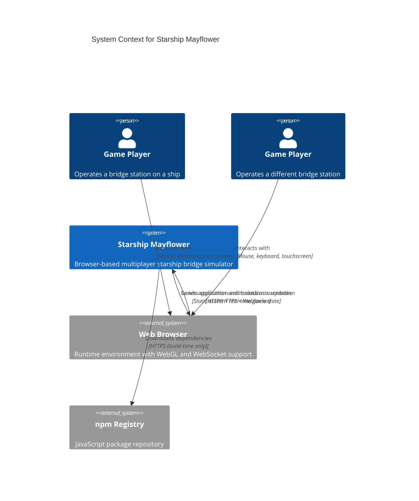

# 3. Context and Scope

This section delimits the Starship Mayflower system from its environment, showing all external interfaces and communication partners.

## 3.1 Business Context

**Starship Mayflower** is a self-contained browser-based multiplayer game with minimal external dependencies. The system operates as an isolated gaming environment where players connect via web browsers to a central game server. This architectural simplicity eliminates operational complexity—there are no external databases, authentication providers, payment gateways, email services, cloud APIs, or third-party integrations to configure, monitor, or maintain.

**Context Diagram:**

**Communication Partners:**

| Partner | Inputs | Outputs | Description |
|---------|--------|---------|-------------|
| **Game Players** | User actions: login with username, ship commands (impulse, turn, fire weapons), station controls (shield frequency, sensor scans, communications) | Game state updates: ship position/orientation, sensor readings, tactical display, damage reports, UI feedback messages | Players access the system through web browsers to operate a starship bridge simulator cooperatively. Each player joins a ship and controls one of five bridge stations: helm, weapons, communications, science, or engineering. **Business Significance:** Primary users whose experience defines system success[^1] |
| **Web Browsers** | HTTP GET requests for static assets (HTML, CSS, JavaScript, images), WebSocket connection requests, keep-alive heartbeats | Complete React SPA bundle (~several MB), real-time game state updates via WebSocket (JSON or binary), 3D star map rendering via WebGL | Modern web browsers (Chrome, Firefox, Safari, Edge) act as the runtime environment and rendering engine for the game client. **Requirements:** ES2015+ JavaScript support, WebGL 1.0+ for 3D graphics (Three.js star map), WebSocket API for real-time bidirectional communication. **Business Significance:** Critical runtime dependency—system unusable without compatible browser[^2] |
| **npm Registry** | N/A (build-time only) | JavaScript packages: React 17.0.2, Pinus 1.4.14, Three.js 0.135.0, TypeScript 4.4.3, and 40+ other dependencies | External package repository (registry.npmjs.org) for downloading JavaScript dependencies during `npm install` or `yarn install`. **Not a runtime dependency**—only accessed during development and build phases. Package versions locked in package.json and package-lock.json[^3] |

**System Boundary (Black Box View):**

- **Inside the system:** Complete Starship Mayflower application including React frontend SPA, Pinus game server (connector + world servers), shared TypeScript libraries for game models and utilities, in-memory game state (ship registry, player sessions, physics simulation)
- **Outside the system:** Web browsers (runtime environment provided by end users), npm registry (build-time package source), game players (human users)
- **Key architectural property:** System has **no external service dependencies at runtime**. No databases, authentication providers, payment systems, email services, cloud APIs, or third-party service integrations. Game state is ephemeral and exists only in server memory[^4]

> **Note:** Internal structure (React frontend vs Pinus game server separation, distributed server architecture) is detailed in **section 5 (Building Blocks)**. This section maintains black box view of external interfaces only.

**Data Flow Summary:**

1. **Player Authentication:** Player enters username in browser → Frontend sends login request via WebSocket → Game server validates format and creates session → Session bound to playerId → Confirmation sent to client[^5]
2. **Ship Operations:** Player issues command (e.g., "set impulse to 0.5", "turn ship 15 degrees") → Frontend sends via WebSocket to connector server → Connector forwards to world server via RPC → Game server queues action in action system → Physics engine executes on next tick → State changes calculated → Updates broadcast to all players on same ship[^6]
3. **Real-Time Updates:** Game server tick executes every 100ms → Physics simulation updates ship positions/orientations → World state calculated → Updates serialized (protobuf + dictionary compression) → Broadcast via WebSocket to all connected clients → Clients receive and render updates in UI[^7]

## 3.2 Technical Context

This section documents the technical interfaces, protocols, and data formats used for communication between Starship Mayflower and its external environment.

**Communication Channels:**

| Interface | Protocol/Technology | I/O Mapping | Description |
|-----------|---------------------|-------------|-------------|
| **Web Interface** | HTTP/HTTPS serving static files | Browser HTTP GET requests → HTML/CSS/JavaScript bundle (static assets) | Nx development server on port 4200 serves React SPA during development. Legacy README mentions port 3001. Static asset serving includes HTML entry point, bundled JavaScript (Webpack), CSS stylesheets, and image assets. **Production deployment:** Static hosting (nginx, Caddy, CDN) recommended but not configured[^8] |
| **Real-Time Game Protocol** | WebSocket with Pinus binary protocol (protobuf + dictionary compression) | Client JSON commands → Pinus protocol wrapper → Binary WebSocket frames with protobuf encoding → Server processes → Binary responses with compressed game state | Port 3010 for client connections. Pinus framework provides connection management, request-response RPC, push notifications, and broadcast channels. Binary serialization reduces message size (~1KB per world update with 40 players vs ~5KB JSON). Dictionary compression maps common strings ("shipPosition", "orientation") to small integers. 3-second heartbeat detects client disconnections. **Critical bug:** Client hardcodes port 10000 but server listens on 3010—mismatch prevents connection[^9] |
| **Internal Server Communication** | Pinus RPC over TCP sockets | Internal RPC calls between connector and world servers → Binary protocol → Method invocation on remote server → Response | Port 3150 (connector server internal), Port 3151 (world server internal). Used for distributed server architecture where connector servers handle client connections/authentication and world servers manage game logic/physics. Enables horizontal scaling of connection capacity independently from game simulation. **Not exposed to external clients**—internal communication only[^10] |

**Technology Mapping:**

| Interface | Technology Stack | Technical Details |
|-----------|------------------|-------------------|
| **Browser Runtime Requirements** | ES2015+ JavaScript, WebGL 1.0+, WebSocket API | **ES2015 compilation target** (tsconfig.base.json) provides broad browser compatibility while enabling modern TypeScript features (async/await, classes, arrow functions). **WebGL 1.0+** required for Three.js 3D star map rendering—uses GPU-accelerated graphics for real-time visualization. **WebSocket API** mandatory for bidirectional real-time communication—HTTP polling not used. **Browser compatibility:** Chrome 51+, Firefox 54+, Safari 10+, Edge 14+[^11] |
| **Frontend-Server Protocol** | Pinus WebSocket connector with protobuf encoding + dictionary compression | **Binary protocol efficiency:** ~1KB per world update with 40 players (vs ~5KB JSON). **Dictionary compression:** Maps common field names to small integers defined in config/dictionary.json. **Protobuf encoding:** Schema defined in config/clientProtos.json for type-safe serialization. **Heartbeat mechanism:** 3-second interval ping/pong to detect disconnections quickly. **Connection flow:** WebSocket handshake → Pinus protocol handshake → Session authentication → RPC/push channels established[^12] |
| **Distributed Server Architecture** | Pinus multi-server framework (connector + world servers) | **Connector servers** (port 3010 client, 3150 internal): Handle client connections, WebSocket management, authentication, session binding, message routing. **World servers** (port 3151 internal): Manage game state, physics simulation, action queue processing, world update broadcasting. **Separation rationale:** Scale connection capacity (I/O-bound) independently from game logic (CPU-bound). RPC layer enables transparent remote method calls between server types[^13] |
| **No External Database** | In-memory state only (JavaScript objects, Maps, Arrays) | **State storage:** ShipRegistry, ObjectInSpaceRegistry, player sessions stored in memory as JavaScript data structures. **Persistence:** None—game state lost on server restart (ephemeral). **Trade-offs:** Eliminates database infrastructure complexity, connection pooling, schema migrations, backup/recovery. Enables rapid development without ORM. See **section 2** for architectural constraint on in-memory state and **section 4** for solution strategy rationale[^14] |

**Port Assignment:**

| Port | Service | Purpose | Accessibility | Security |
|------|---------|---------|---------------|----------|
| 3010 | Pinus Connector (clientPort) | Client WebSocket connections from browsers | **External** (player-facing) | **Unencrypted** ws:// protocol—TLS recommended for production |
| 3150 | Pinus Connector (internal) | Internal RPC communication to world servers | **Internal only** (server-to-server) | Localhost binding—not exposed externally |
| 3151 | Pinus World Server | Game logic processing and physics simulation | **Internal only** (server-to-server) | Localhost binding—not exposed externally |
| 4200 | Nx Dev Server | Development HTTP server for static assets | **External** (local development only) | Development mode—not for production use |

> **Note on production deployment:** Port 3001 mentioned in legacy README but current Nx configuration uses port 4200 for development. Production deployment topology not documented. See **section 7 (Deployment View)** for infrastructure details (TBD)[^15].

**Security Considerations:**

**Unencrypted communication:** WebSocket connections use `ws://` protocol (plaintext) rather than `wss://` (TLS encrypted). Client code hardcodes `ws://localhost:10000` without TLS configuration[^16]. **Risk:** Credentials (usernames), game commands, and state updates transmitted in clear text—vulnerable to network eavesdropping and man-in-the-middle attacks. **Mitigation for production:**
- Deploy TLS termination reverse proxy (nginx with Let's Encrypt, Caddy with automatic HTTPS)
- Upgrade WebSocket connections to `wss://` protocol
- Serve static assets via HTTPS
- Configure HSTS headers to enforce encrypted connections

**Minimal authentication:** Current implementation accepts username without password verification or persistent accounts. Session binding in connector/handler/entry.ts simply stores username and generates playerId without credential validation[^17]. **Risk:** No protection against impersonation or unauthorized access. **Current status:** Acceptable for development/prototype phase. Production deployment requires authentication system design—see **section 4 (Solution Strategy)** for architectural decisions on authentication.

**Port mismatch bug:** Client WebSocket connection hardcodes port 10000 (`ws://localhost:10000`) but server listens on port 3010 per servers.json configuration[^16]. **Impact:** Connection fails in current configuration—likely dead code or configuration drift. **Resolution:** Update client.ts to use correct port or externalize as configuration.

> **Cross-references:**
> - **Section 1.1** (Requirements) describes browser-based deployment requirement and multiplayer cooperative gameplay
> - **Section 2** (Constraints) documents browser compatibility, WebSocket protocol, and no-database architectural constraints
> - **Section 4** (Solution Strategy) explains rationale for in-memory state, technology selection, and architectural patterns
> - **Section 5** (Building Blocks) details internal architecture: React component structure, Pinus server types, shared libraries
> - **Section 7** (Deployment View) will document production deployment topology, infrastructure, and operational considerations (TBD)
> - **Section 8** (Cross-cutting Concepts) will cover authentication strategy, session management, and error handling (TBD)

[^1]: README.md describes "starship bridge simulator running in your browser"; libs/util/src/lib/model/Ship.ts defines five StationType enum values (helm, weapons, communications, science, engineering)
[^2]: apps/starship-mayflower-frontend uses React 17.0.2 (package.json line 31); Three.js 0.135.0 for WebGL 3D graphics (line 38); isomorphic-ws 4.0.1 for WebSocket (line 28)
[^3]: package.json lists 42 dependencies; npm registry URL implicit in package resolution; package-lock.json locks transitive dependencies
[^4]: No database drivers in package.json (verified absence of: pg, mysql2, mongodb, mongoose, redis, ioredis, sequelize, typeorm, prisma); apps/game-server/src/app/src/game.ts implements ShipRegistry and ObjectInSpaceRegistry as in-memory Map/Array structures
[^5]: apps/game-server/src/app/servers/connector/handler/entry.ts entry() method validates username format, generates playerId via uuid(), calls session.bind(playerId), stores playername in session
[^6]: apps/game-server/src/app/servers/world/handler/navigation.ts implements handleImpulse() and handleTurn() commands; apps/game-server/src/app/src/action/ directory contains action queue system with ActionHandler and ActionQueue classes
[^7]: apps/game-server/src/app/src/timer.ts schedules tick() every 100ms (setInterval 100); tick() calls moveShips() for physics, then sendUpdates() for broadcasting; game.ts sendUpdates() iterates ships and calls app.rpc.connector.push.pushMessage() to broadcast
[^8]: nx.json configures Nx workspace; apps/starship-mayflower-frontend/project.json defines serve target with port 4200; legacy README.md line 43 mentions localhost:3001; no nginx.conf or production server config found
[^9]: apps/game-server/src/main.ts lines 12-17 configure connectorConfig: { heartbeat: 3, useDict: true, useProtobuf: true, useProtobuf: true }; servers.json clientPort: 3010; apps/starship-mayflower-frontend/src/app/store/client.ts line 15 hardcodes ws://localhost:10000 (bug: port mismatch)
[^10]: apps/game-server/src/config/servers.json development section defines connector server (id: "connector-server-1", host: "127.0.0.1", port: 3150, clientPort: 3010, frontend: true) and world server (id: "world-server-1", host: "127.0.0.1", port: 3151)
[^11]: tsconfig.base.json line 6 sets target: "es2015"; libs/map/src/lib/StarMap.ts imports Three.js for WebGL rendering; WebSocket API standardized in all modern browsers; compatibility per caniuse.com
[^12]: apps/game-server/src/main.ts configures Pinus binary protocol with useDict and useProtobuf flags; config/dictionary.json maps strings to integers; config/clientProtos.json defines protobuf schemas; heartbeat: 3 in connectorConfig
[^13]: apps/game-server/src/config/servers.json shows physical separation of connector and world server types; Pinus framework docs describe multi-server RPC architecture; game.ts uses app.rpc.connector.* for cross-server calls
[^14]: No database configuration files found (no knexfile.js, ormconfig.json, prisma/schema.prisma); game.ts lines 10-12 initialize registries as plain objects/Maps; see docs/arc42/02-architecture-constraints.md constraint on in-memory state
[^15]: servers.json clientPort: 3010 for WebSocket; apps/starship-mayflower-frontend/project.json Nx serve target defaults to 4200; README.md line 43 legacy reference to localhost:3001; no deployment configs found
[^16]: apps/starship-mayflower-frontend/src/app/store/client.ts line 15: `this.client = new WebSocket('ws://localhost:10000')` uses unencrypted protocol and incorrect port (should be 3010 per servers.json)
[^17]: apps/game-server/src/app/servers/connector/handler/entry.ts entry() method accepts username parameter without password; calls session.bind(playerId) without credential verification; no password hashing or token validation code found
