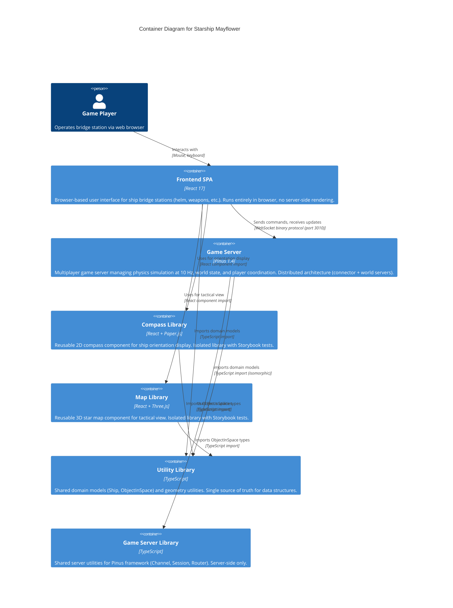
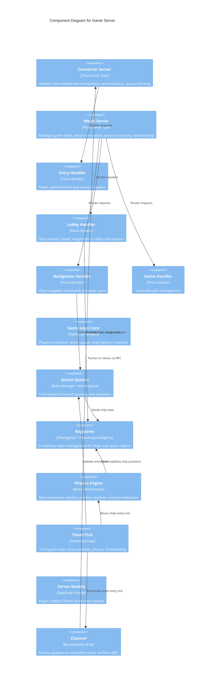
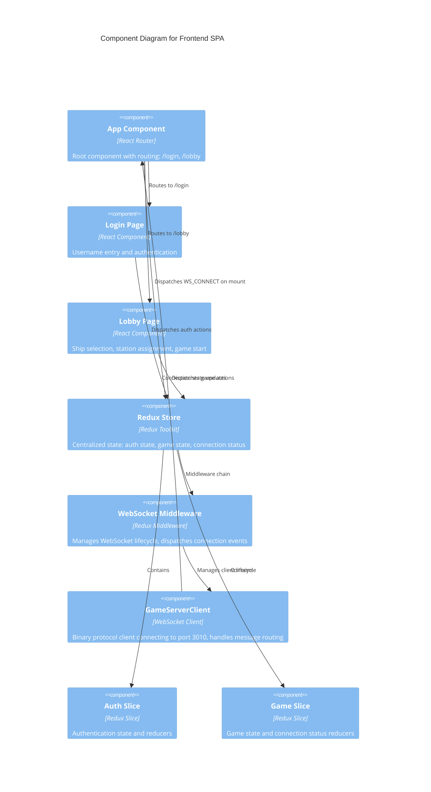

# 5. Building Block View

This section shows the static decomposition of Starship Mayflower into building blocks (applications, libraries, modules) and their dependencies. The structure reflects the Nx monorepo organization with clear separation between deployable applications and reusable shared libraries.

## 5.1 Whitebox Overall System

**Decomposition Rationale**: The system follows Nx monorepo best practices, organizing code into two top-level categories: **applications** (apps/) containing deployable executables and **libraries** (libs/) containing reusable shared code. This structure directly addresses the **maintainability quality goal** from section 1.2 by:
- Enforcing module boundaries via ESLint (preventing architectural erosion)
- Enabling code reuse through well-defined library exports
- Supporting independent development and testing of UI components (Storybook isolation)
- Providing clear ownership boundaries for development teams[^1]

The decomposition separates concerns as follows:
- **Frontend application** handles all client-side presentation and user interaction
- **Game server application** manages multiplayer game logic, physics simulation, and player coordination
- **Shared libraries** provide domain models, UI components, and utilities used by both frontend and backend
- **Test applications** provide end-to-end testing for visual components (Storybook-based)

This structure enables **isomorphic TypeScript development** where domain models are defined once and shared between client and server, directly supporting the **developer experience quality goal** from section 1.2. The compiler-enforced type safety across the network boundary prevents serialization bugs and eliminates the need for manual type synchronization (see section 8 for the Shared Domain Model pattern)[^2].

**Container Diagram**:



**Contained Building Blocks**:

| Building Block | Responsibility | Key Interfaces | Directory Location |
|----------------|----------------|----------------|-------------------|
| **Frontend SPA** | Browser-based user interface for ship bridge stations; handles player input, renders ship status, displays compass and map; manages WebSocket connection to game server | React components, Redux store, WebSocket client | apps/starship-mayflower-frontend/[^3] |
| **Game Server** | Multiplayer game server managing distributed server architecture (connector + world servers); handles physics simulation, action queue processing, player session management, world state broadcasting | Pinus RPC handlers (entry, lobby, navigation, game), WebSocket binary protocol | apps/game-server/[^4] |
| **Compass Library** | Reusable React component for 2D ship orientation display using Paper.js canvas rendering; shows pitch and yaw angles visually | React component API: `<Compass pitch={number} yaw={number} />` | libs/compass/[^5] |
| **Map Library** | Reusable React component for 3D tactical star map using Three.js WebGL rendering; displays ships, space stations, planets in 3D space | React component API: `<StarMap objects={ObjectInSpace[]} />` | libs/map/[^6] |
| **Utility Library** | Shared domain models (Ship, ObjectInSpace, Station types) and geometry utilities (collision detection, volume calculations); provides single source of truth for data structures used across frontend and backend | TypeScript interfaces and classes exported via @starship-mayflower/util | libs/util/[^7] |
| **Game Server Library** | Shared utilities for Pinus framework: Channel abstraction for broadcasting, Session management, SocketHandler, Router utilities | TypeScript classes and interfaces for server infrastructure | libs/game-server-lib/[^8] |

**Supporting Building Blocks** (Testing):

| Building Block | Responsibility | Directory Location |
|----------------|----------------|-------------------|
| Frontend E2E Tests | End-to-end tests for frontend application using Cypress | apps/starship-mayflower-frontend-e2e/[^9] |
| Compass E2E Tests | Storybook-based visual tests for Compass component | apps/compass-e2e/[^10] |
| Map E2E Tests | Storybook-based visual tests for Map component | apps/map-e2e/[^11] |

**Note on Legacy Code**: The repository contains `apps/game-server-next/` which appears to be an incomplete migration to a newer Pinus architecture. This directory is not part of the active system and is excluded from this decomposition[^12].

## 5.2 Level 2 - Whitebox: Game Server

**Motivation**: The Game Server is the most complex building block, warranting level-2 decomposition for the following architectural reasons:

1. **Quality Goal Support**: Implements the distributed multiplayer architecture that is critical to achieving the **real-time responsiveness quality goal** from section 1.2 (100ms tick cycle, sub-second command response)
2. **Complexity Management**: Contains 12 distinct components with intricate dependencies (tick orchestration, physics simulation, action queue processing)
3. **Architectural Significance**: Demonstrates the layered architecture pattern from section 4 (handler layer → business logic → data layer)
4. **Risk Mitigation**: The 10 Hz tick cycle and physics orthonormalization represent technical risks requiring explicit documentation

This decomposition separates server types (connector vs world), handler logic, business logic, and data models, enabling understanding of how the tick cycle orchestrates action processing, physics updates, and state broadcasting[^13].

**Component Diagram**:



**Contained Components**:

| Component | Responsibility | Technology | File Location |
|-----------|----------------|------------|---------------|
| **Connector Server** | Handles client WebSocket connections on port 3010; authenticates players; binds sessions to player IDs; routes client requests to world servers via Pinus RPC | Pinus connector server type | apps/game-server/src/config/servers.json (connector definition)[^14] |
| **World Server** | Manages game state and physics simulation; processes lobby operations (ship creation, station assignment); handles navigation commands; runs 10 Hz tick cycle; broadcasts updates to connector servers | Pinus world server type | apps/game-server/src/config/servers.json (world definition)[^15] |
| **Entry Handler** | Authenticates players with username; generates player ID; binds session to player; no password validation (minimal auth for prototype) | Pinus RPC handler | apps/game-server/src/app/servers/connector/handler/entry.ts[^16] |
| **Lobby Handler** | Creates new ships; assigns players to ships; assigns players to specific bridge stations (helm, weapons, comm, science, engineering); manages lobby state broadcasting | Pinus RPC handler | apps/game-server/src/app/servers/world/handler/lobby.ts[^17] |
| **Navigation Handler** | Processes ship navigation commands: setImpulse (acceleration), turn (rotation), setWarp (faster-than-light travel); queues commands in action system for time-based execution | Pinus RPC handler | apps/game-server/src/app/servers/world/handler/navigation.ts[^18] |
| **Game Handler** | Manages game lifecycle: start game, get world state; initiates timer when game starts | Pinus RPC handler | apps/game-server/src/app/servers/world/handler/game.ts[^19] |
| **Game Logic Core** | Central game state management: instantiates ship registry, object registry, action manager; initializes world with space stations and planets; exposes getters for registries; coordinates tick cycle | TypeScript module exports | apps/game-server/src/app/src/game.ts[^20] |
| **Action System** | Queues player commands for time-based execution; supports singleton actions (abort previous of same type); processes action queue every tick; marks actions as finished or aborted | ActionManager + ActionQueue classes | apps/game-server/src/app/src/action/actionManager.ts[^21] |
| **Registries** | ShipRegistry: manages all ships, players, station assignments; provides lookup by ID or name; validates uniqueness. ObjectInSpaceRegistry: manages space stations, planets, ships; provides spatial lookup | Registry pattern classes | apps/game-server/src/app/src/world/ShipRegistry.ts, game.ts (objectRegistry)[^22] |
| **Physics Engine** | Calculates ship movement based on velocity and time delta; applies rotation matrices (pitch, yaw, roll); orthonormalizes matrices to correct floating-point rounding errors; clips positions to playing field boundaries | Vector mathematics (Sylvester library) | apps/game-server/src/app/src/physics.ts[^23] |
| **Timer/Tick** | Runs 10 Hz game loop (100ms intervals); each tick: updates action queue, moves all ships via physics, broadcasts state to all clients; directly supports real-time responsiveness quality goal | setInterval loop | apps/game-server/src/app/src/timer.ts[^24] |
| **Server Models** | Player (wraps session, tracks ship/station assignment), Station (space station with position), Planet (celestial body with size and position); supplements shared util models with server-specific functionality | TypeScript classes | apps/game-server/src/app/src/models/[^25] |
| **Channel** | Broadcasting utility: pushes messages to specific ships (all players on ship), pushes to lobby, manages Pinus RPC calls to connector servers for client delivery | Pinus RPC wrapper | apps/game-server/src/app/src/channel.ts[^26] |

**Dependency Relationships**:
- Handlers depend on Game Logic Core (registries, action system)
- Game Logic Core depends on Registries, Action System, Physics, Timer
- **Timer orchestrates the 10 Hz tick cycle** (see section 6 for runtime view):
  1. Action System updates (process queued commands)
  2. Physics updates (move all ships)
  3. Channel broadcasts (push state to all clients)
- All game server components depend on Utility Library for domain models
- Channel depends on Connector Server for client message delivery

**Architectural Note**: The Timer acts as the "heartbeat" of the game server, directly implementing the 100ms tick cycle requirement from section 1.2 (real-time responsiveness quality goal). This tick-based architecture is critical to maintaining synchronized game state across all connected clients.

## 5.3 Level 2 - Whitebox: Frontend SPA

**Motivation**: The Frontend SPA warrants level-2 decomposition to document:

1. **Integration Architecture**: Shows how the React SPA integrates with the game server via WebSocket binary protocol, addressing the distributed architecture constraint from section 2
2. **State Management Pattern**: Documents the Redux Toolkit + WebSocket Middleware pattern (see section 8) that coordinates communication and UI updates
3. **Library Reuse**: Demonstrates how the frontend consumes the Compass and Map libraries, validating the component reusability strategy from section 4
4. **Authentication Flow**: Shows the minimal authentication approach (username-only) that meets prototype requirements from section 1.1

This decomposition separates feature modules (auth, lobby), state management (Redux store), communication layer (WebSocket middleware), and library integrations[^27].

**Component Diagram**:



**Contained Components**:

| Component | Responsibility | Technology | File Location |
|-----------|----------------|------------|---------------|
| **App Component** | Root React component with React Router configuration; routes to /login (public) and /lobby (requires auth); dispatches WS_CONNECT action on mount to establish game server connection | React 17 with hooks | apps/starship-mayflower-frontend/src/app/App.tsx[^28] |
| **Login Page** | Username entry form; dispatches authentication action; redirects to lobby on success; minimal validation (prototype-level authentication) | React component | apps/starship-mayflower-frontend/src/app/Login.tsx[^29] |
| **Lobby Page** | Ship selection interface; displays available ships and players; allows joining ship and taking bridge station; initiates game start | React component | apps/starship-mayflower-frontend/src/app/lobby/Lobby.tsx[^30] |
| **Redux Store** | Centralized state management: auth state (username, authenticated flag), game state (connection status, game data); configured with Redux Toolkit for type safety | Redux Toolkit 1.6.2 | apps/starship-mayflower-frontend/src/app/store/store.ts[^31] |
| **WebSocket Middleware** | Redux middleware intercepting WS_CONNECT, WS_DISCONNECT, NEW_MESSAGE actions; instantiates GameServerClient; dispatches connection state changes (connected, connectionError); routes incoming messages as Redux actions | Custom Redux middleware | apps/starship-mayflower-frontend/src/app/store/websocketMiddleware.ts[^32] |
| **GameServerClient** | WebSocket client wrapping browser WebSocket API; connects to ws://localhost:10000 (hardcoded, **bug: should be 3010**); handles binary protocol message framing; implements request-response pattern with UUID-based request IDs | EventEmitter-based client | apps/starship-mayflower-frontend/src/app/store/client.ts[^33] |
| **Auth Slice** | Redux slice managing authentication state: username, authenticated flag; provides selectors (selectUsername, selectAuthenticated); reducers for login/logout actions | Redux Toolkit slice | apps/starship-mayflower-frontend/src/app/store/auth.slice.ts[^34] |
| **Game Slice** | Redux slice managing game and connection state: connected flag, connection error flag; provides selectors (selectConnected, selectConnectionError); reducers for connection lifecycle | Redux Toolkit slice | apps/starship-mayflower-frontend/src/app/store/game.slice.ts[^35] |

**Dependency Relationships**:
- App Component depends on Redux Store and React Router
- Login/Lobby Pages depend on Redux Store for state and actions
- Redux Store depends on WebSocket Middleware (middleware chain)
- WebSocket Middleware depends on GameServerClient
- All frontend components depend on Compass Library and Map Library for visualizations
- Frontend depends on Utility Library for domain model types (Ship, ObjectInSpace)

## 5.4 Level 2 - Whitebox: Utility Library

**Motivation**: The Utility Library is the architectural keystone enabling isomorphic TypeScript development, warranting level-2 decomposition to document:

1. **Type Safety Enforcement**: Provides shared domain models used by both frontend and backend, with compiler-enforced consistency preventing serialization bugs (directly supports **developer experience quality goal** from section 1.2)
2. **Single Source of Truth**: All spatial entities (ships, stations, planets) inherit from ObjectInSpace base class, ensuring consistent behavior across system boundaries
3. **Architectural Pattern**: Demonstrates the Shared Domain Model pattern (see section 8) that is critical to the overall solution strategy from section 4
4. **Geometry Foundation**: Contains collision detection and spatial query utilities used by game server physics simulation

This decomposition shows domain models (Ship, ObjectInSpace), registries, and geometry utilities[^36].

**Contained Components**:

| Component | Responsibility | File Location |
|-----------|----------------|---------------|
| **Ship Model** | Core ship domain model: name, creator, player assignments, 5 bridge stations (helm, weapons, comm, science, engineering), position, velocity, orientation, energy, impulse/warp settings; serialization for network transmission | libs/util/src/lib/model/Ship.ts[^37] |
| **ObjectInSpace Model** | Base class for all spatial objects: 3D position (Vector), velocity, heading, unique ID; provides serialization, map data generation; extended by Ship, Station, Planet | libs/util/src/lib/model/ObjectInSpace.ts[^38] |
| **ObjectInSpaceRegistry** | Registry for managing collections of space objects; assigns unique IDs (auto-increment); provides lookup by ID; thread-safe ID generation | libs/util/src/lib/model/ObjectInSpaceRegistry.ts[^39] |
| **Volume Geometry** | Geometric primitives for collision detection and spatial queries: Point (3D coordinate), Box (axis-aligned bounding box), Sphere (radius-based volume), Volume (interface) | libs/util/src/lib/model/volume/[^40] |
| **Collision Detection** | Geometry utilities for collision detection between volumes (sphere-sphere, box-box, box-sphere); used for spatial queries and ship interactions | libs/util/src/lib/geometry/collision.ts[^41] |

**Usage Pattern**:
All components import domain models via TypeScript path mapping:
```typescript
import { Ship, ObjectInSpace } from '@starship-mayflower/util';
```

The TypeScript compiler validates type consistency across all imports, preventing frontend-backend deserialization errors[^42].

## 5.5 Level 2 - Whitebox: Component Libraries (Compass & Map)

**Motivation**: The Compass and Map libraries are decomposed to level-2 to document the **component isolation strategy** that supports maintainability:

1. **Independent Development**: Each library is packaged as a standalone Nx library with its own Storybook configuration, enabling UI development without running the full game server (directly supports **maintainability quality goal** from section 1.2)
2. **Visual Regression Testing**: Storybook-based E2E tests (compass-e2e, map-e2e) validate visual correctness in isolation
3. **Technology Segregation**: Separates rendering concerns (Paper.js 2D vs Three.js 3D) into focused libraries with minimal dependencies
4. **Reusability Validation**: Demonstrates that visual components can be developed once and consumed by multiple applications (proving the library strategy from section 4)

This decomposition shows the internal structure of both component libraries[^43].

**Compass Library Components**:

| Component | Responsibility | File Location |
|-----------|----------------|---------------|
| **Compass React Component** | React wrapper component accepting pitch and yaw props; manages Compass instance lifecycle; attaches canvas to DOM; re-renders on prop changes | libs/compass/src/compass.tsx[^44] |
| **Compass Rendering Engine** | Paper.js-based 2D canvas rendering: draws pitch and yaw indicators, orientation lines, degree markings; provides draw() method for updates | libs/compass/src/lib/Compass.ts[^45] |

**Map Library Components**:

| Component | Responsibility | File Location |
|-----------|----------------|---------------|
| **StarMap React Component** | React wrapper for Three.js scene; accepts array of ObjectInSpace objects; manages camera, renderer, scene lifecycle | libs/map/src/lib/map.tsx, StarMap.ts[^46] |
| **MapObject Hierarchy** | MapObject (base class), MapObjectActor (ships), MapObjectBase (stations/planets); converts domain models to Three.js meshes | libs/map/src/lib/MapObject*.ts[^47] |
| **Grid** | Three.js grid helper for spatial reference; renders coordinate grid in 3D space | libs/map/src/lib/Grid.ts[^48] |

Both libraries include Storybook configurations for isolated development and visual regression testing[^49].

## 5.6 Dependency Graph and Module Boundaries

**Nx Module Boundary Enforcement**:

The Nx workspace enforces module boundaries via ESLint rules configured in `.eslintrc.json`, preventing unauthorized imports and maintaining architectural discipline. This **compile-time enforcement** prevents architectural erosion (addressing the technical debt constraint from section 2) by failing the build when developers attempt prohibited imports. The dependency graph follows these rules[^50]:

**Allowed Dependencies**:
- Frontend SPA → Compass Library, Map Library, Utility Library
- Game Server → Utility Library, Game Server Library
- Compass Library → Utility Library (for ObjectInSpace types)
- Map Library → Utility Library (for ObjectInSpace types)
- Game Server Library → Utility Library

**Prohibited Dependencies** (enforced by ESLint, violations fail CI build):
- Libraries CANNOT import from applications (prevents tight coupling, maintains library reusability)
- Applications CANNOT import from each other (prevents circular dependencies, enforces clear boundaries)
- Compass/Map libraries are self-contained (only depend on Utility Library, ensuring portability)
- No circular dependencies allowed at any level (enforced by TypeScript compiler + ESLint)

**Architectural Significance**: These prohibitions prevent the architectural antipattern where reusable libraries become tightly coupled to specific applications, which would violate the maintainability quality goal and make library extraction impossible.

**TypeScript Path Mappings**:

All cross-module imports use clean TypeScript path mappings defined in `tsconfig.base.json`, supporting the **developer experience quality goal** from section 1.2[^51]:
- `@starship-mayflower/util` → libs/util/src/index.ts
- `@starship-mayflower/compass` → libs/compass/src/index.ts
- `@starship-mayflower/map` → libs/map/src/index.ts
- `@starship-mayflower/game-server-lib` → libs/game-server-lib/src/index.ts

This enables clean imports without brittle relative paths:
```typescript
// Good: Clean, refactoring-safe import
import { Ship } from '@starship-mayflower/util';

// Bad: Brittle relative path (NOT used in this codebase)
import { Ship } from '../../../libs/util/src/lib/model/Ship';
```

The path mappings work identically in both frontend and backend code, reinforcing the isomorphic development model from section 4.

## 5.7 Third-Party Dependencies

**Critical Third-Party Libraries** (documented per arc42 tip 5-19):

| Library | Purpose | Used By | Rationale |
|---------|---------|---------|-----------|
| **Pinus 1.4.14** | Multiplayer game server framework | Game Server | Provides distributed server architecture (connector + world servers), binary WebSocket protocol, RPC layer for inter-server communication. Successor to Pomelo framework. **Critical dependency** for achieving the real-time responsiveness quality goal from section 1.2[^52] |
| **React 17.0.2** | UI framework | Frontend SPA, Compass, Map | Component-based UI with hooks API, mature ecosystem, good TypeScript support. Enables SPA architecture avoiding page reloads. Chosen per section 2 constraint (web-based UI)[^53] |
| **Redux Toolkit 1.6.2** | State management | Frontend SPA | Centralized state with first-class TypeScript support, integrates cleanly with custom WebSocket middleware. Provides DevTools for debugging state transitions. Supports developer experience quality goal[^54] |
| **Three.js 0.135.0** | 3D graphics | Map Library | WebGL-based 3D rendering for star map with GPU-accelerated graphics. Enables astronomical-scale visualization (solar systems, star clusters). Industry-standard library for web 3D[^55] |
| **Paper.js 0.12.15** | 2D graphics | Compass Library | Canvas-based 2D rendering for compass orientation display. Vector graphics API simpler than Three.js for 2D instrumentation needs. Good performance for real-time compass updates[^56] |
| **Sylvester (sylvester-es6 0.0.2)** | Vector mathematics | Game Server Physics | Vector and Matrix math for ship physics simulation, rotation matrices, orthonormalization. Provides mathematical foundation for 3D space navigation[^57] |

> **Cross-references:**
> - **Section 1.1** (Requirements) defines the functional requirements that drive this decomposition
> - **Section 2** (Constraints) documents the Nx monorepo and TypeScript constraints that shape this structure
> - **Section 3** (Context and Scope) shows external interfaces that level-1 building blocks implement
> - **Section 4** (Solution Strategy) explains the rationale for monorepo structure and isomorphic models
> - **Section 6** (Runtime View) illustrates how these building blocks interact at runtime
> - **Section 8** (Cross-cutting Concepts) documents patterns used across building blocks: Registry pattern, Action Queue pattern, Middleware pattern

[^1]: workspace.json defines 10 projects; nx.json configures module boundary enforcement; directory structure shows apps/ and libs/ separation
[^2]: tsconfig.base.json lines 17-24 define @starship-mayflower/* path mappings enabling isomorphic imports; libs/util contains shared domain models
[^3]: apps/starship-mayflower-frontend/ contains React SPA; src/main.tsx bootstraps app; src/app/App.tsx defines routing
[^4]: apps/game-server/ contains Pinus server; src/main.ts initializes Pinus; src/config/servers.json defines connector/world topology
[^5]: libs/compass/ contains Compass component; src/compass.tsx exports React component; src/lib/Compass.ts implements Paper.js rendering
[^6]: libs/map/ contains Map component; src/lib/map.tsx exports React component; src/lib/StarMap.ts implements Three.js rendering
[^7]: libs/util/src/lib/model/ contains Ship.ts, ObjectInSpace.ts, ObjectInSpaceRegistry.ts; src/lib/geometry/ contains collision detection
[^8]: libs/game-server-lib/src/lib/ contains Channel.ts, Session.ts, SocketHandler.ts, Router.ts for Pinus utilities
[^9]: apps/starship-mayflower-frontend-e2e/ contains Cypress E2E tests for frontend
[^10]: apps/compass-e2e/ contains Storybook-based tests for Compass component
[^11]: apps/map-e2e/ contains Storybook-based tests for Map component
[^12]: apps/game-server-next/ directory exists but is not referenced in workspace.json projects or imported anywhere; appears to be incomplete Pinus migration
[^13]: apps/game-server/src/app/src/ contains game logic core; timer.ts implements 10 Hz tick; action/ directory contains action system; world/ contains registries
[^14]: apps/game-server/src/config/servers.json lines 3-10 define connector-server-1 with clientPort 3010, internal port 3150, frontend: true
[^15]: apps/game-server/src/config/servers.json line 12 defines world-server-1 with port 3151; world server processes game logic
[^16]: apps/game-server/src/app/servers/connector/handler/entry.ts implements entry() method for player authentication and session binding
[^17]: apps/game-server/src/app/servers/world/handler/lobby.ts implements ship creation (createShip), player assignment (addPlayerToShip), station assignment (takeStation, releaseStation)
[^18]: apps/game-server/src/app/servers/world/handler/navigation.ts implements handleImpulse(), handleTurn(), handleWarp() for ship navigation
[^19]: apps/game-server/src/app/servers/world/handler/game.ts implements startGame() and getWorld() for game lifecycle
[^20]: apps/game-server/src/app/src/game.ts lines 16-18 instantiate shipRegistry, objectRegistry, actionManager; exports getShipRegistry(), getObjectRegistry(), getActionManager()
[^21]: apps/game-server/src/app/src/action/actionManager.ts implements ActionManager class with addAction(), abortAction(), update() methods; uses ActionQueue for time-based processing
[^22]: apps/game-server/src/app/src/world/ShipRegistry.ts implements ShipRegistry with getAllShips(), getShip(), addShip(), addPlayer(); game.ts line 17 instantiates objectRegistry
[^23]: apps/game-server/src/app/src/physics.ts implements orthonormalizeMatrix() (lines 14-31), clipPosition(), moveShip() with velocity integration
[^24]: apps/game-server/src/app/src/timer.ts line 8 setInterval(tick, 100) runs 10 Hz loop; tick() calls actionManager.update(), moveShips(), sendUpdates()
[^25]: apps/game-server/src/app/src/models/ contains Player.ts, Station.ts, Planet.ts with server-specific functionality
[^26]: apps/game-server/src/app/src/channel.ts implements Channel class with pushToShip(), pushToLobby() methods wrapping Pinus RPC
[^27]: apps/starship-mayflower-frontend/src/app/ contains feature modules; store/ contains Redux state management; App.tsx implements routing
[^28]: apps/starship-mayflower-frontend/src/app/App.tsx implements root component with React Router; dispatches WS_CONNECT in useEffect hook line 15
[^29]: apps/starship-mayflower-frontend/src/app/Login.tsx (inferred from routing in App.tsx line 21)
[^30]: apps/starship-mayflower-frontend/src/app/lobby/Lobby.tsx implements lobby interface
[^31]: apps/starship-mayflower-frontend/src/app/store/store.ts configures Redux store with auth and game slices; adds WebSocket middleware line 14
[^32]: apps/starship-mayflower-frontend/src/app/store/websocketMiddleware.ts implements GameMiddleware intercepting WS_CONNECT, WS_DISCONNECT, NEW_MESSAGE actions
[^33]: apps/starship-mayflower-frontend/src/app/store/client.ts implements GameServerClient class; line 15 hardcodes ws://localhost:10000 (port mismatch bug)
[^34]: apps/starship-mayflower-frontend/src/app/store/auth.slice.ts implements authReducer with AUTH_FEATURE_KEY
[^35]: apps/starship-mayflower-frontend/src/app/store/game.slice.ts implements gameReducer with GAME_FEATURE_KEY; connected() and connectionError() actions
[^36]: libs/util/ provides shared domain models; TypeScript compiler validates consistency across frontend/backend imports per tsconfig.base.json path mappings
[^37]: libs/util/src/lib/model/Ship.ts defines Ship class extending ObjectInSpace; includes stations Record<Station, Player>, serialize() method
[^38]: libs/util/src/lib/model/ObjectInSpace.ts defines ObjectInSpace base class with position (Vector), velocity, heading; provides serialize(), getMapData()
[^39]: libs/util/src/lib/model/ObjectInSpaceRegistry.ts implements ObjectInSpaceRegistry class with createId(), addObject(), getObject() methods
[^40]: libs/util/src/lib/model/volume/ contains Point.ts, Box.ts, Sphere.ts, Volume.ts (interface) for geometric primitives
[^41]: libs/util/src/lib/geometry/collision.ts implements collision detection functions between geometric volumes
[^42]: TypeScript compiler validates imports across apps/game-server and apps/starship-mayflower-frontend when both import from @starship-mayflower/util
[^43]: libs/compass/.storybook and libs/map/.storybook contain Storybook configurations; enables isolated component development per maintainability quality goal
[^44]: libs/compass/src/compass.tsx implements Compass React component wrapper; manages Compass instance lifecycle with useRef and useEffect hooks
[^45]: libs/compass/src/lib/Compass.ts implements Compass class using Paper.js; provides pitch(), yaw(), draw() methods for rendering
[^46]: libs/map/src/lib/map.tsx and StarMap.ts implement StarMap React component and Three.js scene management
[^47]: libs/map/src/lib/ contains MapObject.ts (base), MapObjectActor.ts (ships), MapObjectBase.ts (stations/planets), MapObjectPicker.ts (selection)
[^48]: libs/map/src/lib/Grid.ts implements Three.js grid helper for spatial reference
[^49]: libs/compass/.storybook/main.js and libs/map/.storybook/main.js configure Storybook; package.json line 61 includes @storybook/react ~6.4.5
[^50]: .eslintrc.json lines 9-21 configure @nrwl/nx/enforce-module-boundaries rule; prevents unauthorized cross-boundary imports
[^51]: tsconfig.base.json lines 17-24 define paths object mapping @starship-mayflower/* to libs/*/src/index.ts
[^52]: package.json line 30 pinus 1.4.14; apps/game-server/src/main.ts imports pinus; Pinus provides distributed architecture per section 4
[^53]: package.json line 31 react 17.0.2; apps/starship-mayflower-frontend/src/main.tsx imports react, react-dom
[^54]: package.json line 19 @reduxjs/toolkit 1.6.2; apps/starship-mayflower-frontend/src/app/store/store.ts uses configureStore from Redux Toolkit
[^55]: package.json line 38 three 0.135.0; libs/map/src/lib/StarMap.ts imports THREE from three; provides WebGL 3D rendering
[^56]: package.json line 29 paper 0.12.15; libs/compass/src/lib/Compass.ts imports paper; provides Canvas 2D rendering
[^57]: package.json line 37 sylvester-es6 0.0.2; apps/game-server/src/app/src/physics.ts imports Vector, Matrix from sylvester-es6
