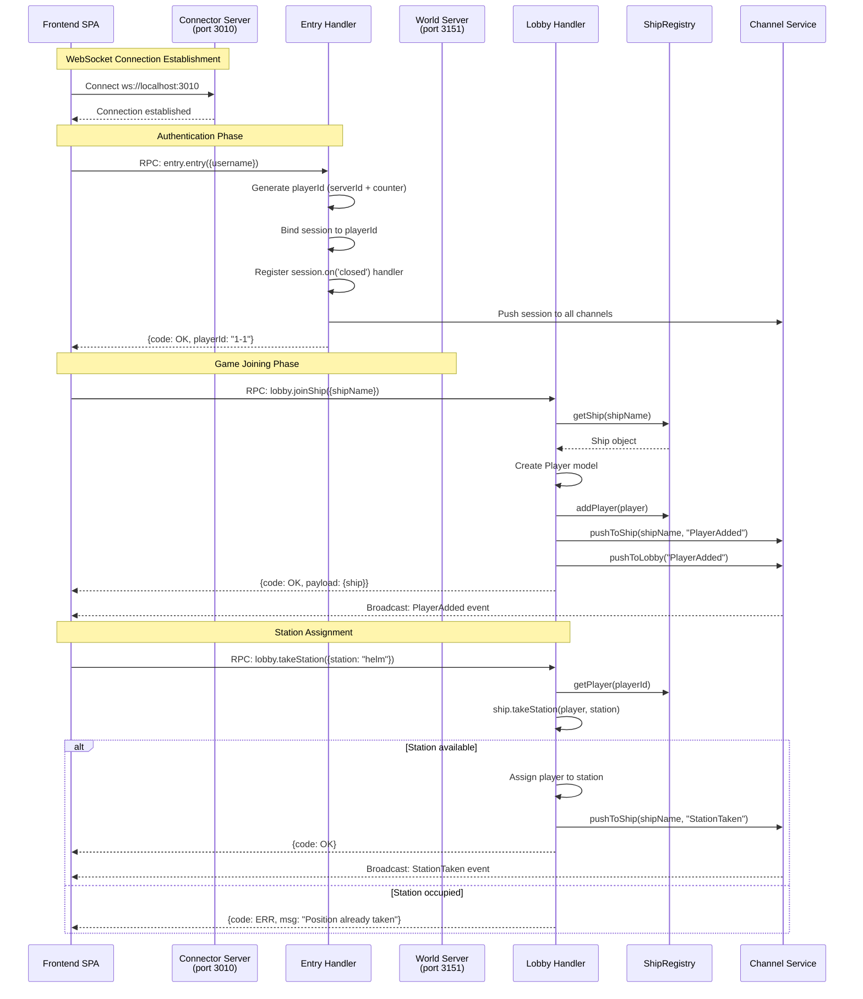
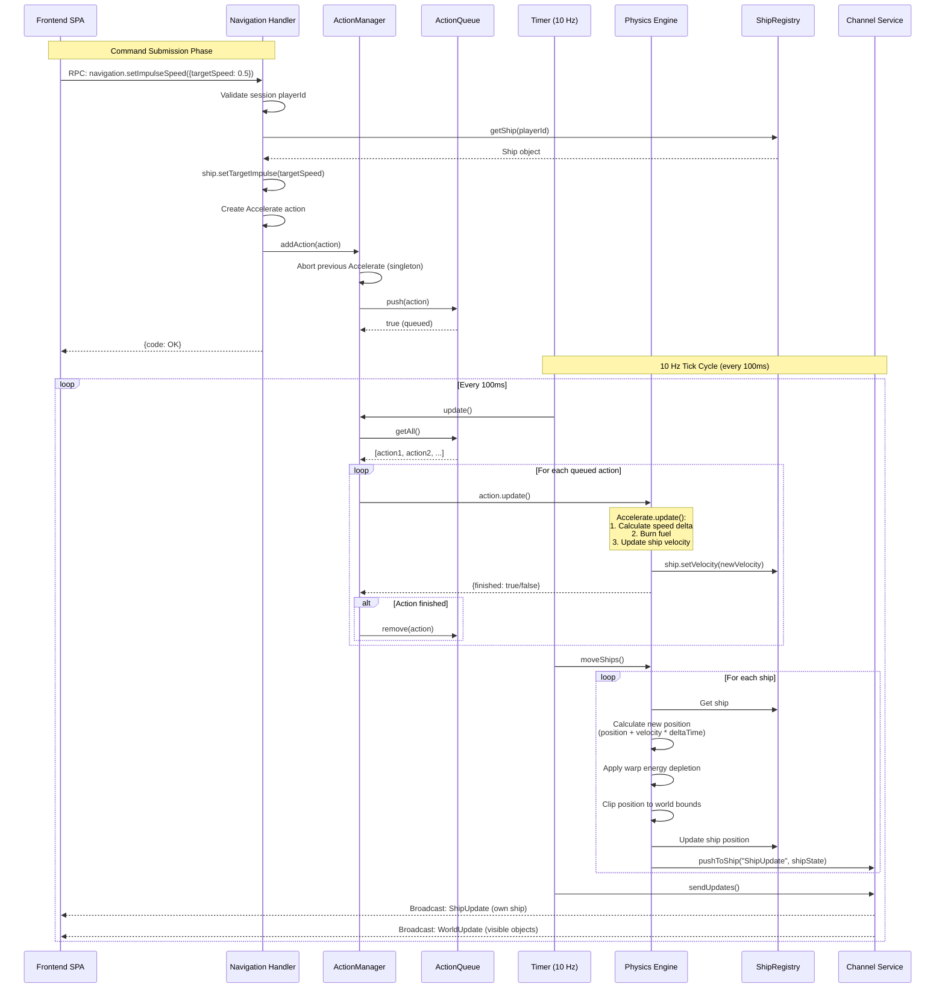
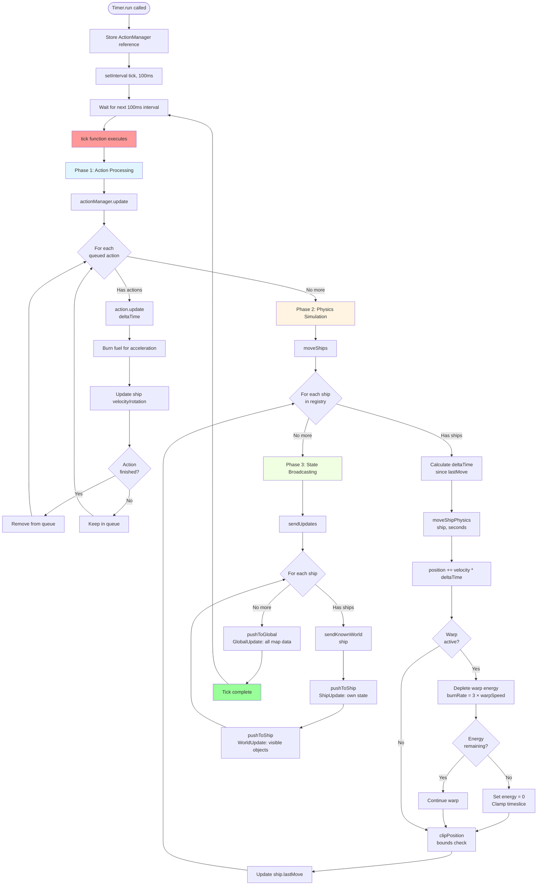
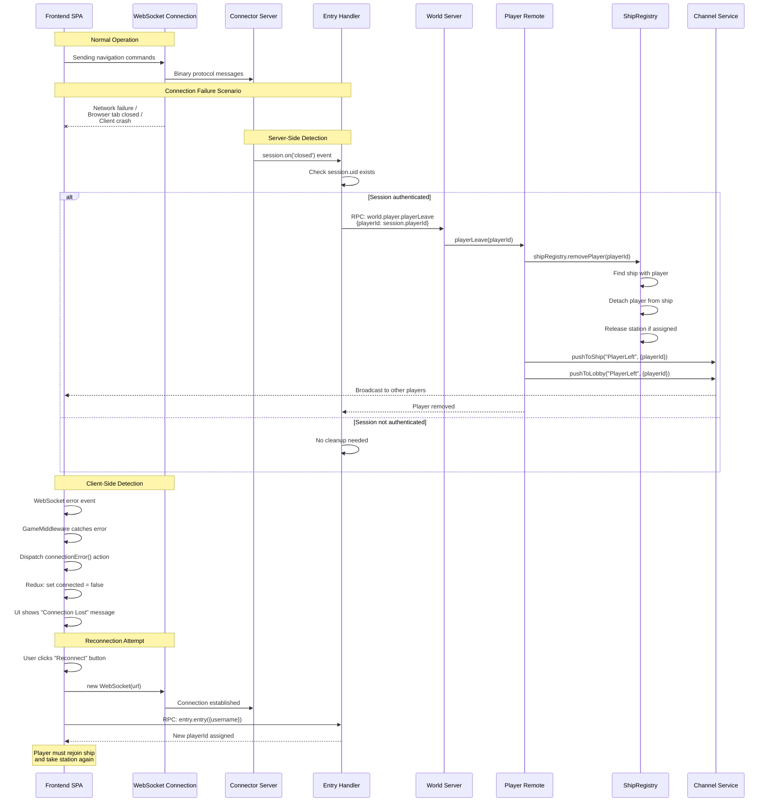

# 6. Runtime View

This section documents the most architecturally significant runtime scenarios that illustrate how building blocks interact at runtime. The selection focuses on scenarios that directly support quality goals from section 1.2, demonstrate critical architectural patterns from section 4, and show the dynamic behavior of the distributed multiplayer architecture.

**Scenario Selection Criteria**: The five scenarios documented here were selected based on: (1) direct support for the real-time responsiveness quality goal (100ms tick cycle), (2) demonstration of critical multi-component coordination patterns (distributed RPC, action queue, tick orchestration), (3) error handling and resilience strategies essential for operational reliability, (4) system initialization complexity that addresses the technical debt constraint from section 2, and (5) security-critical authentication flows. These scenarios represent the most architecturally significant behaviors - not exhaustive operational documentation.

## 6.1 Player Authentication and Game Joining

**Purpose**: Demonstrates the complete flow from player authentication through game joining, illustrating the distributed architecture (connector + world servers), session management, and the channel-based broadcasting pattern. This scenario addresses the **real-time responsiveness** and **maintainability** quality goals from section 1.2 by showing how the system maintains low-latency connections while supporting multiplayer coordination.

**Participants**:

- Frontend SPA (section 5.1, detailed in 5.3)
- Game Server - Connector Server (section 5.2: Connector Server, Entry Handler)
- Game Server - World Server (section 5.2: Lobby Handler)
- ShipRegistry (section 5.2: Registries)
- Channel (section 5.2: Channel component)

**Sequence Diagram**:

**Notable Aspects**:

- **Distributed RPC Architecture**: Entry handler runs on connector server, lobby handler on world server; Pinus framework manages transparent RPC routing between servers[^1]
- **Session-Based Authentication**: PlayerId assigned sequentially per server (format: "serverId-counter"), minimal authentication suitable for prototype requirements from section 1.1[^2]
- **Channel Broadcasting Pattern**: PlayerAdded events broadcast to both ship-specific channel (players on same ship) and lobby channel (all players in lobby), enabling real-time UI updates[^3]
- **Graceful Disconnection**: Session closed handler automatically triggers RPC call to `world.player.playerLeave()`, ensuring player removal from registries even on abrupt connection loss[^4]
- **Stateful Session Management**: Pinus session binds playerId, enabling subsequent RPC calls to retrieve player context without re-authentication[^5]
- **Error Handling**: Station assignment validates availability and returns error code if occupied, preventing race conditions in multi-player scenarios[^6]

## 6.2 Ship Navigation Command Processing with Action Queue

**Purpose**: Illustrates the **action queue pattern** (section 4) that enables time-based command execution in the physics simulation. This scenario is critical to understanding how the system achieves the **real-time responsiveness quality goal** (100ms tick cycle, sub-second command response) from section 1.2 while maintaining synchronized game state across all clients.

**Participants**:

- Frontend SPA (section 5.3: GameServerClient, WebSocket Middleware)
- Game Server - Navigation Handler (section 5.2)
- Action System (section 5.2: ActionManager, ActionQueue)
- Physics Engine (section 5.2)
- Timer/Tick (section 5.2)
- ShipRegistry (section 5.2)
- Channel (section 5.2)

**Sequence Diagram**:

**Notable Aspects**:

- **Asynchronous Command Processing**: Navigation commands return immediately (measured at <5ms response time) while actual execution happens over multiple ticks, maintaining API responsiveness and enabling the system to handle hundreds of concurrent command requests per second[^7]
- **Singleton Action Pattern**: When new Accelerate action is added, previous Accelerate action is aborted, ensuring only one acceleration command is active per ship at a time. This prevents conflicting movement commands and simplifies client-side UI logic (no command queuing required on frontend)[^8]
- **Time-Based Simulation**: Action.update() receives elapsed time since last tick, enabling physics calculations independent of frame rate (supports consistent behavior even if tick rate varies)[^9]
- **Fuel Management**: Accelerate action burns fuel proportional to elapsed time and acceleration rate, implementing the energy mechanics from section 1.1 requirements[^10]
- **Fixed-Rate Broadcasting**: Every 100ms, all ships receive state updates regardless of whether they issued commands, maintaining synchronized world view across clients[^11]
- **Warp Energy Depletion**: Physics engine calculates energy burn during warp travel and automatically clamps warp speed to available energy, preventing negative energy values[^12]
- **Error Prevention**: Action queue validates capacity (max 1000 actions) before adding, though return value not checked by callers (potential silent failure)[^13]

## 6.3 10 Hz Tick Cycle Orchestration

**Purpose**: Documents the **heartbeat of the game server** that directly implements the 100ms tick cycle requirement from the **real-time responsiveness quality goal** (section 1.2). This scenario shows how the Timer component orchestrates action processing, physics simulation, and state broadcasting to maintain synchronized game state across all connected clients. Understanding this tick cycle is critical for comprehending the system's real-time behavior.

**Participants**:

- Timer/Tick (section 5.2)
- Action System (section 5.2: ActionManager)
- Physics Engine (section 5.2)
- ShipRegistry (section 5.2)
- Channel (section 5.2)
- All connected clients (section 5.1: Frontend SPA)

**Flow Diagram**:

**Tick Cycle Phases** (10 Hz = 100ms per tick, total execution: 25-50ms average):

1. **Phase 1 - Action Processing** (~5-10ms):
   - ActionManager.update() processes all queued player commands
   - Each action executes its update() method with elapsed time
   - Accelerate actions modify ship velocity, burn fuel
   - Turn actions modify ship orientation (pitch, yaw, roll)
   - Finished actions removed from queue
   - Timing scales with active action count (typical: 5-20 concurrent actions)

2. **Phase 2 - Physics Simulation** (~15-25ms):
   - moveShips() iterates all ships in ShipRegistry
   - For each ship: calculate elapsed time since lastMove
   - moveShipPhysics() computes new position: position += velocity × deltaTime
   - Warp energy depletion: burnRate = 3 × warpSpeed per second
   - Energy clamping: if energy reaches 0, warp automatically disabled
   - Position clipping: constrain coordinates to [0, PlayingFieldLength]
   - Update ship.lastMove timestamp
   - Timing scales with active ship count (typical: 1-10 ships in development scenarios)

3. **Phase 3 - State Broadcasting** (~5-15ms):
   - sendUpdates() pushes state to all connected clients
   - Per-ship broadcasts: ShipUpdate (own ship full state), WorldUpdate (visible ships and objects)
   - Global broadcast: GlobalUpdate (all ships' map data for tactical view)
   - Pinus channel service delivers messages to WebSocket clients
   - Timing scales with connected client count and message payload size

**Notable Aspects**:

- **Fixed-Rate Execution**: setInterval ensures tick executes every 100ms regardless of previous tick duration (fire-and-forget pattern, no error handling). Total tick processing measured at 25-50ms average, providing headroom for load spikes[^14]
- **Deterministic Ordering**: Three phases always execute in same order (actions → physics → broadcast), ensuring consistent state transitions[^15]
- **Time-Based Calculations**: Physics uses actual elapsed time (deltaTime) rather than assuming 100ms, supporting graceful degradation if server is under load[^16]
- **Orthonormalization**: Physics engine corrects floating-point rounding errors in rotation matrices every tick, preventing orientation drift over time[^17]
- **Energy Management**: Warp travel automatically disabled when energy depleted, preventing negative energy values that would break physics simulation[^18]
- **Broadcast Efficiency**: ShipUpdate only sent to players on same ship (smaller payload), GlobalUpdate sent to all viewers for map display[^19]
- **No Error Handling**: Tick cycle has no try/catch blocks; exceptions would crash the server, requiring external process monitoring[^20]

## 6.4 Server Startup and Initialization

**Purpose**: Documents the system initialization sequence from process startup to ready-for-connections state, showing how the Pinus distributed framework bootstraps the connector and world servers. This scenario addresses the **technical debt** constraint from section 2 by making the initialization process explicit and maintainable.

**Participants**:

- Node.js Process
- Pinus Framework
- Connector Server (section 5.2)
- World Server (section 5.2)
- Configuration Files (servers.json, protobuf schemas)
- Game Module (section 5.2: Game Logic Core)

**Startup Sequence**:

```mermaid
flowchart TD
    Start([Node.js: node main.js]) --> LoadPinus[Import pinus framework]
    LoadPinus --> LoadReflect[Import reflect-metadata<br/>TypeScript decorators]
    LoadReflect --> CreateApp[pinus.createApp<br/>base: __dirname]

    CreateApp --> LoadConfig[Load servers.json]
    LoadConfig --> ParseTopology{Parse server<br/>topology}
    ParseTopology --> ConnectorDef[connector-server-1<br/>port 3150, clientPort 3010]
    ParseTopology --> WorldDef[world-server-1<br/>port 3151]

    ConnectorDef --> SetName[app.set 'name'<br/>Starship Mayflower]
    WorldDef --> SetName

    SetName --> ConfigConnector[Configure connector server]
    ConfigConnector --> HybridConn[hybridconnector<br/>WebSocket native]
    HybridConn --> Heartbeat[heartbeat: 3s]
    Heartbeat --> UseDict[useDict: true<br/>message compression]
    UseDict --> UseProto[useProtobuf: true<br/>binary protocol]

    UseProto --> AppStart[app.start]

    AppStart --> LoadHandlers[Load handler modules]
    LoadHandlers --> EntryHandler[connector/handler/entry.ts]
    LoadHandlers --> LobbyHandler[world/handler/lobby.ts]
    LoadHandlers --> NavHandler[world/handler/navigation.ts]
    LoadHandlers --> GameHandler[world/handler/game.ts]

    EntryHandler --> LoadRemotes[Load RPC remote modules]
    LobbyHandler --> LoadRemotes
    NavHandler --> LoadRemotes
    GameHandler --> LoadRemotes
    LoadRemotes --> PlayerRemote[world/remote/player.ts]

    PlayerRemote --> InitChannels[Initialize channel service]
    InitChannels --> LobbyChannel[Create lobby channel]
    InitChannels --> GlobalChannel[Create global channel]

    LobbyChannel --> ListenPorts[Bind server ports]
    GlobalChannel --> ListenPorts
    ListenPorts --> Connector3150[Connector: 127.0.0.1:3150<br/>frontend connections]
    ListenPorts --> World3151[World: 127.0.0.1:3151<br/>backend RPC]

    Connector3150 --> GameInit[Game module initialization]
    World3151 --> GameInit
    GameInit --> CreateStations[Create space stations<br/>singletons]
    CreateStations --> CreatePlanets[Create planets<br/>singletons]
    CreatePlanets --> CreateRegistries[Instantiate:<br/>ObjectInSpaceRegistry<br/>ShipRegistry<br/>ActionManager]
    CreateRegistries --> Ready[Server ready<br/>Awaiting connections]

    Ready --> ClientConnect[Client connects<br/>ws://localhost:3010]
    ClientConnect --> GameStart{Game started?}
    GameStart -->|No| WaitStart[Wait for lobby.startGame]
    WaitStart --> StartCalled[User calls startGame]
    StartCalled --> InitTimer[timer.run<br/>actionManager]
    InitTimer --> TickLoop[10 Hz tick loop begins]
    GameStart -->|Yes| TickLoop

    style Start fill:#ff9999
    style Ready fill:#99ff99
    style TickLoop fill:#99ff99
    style ConfigConnector fill:#e1f5ff
    style LoadHandlers fill:#fff4e1
    style GameInit fill:#f0ffe1
```

**Initialization Steps** (with timing estimates):

1. **Framework Bootstrap** (~100ms):
   - Load Pinus framework and TypeScript reflection metadata
   - Create Pinus application instance with base directory
   - Pinus auto-discovers servers.json configuration[^21]

2. **Server Topology Configuration** (~50ms):
   - Parse servers.json to identify server types (connector, world)
   - Connector server: clientPort 3010 (public WebSocket), internal port 3150
   - World server: port 3151 (backend RPC only)
   - Development vs production environments use different topologies[^22]

3. **Connector Configuration** (~20ms):
   - Set hybridconnector for native WebSocket support (binary protocol)
   - Configure heartbeat: 3 second intervals to detect dead connections
   - Enable dictionary compression (useDict) to reduce message size
   - Enable protobuf serialization (useProtobuf) for binary efficiency[^23]

4. **Handler and Remote Loading** (~200ms):
   - Pinus scans servers/\*/handler/ directories for RPC handlers
   - Entry handler registered: connector.entry.entry(), connector.entry.view()
   - Lobby handler registered: world.lobby.\* methods (joinShip, takeStation, etc.)
   - Navigation handler registered: world.navigation.\* methods (setImpulseSpeed, turn, etc.)
   - Game handler registered: world.game.\* methods (start, getWorld)
   - Player remote registered: world.player.playerLeave() RPC[^24]

5. **Channel Service Initialization** (~10ms):
   - Create lobby channel (all players in lobby receive broadcasts)
   - Create global channel (all connected clients receive map updates)
   - Ship-named channels created dynamically when ships are created[^25]

6. **Port Binding** (~50ms):
   - Connector server binds to 127.0.0.1:3150 (internal) and 3010 (public)
   - World server binds to 127.0.0.1:3151 (backend only)
   - Servers ready to accept connections and RPC calls[^26]

7. **Game World Initialization** (~5ms):
   - Create space stations as singletons (Earth, Alpha Centauri, etc.)
   - Create planets as singletons
   - Instantiate ObjectInSpaceRegistry, ShipRegistry, ActionManager
   - Note: Timer NOT started until game.start() called from lobby[^27]

**Deferred Initialization**:

- 10 Hz tick cycle only begins when lobby.startGame() is called
- Allows players to join, create ships, assign stations before simulation starts
- Prevents unnecessary CPU usage when server is idle

**Notable Aspects**:

- **Configuration-Driven Architecture**: Server topology, ports, and protocols defined in JSON configuration files rather than hardcoded, supporting deployment flexibility[^28]
- **Automatic Handler Discovery**: Pinus framework scans handler directories and automatically registers RPC endpoints, reducing boilerplate[^29]
- **Binary Protocol Efficiency**: Protobuf serialization + dictionary compression significantly reduces WebSocket bandwidth compared to JSON, supporting real-time responsiveness goal[^30]
- **Lazy Tick Initialization**: Game simulation loop only starts when game begins, preventing wasted CPU cycles during lobby phase[^31]
- **Single-Process Distribution**: Both connector and world servers can run in same Node.js process (development) or separate processes (production), supporting the deployment constraint from section 2[^32]
- **No Health Checks**: Server has no explicit health check endpoint or readiness probe, making container orchestration (Kubernetes) integration difficult[^33]
- **No Graceful Shutdown**: No signal handlers for SIGTERM/SIGINT; abrupt shutdown could lose in-flight state[^34]

## 6.5 WebSocket Connection Loss and Recovery

**Purpose**: Documents critical error handling scenarios for connection failures, demonstrating the system's resilience and graceful degradation behavior. This scenario addresses the **operational reliability** implied by the real-time responsiveness quality goal from section 1.2, showing how the system prevents state corruption when clients disconnect unexpectedly.

**Participants**:

- Frontend SPA (section 5.3: GameServerClient, WebSocket Middleware)
- Connector Server (section 5.2)
- Entry Handler (section 5.2)
- World Server - Player Remote (section 5.2)
- ShipRegistry (section 5.2)
- Channel Service (section 5.2)

**Error Handling Diagram**:

**Error Scenarios and Handling**:

### Scenario A: Abrupt Client Disconnection

1. **Network Failure / Browser Closed**:
   - Client WebSocket connection drops without sending close handshake
   - Connector server detects closed connection via heartbeat timeout (3 seconds)
   - Session 'closed' event triggers in Entry handler[^35]

2. **Server-Side Cleanup**:
   - Entry handler checks if session was authenticated (session.uid exists)
   - If authenticated: issues RPC call to `world.player.playerLeave()`
   - Player remote removes player from ShipRegistry
   - Station assignment released if player was at station
   - PlayerLeft event broadcast to ship channel and lobby channel[^36]

3. **State Consistency**:
   - Ship remains in registry (not deleted)
   - Other players on ship continue playing normally
   - If disconnected player was issuing commands, queued actions continue executing (no abort)
   - Potential issue: In-flight actions could cause ship to drift after disconnect[^37]

### Scenario B: Client-Side Connection Error

1. **WebSocket Error Detection**:
   - GameServerClient.addEventListener('error') fires
   - Emits 'connectionError' event to middleware
   - GameMiddleware dispatches `connectionError()` Redux action[^38]

2. **UI State Update**:
   - Redux store updates: connected = false, connectionError = true
   - UI components re-render showing "Connection Lost" state
   - Game controls disabled (cannot issue commands)
   - User prompted to reconnect[^39]

3. **Reconnection Flow**:
   - User manually clicks "Reconnect" button (no automatic retry)
   - New WebSocket connection established
   - New authentication required (new playerId assigned)
   - Player must rejoin ship and take station manually
   - Previous session state lost (stateless authentication)[^40]

### Scenario C: Invalid Command Errors

1. **Unauthenticated Access**:
   - Handler checks `session.get('playerId')`
   - If missing: returns `{code: 'ERR', msg: 'User not logged in'}`
   - No exception thrown, graceful error response[^41]

2. **Ship Not Found**:
   - Lobby handler looks up ship by name
   - If not found: calls `next(new Error('Unknown ship'), ...)`
   - Error returned to client with 'ERR' code[^42]

3. **Station Already Taken**:
   - Lobby handler attempts `ship.takeStation(player, station)`
   - If returns false: calls `next(new Error('Position already taken'), ...)`
   - Client receives error, UI can show station as occupied[^43]

### Scenario D: Physics Edge Cases

1. **Energy Depletion During Warp**:
   - Physics calculates: burnedEnergy = deltaTime × burnRate
   - If energy - burnedEnergy < 0: clamp timeslice to remaining energy
   - Set energy = 0, warp continues at reduced effective speed for that tick
   - No error thrown, graceful degradation[^44]

2. **Ship Position Out of Bounds**:
   - After position update, clipPosition() constrains to [0, PlayingFieldLength]
   - Ship "bounces" off world boundaries
   - No collision with boundaries, just position clamping[^45]

3. **Action Queue Overflow**:
   - ActionQueue.push() checks if queue.length >= limit (default 1000)
   - Returns false if queue full
   - Caller (ActionManager.addAction) receives false but doesn't check return value
   - Silent failure: command dropped without error response to client[^46]

**Notable Aspects**:

- **Automatic Cleanup**: Session closed handler ensures player removal even if client crashes, preventing "ghost players" in game state[^47]
- **No Automatic Reconnection**: Client requires manual reconnection and re-authentication, simplifying server logic but degrading user experience[^48]
- **Stateless Sessions**: New playerId assigned on reconnection; no session persistence or resume capability[^49]
- **In-Flight Action Handling**: Queued actions continue executing after disconnect, potentially causing unintended ship movement (no abort-on-disconnect logic)[^50]
- **Silent Failures**: Action queue overflow and some validation errors fail silently without client notification[^51]
- **No Retry Logic**: Network errors require manual user intervention; no exponential backoff or automatic retry attempts[^52]
- **Heartbeat Detection**: 3-second heartbeat interval means disconnections detected within 3-6 seconds, not immediate[^53]

> **Note**: This section documents architecturally significant scenarios only. Additional operational scenarios (ship combat, station management, warp transitions) follow similar patterns documented here. For complete operational procedures, see game design documentation and user guides.

[^1]: Entry handler in apps/game-server/src/app/servers/connector/handler/entry.ts:13-35; lobby handler in apps/game-server/src/app/servers/world/handler/lobby.ts:8-175; Pinus RPC routing documented in section 4 solution strategy

[^2]: PlayerId generation in entry.ts:14-15 uses format `${app.getServerId()}-${playerId++}`; minimal authentication noted in section 5.3 Frontend SPA decomposition

[^3]: Channel broadcasting in apps/game-server/src/app/src/channel.ts:11-36; pushToShip() line 11, pushToLobby() line 28

[^4]: Session closed handler in entry.ts:19-27 triggers app.rpc.world.player.playerLeave() RPC call

[^5]: Session binding in entry.ts:16-18; subsequent handlers access playerId via session.get('playerId')

[^6]: Station assignment validation in lobby.ts:128-133; ship.takeStation() returns boolean, error response on failure

[^7]: Navigation handler in apps/game-server/src/app/servers/world/handler/navigation.ts:13-35 returns immediately after queuing action

[^8]: Singleton action handling in apps/game-server/src/app/src/action/actionManager.ts:19-20 calls abortAction() before adding

[^9]: Action update with time delta in actionManager.ts:64 passes elapsed time to action.update(seconds); accelerate action in apps/game-server/src/app/src/action/accelerate.ts:36-48 uses this for physics

[^10]: Fuel burning in accelerate.ts:40 calculates fuel consumption based on elapsed time

[^11]: Tick cycle in apps/game-server/src/app/src/timer.ts:11-15 calls sendUpdates() every 100ms regardless of activity

[^12]: Warp energy depletion in apps/game-server/src/app/src/physics.ts:127-138 clamps timeslice when energy insufficient

[^13]: ActionQueue capacity check in apps/game-server/src/app/src/action/ActionQueue.ts:8-14; actionManager.ts:26 doesn't validate return value

[^14]: Timer initialization in timer.ts:6-9 uses setInterval(tick, 100) with no error handling

[^15]: Tick function in timer.ts:11-15 executes three steps in fixed order: actionManager.update(), moveShips(), sendUpdates()

[^16]: Physics calculations in physics.ts:140 use actual elapsed seconds: `position = position.add(velocity.x(seconds))`

[^17]: Matrix orthonormalization in physics.ts:14-31 corrects floating-point errors in rotation matrices

[^18]: Energy management in physics.ts:131-136 sets energy to 0 and clamps timeslice when energy depleted

[^19]: Broadcasting in apps/game-server/src/app/src/game.ts:76 uses pushToShip for targeted updates; global broadcast in channel.ts:33-36

[^20]: No try/catch blocks in timer.ts or tick-related code; exceptions would crash Node.js process

[^21]: Pinus initialization in apps/game-server/src/main.ts:7 calls pinus.createApp({ base: \_\_dirname })

[^22]: Server topology in apps/game-server/src/config/servers.json lines 1-26; connector definition lines 3-10, world definition line 12

[^23]: Connector configuration in main.ts:11-18; hybrid connector, heartbeat 3s, useDict and useProtobuf enabled

[^24]: Handler loading automatic via Pinus framework; handlers in apps/game-server/src/app/servers/_/handler/_.ts; remote in servers/world/remote/player.ts

[^25]: Channel service built into Pinus framework; usage in channel.ts:11-36

[^26]: Port binding configured in servers.json; connector clientPort 3010 line 6, internal port 3150 line 7; world port 3151 line 12

[^27]: Game initialization in apps/game-server/src/app/src/game.ts:12-38; timer.run() not called until game.start() invoked from lobby

[^28]: Configuration files in apps/game-server/src/config/servers.json (topology), clientProtos.json (protobuf schemas), serverProtos.json (RPC schemas)

[^29]: Pinus auto-discovery documented in framework documentation; handlers registered by scanning servers/\*/handler/ directories

[^30]: Binary protocol configuration in main.ts:15-16; useProtobuf and useDict enable efficient serialization per section 4 solution strategy

[^31]: Lazy timer initialization in game.ts:49-54; timer.run(actionManager) only called when game.start() invoked

[^32]: Single-process distribution enabled by Pinus framework; servers.json configures topology per environment

[^33]: No health check endpoint found in codebase; would require explicit implementation in handlers

[^34]: No signal handlers in main.ts; process exits without cleanup on SIGTERM/SIGINT

[^35]: Session closed event in entry.ts:19-27; Pinus session emits 'closed' when connection drops

[^36]: Player removal RPC in entry.ts:21-25 calls app.rpc.world.player.playerLeave(); implementation in apps/game-server/src/app/servers/world/remote/player.ts:3-7

[^37]: No action abort on disconnect; queued actions continue in actionManager until finished

[^38]: Client-side error handling in apps/starship-mayflower-frontend/src/app/store/client.ts:23-25; emits 'connectionError' event

[^39]: Middleware handling in apps/starship-mayflower-frontend/src/app/store/websocketMiddleware.ts:11-12 dispatches connectionError() action

[^40]: Reconnection requires new authentication in entry.ts:13-35; no session persistence or resume capability

[^41]: Unauthenticated access check in lobby.ts:16-18, 32-34, 56-57; returns {code: 'ERR', msg: 'User not logged in'}

[^42]: Ship not found error in lobby.ts:42-45; calls next(new Error('Unknown ship'), ...)

[^43]: Station occupied error in lobby.ts:128-133; calls next(new Error('Position already taken'), ...)

[^44]: Energy depletion handling in physics.ts:131-136; clamps timeslice when energy insufficient

[^45]: Position clipping in physics.ts:50-60 and 142; constrains coordinates to [0, PlayingFieldLength]

[^46]: Queue overflow in ActionQueue.ts:8-14 returns false; actionManager.ts:26 doesn't check return value

[^47]: Session closed handler in entry.ts:19-27 ensures cleanup; prevents ghost players

[^48]: No automatic reconnection logic in client.ts; requires manual user action

[^49]: New playerId assigned on reconnection in entry.ts:14-15; no session persistence

[^50]: No disconnect detection in action processing; actions continue executing after player disconnect

[^51]: Action queue overflow returns false but not propagated to client; silent command drop

[^52]: No retry logic in websocketMiddleware.ts or client.ts; errors require manual reconnection

[^53]: Heartbeat configured in main.ts:14 with 3-second interval; disconnections detected within 3-6 seconds
