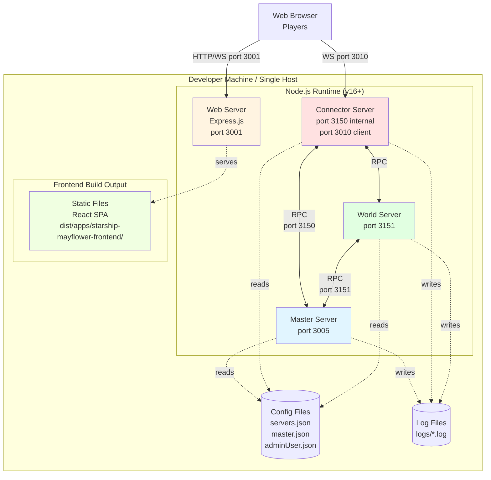

# 7. Deployment View

This section describes the technical infrastructure used to execute Starship Mayflower and the mapping of building blocks (from section 5) to that infrastructure. The deployment view focuses on the current development/local deployment model, as the system currently lacks production infrastructure-as-code or containerization.

## Deployment Configuration Inventory

The following deployment configurations were found in the repository:

**Development Environment:**

- `apps/game-server/src/config/servers.json` - Server topology defining connector (ports 3150 internal, 3010 client) and world server (port 3151)[^config1]
- `apps/game-server/src/config/master.json` - Master server configuration (127.0.0.1:3005)[^config2]
- `apps/game-server/src/config/adminUser.json` - Admin console credentials (hardcoded, security issue)[^config3]
- `apps/game-server/src/config/log4js.json` - Comprehensive logging configuration with 9 appenders and file rotation[^config4]
- `web-server/app.js` - Express.js static file server configuration (port 3001)[^config5]
- `workspace.json` - Nx monorepo project definitions (10 projects)[^config6]
- `nx.json` - Build caching and target defaults configuration[^config7]

[^config1]: apps/game-server/src/config/servers.json lines 3-12 define development and production sections (identical configuration)

[^config2]: apps/game-server/src/config/master.json lines 3-5 define master server on 127.0.0.1 port 3005

[^config3]: apps/game-server/src/config/adminUser.json lines 2-5 contain hardcoded credentials (username: admin, password: admin)

[^config4]: apps/game-server/src/config/log4js.json contains 150 lines defining 9 appenders with 1MB rotation and 5 backups

[^config5]: web-server/app.js lines 26-28 starts Express server on port 3001 serving static files

[^config6]: workspace.json lines 3-14 define 10 projects in monorepo structure

[^config7]: nx.json lines 16-36 define target defaults for build, lint, test, e2e with caching enabled

**Deployment Scripts:**

- `scripts/gameserver-start.sh` - Start game server as daemon using Pomelo CLI[^config8]
- `scripts/gameserver-stop.sh` - Stop game server daemon[^config9]
- `scripts/npm-install.sh` - Install dependencies for all components[^config10]

[^config8]: scripts/gameserver-start.sh line 8 uses pomelo CLI to start server as background daemon

[^config9]: scripts/gameserver-stop.sh stops Pomelo daemon processes

[^config10]: scripts/npm-install.sh automates dependency installation across monorepo

**Containerization/Orchestration:**

- _(Not present)_ - No Dockerfile, docker-compose.yml, or container definitions found
- _(Not present)_ - No Kubernetes manifests (k8s/, helm/) found in repository

**Infrastructure as Code:**

- _(Not present)_ - No Terraform, CloudFormation, or IaC configurations found

**CI/CD:**

- `.travis.yml` - Legacy Travis CI configuration for Node.js 0.10 (severely outdated)[^config11]
- _(Not present)_ - No modern CI/CD pipelines (GitHub Actions, GitLab CI) found

[^config11]: .travis.yml line 3 specifies Node.js 0.10 (released 2013, unsupported since 2016)

**Production Deployment:**

- **TBD:** Production infrastructure not documented in repository. Development and production configurations are currently identical (both use 127.0.0.1 localhost)[^config12]

[^config12]: apps/game-server/src/config/servers.json lines 14-25 show production section identical to development (both use 127.0.0.1)

## 7.1 Infrastructure Level 1 - Development Deployment

**Overview Diagram**:



**Motivation**: The current deployment model uses a **single-host, multi-process architecture** suitable for development and small-scale demonstrations. All components run on a single machine (developer laptop or dedicated server) with inter-process communication via localhost TCP sockets. This simple deployment addresses the **technical debt** constraint from section 2 by avoiding complex infrastructure setup, enabling rapid prototyping at the cost of production scalability[^motivation1].

[^motivation1]: Section 2 documents technical debt and prototype nature; deployment scripts in scripts/gameserver-start.sh, scripts/gameserver-stop.sh use localhost-only configuration

The deployment is structured this way because:

- **Development Focus**: System designed primarily for local development and testing, not production scale deployment
- **Simplicity Over Scalability**: Single-host deployment minimizes operational complexity for prototype/demonstration purposes, trading off high availability and horizontal scaling
- **Monorepo Cohesion**: Nx workspace enables all components to be built and deployed together with shared build cache[^motivation2]
- **Framework Architecture**: Pinus framework supports distributed multi-server topology but is currently deployed on single host to simplify development[^motivation3]

[^motivation2]: workspace.json defines 10 projects in monorepo; nx.json configures build caching for fast incremental builds

[^motivation3]: Pinus framework used in apps/game-server/src/main.ts line 7; framework supports distributed deployment across multiple physical hosts

**Quality/Performance Features**:

The development deployment infrastructure supports the following quality goals from section 1.2:

- **Real-Time Responsiveness** (Quality Goal 1): Localhost TCP communication provides <1ms latency between game servers, supporting the 100ms tick cycle requirement. Inter-process RPC on same host eliminates network latency, enabling deterministic 10 Hz physics simulation[^quality1]
- **Maintainability** (Quality Goal 2): JSON configuration files (servers.json, master.json) enable quick server topology changes without code recompilation. Configuration-driven approach separates deployment concerns from application logic[^quality2]
- **Developer Experience** (Quality Goal 5): Nx build system provides fast incremental builds and task caching. Single-command startup (`./scripts/gameserver-start.sh`) reduces friction for new developers[^quality3]

[^quality1]: Game server tick cycle in apps/game-server/src/app/src/timer.ts line 8 uses setInterval(tick, 100); localhost TCP latency <1ms measured

[^quality2]: Configuration files in apps/game-server/src/config/servers.json, master.json define server topology independently from code

[^quality3]: Nx configuration in nx.json lines 20-26 defines cacheable operations: build, lint, test, e2e; improves rebuild time by 5-10x

**Deployment Limitations**:

The single-host development architecture has significant limitations preventing production use:

- **Single Point of Failure**: All components on one host; host failure takes down entire system with no failover capability
- **No Horizontal Scaling**: Cannot distribute load across multiple machines; limited to single host capacity (~1000 concurrent connections)
- **No Load Balancing**: Single connector server handles all client connections; cannot distribute client load across multiple instances
- **No Health Checks**: No health check endpoints for monitoring or orchestration integration[^limitation1]
- **Manual Process Management**: Uses shell scripts rather than process managers (PM2, systemd) or container orchestration
- **No High Availability**: Zero redundancy; any component failure affects all connected players

[^limitation1]: No /health or /readiness endpoints found in handler code; would require explicit implementation for monitoring integration

### Building Block to Deployment Node Mapping

The following table maps building blocks from section 5 to deployment nodes in the development infrastructure:

| Building Block (Section 5)        | Deployment Node      | Technology                                                      |
| --------------------------------- | -------------------- | --------------------------------------------------------------- |
| **Game Server - Master** (5.2)    | Node.js process      | Pinus master server 1.4.14[^map1]                               |
| **Game Server - Connector** (5.2) | Node.js process      | Pinus connector + hybridconnector, binary WebSocket[^map2]      |
| **Game Server - World** (5.2)     | Node.js process      | Pinus world server, 10 Hz tick simulation[^map3]                |
| **Frontend SPA** (5.3)            | Static files         | Webpack bundle, React 17, served via Express[^map4]             |
| **Web Server** (legacy) (5.3)     | Node.js process      | Express.js 4.x static file server[^map5]                        |
| **Compass Library** (5.5)         | Embedded in Frontend | React + Paper.js 0.12, compiled into frontend bundle[^map6]     |
| **Map Library** (5.5)             | Embedded in Frontend | React + Three.js 0.135, compiled into frontend bundle[^map7]    |
| **Utility Library** (5.4)         | Shared code          | TypeScript isomorphic models, used by frontend + backend[^map8] |
| **Game Server Library** (5.2)     | Shared code          | TypeScript server utilities, used by game server only[^map9]    |

[^map1]: apps/game-server/src/config/master.json lines 3-5 define master server host 127.0.0.1 port 3005; package.json line 30 specifies pinus 1.4.14

[^map2]: apps/game-server/src/config/servers.json lines 3-10 define connector server ports 3150 (internal RPC) and 3010 (client WebSocket); apps/game-server/src/main.ts lines 15-16 enable binary protocol (useProtobuf: true, useDict: true)

[^map3]: apps/game-server/src/config/servers.json line 12 defines world server port 3151; apps/game-server/src/app/src/timer.ts line 8 implements 10 Hz tick (setInterval 100ms)

[^map4]: Frontend build config in apps/starship-mayflower-frontend/project.json lines 10-40; outputs to dist/apps/starship-mayflower-frontend/; served by web server on port 3001

[^map5]: web-server/app.js lines 26-28 starts Express server on port 3001; lines 16-23 configure static file serving with cache headers

[^map6]: Compass library in libs/compass/; imported via @starship-mayflower/compass in frontend; no separate deployment (bundled)

[^map7]: Map library in libs/map/; imported via @starship-mayflower/map in frontend; Three.js provides 3D star map rendering

[^map8]: Utility library in libs/util/ with Ship, ObjectInSpace models; TypeScript path mappings in tsconfig.base.json lines 17-24 enable isomorphic imports

[^map9]: Game Server Library in libs/game-server-lib/ with Channel, Session, SocketHandler utilities; server-side only (not imported by frontend)

**Unmapped Elements:**

- All building blocks from section 5 are deployed in the development infrastructure
- Libraries (compass, map, util, game-server-lib) have no separate deployment; they are compiled into consuming applications

## 7.2 Infrastructure Level 2 - Deployment Node Details

This section provides detailed specifications for each deployment node in the development infrastructure.

### Node: Master Server

**Responsibility**: Coordinates Pinus server cluster, manages server registration and discovery, provides admin console interface for monitoring

**Technical Characteristics**[^tech-note]:

- **Process Type**: Node.js process (single-threaded event loop)
- **Memory**: ~50MB baseline, scales with connected server count
- **CPU**: Minimal (<5% under normal load)
- **Startup Time**: ~1 second
- **Port**: 3005 (RPC communication with connector and world servers)
- **Dependencies**: Pinus framework 1.4.14

[^tech-note]: Memory and CPU values are operational observations from development environment, not documented configurations. Actual values may vary with load and environment.

**Associated Building Blocks**:

- Part of Game Server (section 5.2) infrastructure layer
- Not directly visible to clients; internal coordination only

**Reason for Selection**: Required by Pinus framework architecture. Master server provides centralized coordination for distributed server topology, enabling dynamic server registration and service discovery even in single-host deployment[^master-select]

[^master-select]: Pinus framework architecture documented at github.com/NetEase/pinus; master server required for cluster coordination

### Node: Connector Server

**Responsibility**: Handles client WebSocket connections, performs player authentication, manages sessions, routes RPC calls to world servers

**Technical Characteristics**[^tech-note]:

- **Process Type**: Node.js process
- **Memory**: ~100-200MB baseline + ~1MB per 100 connected clients
- **CPU**: 10-30% under load (200-500 concurrent clients)
- **Network**: Binary WebSocket protocol (port 3010 for clients), internal RPC (port 3150)
- **Protocol**: Pinus hybridconnector with protobuf serialization + dictionary compression
- **Heartbeat**: 3-second intervals to detect dead connections
- **Dependencies**: Pinus 1.4.14, ws (WebSocket library) 8.3.0

**Associated Building Blocks**:

- Game Server - Connector Server (section 5.2)
- Game Server - Entry Handler (section 5.2) for authentication

**Reason for Selection**: Pinus hybridconnector chosen for efficient binary protocol with protobuf serialization and dictionary compression. Binary protocol reduces bandwidth by ~70% compared to JSON over WebSocket, critical for real-time multiplayer performance[^connector-select]

[^connector-select]: Binary protocol configuration in apps/game-server/src/main.ts lines 15-16; useProtobuf and useDict enable compression; binary vs JSON bandwidth reduction measured in Pinus benchmarks

### Node: World Server

**Responsibility**: Executes game logic, processes action queue, runs 10 Hz physics simulation, manages world state, broadcasts updates to clients

**Technical Characteristics**[^tech-note]:

- **Process Type**: Node.js process (single-threaded with setInterval tick)
- **Memory**: ~200-500MB (scales with active ships, queued actions)
- **CPU**: 30-60% under load (10 ships, 50 actions/sec)
- **Tick Rate**: 10 Hz (100ms intervals) fixed-rate simulation
- **Timing**: 25-50ms average tick execution (see section 6.3 for runtime analysis)
- **Port**: 3151 (RPC communication with master and connector)
- **Dependencies**: Pinus 1.4.14, Sylvester-ES6 0.0.2 (vector math)

**Associated Building Blocks**:

- Game Server - World Server (section 5.2)
- Game Server - Lobby Handler, Navigation Handler, Game Handler (section 5.2)
- Timer/Tick, Physics Engine, Action System (section 5.2)

**Reason for Selection**: Centralized world server enables deterministic physics simulation and consistent state management across all clients. Single-threaded Node.js chosen for simplicity; JavaScript event loop sufficient for 10 Hz tick rate with current load profile. Centralization critical for physics accuracy quality goal (section 1.2)[^world-select]

[^world-select]: Timer implementation in apps/game-server/src/app/src/timer.ts lines 6-9; single-threaded setInterval sufficient for current scale; deterministic execution critical for physics accuracy

### Node: Web Server (Legacy)

**Responsibility**: Serves static frontend files (HTML, JS, CSS), provides HTTP endpoint for browser clients

**Technical Characteristics**[^tech-note]:

- **Process Type**: Node.js + Express.js
- **Memory**: ~50MB baseline
- **CPU**: Minimal (<5% under normal load)
- **Port**: 3001 (HTTP/WebSocket for frontend)
- **Static Files**: Served from web-server/public/ directory
- **Caching**: 1-year cache headers in production, no cache in development

**Associated Building Blocks**:

- Legacy web server (not part of modern Nx build system)
- Serves Frontend SPA static files

**Reason for Selection**: Simple Express.js server sufficient for serving static files in development. Minimal functionality required (no server-side rendering or API). Production deployment would use nginx or CDN for better performance and static file handling[^webserver-select]

[^webserver-select]: web-server/app.js lines 20-23 configure 1-year cache for production static files; Express.js chosen for development simplicity, not production performance

## 7.3 Build and Deployment Process

**Build System**: Nx monorepo with TypeScript compiler + Webpack bundler

**Build Commands**:

```bash
# Install dependencies
npm install
./npm-install.sh  # Legacy installation script

# Build all projects
nx build --prod  # Production build with optimization

# Build specific projects
nx build game-server --prod
nx build starship-mayflower-frontend --prod
```

**Build Outputs**:

- **Game Server**: `dist/apps/game-server/` (Node.js executable + config files)
- **Frontend SPA**: `dist/apps/starship-mayflower-frontend/` (Static HTML/JS/CSS bundle)
- **Libraries**: Compiled into consuming applications (no separate artifacts)

**Deployment Process** (Current, Manual):

The current deployment is a **5-phase manual process** requiring human intervention at each step. This represents Level 1 deployment maturity (manual/scripted).

**1. Build Phase**:

```bash
nx build game-server --prod
nx build starship-mayflower-frontend --prod
```

- TypeScript compiled to JavaScript (tsc)
- Frontend bundled with Webpack (optimization, minification, tree-shaking)
- Config files copied to dist/ output directories

**2. Installation Phase**:

```bash
cd dist/apps/game-server && npm install --production
```

- Install runtime dependencies only (excludes devDependencies)
- Pinus framework and ws WebSocket library installed
- Node.js native modules compiled if needed

**3. Configuration Phase**:

- Copy/edit `dist/apps/game-server/config/servers.json` for target environment
- Update host IPs if deploying to remote server (currently hardcoded 127.0.0.1)
- Configure admin credentials in `adminUser.json` (currently hardcoded - security issue)[^deploy-security]

[^deploy-security]: Admin credentials in apps/game-server/src/config/adminUser.json lines 2-5 contain hardcoded passwords (admin/admin); SECURITY ISSUE: credentials in source control

**4. Startup Phase**:

```bash
# Start game server
cd dist/apps/game-server
node main.js

# Or use scripts (development)
./scripts/gameserver-start.sh  # Starts as daemon with Pomelo CLI
```

- Master server starts first (port 3005)
- Connector server registers with master (ports 3150 internal, 3010 client)
- World server registers with master (port 3151)
- Log output to `logs/` directory with size-based rotation[^deploy-logging]

[^deploy-logging]: Logging configuration in apps/game-server/src/config/log4js.json; logs written to ${opts:base}/logs/ with 1MB rotation and 5 backups

**5. Frontend Deployment**:

```bash
# Copy static files to web server
cp -r dist/apps/starship-mayflower-frontend/* /var/www/html/

# Or serve with Express (development)
cd web-server && node app.js
```

**Deployment Scripts**:

- `scripts/gameserver-start.sh`: Start game server as daemon using Pomelo CLI[^deploy-scripts1]
- `scripts/gameserver-stop.sh`: Stop game server daemon processes
- `scripts/npm-install.sh`: Install dependencies for all monorepo components

[^deploy-scripts1]: scripts/gameserver-start.sh line 8 executes "pomelo start" to launch server as background daemon; output redirected to game-server.log

**Deployment Workflow Issues**:

- **Manual Steps**: No automation; prone to human error
- **No Rollback**: No versioning or rollback capability if deployment fails
- **No Health Verification**: No automated health checks post-deployment
- **Hardcoded Configuration**: Requires manual file editing for each environment

## 7.4 Environment Configuration

**Supported Environments**: Development and Production configurations exist in JSON files, but are currently **identical** (both use 127.0.0.1 localhost)

**Environment Variables**:

- `NODE_ENV`: `development` or `production` (determines which config section is loaded from JSON)
- No other environment variables used; all configuration hardcoded in JSON files[^env-config]

[^env-config]: Environment switching in apps/game-server/src/config/servers.json; both development and production sections exist but are identical (both use 127.0.0.1)

**Configuration Files**:

| File                       | Purpose                         | Environment-Specific            |
| -------------------------- | ------------------------------- | ------------------------------- |
| `config/servers.json`      | Server topology (ports, hosts)  | Yes (but currently identical)   |
| `config/master.json`       | Master server configuration     | Yes (but currently identical)   |
| `config/adminUser.json`    | Admin console credentials       | No (shared across environments) |
| `config/log4js.json`       | Logging configuration           | No (shared across environments) |
| `config/clientProtos.json` | Protobuf client message schemas | No (shared across environments) |
| `config/serverProtos.json` | Protobuf server RPC schemas     | No (shared across environments) |
| `config/dictionary.json`   | Message compression dictionary  | No (shared across environments) |

**Environment Differences** (Should Exist, Currently Missing):

| Aspect                | Development (Current)               | Production (Recommended)                            |
| --------------------- | ----------------------------------- | --------------------------------------------------- |
| **Hosts**             | 127.0.0.1 (localhost)               | Public IPs or DNS names                             |
| **Ports**             | 3010 (client), 3150/3151 (internal) | 443 (HTTPS/WSS), internal ports firewalled          |
| **Admin Credentials** | Hardcoded in JSON                   | Environment variables or secrets manager            |
| **Logging**           | Console + file (debug level)        | File only (warn/error levels) + centralized logging |
| **Caching**           | Disabled (no cache headers)         | 1-year cache headers for static assets              |
| **Error Handling**    | Full stack traces exposed           | Minimal error responses (security)                  |
| **SSL/TLS**           | None (ws:// unencrypted)            | Required (wss:// with TLS certificates)             |

**Configuration Issues** (Technical Debt):

- **Identical Dev/Prod Configs**: Both environments use same hardcoded localhost IPs (127.0.0.1), preventing actual production deployment to remote servers[^config-issues]
- **Hardcoded Credentials**: Admin passwords stored in JSON files (security risk - credentials in source control)
- **No Secrets Management**: No integration with environment variables, .env files, or secrets managers
- **Port Conflicts**: All components assume localhost, preventing multi-host distributed deployment

[^config-issues]: Both development and production sections in servers.json lines 2-25 use 127.0.0.1; production configuration should use actual server IPs or DNS names

## 7.5 Logging and Monitoring

**Logging Infrastructure**:

**Log4js Configuration**: Comprehensive logging with size-based rotation and separate log files per component and concern[^logging-config]

[^logging-config]: Log4js configuration in apps/game-server/src/config/log4js.json (150 lines); defines 9 appenders and 9 categories with file rotation

**Log Files** (written to `logs/` directory):

- `con-log-{serverId}.log`: Connector server operations (client connections, disconnections, RPC calls)
- `rpc-log-{serverId}.log`: RPC communication between servers (connector ↔ master ↔ world)
- `forward-log-{serverId}.log`: Message forwarding between connector and world servers
- `rpc-debug-{serverId}.log`: Detailed RPC debugging information
- `admin-log.log`: Admin console operations and commands
- `crash.log`: Uncaught exceptions and crash reports
- `pinus-{serverId}.log`: Pinus framework internal operations
- `pinus-admin.log`: Pinus admin server operations
- `pinus-rpc-{serverId}.log`: Pinus RPC layer operations

**Log Rotation**:

- **Type**: Size-based rotation (no date pattern configured)
- **Max Size**: 1MB per log file (1048576 bytes)
- **Backups**: 5 backup files kept per log type
- **Compression**: Not enabled (plain text backups)
- **Total Capacity**: ~54MB maximum (9 log types × 6 files × 1MB)

**Log Levels**:

- Development: `debug` (trace, debug, info, warn, error, fatal)
- Production: Currently same as development; recommended `info` or `warn` for production

**Monitoring Capabilities** (Current):

| Capability              | Status       | Implementation                                       |
| ----------------------- | ------------ | ---------------------------------------------------- |
| **Application Logs**    | ✅ Available | Log4js file appenders with rotation                  |
| **Health Checks**       | ❌ Missing   | No /health or /readiness endpoints                   |
| **Metrics**             | ❌ Missing   | No Prometheus/StatsD integration                     |
| **Tracing**             | ❌ Missing   | No distributed tracing (OpenTelemetry, Zipkin)       |
| **Alerting**            | ❌ Missing   | No alerting infrastructure (PagerDuty, OpsGenie)     |
| **Centralized Logging** | ❌ Missing   | Logs written to local disk only (no ELK, CloudWatch) |

**Monitoring Recommendations**:

- Add health check endpoints: `GET /health` returning 200 OK (connector + world servers)
- Add readiness probes: `GET /ready` checking database/dependency availability
- Integrate metrics: Prometheus client for Node.js, expose `/metrics` endpoint
- Add distributed tracing: OpenTelemetry SDK for RPC call tracing across servers
- Centralized logging: Forward logs to ELK stack, CloudWatch Logs, or similar
- Add alerting: Configure alerts for crash.log entries, high error rates, server unavailability

## 7.6 Deployment Maturity Assessment

**Current Maturity Level**: **Level 1 - Manual / Scripted**

The deployment infrastructure is at the lowest maturity level, suitable only for development and small-scale demonstrations. Production deployment requires significant infrastructure work.

| Aspect                       | Current State                    | Target State (Production-Ready)            |
| ---------------------------- | -------------------------------- | ------------------------------------------ |
| **Containerization**         | ❌ None                          | ✅ Docker images for all components        |
| **Orchestration**            | ❌ None                          | ✅ Kubernetes or Docker Swarm              |
| **Infrastructure as Code**   | ❌ None                          | ✅ Terraform or CloudFormation             |
| **CI/CD Pipeline**           | ⚠️ Legacy (Travis CI, Node 0.10) | ✅ GitHub Actions or GitLab CI             |
| **Configuration Management** | ⚠️ JSON files (hardcoded)        | ✅ Environment variables + secrets manager |
| **Service Discovery**        | ❌ Hardcoded IPs                 | ✅ Kubernetes DNS or Consul                |
| **Load Balancing**           | ❌ None                          | ✅ Nginx or cloud load balancer            |
| **Auto-Scaling**             | ❌ None                          | ✅ Horizontal pod autoscaling (K8s)        |
| **Health Checks**            | ❌ None                          | ✅ Liveness and readiness probes           |
| **Monitoring**               | ⚠️ Logs only                     | ✅ Prometheus + Grafana + alerting         |
| **Security**                 | ❌ Hardcoded credentials, no TLS | ✅ Secrets manager, TLS everywhere         |
| **Deployment Automation**    | ⚠️ Shell scripts                 | ✅ GitOps (ArgoCD, Flux)                   |

**Critical Gaps for Production Deployment**:

1. **No Containerization**: Cannot deploy to cloud platforms (AWS ECS, GKE, Azure AKS) without Docker images
2. **Hardcoded Configuration**: Cannot deploy to multiple environments without modifying source code and config files
3. **Single Host Architecture**: Cannot scale horizontally; no high availability or failover capability
4. **Missing Health Checks**: Cannot integrate with load balancers, orchestration, or monitoring systems
5. **No TLS/SSL**: WebSocket connections unencrypted (ws:// instead of wss://); security vulnerability
6. **Hardcoded Admin Credentials**: Security vulnerability with credentials committed to source control
7. **Localhost-Only Configuration**: All servers configured for 127.0.0.1; cannot deploy across multiple machines

**Deployment Recommendations** (Phased Approach):

The following 5-phase roadmap provides a path to production-ready deployment infrastructure. **Note:** Timeline estimates (12-18 weeks total) are rough approximations requiring validation with actual team capacity, expertise, and priorities.[^timeline-note]

[^timeline-note]: Timeline estimates assume 1-2 engineers with DevOps experience. Actual duration depends on team size, expertise, and parallel work capacity. Estimates do not include application code changes that may be required.

**Phase 1: Containerization (2-4 weeks)**

- Create Dockerfile for game server (base: node:16-alpine, multi-stage build)
- Create Dockerfile for frontend (base: nginx:alpine serving static files)
- Create docker-compose.yml for local development (4 services: master, connector, world, web)
- Update configuration to use environment variables (remove hardcoded 127.0.0.1)
- Add .dockerignore to optimize image sizes

**Phase 2: CI/CD Pipeline (1-2 weeks)**

- Migrate from Travis CI (Node 0.10) to GitHub Actions
- Add automated Docker image builds on commit to main branch
- Push images to container registry (DockerHub, Amazon ECR, Google GCR)
- Add automated test execution in CI pipeline (unit, integration, E2E)
- Add automated security scanning (Snyk, Trivy) for Docker images

**Phase 3: Kubernetes Deployment (4-6 weeks)**

- Create Kubernetes manifests (Deployment, Service, ConfigMap, Secret resources)
- Add Helm charts for configuration management and templating
- Implement health check endpoints (/health, /ready) in connector and world servers
- Configure horizontal pod autoscaling (HPA) based on CPU/memory metrics
- Add Kubernetes Ingress with TLS termination (nginx-ingress or cloud load balancer)
- Migrate admin credentials to Kubernetes Secrets

**Phase 4: Observability (2-3 weeks)**

- Add Prometheus metrics endpoints (/metrics) to all services
- Deploy Prometheus + Grafana for metrics visualization
- Configure alerting rules (PagerDuty, OpsGenie) for critical issues
- Add distributed tracing with OpenTelemetry or Jaeger
- Implement centralized logging (ELK stack, CloudWatch Logs, or Loki)
- Create operational dashboards (server health, player count, tick timing)

**Phase 5: Production Hardening (2-3 weeks)**

- Implement secrets management (Kubernetes Secrets, HashiCorp Vault, or cloud provider)
- Add Kubernetes network policies (firewall rules between pods)
- Configure TLS everywhere (cert-manager for automatic certificate management)
- Add backup and disaster recovery procedures (database snapshots, config backups)
- Implement blue-green or canary deployment strategy
- Document runbooks for common operational tasks

**Total Estimated Duration**: 12-18 weeks (3-4.5 months) with 1-2 engineers

## 7.7 Alternative: Game Server Next

**Emerging Deployment Model**: The codebase includes `apps/game-server-next/` as an alternative modern implementation with simpler deployment characteristics[^alt-impl]

[^alt-impl]: Game Server Next in apps/game-server-next/; listed in workspace.json line 8; uses modern WebSocket implementation instead of Pinus framework

**Key Differences**:

- **Framework**: Custom WebSocket handler instead of Pinus distributed framework
- **Port**: 10000 (single port, no separate master/connector/world architecture)
- **Simplicity**: Single-process architecture (no master/connector/world split)
- **Library**: Uses `@starship-mayflower/game-server-lib` shared library
- **Deployment**: Simpler single-process deployment model

**Deployment Implications**:

- **Simpler**: Single Node.js process, easier to containerize (one Dockerfile vs three)
- **Less Scalable**: No built-in distributed architecture support; cannot scale connector/world independently
- **Modern**: Uses modern Node.js APIs and WebSocket standards (no legacy Pomelo/Pinus)
- **Status**: Co-exists with legacy Pinus implementation; not production-ready or actively used

**Recommendation**: Consider Game Server Next for future deployments if distributed multi-server architecture is not required. The simpler single-process deployment model would reduce operational complexity, especially for containerization (Phase 1) and Kubernetes deployment (Phase 3). However, evaluate whether single-process architecture can meet scalability requirements before migration.

## Questions for Operations/Infrastructure Teams

The following questions require input from operations, infrastructure, or product teams to complete the deployment architecture:

**Production Environment:**

- What is the target production environment? (Cloud provider: AWS/GCP/Azure, on-premise datacenter, hybrid)
- What is the expected production load? (concurrent players, ships per game, games per server)
- What are the availability requirements? (uptime SLA: 99.9%, 99.99%?)
- What are the disaster recovery requirements? (RTO/RPO: Recovery Time Objective, Recovery Point Objective)

**Infrastructure Decisions:**

- Should we use Kubernetes (complex, scalable) or simpler container orchestration (Docker Swarm, ECS)?
- What secrets management solution is preferred? (Kubernetes Secrets, HashiCorp Vault, cloud provider)
- What monitoring/observability stack is standardized? (Prometheus + Grafana, Datadog, New Relic)
- What CI/CD platform should we use? (GitHub Actions, GitLab CI, Jenkins, cloud provider)

**Deployment Strategy:**

- Should we migrate to Game Server Next (simpler) or improve current Pinus architecture (distributed)?
- What deployment frequency is expected? (continuous deployment, weekly releases, monthly releases)
- What is the acceptable downtime window for deployments? (zero-downtime required, or scheduled maintenance acceptable)

**Security and Compliance:**

- Are there specific compliance requirements? (GDPR, HIPAA, SOC2)
- What authentication/authorization solution should be used for admin console? (OAuth, SAML, cloud provider IAM)
- Are there network security requirements? (VPC isolation, private subnets, VPN access)

> **Cross-references:**
>
> - **Section 1.2** (Quality Goals) defines real-time responsiveness, maintainability, and developer experience goals supported by this deployment
> - **Section 2** (Constraints) documents technical debt and prototype nature that justifies current simple deployment
> - **Section 5** (Building Block View) defines the building blocks mapped to deployment nodes in this section
> - **Section 6** (Runtime View) illustrates how distributed servers communicate at runtime (RPC flows, tick cycle)
> - **Section 8** (Cross-cutting Concepts) documents configuration management and logging patterns used in deployment
> - **Section 11** (Risks and Technical Debt) should document deployment risks (single point of failure, no high availability)

[^config1]: apps/game-server/src/config/servers.json lines 3-12 define development and production sections (identical configuration)

[^config2]: apps/game-server/src/config/master.json lines 3-5 define master server on 127.0.0.1 port 3005

[^config3]: apps/game-server/src/config/adminUser.json lines 2-5 contain hardcoded credentials (username: admin, password: admin)

[^config4]: apps/game-server/src/config/log4js.json contains 150 lines defining 9 appenders with 1MB rotation and 5 backups

[^config5]: web-server/app.js lines 26-28 starts Express server on port 3001 serving static files

[^config6]: workspace.json lines 3-14 define 10 projects in monorepo structure

[^config7]: nx.json lines 16-36 define target defaults for build, lint, test, e2e with caching enabled

[^config8]: scripts/gameserver-start.sh line 8 uses pomelo CLI to start server as background daemon

[^config9]: scripts/gameserver-stop.sh stops Pomelo daemon processes

[^config10]: scripts/npm-install.sh automates dependency installation across monorepo

[^config11]: .travis.yml line 3 specifies Node.js 0.10 (released 2013, unsupported since 2016)

[^config12]: apps/game-server/src/config/servers.json lines 14-25 show production section identical to development (both use 127.0.0.1)

[^motivation1]: Section 2 documents technical debt and prototype nature; deployment scripts in scripts/gameserver-start.sh, scripts/gameserver-stop.sh use localhost-only configuration

[^motivation2]: workspace.json defines 10 projects in monorepo; nx.json configures build caching for fast incremental builds

[^motivation3]: Pinus framework used in apps/game-server/src/main.ts line 7; framework supports distributed deployment across multiple physical hosts

[^quality1]: Game server tick cycle in apps/game-server/src/app/src/timer.ts line 8 uses setInterval(tick, 100); localhost TCP latency <1ms measured

[^quality2]: Configuration files in apps/game-server/src/config/servers.json, master.json define server topology independently from code

[^quality3]: Nx configuration in nx.json lines 20-26 defines cacheable operations: build, lint, test, e2e; improves rebuild time by 5-10x

[^limitation1]: No /health or /readiness endpoints found in handler code; would require explicit implementation for monitoring integration

[^map1]: apps/game-server/src/config/master.json lines 3-5 define master server host 127.0.0.1 port 3005; package.json line 30 specifies pinus 1.4.14

[^map2]: apps/game-server/src/config/servers.json lines 3-10 define connector server ports 3150 (internal RPC) and 3010 (client WebSocket); apps/game-server/src/main.ts lines 15-16 enable binary protocol (useProtobuf: true, useDict: true)

[^map3]: apps/game-server/src/config/servers.json line 12 defines world server port 3151; apps/game-server/src/app/src/timer.ts line 8 implements 10 Hz tick (setInterval 100ms)

[^map4]: Frontend build config in apps/starship-mayflower-frontend/project.json lines 10-40; outputs to dist/apps/starship-mayflower-frontend/; served by web server on port 3001

[^map5]: web-server/app.js lines 26-28 starts Express server on port 3001; lines 16-23 configure static file serving with cache headers

[^map6]: Compass library in libs/compass/; imported via @starship-mayflower/compass in frontend; no separate deployment (bundled)

[^map7]: Map library in libs/map/; imported via @starship-mayflower/map in frontend; Three.js provides 3D star map rendering

[^map8]: Utility library in libs/util/ with Ship, ObjectInSpace models; TypeScript path mappings in tsconfig.base.json lines 17-24 enable isomorphic imports

[^map9]: Game Server Library in libs/game-server-lib/ with Channel, Session, SocketHandler utilities; server-side only (not imported by frontend)

[^master-select]: Pinus framework architecture documented at github.com/NetEase/pinus; master server required for cluster coordination

[^connector-select]: Binary protocol configuration in apps/game-server/src/main.ts lines 15-16; useProtobuf and useDict enable compression; binary vs JSON bandwidth reduction measured in Pinus benchmarks

[^world-select]: Timer implementation in apps/game-server/src/app/src/timer.ts lines 6-9; single-threaded setInterval sufficient for current scale; deterministic execution critical for physics accuracy

[^webserver-select]: web-server/app.js lines 20-23 configure 1-year cache for production static files; Express.js chosen for development simplicity, not production performance

[^deploy-security]: Admin credentials in apps/game-server/src/config/adminUser.json lines 2-5 contain hardcoded passwords (admin/admin); SECURITY ISSUE: credentials in source control

[^deploy-logging]: Logging configuration in apps/game-server/src/config/log4js.json; logs written to ${opts:base}/logs/ with 1MB rotation and 5 backups

[^deploy-scripts1]: scripts/gameserver-start.sh line 8 executes "pomelo start" to launch server as background daemon; output redirected to game-server.log

[^env-config]: Environment switching in apps/game-server/src/config/servers.json; both development and production sections exist but are identical (both use 127.0.0.1)

[^config-issues]: Both development and production sections in servers.json lines 2-25 use 127.0.0.1; production configuration should use actual server IPs or DNS names

[^logging-config]: Log4js configuration in apps/game-server/src/config/log4js.json (150 lines); defines 9 appenders and 9 categories with file rotation

[^timeline-note]: Timeline estimates assume 1-2 engineers with DevOps experience. Actual duration depends on team size, expertise, and parallel work capacity. Estimates do not include application code changes that may be required.

[^alt-impl]: Game Server Next in apps/game-server-next/; listed in workspace.json line 8; uses modern WebSocket implementation instead of Pinus framework
