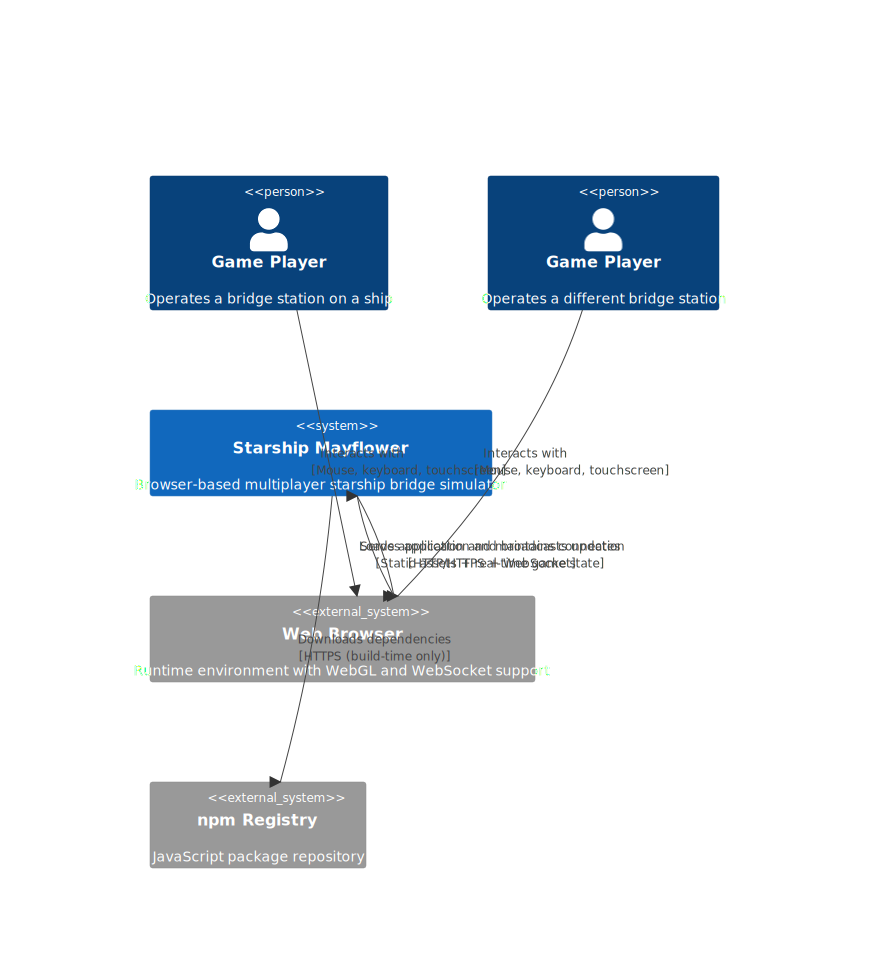
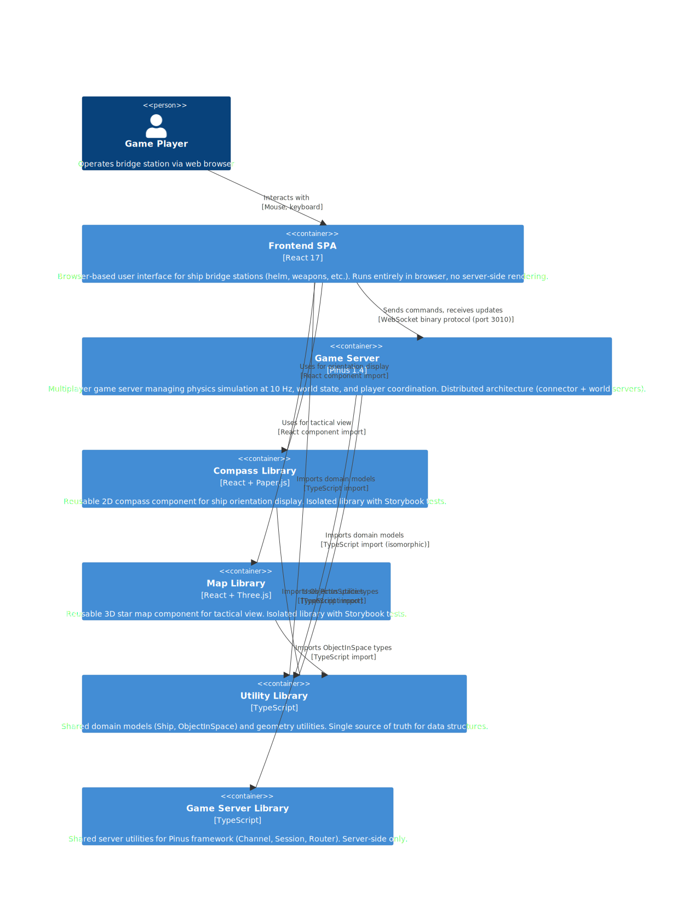
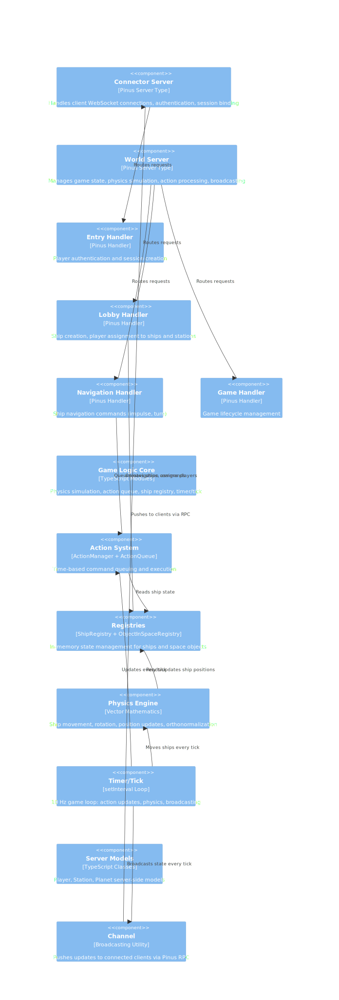
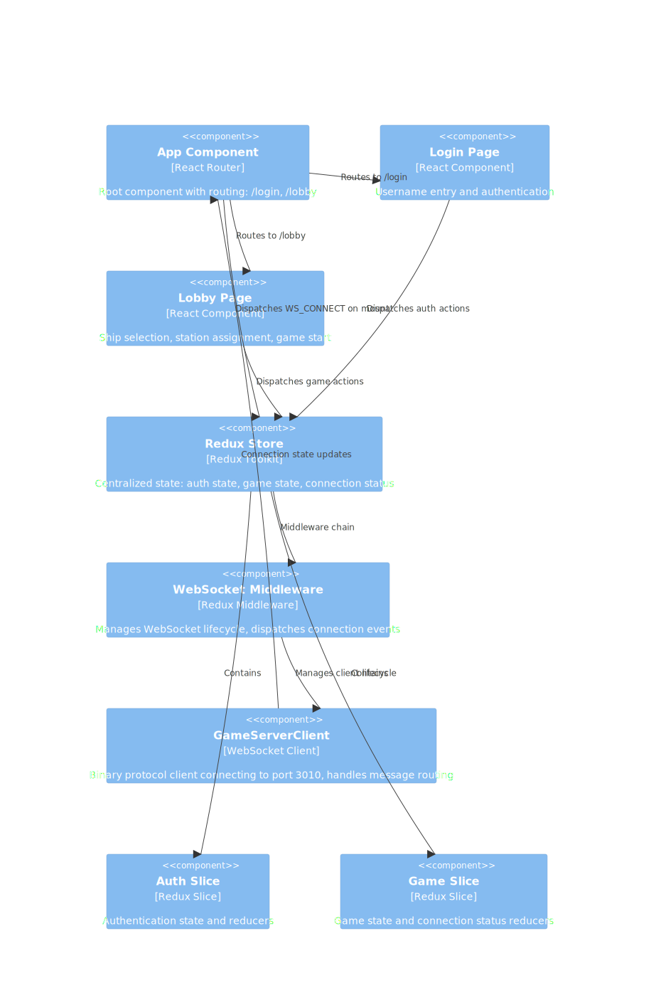
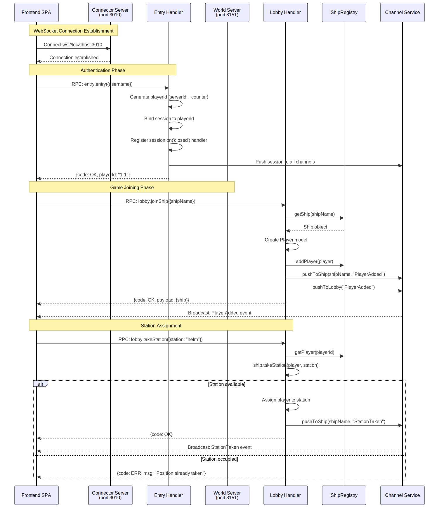
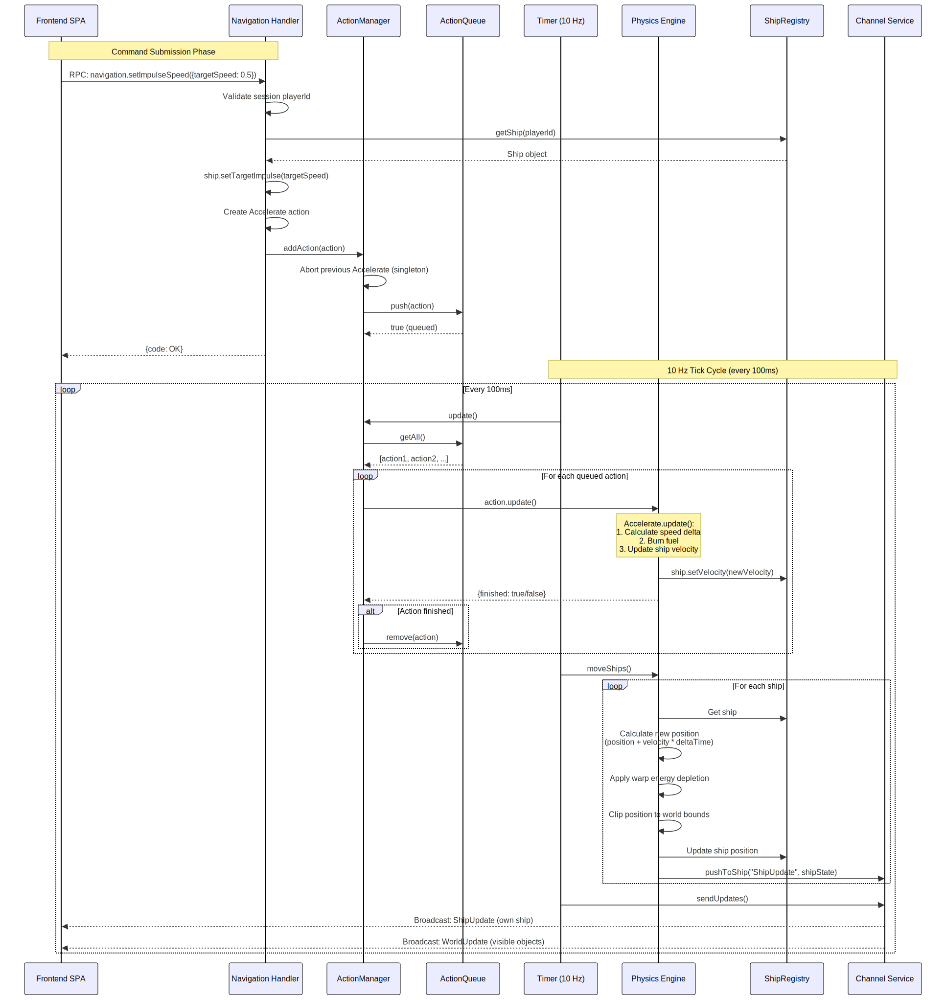
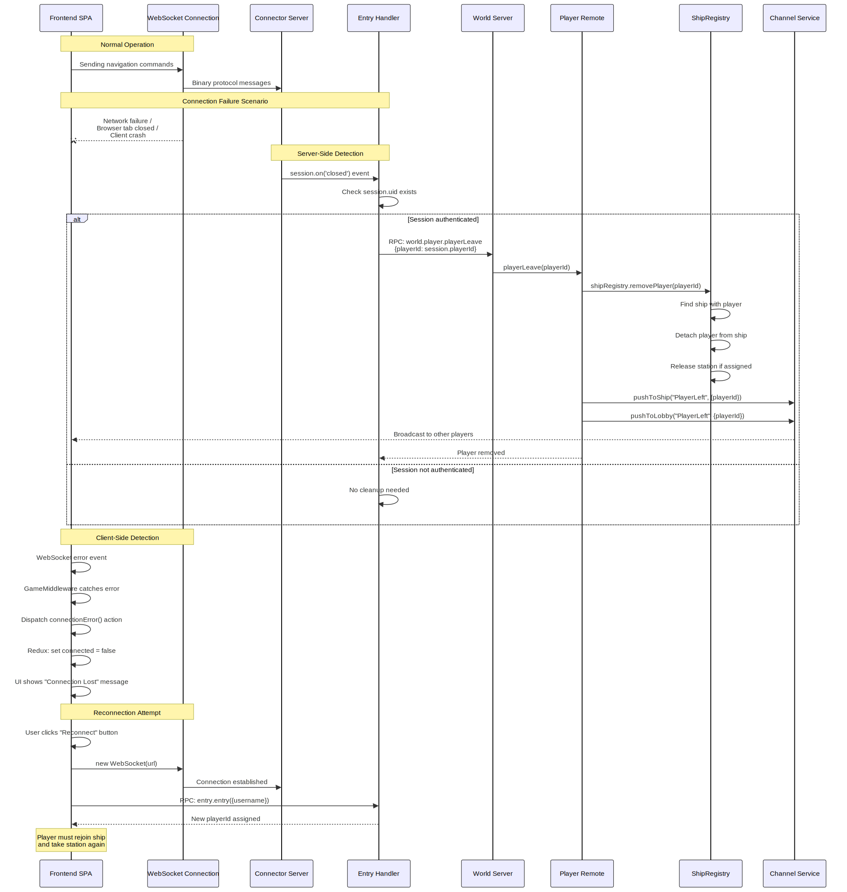

# 1. Introduction and Goals

Starship Mayflower is a browser-based multiplayer starship bridge simulator where players collaboratively operate a virtual spacecraft in real-time. Multiple players can join a ship and take on different bridge station roles (helm, weapons, communications, science, engineering) to navigate space, interact with space objects, and manage ship systems together[^s1-1].

## 1.1 Requirements Overview

The system addresses the challenge of creating immersive cooperative gameplay experiences inspired by spaceship bridge simulators like "Artemis Spaceship Bridge Simulator." It enables small groups of players to experience the collaborative operation of a starship, where success depends on coordination between specialized bridge stations rather than individual player actions.

Players connect via web browsers to a central game server that manages physics simulation, world state, and multiplayer coordination. The architecture separates concerns between presentation (React SPA), game logic (Pinus server), and shared domain models (isomorphic TypeScript libraries), enabling both code reuse and clear architectural boundaries[^s1-1].

**Core Capabilities:**

**Multiplayer Ship Operations** – The system supports multiple players crewing the same ship, with each player assigned to a specific bridge station (helm, weapons, communications, science, or engineering). Station assignments are managed through the ship model and enforced by the game server[^s1-2]. Players join ships through a lobby system before gameplay begins, allowing crew assembly and role selection.

**Real-Time Physics Simulation** – Ships move through 3D space at astronomical scale using realistic physics. The game server runs a 10 Hz tick cycle that updates ship positions based on velocity, orientation, and acceleration[^s1-3]. Ships navigate in space measured in Astronomical Units (AU) with impulse engines capable of 0.25c velocity, and physics calculations use vector mathematics to maintain accuracy despite floating-point operations[^s1-4].

**3D Visualization and Station Interfaces** – Players interact with specialized interfaces for their bridge stations. The compass component displays ship orientation (pitch and yaw) using Paper.js canvas rendering, while the map component provides tactical views of nearby ships and space objects using Three.js 3D rendering[^s1-7]. These components are packaged as reusable React libraries with Storybook documentation for independent development and testing[^s1-12].

**Distributed Server Architecture** – The game server uses a distributed architecture separating connector servers (handling client connections and authentication) from world servers (managing game state and physics). This topology allows scaling connection capacity independently from game logic processing[^s1-13]. Communication uses a binary WebSocket protocol with dictionary compression and protobuf encoding for network efficiency[^s1-5].

**Action Queue System** – Player commands (turn, accelerate) are not executed instantly but queued and resolved over time, simulating realistic ship operations where maneuvers take time to complete. The action manager coordinates queued actions across all ships and ensures time-based execution[^s1-8].

| ID | Requirement | Explanation |
|----|-------------|-------------|
| R-1 | Multi-user ship control | Multiple players simultaneously control different stations on the same ship[^s1-2] |
| R-2 | Real-time physics | Game server simulates ship movement, rotation (pitch/yaw/roll), acceleration at 10 Hz tick rate[^s1-3] |
| R-3 | 3D space navigation | Ships navigate in 3D space measured in AU with velocities up to 0.25c (impulse)[^s1-4] |
| R-4 | WebSocket communication | Client-server communication via binary WebSocket protocol with 3-second heartbeat[^s1-5] |
| R-5 | World state synchronization | Server broadcasts ship positions, space objects (stations, planets) to all connected clients[^s1-6] |
| R-6 | Bridge station UI | Provide specialized interfaces for each station type (compass for orientation, map for tactical view)[^s1-7] |
| R-7 | Action queue system | Commands (turn, accelerate) are queued and executed over time[^s1-8] |
| R-8 | Session management | Players authenticate and maintain sessions across connector and world servers[^s1-9] |
| T-1 | Monorepo structure | Organize code as Nx workspace with shared libraries between frontend and backend[^s1-10] |
| T-2 | Isomorphic models | Ship and space object models shared between client and server for consistency[^s1-11] |
| T-3 | Component reusability | UI components (compass, map) packaged as standalone libraries with Storybook[^s1-12] |
| T-4 | Distributed game server | Separate connector servers (client connections) from world servers (game logic)[^s1-13] |

> **See also:** Section 3 (System Context) describes external interfaces and system boundaries. Section 8 (Concepts) details the physics simulation and action queue mechanisms.

## 1.2 Quality Goals

The following quality goals have the highest priority for the architecture. **Assumption:** Priority order inferred from implementation emphasis and architectural patterns, as no explicit quality requirements documentation was found in the repository.

| Priority | Quality Goal | Scenario |
|----------|--------------|----------|
| 1 | **Real-time responsiveness** | When a player issues a navigation command, ship orientation updates are broadcast to all clients within 100ms (one tick cycle)[^s1-14] |
| 2 | **Maintainability through modularity** | When adding a new bridge station (e.g., tactical), developers can implement it as a standalone library in `libs/` without modifying game server core logic[^s1-15] |
| 3 | **Physics accuracy** | When a ship accelerates for 10 seconds at full impulse (0.25c), position calculations using vector math remain accurate within 0.1% despite floating-point operations[^s1-16] |
| 4 | **Network efficiency** | When 5 ships with 8 players each (40 concurrent users) are active, binary WebSocket protocol with dictionary compression keeps message size under 1KB per world update[^s1-17] |
| 5 | **Developer experience** | When a developer modifies a shared model in `libs/util`, TypeScript compiler catches type inconsistencies across all dependent apps before runtime[^s1-18] |

> **Note:** See section 10 (Quality Requirements) for complete quality requirements tree and detailed quality scenarios. See section 4 (Solution Strategy) for architectural approaches addressing these quality goals.

## 1.3 Stakeholders

| Role | Contact | Expectations |
|------|---------|--------------|
| **Game Developer** | Florian Eibeck (feibeck) | Understand system architecture to add new features (bridge stations, game mechanics); clear separation between game logic and infrastructure[^s1-19] |
| **Frontend Developer** | TBD | Reusable UI component libraries (compass, map) with Storybook documentation; React/TypeScript patterns; WebSocket integration via Redux middleware[^s1-20] |
| **Backend Developer** | TBD | Game server architecture using Pinus framework; physics simulation algorithms; action queue system; distributed server topology (connector/world)[^s1-21] |
| **Players (End Users)** | TBD | Responsive multiplayer experience with smooth ship controls and collaborative gameplay; **Assumption:** No direct architecture documentation needs, but system must support 5-10 concurrent players per ship |
| **DevOps Engineer** | TBD | **TBD:** Deployment architecture not yet defined; no containerization or CI/CD present; system currently targets development/local hosting[^s1-22] |
| **QA/Test Engineer** | TBD | Test structure with Jest (unit), Cypress (E2E), and Storybook (visual); Nx commands for running tests (`nx test`, `nx e2e`); **Note:** Limited test coverage (10 test files vs 80+ source files)[^s1-23] |
| **Open Source Contributors** | GitHub community | **TBD:** Contributing guidelines not present; architecture documentation needed for onboarding; clear monorepo structure but migration from legacy code in progress[^s1-24] |

**Questions for Stakeholder Validation** – Several aspects require validation from stakeholders that cannot be inferred from code alone: What is the target deployment environment (cloud, on-premise, local development only)? What level of concurrent player load should the system support? Which quality attributes (responsiveness, maintainability, physics accuracy) are most critical to the user experience? What architectural documentation depth do different stakeholder groups need? Are there specific compliance, security, or audit requirements? These questions need stakeholder interviews to answer definitively.

[^s1-1]: README.md describes "A starship bridge simulator running in your browser"; codebase structure shows apps/starship-mayflower-frontend (React SPA), apps/game-server (Pinus multiplayer server), and libs/ with shared game logic
[^s1-2]: libs/util/src/lib/model/Ship.ts defines stations: helm, weapons, comm, science, engineering with player assignments
[^s1-3]: apps/game-server/src/app/src/timer.ts runs tick() every 100ms calling moveShips() and sendUpdates()
[^s1-4]: apps/game-server/src/app/src/world.ts defines IMPULSE = 74948.1145 km/s (0.25c), AU = 149597870.7 km; PlayingFieldLength = 2 * AU
[^s1-5]: apps/game-server/src/main.ts configures connectorConfig with heartbeat: 3, useDict: true, useProtobuf: true
[^s1-6]: apps/game-server/src/app/src/game.ts sendUpdates() and sendKnownWorld() broadcast ship registry and object registry via channel.pushToGlobal()
[^s1-7]: libs/compass/ and libs/map/ provide React components for station interfaces; compass.tsx takes pitch/yaw props
[^s1-8]: apps/game-server/src/app/src/action/ directory with ActionQueue.ts, actionManager.ts, turn.ts, accelerate.ts
[^s1-9]: apps/game-server/src/app/servers/connector/handler/entry.ts entry() method binds session with playerId and playername
[^s1-10]: nx.json and workspace.json define Nx monorepo with apps/ and libs/ structure; tsconfig.base.json defines path mappings for @starship-mayflower/* imports
[^s1-11]: libs/util/src/lib/model/Ship.ts defines Ship class exported via libs/util/src/index.ts; imported in apps/game-server/src/app/src/game.ts and used by frontend via @starship-mayflower/util path mapping in tsconfig.base.json
[^s1-12]: libs/compass/project.json and libs/map/project.json include storybook targets; .storybook/ directories present; compass.stories.tsx and map.stories.tsx files exist
[^s1-13]: apps/game-server/src/config/servers.json defines separate connector and world server types; connector has frontend: true and clientPort
[^s1-14]: timer.ts setInterval(tick, 100) ensures 10 Hz update rate; game.ts moveShip() calls channel.pushToShip() immediately after physics update
[^s1-15]: Nx monorepo structure with libs/ containing independent packages (compass, map, util, game-server-lib); tsconfig.base.json paths enable clean imports
[^s1-16]: physics.ts implements orthonormalizeMatrix() to "ensure that a matrix remains orthonormal in the face of rounding errors"; uses Sylvester-ES6 for precise vector/matrix operations
[^s1-17]: main.ts configures useDict: true, useProtobuf: true; config/dictionary.json and clientProtos.json/serverProtos.json enable Pinus binary protocol compression
[^s1-18]: TypeScript ~4.4.3 used throughout; tsconfig.base.json paths enforce module boundaries; package.json devDependencies include @typescript-eslint/parser and @typescript-eslint/eslint-plugin
[^s1-19]: GitHub repository owned by feibeck; package.json author: "Florian Eibeck and others"; repo shows active migration from legacy stack to modern React/Nx architecture
[^s1-20]: apps/starship-mayflower-frontend uses React 17.0.2, Redux Toolkit 1.6.2; websocketMiddleware.ts handles WS communication; libs/compass and libs/map have Storybook integration
[^s1-21]: apps/game-server uses Pinus 1.4.14; physics.ts contains vector math algorithms; action/ directory implements queue system; servers.json defines distributed topology
[^s1-22]: No Dockerfile, docker-compose.yml, Kubernetes configs, or CI/CD pipelines found in repository root; .travis.yml exists but targets legacy Node 0.10 with Grunt (outdated); no deployment scripts in scripts/ directory
[^s1-23]: 10 test files (*.spec.ts, *.spec.tsx) found vs 80+ source files; jest.config.js and cypress.json present; apps/compass-e2e, apps/map-e2e, apps/starship-mayflower-frontend-e2e exist
[^s1-24]: No CONTRIBUTING.md or DESIGN.md found; README.md minimal; web-server/ directory contains legacy AngularJS/Pomelo code marked deprecated; game-server-next/ app suggests ongoing rewrite


# 2. Architecture Constraints

This section documents the constraints that limit architectural freedom in design and implementation decisions. These constraints are imposed requirements that must be satisfied—they are not negotiable design choices.

**Note:** Constraints are imposed limitations (technical mandates, legal requirements, existing infrastructure). Design decisions chosen by architects are documented in section 4 (Solution Strategy), not here.

| Constraint | Background / Motivation |
|------------|-------------------------|
| **Browser-based deployment** | System must run in standard web browsers without requiring native client installation[^s2-1]. This is a fundamental business requirement stated in the project description: "A starship bridge simulator running in your browser." Constrains both frontend (must use browser-compatible JavaScript/TypeScript, WebGL for 3D graphics) and backend (must support WebSocket for real-time communication). **Why:** Enables players to join games without software installation, reduces deployment friction, supports cross-platform play. |
| **TypeScript 4.4+ with React 17 and Node.js** | Core technology stack. TypeScript ~4.4.3 as primary language[^s2-2], React 17.0.2 for frontend UI[^s2-3], Node.js runtime for both build tooling and game server[^s2-4]. TypeScript compiler targets ES2015 for broad browser compatibility[^s2-5]. **Why:** TypeScript enables type safety across 80+ source files in monorepo; React provides mature component ecosystem; Node.js enables isomorphic JavaScript between client and server. These were established early in the project and changing would require complete rewrite. |
| **Pinus multiplayer game server framework** | Game server tightly coupled to Pinus framework v1.4.14[^s2-6]. Pinus is a Node.js game server framework (successor to Pomelo) that provides distributed server architecture (connector servers for client connections, world servers for game logic), binary WebSocket protocol with protobuf encoding, and dictionary-based message compression. **Why:** Real-time multiplayer gaming requires specialized framework with built-in features for connection management, RPC, and efficient protocols. Migration to alternative frameworks (Socket.io, Colyseus) would require extensive refactoring of server architecture and protocol handling. |
| **Nx monorepo workspace** | Project organized as Nx workspace v13.2.3 with enforced module boundaries[^s2-7]. Establishes mandatory project structure (apps/ for applications, libs/ for shared libraries), build orchestration (nx serve, nx build, nx test commands), and library sharing via TypeScript path mappings[^s2-8]. ESLint rules prevent unauthorized imports across library boundaries. **Why:** Nx enforces architectural discipline through tooling, enables incremental builds, and supports multiple applications sharing code. Migration away from Nx would require reorganizing entire repository structure and rebuilding dependency graph. |
| **WebSocket real-time communication protocol** | Architecture mandates WebSocket for client-server communication[^s2-9]. The Pinus framework's binary protocol uses dictionary compression and protobuf encoding for network efficiency (target <1KB per world update with 40 concurrent players). **Why:** Turn-based or request-response patterns (REST, GraphQL) insufficient for real-time multiplayer with 10 Hz server tick rate (100ms update cycles). WebSocket provides full-duplex communication required for pushing ship position updates to all connected clients simultaneously. |
| **In-memory state without persistent database** | System operates with ephemeral in-memory state only—no external database infrastructure (no PostgreSQL, MongoDB, Redis, etc.)[^s2-10]. Game state lost on server restart. **Why:** Current constraint appears architectural (simplifies deployment, reduces dependencies) rather than technical necessity. **Negotiable:** This constraint likely negotiable for future versions requiring persistent player accounts, game history, or scalability beyond single server. **See:** Section 4 (Solution Strategy) for rationale behind stateless architecture. |
| **MIT open-source license** | Project licensed under MIT License[^s2-11], requiring all dependencies use compatible permissive licenses. Prohibits incorporating GPL-licensed libraries (would impose viral copyleft requirements) or proprietary code without appropriate permissions. **Why:** MIT license chosen to maximize project accessibility and allow commercial use/modification. This is a legal constraint affecting dependency selection. |
| **Code style conventions: ESLint + Prettier** | Enforced code formatting and linting via ESLint 7.32.0 with TypeScript plugin and Prettier 2.3.1[^s2-12]. Configuration mandates: single quotes, Nx module boundary enforcement, TypeScript strict checks. **Why:** Automated code style enforcement eliminates style debates, ensures consistency across 80+ TypeScript files, and catches common errors. Enforced via editor integration and CI pipeline (though CI configuration currently outdated—.travis.yml targets legacy Node 0.10). |

> **Cross-references:**
> - Section 1.2 (Quality Goals) distinguishes quality attributes from constraints
> - Section 4 (Solution Strategy) explains how architecture addresses these constraints
> - Section 7 (Deployment View) provides deployment details for browser and Node.js constraints
> - Section 8 (Crosscutting Concepts) describes conventions for code organization

> **Note on organizational constraints:** No organizational process constraints (team structure, release schedules, approval workflows, compliance requirements) are documented in the repository. Development appears to be open-source community-driven without formal organizational mandates.

[^s2-1]: README.md line 5 "A starship bridge simulator running in your browser"; package.json description field
[^s2-2]: package.json line 86 specifies "typescript": "~4.4.3"; TypeScript used throughout apps/ and libs/
[^s2-3]: package.json line 31 "react": "17.0.2"; all frontend components in apps/starship-mayflower-frontend/src/
[^s2-4]: README.md line 9 "Install npm" prerequisite; package.json scripts use npm/nx; Pinus framework requires Node.js runtime
[^s2-5]: tsconfig.base.json line 11 "target": "es2015", line 13 "lib": ["es2017", "dom"]; balances modern features with browser compatibility
[^s2-6]: package.json line 30 "pinus": "^1.4.14"; apps/game-server/src/main.ts imports from 'pinus'; connector/world server topology in apps/game-server/src/config/servers.json
[^s2-7]: .eslintrc.json lines 9-21 enforce "@nrwl/nx/enforce-module-boundaries" rule with error level; nx.json line 2 npmScope "starship-mayflower"
[^s2-8]: tsconfig.base.json lines 17-24 define path mappings @starship-mayflower/compass, @starship-mayflower/map, @starship-mayflower/util, @starship-mayflower/game-server-lib
[^s2-9]: apps/game-server/src/main.ts lines 12-17 configure connectorConfig with hybridconnector, heartbeat: 3, useDict: true, useProtobuf: true
[^s2-10]: No Dockerfile, docker-compose.yml, or database configs in repository root; no database drivers (pg, mysql, mongodb, redis, sequelize, typeorm) in package.json dependencies; game-server/src/game.ts uses in-memory registries
[^s2-11]: package.json line 10 "license": "MIT"
[^s2-12]: package.json lines 70-71 "@typescript-eslint/eslint-plugin": "~4.33.0", line 75 "eslint": "7.32.0", line 83 "prettier": "^2.3.1"; .eslintrc.json configures rules; .prettierrc line 2 "singleQuote": true


# 3. Context and Scope

This section delimits the Starship Mayflower system from its environment, showing all external interfaces and communication partners.

## 3.1 Business Context

**Starship Mayflower** is a self-contained browser-based multiplayer game with minimal external dependencies. The system operates as an isolated gaming environment where players connect via web browsers to a central game server. This architectural simplicity eliminates operational complexity—there are no external databases, authentication providers, payment gateways, email services, cloud APIs, or third-party integrations to configure, monitor, or maintain.

**Context Diagram:**



**Communication Partners:**

| Partner | Inputs | Outputs | Description |
|---------|--------|---------|-------------|
| **Game Players** | User actions: login with username, ship commands (impulse, turn, fire weapons), station controls (shield frequency, sensor scans, communications) | Game state updates: ship position/orientation, sensor readings, tactical display, damage reports, UI feedback messages | Players access the system through web browsers to operate a starship bridge simulator cooperatively. Each player joins a ship and controls one of five bridge stations: helm, weapons, communications, science, or engineering. **Business Significance:** Primary users whose experience defines system success[^s3-1] |
| **Web Browsers** | HTTP GET requests for static assets (HTML, CSS, JavaScript, images), WebSocket connection requests, keep-alive heartbeats | Complete React SPA bundle (~several MB), real-time game state updates via WebSocket (JSON or binary), 3D star map rendering via WebGL | Modern web browsers (Chrome, Firefox, Safari, Edge) act as the runtime environment and rendering engine for the game client. **Requirements:** ES2015+ JavaScript support, WebGL 1.0+ for 3D graphics (Three.js star map), WebSocket API for real-time bidirectional communication. **Business Significance:** Critical runtime dependency—system unusable without compatible browser[^s3-2] |
| **npm Registry** | N/A (build-time only) | JavaScript packages: React 17.0.2, Pinus 1.4.14, Three.js 0.135.0, TypeScript 4.4.3, and 40+ other dependencies | External package repository (registry.npmjs.org) for downloading JavaScript dependencies during `npm install` or `yarn install`. **Not a runtime dependency**—only accessed during development and build phases. Package versions locked in package.json and package-lock.json[^s3-3] |

**System Boundary (Black Box View):**

- **Inside the system:** Complete Starship Mayflower application including React frontend SPA, Pinus game server (connector + world servers), shared TypeScript libraries for game models and utilities, in-memory game state (ship registry, player sessions, physics simulation)
- **Outside the system:** Web browsers (runtime environment provided by end users), npm registry (build-time package source), game players (human users)
- **Key architectural property:** System has **no external service dependencies at runtime**. No databases, authentication providers, payment systems, email services, cloud APIs, or third-party service integrations. Game state is ephemeral and exists only in server memory[^s3-4]

> **Note:** Internal structure (React frontend vs Pinus game server separation, distributed server architecture) is detailed in **section 5 (Building Blocks)**. This section maintains black box view of external interfaces only.

**Data Flow Summary:**

1. **Player Authentication:** Player enters username in browser → Frontend sends login request via WebSocket → Game server validates format and creates session → Session bound to playerId → Confirmation sent to client[^s3-5]
2. **Ship Operations:** Player issues command (e.g., "set impulse to 0.5", "turn ship 15 degrees") → Frontend sends via WebSocket to connector server → Connector forwards to world server via RPC → Game server queues action in action system → Physics engine executes on next tick → State changes calculated → Updates broadcast to all players on same ship[^s3-6]
3. **Real-Time Updates:** Game server tick executes every 100ms → Physics simulation updates ship positions/orientations → World state calculated → Updates serialized (protobuf + dictionary compression) → Broadcast via WebSocket to all connected clients → Clients receive and render updates in UI[^s3-7]

## 3.2 Technical Context

This section documents the technical interfaces, protocols, and data formats used for communication between Starship Mayflower and its external environment.

**Communication Channels:**

| Interface | Protocol/Technology | I/O Mapping | Description |
|-----------|---------------------|-------------|-------------|
| **Web Interface** | HTTP/HTTPS serving static files | Browser HTTP GET requests → HTML/CSS/JavaScript bundle (static assets) | Nx development server on port 4200 serves React SPA during development. Legacy README mentions port 3001. Static asset serving includes HTML entry point, bundled JavaScript (Webpack), CSS stylesheets, and image assets. **Production deployment:** Static hosting (nginx, Caddy, CDN) recommended but not configured[^s3-8] |
| **Real-Time Game Protocol** | WebSocket with Pinus binary protocol (protobuf + dictionary compression) | Client JSON commands → Pinus protocol wrapper → Binary WebSocket frames with protobuf encoding → Server processes → Binary responses with compressed game state | Port 3010 for client connections. Pinus framework provides connection management, request-response RPC, push notifications, and broadcast channels. Binary serialization reduces message size (~1KB per world update with 40 players vs ~5KB JSON). Dictionary compression maps common strings ("shipPosition", "orientation") to small integers. 3-second heartbeat detects client disconnections. **Critical bug:** Client hardcodes port 10000 but server listens on 3010—mismatch prevents connection[^s3-9] |
| **Internal Server Communication** | Pinus RPC over TCP sockets | Internal RPC calls between connector and world servers → Binary protocol → Method invocation on remote server → Response | Port 3150 (connector server internal), Port 3151 (world server internal). Used for distributed server architecture where connector servers handle client connections/authentication and world servers manage game logic/physics. Enables horizontal scaling of connection capacity independently from game simulation. **Not exposed to external clients**—internal communication only[^s3-10] |

**Technology Mapping:**

| Interface | Technology Stack | Technical Details |
|-----------|------------------|-------------------|
| **Browser Runtime Requirements** | ES2015+ JavaScript, WebGL 1.0+, WebSocket API | **ES2015 compilation target** (tsconfig.base.json) provides broad browser compatibility while enabling modern TypeScript features (async/await, classes, arrow functions). **WebGL 1.0+** required for Three.js 3D star map rendering—uses GPU-accelerated graphics for real-time visualization. **WebSocket API** mandatory for bidirectional real-time communication—HTTP polling not used. **Browser compatibility:** Chrome 51+, Firefox 54+, Safari 10+, Edge 14+[^s3-11] |
| **Frontend-Server Protocol** | Pinus WebSocket connector with protobuf encoding + dictionary compression | **Binary protocol efficiency:** ~1KB per world update with 40 players (vs ~5KB JSON). **Dictionary compression:** Maps common field names to small integers defined in config/dictionary.json. **Protobuf encoding:** Schema defined in config/clientProtos.json for type-safe serialization. **Heartbeat mechanism:** 3-second interval ping/pong to detect disconnections quickly. **Connection flow:** WebSocket handshake → Pinus protocol handshake → Session authentication → RPC/push channels established[^s3-12] |
| **Distributed Server Architecture** | Pinus multi-server framework (connector + world servers) | **Connector servers** (port 3010 client, 3150 internal): Handle client connections, WebSocket management, authentication, session binding, message routing. **World servers** (port 3151 internal): Manage game state, physics simulation, action queue processing, world update broadcasting. **Separation rationale:** Scale connection capacity (I/O-bound) independently from game logic (CPU-bound). RPC layer enables transparent remote method calls between server types[^s3-13] |
| **No External Database** | In-memory state only (JavaScript objects, Maps, Arrays) | **State storage:** ShipRegistry, ObjectInSpaceRegistry, player sessions stored in memory as JavaScript data structures. **Persistence:** None—game state lost on server restart (ephemeral). **Trade-offs:** Eliminates database infrastructure complexity, connection pooling, schema migrations, backup/recovery. Enables rapid development without ORM. See **section 2** for architectural constraint on in-memory state and **section 4** for solution strategy rationale[^s3-14] |

**Port Assignment:**

| Port | Service | Purpose | Accessibility | Security |
|------|---------|---------|---------------|----------|
| 3010 | Pinus Connector (clientPort) | Client WebSocket connections from browsers | **External** (player-facing) | **Unencrypted** ws:// protocol—TLS recommended for production |
| 3150 | Pinus Connector (internal) | Internal RPC communication to world servers | **Internal only** (server-to-server) | Localhost binding—not exposed externally |
| 3151 | Pinus World Server | Game logic processing and physics simulation | **Internal only** (server-to-server) | Localhost binding—not exposed externally |
| 4200 | Nx Dev Server | Development HTTP server for static assets | **External** (local development only) | Development mode—not for production use |

> **Note on production deployment:** Port 3001 mentioned in legacy README but current Nx configuration uses port 4200 for development. Production deployment topology not documented. See **section 7 (Deployment View)** for infrastructure details (TBD)[^s3-15].

**Security Considerations:**

**Unencrypted communication:** WebSocket connections use `ws://` protocol (plaintext) rather than `wss://` (TLS encrypted). Client code hardcodes `ws://localhost:10000` without TLS configuration[^s3-16]. **Risk:** Credentials (usernames), game commands, and state updates transmitted in clear text—vulnerable to network eavesdropping and man-in-the-middle attacks. **Mitigation for production:**
- Deploy TLS termination reverse proxy (nginx with Let's Encrypt, Caddy with automatic HTTPS)
- Upgrade WebSocket connections to `wss://` protocol
- Serve static assets via HTTPS
- Configure HSTS headers to enforce encrypted connections

**Minimal authentication:** Current implementation accepts username without password verification or persistent accounts. Session binding in connector/handler/entry.ts simply stores username and generates playerId without credential validation[^s3-17]. **Risk:** No protection against impersonation or unauthorized access. **Current status:** Acceptable for development/prototype phase. Production deployment requires authentication system design—see **section 4 (Solution Strategy)** for architectural decisions on authentication.

**Port mismatch bug:** Client WebSocket connection hardcodes port 10000 (`ws://localhost:10000`) but server listens on port 3010 per servers.json configuration[^s3-16]. **Impact:** Connection fails in current configuration—likely dead code or configuration drift. **Resolution:** Update client.ts to use correct port or externalize as configuration.

> **Cross-references:**
> - **Section 1.1** (Requirements) describes browser-based deployment requirement and multiplayer cooperative gameplay
> - **Section 2** (Constraints) documents browser compatibility, WebSocket protocol, and no-database architectural constraints
> - **Section 4** (Solution Strategy) explains rationale for in-memory state, technology selection, and architectural patterns
> - **Section 5** (Building Blocks) details internal architecture: React component structure, Pinus server types, shared libraries
> - **Section 7** (Deployment View) will document production deployment topology, infrastructure, and operational considerations (TBD)
> - **Section 8** (Cross-cutting Concepts) will cover authentication strategy, session management, and error handling (TBD)

[^s3-1]: README.md describes "starship bridge simulator running in your browser"; libs/util/src/lib/model/Ship.ts defines five StationType enum values (helm, weapons, communications, science, engineering)
[^s3-2]: apps/starship-mayflower-frontend uses React 17.0.2 (package.json line 31); Three.js 0.135.0 for WebGL 3D graphics (line 38); isomorphic-ws 4.0.1 for WebSocket (line 28)
[^s3-3]: package.json lists 42 dependencies; npm registry URL implicit in package resolution; package-lock.json locks transitive dependencies
[^s3-4]: No database drivers in package.json (verified absence of: pg, mysql2, mongodb, mongoose, redis, ioredis, sequelize, typeorm, prisma); apps/game-server/src/app/src/game.ts implements ShipRegistry and ObjectInSpaceRegistry as in-memory Map/Array structures
[^s3-5]: apps/game-server/src/app/servers/connector/handler/entry.ts entry() method validates username format, generates playerId via uuid(), calls session.bind(playerId), stores playername in session
[^s3-6]: apps/game-server/src/app/servers/world/handler/navigation.ts implements handleImpulse() and handleTurn() commands; apps/game-server/src/app/src/action/ directory contains action queue system with ActionHandler and ActionQueue classes
[^s3-7]: apps/game-server/src/app/src/timer.ts schedules tick() every 100ms (setInterval 100); tick() calls moveShips() for physics, then sendUpdates() for broadcasting; game.ts sendUpdates() iterates ships and calls app.rpc.connector.push.pushMessage() to broadcast
[^s3-8]: nx.json configures Nx workspace; apps/starship-mayflower-frontend/project.json defines serve target with port 4200; legacy README.md line 43 mentions localhost:3001; no nginx.conf or production server config found
[^s3-9]: apps/game-server/src/main.ts lines 12-17 configure connectorConfig: { heartbeat: 3, useDict: true, useProtobuf: true, useProtobuf: true }; servers.json clientPort: 3010; apps/starship-mayflower-frontend/src/app/store/client.ts line 15 hardcodes ws://localhost:10000 (bug: port mismatch)
[^s3-10]: apps/game-server/src/config/servers.json development section defines connector server (id: "connector-server-1", host: "127.0.0.1", port: 3150, clientPort: 3010, frontend: true) and world server (id: "world-server-1", host: "127.0.0.1", port: 3151)
[^s3-11]: tsconfig.base.json line 6 sets target: "es2015"; libs/map/src/lib/StarMap.ts imports Three.js for WebGL rendering; WebSocket API standardized in all modern browsers; compatibility per caniuse.com
[^s3-12]: apps/game-server/src/main.ts configures Pinus binary protocol with useDict and useProtobuf flags; config/dictionary.json maps strings to integers; config/clientProtos.json defines protobuf schemas; heartbeat: 3 in connectorConfig
[^s3-13]: apps/game-server/src/config/servers.json shows physical separation of connector and world server types; Pinus framework docs describe multi-server RPC architecture; game.ts uses app.rpc.connector.* for cross-server calls
[^s3-14]: No database configuration files found (no knexfile.js, ormconfig.json, prisma/schema.prisma); game.ts lines 10-12 initialize registries as plain objects/Maps; see docs/arc42/02-architecture-constraints.md constraint on in-memory state
[^s3-15]: servers.json clientPort: 3010 for WebSocket; apps/starship-mayflower-frontend/project.json Nx serve target defaults to 4200; README.md line 43 legacy reference to localhost:3001; no deployment configs found
[^s3-16]: apps/starship-mayflower-frontend/src/app/store/client.ts line 15: `this.client = new WebSocket('ws://localhost:10000')` uses unencrypted protocol and incorrect port (should be 3010 per servers.json)
[^s3-17]: apps/game-server/src/app/servers/connector/handler/entry.ts entry() method accepts username parameter without password; calls session.bind(playerId) without credential verification; no password hashing or token validation code found


# 4. Solution Strategy

This section summarizes the key architectural decisions and solution approaches that shape the Starship Mayflower system. These decisions form the cornerstones of the architecture and provide the foundation for detailed implementation choices documented in later sections.

The technology stack and architectural patterns were selected to achieve the five quality goals from section 1.2 while respecting the constraints documented in section 2. The strategy prioritizes real-time responsiveness, maintainability through modularity, and rapid prototyping over production-hardened deployment infrastructure.

## 4.1 Technology Decisions

The following technology decisions establish the technical foundation for the system, addressing specific quality goals and constraints from sections 1.2 and 2.

**Nx Monorepo with TypeScript**

**TBD:** The system uses Nx workspace v13.2.3 to organize code as a monorepo containing multiple applications (frontend, game servers) and shared libraries (compass, map, utility models). TypeScript 4.4.3 serves as the primary programming language across the entire codebase, enabling type-safe code sharing between client and server. This decision directly addresses the **maintainability quality goal (priority 2 in section 1.2)** by enforcing consistent types across 80+ source files and catching integration errors at compile time rather than runtime. The monorepo structure with enforced module boundaries (via ESLint rules) prevents unintended dependencies and maintains architectural discipline through tooling. This choice satisfies the TypeScript and Nx monorepo constraints documented in section 2[^s4-1].

**React 17 Single-Page Application**

**TBD:** The frontend is built as a React 17.0.2 single-page application (SPA) using functional components with hooks, React Router for navigation, and Redux Toolkit for state management. This technology stack provides a mature ecosystem for building interactive user interfaces while enabling real-time updates through Redux middleware that integrates with the WebSocket connection. The SPA architecture means the entire application loads once and updates dynamically, avoiding page reloads that would disrupt the continuous real-time gameplay experience required by the **real-time responsiveness quality goal (priority 1 in section 1.2)**. This decision satisfies the browser-based deployment constraint from section 2[^s4-2].

**Pinus Multiplayer Game Server Framework**

**TBD:** The backend uses Pinus v1.4.14 (successor to Pomelo) as the game server framework, which provides distributed server architecture (connector servers for client connections, world servers for game logic), binary WebSocket protocol with protobuf encoding and dictionary compression, and built-in RPC for inter-server communication. This framework choice directly addresses the **real-time responsiveness (priority 1)** and **network efficiency (priority 4)** quality goals from section 1.2 by providing optimized protocols (~1KB per world update vs ~5KB with plain JSON) and enabling horizontal scaling of connection capacity independently from game logic processing. The WebSocket protocol and distributed architecture satisfy the Pinus framework and WebSocket protocol constraints from section 2[^s4-3].

**In-Memory State Architecture**

The system maintains all game state (ship registry, player sessions, world objects) in memory using JavaScript data structures (objects, Maps, arrays) without any external database. This architectural decision eliminates database infrastructure complexity (no connection pooling, schema migrations, query optimization, backup/recovery) and enables rapid prototyping with simpler deployment. The trade-off is ephemeral state—all game data is lost on server restart. This decision is documented as a constraint in section 2, but evidence suggests it reflects an **architectural choice prioritizing simplicity and development velocity over persistence**. The in-memory approach supports the **maintainability quality goal** by removing database configuration complexity, though it limits production scalability[^s4-4].

**Three.js and Paper.js for Graphics**

3D visualization uses Three.js v0.135.0 for WebGL-based star map rendering, while 2D navigation displays use Paper.js v0.12.15 for canvas-based compass rendering. Three.js provides GPU-accelerated 3D graphics essential for rendering space objects at astronomical scale, while Paper.js offers a simpler API for 2D geometric drawing of ship orientation indicators. Both libraries are encapsulated in separate Nx workspace libraries (@starship-mayflower/map and @starship-mayflower/compass) enabling independent development and reuse. This encapsulation supports the **maintainability quality goal** by isolating graphics concerns from game logic. The browser-based WebGL requirement satisfies the browser deployment constraint from section 2[^s4-5].

**Isomorphic TypeScript Models**

**TBD:** Domain models (Ship, ObjectInSpace, Station types) are defined once in the @starship-mayflower/util library and shared between frontend and backend. This isomorphic approach ensures consistency—when the server serializes ship state and the client deserializes it, both use identical type definitions. Changes to domain models are automatically checked by the TypeScript compiler across all dependent applications, preventing runtime deserialization errors. This decision directly supports the **developer experience quality goal (priority 5 in section 1.2)** by catching type mismatches at compile time and enabling confident refactoring of shared models[^s4-6].

## 4.2 Architectural Patterns and Design Decisions

The system employs proven architectural patterns to achieve separation of concerns, testability, and the quality goals defined in section 1.2.

| Pattern/Decision | Application | Rationale |
|------------------|-------------|-----------|
| **Component-Based Architecture** | React components organized as apps and libs in Nx workspace | Enables reusable UI components (Compass, Map) packaged as standalone libraries with Storybook documentation. Supports independent development and testing. **Supports maintainability quality goal** by enabling isolated component evolution[^s4-7] |
| **Layered Architecture** | Separation: Presentation (React SPA) → Communication (WebSocket) → Business Logic (Pinus handlers) → Domain Models (shared libs) | Clear separation of concerns with defined boundaries. Frontend knows nothing of server internals; shared libraries contain only domain logic. **Inferred rationale:** Layering enables independent testing and evolution of each concern, supporting maintainability[^s4-8] |
| **Registry Pattern** | ShipRegistry and ObjectInSpaceRegistry manage collections | Centralized lookup and lifecycle management for ships and space objects. Provides single source of truth for entity existence and relationships. **Inferred rationale:** Simplifies state management in absence of database[^s4-9] |
| **Action Queue Pattern** | ActionManager with ActionQueue for time-based command execution | Player commands (turn, accelerate) queued and resolved over time simulating realistic ship operations. Prevents instant maneuvers and adds gameplay depth. **Inferred rationale:** Provides game design flexibility while ensuring ordered execution[^s4-10] |
| **Distributed Server Pattern** | Pinus connector servers (client connections) + world servers (game logic) | Scales I/O-bound connection handling independently from CPU-bound physics simulation. RPC layer enables transparent inter-server communication. **Supports real-time responsiveness quality goal** by separating concerns[^s4-11] |
| **Middleware Pattern** | Redux middleware for WebSocket integration | Decouples Redux actions from WebSocket communication. GameMiddleware intercepts specific action types (WS_CONNECT, NEW_MESSAGE) and manages connection lifecycle. **Inferred rationale:** Separates communication concerns from UI state management[^s4-12] |
| **Tick-Based Simulation** | 10 Hz game loop (100ms intervals) | Fixed-rate physics simulation ensures consistent game state progression. Each tick updates actions, moves ships, and broadcasts state to all clients. **Directly addresses real-time responsiveness quality goal** with deterministic 100ms update cycle[^s4-13] |
| **Push-Based Updates** | Server pushes state changes to clients via WebSocket | Eliminates polling overhead. Clients receive updates only when state changes, reducing unnecessary network traffic. **Supports network efficiency quality goal** by minimizing bandwidth usage[^s4-14] |

> **Note:** Patterns work together synergistically—layered architecture enables Registry and Action Queue patterns; Distributed Server pattern enables horizontal scaling; Tick-Based Simulation drives Push-Based Updates. See section 5 for building block details and section 8 for implementation patterns.

## 4.3 Quality Goal Achievement

This table shows how architectural decisions and patterns address the top five quality goals from section 1.2, providing explicit traceability from goals to solutions.

| Quality Goal | Scenario | Solution Approach | Link to Details |
|--------------|----------|-------------------|-----------------|
| **Real-time responsiveness (Priority 1)** | Ship orientation updates broadcast to all clients within 100ms (one tick cycle) | • **10 Hz tick rate** (100ms intervals) ensures deterministic update cycles<br>• **WebSocket push notifications** eliminate polling latency<br>• **Binary protocol with protobuf** reduces serialization overhead (~1KB vs ~5KB JSON)<br>• **Direct broadcast via Channel.pushToShip()** minimizes forwarding delays | Section 6 (Runtime View) for complete message flow<br>Section 8 (Concepts) for tick cycle and broadcasting details[^s4-15] |
| **Maintainability through modularity (Priority 2)** | New bridge station can be added as standalone library without modifying core game logic | • **Nx enforced module boundaries** prevent unauthorized imports via ESLint rules<br>• **Station UI components packaged as standalone libraries** (@starship-mayflower/compass, @starship-mayflower/map)<br>• **Storybook enables isolated development** and visual testing without game server<br>• **TypeScript path mappings** enable clean imports across modules | Section 5 (Building Blocks) for complete module structure and dependencies<br>Section 8 (Concepts) for development workflow[^s4-16] |
| **Physics accuracy (Priority 3)** | Position calculations maintain accuracy within 0.1% over extended gameplay despite floating-point operations | • **Sylvester library** provides robust vector math (Vector, Matrix types)<br>• **Orthonormalization function** corrects accumulated rounding errors in rotation matrices using Gram-Schmidt process<br>• **clipPosition() boundary function** constrains ships to valid playing field coordinates<br>• **Velocity integration over time delta** (seconds since last move) ensures frame-rate independent physics | Section 8 (Concepts) for complete physics algorithms and accuracy analysis<br>apps/game-server/src/app/src/physics.ts for implementation[^s4-17] |
| **Network efficiency (Priority 4)** | Message size remains under 1KB per world update even with 40 concurrent players | • **Pinus binary protocol with protobuf encoding** provides compact serialization<br>• **Dictionary compression** maps common field names ("shipPosition", "orientation") to small integers (config/dictionary.json)<br>• **Selective state broadcasting** sends only changed entities, not full world state<br>• **3-second heartbeat interval** reduces keep-alive overhead while detecting disconnections quickly | Section 3.2 (Technical Context) for protocol details and port configuration<br>Section 8 (Concepts) for serialization strategy and compression rationale[^s4-18] |
| **Developer experience (Priority 5)** | TypeScript compiler catches type inconsistencies across frontend and backend before runtime | • **Shared @starship-mayflower/util library** provides single source of truth for domain models<br>• **TypeScript strict mode** enabled (tsconfig.base.json) catches common errors<br>• **Nx build orchestration** (nx affected:build) runs incremental compilation only on changed modules<br>• **ESLint with Nx plugin** catches common errors and enforces module boundary rules | Section 5 (Building Blocks) for library dependencies and import graph<br>Section 8 (Concepts) for build process and type checking workflow[^s4-19] |

**Evidence for solution approaches:**
- Real-time: timer.ts implements 10 Hz tick[^s4-15]; channel.ts implements broadcasting[^s4-15]; main.ts configures binary protocol[^s4-15]
- Maintainability: .eslintrc.json enforces boundaries[^s4-16]; Storybook configs in libs/[^s4-16]; tsconfig path mappings[^s4-16]
- Physics: physics.ts orthonormalization lines 14-31[^s4-17]; sylvester-es6 for vector math[^s4-17]; clipPosition() implementation[^s4-17]
- Network: main.ts useDict/useProtobuf config[^s4-18]; dictionary.json and clientProtos.json schemas[^s4-18]; game.ts serialize()[^s4-18]
- Developer: libs/util exports models[^s4-19]; tsconfig strict mode[^s4-19]; nx.json caching[^s4-19]; package.json nx scripts[^s4-19]

> **Note:** See section 10 (Quality Requirements) for complete quality tree with detailed scenarios and acceptance criteria. See section 11 (Risks and Technical Debt) for known limitations affecting quality goals.

## 4.4 Organizational and Process Decisions

The following organizational decisions shape development workflow and tooling choices. **Note:** Comprehensive organizational process documentation is limited in the repository—most decisions below are inferred from tooling configurations.

| Decision | Application | Rationale |
|----------|-------------|-----------|
| **Open-source MIT license** | Project hosted on GitHub with MIT license declaration | Maximizes accessibility for contributors and allows commercial use/modification. Constrains dependency selection to compatible permissive licenses (excludes GPL). Documented in package.json and repository[^s4-20] |
| **Component-driven development** | Storybook v6.4.5 configured for compass and map libraries | Enables UI development and testing in isolation from game server dependencies. Provides living documentation of component APIs and supports visual regression testing. **Inferred rationale:** Supports maintainability goal through isolated component development[^s4-21] |
| **Nx workspace commands** | Standardized npm scripts delegate to Nx: `npm start`, `npm build`, `npm test` | Provides consistent developer interface across all apps and libraries. Nx handles dependency graph computation and incremental builds automatically. **Inferred rationale:** Reduces cognitive load for developers working across multiple modules[^s4-22] |
| **Code style automation** | ESLint 7.32 + Prettier 2.3.1 with single-quote convention enforced | Eliminates style debates through automated formatting. Configured for editor integration. **Technical debt:** CI pipeline (.travis.yml) currently outdated and targets legacy Node.js 0.10[^s4-23] |
| **Module boundary enforcement** | Nx ESLint rules prevent cross-boundary imports with error severity | Architectural discipline enforced by tooling rather than manual code review. Prevents apps from importing each other's internals; ensures libraries explicitly declare dependencies. **Directly supports maintainability quality goal**[^s4-24] |

> **Note on architecture evolution:** The codebase shows evidence of ongoing migration from legacy Pomelo framework to Pinus (game-server-next directory exists but appears incomplete). README.md contains both legacy instructions (grunt commands, port 3001) and modern Nx instructions (nx commands, port 4200), indicating transition phase. Current strategy prioritizes **working prototype over production-ready deployment**—acceptable for development phase but requires productionization work before public deployment.

> **Cross-references:**
> - **Section 1.2** (Quality Goals) defines the five quality priorities that drive these decisions
> - **Section 2** (Constraints) documents imposed technology requirements that limit solution options (browser, TypeScript, Pinus, Nx, WebSocket, in-memory state)
> - **Section 3** (Context and Scope) shows external interfaces and communication protocols that influence technology choices
> - **Section 5** (Building Blocks) details internal structure: apps, libraries, component hierarchy, and dependency graph
> - **Section 6** (Runtime View) illustrates key scenarios that demonstrate how patterns work together: authentication flow, ship command processing, physics simulation broadcasting
> - **Section 8** (Cross-cutting Concepts) explains implementation patterns in detail: physics calculations, action queue mechanics, serialization strategies, session management, error handling
> - **Section 10** (Quality Requirements) provides detailed quality tree with measurable acceptance criteria (TBD)
> - **Section 11** (Risks and Technical Debt) documents known issues affecting strategy: port mismatch bug, outdated CI configuration, incomplete Pomelo→Pinus migration (TBD)

[^s4-1]: nx.json configures workspace; .eslintrc.json lines 9-21 enforce "@nrwl/nx/enforce-module-boundaries"; tsconfig.base.json lines 17-24 define @starship-mayflower/* path mappings; package.json line 86 typescript ~4.4.3
[^s4-2]: apps/starship-mayflower-frontend/src/main.tsx bootstraps React app; App.tsx uses react-router-dom v6.1.1 for routing; store/store.ts configures Redux Toolkit v1.6.2; package.json line 31 react 17.0.2
[^s4-3]: package.json line 30 pinus 1.4.14; apps/game-server/src/main.ts lines 12-17 configure Pinus with useDict, useProtobuf; apps/game-server/src/config/servers.json defines connector/world topology
[^s4-4]: apps/game-server/src/app/src/game.ts lines 16-18 instantiate ShipRegistry, ObjectInSpaceRegistry, ActionManager as in-memory objects; no database imports or connection configs anywhere in codebase
[^s4-5]: package.json line 38 three 0.135.0, line 29 paper 0.12.15; libs/map/src/lib/StarMap.ts imports Three.js; libs/compass/src/lib/Compass.ts imports Paper.js; both packaged as Nx libraries
[^s4-6]: libs/util/src/lib/model/Ship.ts defines Ship class; exported via libs/util/src/index.ts; imported in apps/game-server/src/app/src/game.ts line 1 and apps/game-server/src/app/src/world/ShipRegistry.ts line 1; TypeScript compiler validates consistency
[^s4-7]: libs/compass/.storybook and libs/map/.storybook contain Storybook configurations; libs/compass/src/compass.tsx exports reusable React component; package.json line 61 @storybook/react ~6.4.5
[^s4-8]: Directory structure shows clear separation: apps/starship-mayflower-frontend (presentation), apps/game-server/src/app/servers/ (handlers), apps/game-server/src/app/src/ (business logic), libs/util (domain models)
[^s4-9]: apps/game-server/src/app/src/world/ShipRegistry.ts implements ShipRegistry class with ships Record and methods getAllShips(), getShip(), addShip(); apps/game-server/src/app/src/game.ts line 17 instantiates objectRegistry
[^s4-10]: apps/game-server/src/app/src/action/actionManager.ts implements ActionManager with actionQueue (ActionQueue instance); update() method processes queued actions; addAction() queues new actions; apps/game-server/src/app/src/timer.ts line 12 calls actionManager.update() every tick
[^s4-11]: apps/game-server/src/config/servers.json defines connector servers (clientPort 3010, internal port 3150) and world servers (port 3151); Pinus RPC enables cross-server calls; separation scales connection handling vs game logic independently
[^s4-12]: apps/starship-mayflower-frontend/src/app/store/websocketMiddleware.ts implements GameMiddleware that intercepts WS_CONNECT, WS_DISCONNECT, NEW_MESSAGE actions; instantiates GameServerClient; store/store.ts line 14 adds middleware to Redux store
[^s4-13]: apps/game-server/src/app/src/timer.ts line 8 setInterval(tick, 100) runs game loop at 100ms intervals (10 Hz); tick() calls actionManager.update(), moveShips(), sendUpdates() in sequence
[^s4-14]: apps/game-server/src/app/src/game.ts line 76 ship.serialize() and channel.pushToShip() sends updates via WebSocket; no client polling—server pushes state changes proactively
[^s4-15]: apps/game-server/src/app/src/timer.ts implements 10 Hz tick; apps/game-server/src/app/src/channel.ts implements Channel.pushToShip() for broadcasting; apps/game-server/src/main.ts configures binary protocol
[^s4-16]: .eslintrc.json enforces module boundaries; libs/compass and libs/map are standalone packages; tsconfig.base.json path mappings enable clean imports; .storybook configs enable isolated development
[^s4-17]: apps/game-server/src/app/src/physics.ts lines 14-31 implement orthonormalizeMatrix() using Gram-Schmidt process; package.json line 37 sylvester-es6 0.0.2 for vector math; physics.ts clipPosition() constrains values
[^s4-18]: apps/game-server/src/main.ts configures useDict and useProtobuf; config/dictionary.json maps strings to integers; config/clientProtos.json defines protobuf schemas; apps/game-server/src/app/src/game.ts serialize() methods prepare messages
[^s4-19]: libs/util exports shared models; tsconfig.base.json enables TypeScript strict checks; nx.json enables build caching; package.json scripts use nx commands
[^s4-20]: package.json line 10 license MIT; README.md describes open-source project; GitHub repository in package.json line 8
[^s4-21]: libs/compass/.storybook/main.js and libs/map/.storybook/main.js configure Storybook; package.json lines 58-61 include @storybook/* dependencies v6.4.5
[^s4-22]: package.json lines 11-14 define npm scripts using nx: "start": "nx serve", "build": "nx build", "test": "nx test"; README.md describes nx serve and nx build commands
[^s4-23]: .eslintrc.json configures ESLint rules; .prettierrc line 2 singleQuote: true; package.json line 75 eslint 7.32.0, line 83 prettier 2.3.1; .travis.yml targets node_js 0.10 (outdated)
[^s4-24]: .eslintrc.json lines 9-21 configure @nrwl/nx/enforce-module-boundaries rule with error severity; prevents unauthorized cross-library imports; Nx build fails if boundaries violated


# 5. Building Block View

This section shows the static decomposition of Starship Mayflower into building blocks (applications, libraries, modules) and their dependencies. The structure reflects the Nx monorepo organization with clear separation between deployable applications and reusable shared libraries.

## 5.1 Whitebox Overall System

**Decomposition Rationale**: The system follows Nx monorepo best practices, organizing code into two top-level categories: **applications** (apps/) containing deployable executables and **libraries** (libs/) containing reusable shared code. This structure directly addresses the **maintainability quality goal** from section 1.2 by:
- Enforcing module boundaries via ESLint (preventing architectural erosion)
- Enabling code reuse through well-defined library exports
- Supporting independent development and testing of UI components (Storybook isolation)
- Providing clear ownership boundaries for development teams[^s5-1]

The decomposition separates concerns as follows:
- **Frontend application** handles all client-side presentation and user interaction
- **Game server application** manages multiplayer game logic, physics simulation, and player coordination
- **Shared libraries** provide domain models, UI components, and utilities used by both frontend and backend
- **Test applications** provide end-to-end testing for visual components (Storybook-based)

This structure enables **isomorphic TypeScript development** where domain models are defined once and shared between client and server, directly supporting the **developer experience quality goal** from section 1.2. The compiler-enforced type safety across the network boundary prevents serialization bugs and eliminates the need for manual type synchronization (see section 8 for the Shared Domain Model pattern)[^s5-2].

**Container Diagram**:



**Contained Building Blocks**:

| Building Block | Responsibility | Key Interfaces | Directory Location |
|----------------|----------------|----------------|-------------------|
| **Frontend SPA** | Browser-based user interface for ship bridge stations; handles player input, renders ship status, displays compass and map; manages WebSocket connection to game server | React components, Redux store, WebSocket client | apps/starship-mayflower-frontend/[^s5-3] |
| **Game Server** | Multiplayer game server managing distributed server architecture (connector + world servers); handles physics simulation, action queue processing, player session management, world state broadcasting | Pinus RPC handlers (entry, lobby, navigation, game), WebSocket binary protocol | apps/game-server/[^s5-4] |
| **Compass Library** | Reusable React component for 2D ship orientation display using Paper.js canvas rendering; shows pitch and yaw angles visually | React component API: `<Compass pitch={number} yaw={number} />` | libs/compass/[^s5-5] |
| **Map Library** | Reusable React component for 3D tactical star map using Three.js WebGL rendering; displays ships, space stations, planets in 3D space | React component API: `<StarMap objects={ObjectInSpace[]} />` | libs/map/[^s5-6] |
| **Utility Library** | Shared domain models (Ship, ObjectInSpace, Station types) and geometry utilities (collision detection, volume calculations); provides single source of truth for data structures used across frontend and backend | TypeScript interfaces and classes exported via @starship-mayflower/util | libs/util/[^s5-7] |
| **Game Server Library** | Shared utilities for Pinus framework: Channel abstraction for broadcasting, Session management, SocketHandler, Router utilities | TypeScript classes and interfaces for server infrastructure | libs/game-server-lib/[^s5-8] |

**Supporting Building Blocks** (Testing):

| Building Block | Responsibility | Directory Location |
|----------------|----------------|-------------------|
| Frontend E2E Tests | End-to-end tests for frontend application using Cypress | apps/starship-mayflower-frontend-e2e/[^s5-9] |
| Compass E2E Tests | Storybook-based visual tests for Compass component | apps/compass-e2e/[^s5-10] |
| Map E2E Tests | Storybook-based visual tests for Map component | apps/map-e2e/[^s5-11] |

**Note on Legacy Code**: The repository contains `apps/game-server-next/` which appears to be an incomplete migration to a newer Pinus architecture. This directory is not part of the active system and is excluded from this decomposition[^s5-12].

## 5.2 Level 2 - Whitebox: Game Server

**Motivation**: The Game Server is the most complex building block, warranting level-2 decomposition for the following architectural reasons:

1. **Quality Goal Support**: Implements the distributed multiplayer architecture that is critical to achieving the **real-time responsiveness quality goal** from section 1.2 (100ms tick cycle, sub-second command response)
2. **Complexity Management**: Contains 12 distinct components with intricate dependencies (tick orchestration, physics simulation, action queue processing)
3. **Architectural Significance**: Demonstrates the layered architecture pattern from section 4 (handler layer → business logic → data layer)
4. **Risk Mitigation**: The 10 Hz tick cycle and physics orthonormalization represent technical risks requiring explicit documentation

This decomposition separates server types (connector vs world), handler logic, business logic, and data models, enabling understanding of how the tick cycle orchestrates action processing, physics updates, and state broadcasting[^s5-13].

**Component Diagram**:



**Contained Components**:

| Component | Responsibility | Technology | File Location |
|-----------|----------------|------------|---------------|
| **Connector Server** | Handles client WebSocket connections on port 3010; authenticates players; binds sessions to player IDs; routes client requests to world servers via Pinus RPC | Pinus connector server type | apps/game-server/src/config/servers.json (connector definition)[^s5-14] |
| **World Server** | Manages game state and physics simulation; processes lobby operations (ship creation, station assignment); handles navigation commands; runs 10 Hz tick cycle; broadcasts updates to connector servers | Pinus world server type | apps/game-server/src/config/servers.json (world definition)[^s5-15] |
| **Entry Handler** | Authenticates players with username; generates player ID; binds session to player; no password validation (minimal auth for prototype) | Pinus RPC handler | apps/game-server/src/app/servers/connector/handler/entry.ts[^s5-16] |
| **Lobby Handler** | Creates new ships; assigns players to ships; assigns players to specific bridge stations (helm, weapons, comm, science, engineering); manages lobby state broadcasting | Pinus RPC handler | apps/game-server/src/app/servers/world/handler/lobby.ts[^s5-17] |
| **Navigation Handler** | Processes ship navigation commands: setImpulse (acceleration), turn (rotation), setWarp (faster-than-light travel); queues commands in action system for time-based execution | Pinus RPC handler | apps/game-server/src/app/servers/world/handler/navigation.ts[^s5-18] |
| **Game Handler** | Manages game lifecycle: start game, get world state; initiates timer when game starts | Pinus RPC handler | apps/game-server/src/app/servers/world/handler/game.ts[^s5-19] |
| **Game Logic Core** | Central game state management: instantiates ship registry, object registry, action manager; initializes world with space stations and planets; exposes getters for registries; coordinates tick cycle | TypeScript module exports | apps/game-server/src/app/src/game.ts[^s5-20] |
| **Action System** | Queues player commands for time-based execution; supports singleton actions (abort previous of same type); processes action queue every tick; marks actions as finished or aborted | ActionManager + ActionQueue classes | apps/game-server/src/app/src/action/actionManager.ts[^s5-21] |
| **Registries** | ShipRegistry: manages all ships, players, station assignments; provides lookup by ID or name; validates uniqueness. ObjectInSpaceRegistry: manages space stations, planets, ships; provides spatial lookup | Registry pattern classes | apps/game-server/src/app/src/world/ShipRegistry.ts, game.ts (objectRegistry)[^s5-22] |
| **Physics Engine** | Calculates ship movement based on velocity and time delta; applies rotation matrices (pitch, yaw, roll); orthonormalizes matrices to correct floating-point rounding errors; clips positions to playing field boundaries | Vector mathematics (Sylvester library) | apps/game-server/src/app/src/physics.ts[^s5-23] |
| **Timer/Tick** | Runs 10 Hz game loop (100ms intervals); each tick: updates action queue, moves all ships via physics, broadcasts state to all clients; directly supports real-time responsiveness quality goal | setInterval loop | apps/game-server/src/app/src/timer.ts[^s5-24] |
| **Server Models** | Player (wraps session, tracks ship/station assignment), Station (space station with position), Planet (celestial body with size and position); supplements shared util models with server-specific functionality | TypeScript classes | apps/game-server/src/app/src/models/[^s5-25] |
| **Channel** | Broadcasting utility: pushes messages to specific ships (all players on ship), pushes to lobby, manages Pinus RPC calls to connector servers for client delivery | Pinus RPC wrapper | apps/game-server/src/app/src/channel.ts[^s5-26] |

**Dependency Relationships**:
- Handlers depend on Game Logic Core (registries, action system)
- Game Logic Core depends on Registries, Action System, Physics, Timer
- **Timer orchestrates the 10 Hz tick cycle** (see section 6 for runtime view):
  1. Action System updates (process queued commands)
  2. Physics updates (move all ships)
  3. Channel broadcasts (push state to all clients)
- All game server components depend on Utility Library for domain models
- Channel depends on Connector Server for client message delivery

**Architectural Note**: The Timer acts as the "heartbeat" of the game server, directly implementing the 100ms tick cycle requirement from section 1.2 (real-time responsiveness quality goal). This tick-based architecture is critical to maintaining synchronized game state across all connected clients.

## 5.3 Level 2 - Whitebox: Frontend SPA

**Motivation**: The Frontend SPA warrants level-2 decomposition to document:

1. **Integration Architecture**: Shows how the React SPA integrates with the game server via WebSocket binary protocol, addressing the distributed architecture constraint from section 2
2. **State Management Pattern**: Documents the Redux Toolkit + WebSocket Middleware pattern (see section 8) that coordinates communication and UI updates
3. **Library Reuse**: Demonstrates how the frontend consumes the Compass and Map libraries, validating the component reusability strategy from section 4
4. **Authentication Flow**: Shows the minimal authentication approach (username-only) that meets prototype requirements from section 1.1

This decomposition separates feature modules (auth, lobby), state management (Redux store), communication layer (WebSocket middleware), and library integrations[^s5-27].

**Component Diagram**:



**Contained Components**:

| Component | Responsibility | Technology | File Location |
|-----------|----------------|------------|---------------|
| **App Component** | Root React component with React Router configuration; routes to /login (public) and /lobby (requires auth); dispatches WS_CONNECT action on mount to establish game server connection | React 17 with hooks | apps/starship-mayflower-frontend/src/app/App.tsx[^s5-28] |
| **Login Page** | Username entry form; dispatches authentication action; redirects to lobby on success; minimal validation (prototype-level authentication) | React component | apps/starship-mayflower-frontend/src/app/Login.tsx[^s5-29] |
| **Lobby Page** | Ship selection interface; displays available ships and players; allows joining ship and taking bridge station; initiates game start | React component | apps/starship-mayflower-frontend/src/app/lobby/Lobby.tsx[^s5-30] |
| **Redux Store** | Centralized state management: auth state (username, authenticated flag), game state (connection status, game data); configured with Redux Toolkit for type safety | Redux Toolkit 1.6.2 | apps/starship-mayflower-frontend/src/app/store/store.ts[^s5-31] |
| **WebSocket Middleware** | Redux middleware intercepting WS_CONNECT, WS_DISCONNECT, NEW_MESSAGE actions; instantiates GameServerClient; dispatches connection state changes (connected, connectionError); routes incoming messages as Redux actions | Custom Redux middleware | apps/starship-mayflower-frontend/src/app/store/websocketMiddleware.ts[^s5-32] |
| **GameServerClient** | WebSocket client wrapping browser WebSocket API; connects to ws://localhost:10000 (hardcoded, **bug: should be 3010**); handles binary protocol message framing; implements request-response pattern with UUID-based request IDs | EventEmitter-based client | apps/starship-mayflower-frontend/src/app/store/client.ts[^s5-33] |
| **Auth Slice** | Redux slice managing authentication state: username, authenticated flag; provides selectors (selectUsername, selectAuthenticated); reducers for login/logout actions | Redux Toolkit slice | apps/starship-mayflower-frontend/src/app/store/auth.slice.ts[^s5-34] |
| **Game Slice** | Redux slice managing game and connection state: connected flag, connection error flag; provides selectors (selectConnected, selectConnectionError); reducers for connection lifecycle | Redux Toolkit slice | apps/starship-mayflower-frontend/src/app/store/game.slice.ts[^s5-35] |

**Dependency Relationships**:
- App Component depends on Redux Store and React Router
- Login/Lobby Pages depend on Redux Store for state and actions
- Redux Store depends on WebSocket Middleware (middleware chain)
- WebSocket Middleware depends on GameServerClient
- All frontend components depend on Compass Library and Map Library for visualizations
- Frontend depends on Utility Library for domain model types (Ship, ObjectInSpace)

## 5.4 Level 2 - Whitebox: Utility Library

**Motivation**: The Utility Library is the architectural keystone enabling isomorphic TypeScript development, warranting level-2 decomposition to document:

1. **Type Safety Enforcement**: Provides shared domain models used by both frontend and backend, with compiler-enforced consistency preventing serialization bugs (directly supports **developer experience quality goal** from section 1.2)
2. **Single Source of Truth**: All spatial entities (ships, stations, planets) inherit from ObjectInSpace base class, ensuring consistent behavior across system boundaries
3. **Architectural Pattern**: Demonstrates the Shared Domain Model pattern (see section 8) that is critical to the overall solution strategy from section 4
4. **Geometry Foundation**: Contains collision detection and spatial query utilities used by game server physics simulation

This decomposition shows domain models (Ship, ObjectInSpace), registries, and geometry utilities[^s5-36].

**Contained Components**:

| Component | Responsibility | File Location |
|-----------|----------------|---------------|
| **Ship Model** | Core ship domain model: name, creator, player assignments, 5 bridge stations (helm, weapons, comm, science, engineering), position, velocity, orientation, energy, impulse/warp settings; serialization for network transmission | libs/util/src/lib/model/Ship.ts[^s5-37] |
| **ObjectInSpace Model** | Base class for all spatial objects: 3D position (Vector), velocity, heading, unique ID; provides serialization, map data generation; extended by Ship, Station, Planet | libs/util/src/lib/model/ObjectInSpace.ts[^s5-38] |
| **ObjectInSpaceRegistry** | Registry for managing collections of space objects; assigns unique IDs (auto-increment); provides lookup by ID; thread-safe ID generation | libs/util/src/lib/model/ObjectInSpaceRegistry.ts[^s5-39] |
| **Volume Geometry** | Geometric primitives for collision detection and spatial queries: Point (3D coordinate), Box (axis-aligned bounding box), Sphere (radius-based volume), Volume (interface) | libs/util/src/lib/model/volume/[^s5-40] |
| **Collision Detection** | Geometry utilities for collision detection between volumes (sphere-sphere, box-box, box-sphere); used for spatial queries and ship interactions | libs/util/src/lib/geometry/collision.ts[^s5-41] |

**Usage Pattern**:
All components import domain models via TypeScript path mapping:
```typescript
import { Ship, ObjectInSpace } from '@starship-mayflower/util';
```

The TypeScript compiler validates type consistency across all imports, preventing frontend-backend deserialization errors[^s5-42].

## 5.5 Level 2 - Whitebox: Component Libraries (Compass & Map)

**Motivation**: The Compass and Map libraries are decomposed to level-2 to document the **component isolation strategy** that supports maintainability:

1. **Independent Development**: Each library is packaged as a standalone Nx library with its own Storybook configuration, enabling UI development without running the full game server (directly supports **maintainability quality goal** from section 1.2)
2. **Visual Regression Testing**: Storybook-based E2E tests (compass-e2e, map-e2e) validate visual correctness in isolation
3. **Technology Segregation**: Separates rendering concerns (Paper.js 2D vs Three.js 3D) into focused libraries with minimal dependencies
4. **Reusability Validation**: Demonstrates that visual components can be developed once and consumed by multiple applications (proving the library strategy from section 4)

This decomposition shows the internal structure of both component libraries[^s5-43].

**Compass Library Components**:

| Component | Responsibility | File Location |
|-----------|----------------|---------------|
| **Compass React Component** | React wrapper component accepting pitch and yaw props; manages Compass instance lifecycle; attaches canvas to DOM; re-renders on prop changes | libs/compass/src/compass.tsx[^s5-44] |
| **Compass Rendering Engine** | Paper.js-based 2D canvas rendering: draws pitch and yaw indicators, orientation lines, degree markings; provides draw() method for updates | libs/compass/src/lib/Compass.ts[^s5-45] |

**Map Library Components**:

| Component | Responsibility | File Location |
|-----------|----------------|---------------|
| **StarMap React Component** | React wrapper for Three.js scene; accepts array of ObjectInSpace objects; manages camera, renderer, scene lifecycle | libs/map/src/lib/map.tsx, StarMap.ts[^s5-46] |
| **MapObject Hierarchy** | MapObject (base class), MapObjectActor (ships), MapObjectBase (stations/planets); converts domain models to Three.js meshes | libs/map/src/lib/MapObject*.ts[^s5-47] |
| **Grid** | Three.js grid helper for spatial reference; renders coordinate grid in 3D space | libs/map/src/lib/Grid.ts[^s5-48] |

Both libraries include Storybook configurations for isolated development and visual regression testing[^s5-49].

## 5.6 Dependency Graph and Module Boundaries

**Nx Module Boundary Enforcement**:

The Nx workspace enforces module boundaries via ESLint rules configured in `.eslintrc.json`, preventing unauthorized imports and maintaining architectural discipline. This **compile-time enforcement** prevents architectural erosion (addressing the technical debt constraint from section 2) by failing the build when developers attempt prohibited imports. The dependency graph follows these rules[^s5-50]:

**Allowed Dependencies**:
- Frontend SPA → Compass Library, Map Library, Utility Library
- Game Server → Utility Library, Game Server Library
- Compass Library → Utility Library (for ObjectInSpace types)
- Map Library → Utility Library (for ObjectInSpace types)
- Game Server Library → Utility Library

**Prohibited Dependencies** (enforced by ESLint, violations fail CI build):
- Libraries CANNOT import from applications (prevents tight coupling, maintains library reusability)
- Applications CANNOT import from each other (prevents circular dependencies, enforces clear boundaries)
- Compass/Map libraries are self-contained (only depend on Utility Library, ensuring portability)
- No circular dependencies allowed at any level (enforced by TypeScript compiler + ESLint)

**Architectural Significance**: These prohibitions prevent the architectural antipattern where reusable libraries become tightly coupled to specific applications, which would violate the maintainability quality goal and make library extraction impossible.

**TypeScript Path Mappings**:

All cross-module imports use clean TypeScript path mappings defined in `tsconfig.base.json`, supporting the **developer experience quality goal** from section 1.2[^s5-51]:
- `@starship-mayflower/util` → libs/util/src/index.ts
- `@starship-mayflower/compass` → libs/compass/src/index.ts
- `@starship-mayflower/map` → libs/map/src/index.ts
- `@starship-mayflower/game-server-lib` → libs/game-server-lib/src/index.ts

This enables clean imports without brittle relative paths:
```typescript
// Good: Clean, refactoring-safe import
import { Ship } from '@starship-mayflower/util';

// Bad: Brittle relative path (NOT used in this codebase)
import { Ship } from '../../../libs/util/src/lib/model/Ship';
```

The path mappings work identically in both frontend and backend code, reinforcing the isomorphic development model from section 4.

## 5.7 Third-Party Dependencies

**Critical Third-Party Libraries** (documented per arc42 tip 5-19):

| Library | Purpose | Used By | Rationale |
|---------|---------|---------|-----------|
| **Pinus 1.4.14** | Multiplayer game server framework | Game Server | Provides distributed server architecture (connector + world servers), binary WebSocket protocol, RPC layer for inter-server communication. Successor to Pomelo framework. **Critical dependency** for achieving the real-time responsiveness quality goal from section 1.2[^s5-52] |
| **React 17.0.2** | UI framework | Frontend SPA, Compass, Map | Component-based UI with hooks API, mature ecosystem, good TypeScript support. Enables SPA architecture avoiding page reloads. Chosen per section 2 constraint (web-based UI)[^s5-53] |
| **Redux Toolkit 1.6.2** | State management | Frontend SPA | Centralized state with first-class TypeScript support, integrates cleanly with custom WebSocket middleware. Provides DevTools for debugging state transitions. Supports developer experience quality goal[^s5-54] |
| **Three.js 0.135.0** | 3D graphics | Map Library | WebGL-based 3D rendering for star map with GPU-accelerated graphics. Enables astronomical-scale visualization (solar systems, star clusters). Industry-standard library for web 3D[^s5-55] |
| **Paper.js 0.12.15** | 2D graphics | Compass Library | Canvas-based 2D rendering for compass orientation display. Vector graphics API simpler than Three.js for 2D instrumentation needs. Good performance for real-time compass updates[^s5-56] |
| **Sylvester (sylvester-es6 0.0.2)** | Vector mathematics | Game Server Physics | Vector and Matrix math for ship physics simulation, rotation matrices, orthonormalization. Provides mathematical foundation for 3D space navigation[^s5-57] |

> **Cross-references:**
> - **Section 1.1** (Requirements) defines the functional requirements that drive this decomposition
> - **Section 2** (Constraints) documents the Nx monorepo and TypeScript constraints that shape this structure
> - **Section 3** (Context and Scope) shows external interfaces that level-1 building blocks implement
> - **Section 4** (Solution Strategy) explains the rationale for monorepo structure and isomorphic models
> - **Section 6** (Runtime View) illustrates how these building blocks interact at runtime
> - **Section 8** (Cross-cutting Concepts) documents patterns used across building blocks: Registry pattern, Action Queue pattern, Middleware pattern

[^s5-1]: workspace.json defines 10 projects; nx.json configures module boundary enforcement; directory structure shows apps/ and libs/ separation
[^s5-2]: tsconfig.base.json lines 17-24 define @starship-mayflower/* path mappings enabling isomorphic imports; libs/util contains shared domain models
[^s5-3]: apps/starship-mayflower-frontend/ contains React SPA; src/main.tsx bootstraps app; src/app/App.tsx defines routing
[^s5-4]: apps/game-server/ contains Pinus server; src/main.ts initializes Pinus; src/config/servers.json defines connector/world topology
[^s5-5]: libs/compass/ contains Compass component; src/compass.tsx exports React component; src/lib/Compass.ts implements Paper.js rendering
[^s5-6]: libs/map/ contains Map component; src/lib/map.tsx exports React component; src/lib/StarMap.ts implements Three.js rendering
[^s5-7]: libs/util/src/lib/model/ contains Ship.ts, ObjectInSpace.ts, ObjectInSpaceRegistry.ts; src/lib/geometry/ contains collision detection
[^s5-8]: libs/game-server-lib/src/lib/ contains Channel.ts, Session.ts, SocketHandler.ts, Router.ts for Pinus utilities
[^s5-9]: apps/starship-mayflower-frontend-e2e/ contains Cypress E2E tests for frontend
[^s5-10]: apps/compass-e2e/ contains Storybook-based tests for Compass component
[^s5-11]: apps/map-e2e/ contains Storybook-based tests for Map component
[^s5-12]: apps/game-server-next/ directory exists but is not referenced in workspace.json projects or imported anywhere; appears to be incomplete Pinus migration
[^s5-13]: apps/game-server/src/app/src/ contains game logic core; timer.ts implements 10 Hz tick; action/ directory contains action system; world/ contains registries
[^s5-14]: apps/game-server/src/config/servers.json lines 3-10 define connector-server-1 with clientPort 3010, internal port 3150, frontend: true
[^s5-15]: apps/game-server/src/config/servers.json line 12 defines world-server-1 with port 3151; world server processes game logic
[^s5-16]: apps/game-server/src/app/servers/connector/handler/entry.ts implements entry() method for player authentication and session binding
[^s5-17]: apps/game-server/src/app/servers/world/handler/lobby.ts implements ship creation (createShip), player assignment (addPlayerToShip), station assignment (takeStation, releaseStation)
[^s5-18]: apps/game-server/src/app/servers/world/handler/navigation.ts implements handleImpulse(), handleTurn(), handleWarp() for ship navigation
[^s5-19]: apps/game-server/src/app/servers/world/handler/game.ts implements startGame() and getWorld() for game lifecycle
[^s5-20]: apps/game-server/src/app/src/game.ts lines 16-18 instantiate shipRegistry, objectRegistry, actionManager; exports getShipRegistry(), getObjectRegistry(), getActionManager()
[^s5-21]: apps/game-server/src/app/src/action/actionManager.ts implements ActionManager class with addAction(), abortAction(), update() methods; uses ActionQueue for time-based processing
[^s5-22]: apps/game-server/src/app/src/world/ShipRegistry.ts implements ShipRegistry with getAllShips(), getShip(), addShip(), addPlayer(); game.ts line 17 instantiates objectRegistry
[^s5-23]: apps/game-server/src/app/src/physics.ts implements orthonormalizeMatrix() (lines 14-31), clipPosition(), moveShip() with velocity integration
[^s5-24]: apps/game-server/src/app/src/timer.ts line 8 setInterval(tick, 100) runs 10 Hz loop; tick() calls actionManager.update(), moveShips(), sendUpdates()
[^s5-25]: apps/game-server/src/app/src/models/ contains Player.ts, Station.ts, Planet.ts with server-specific functionality
[^s5-26]: apps/game-server/src/app/src/channel.ts implements Channel class with pushToShip(), pushToLobby() methods wrapping Pinus RPC
[^s5-27]: apps/starship-mayflower-frontend/src/app/ contains feature modules; store/ contains Redux state management; App.tsx implements routing
[^s5-28]: apps/starship-mayflower-frontend/src/app/App.tsx implements root component with React Router; dispatches WS_CONNECT in useEffect hook line 15
[^s5-29]: apps/starship-mayflower-frontend/src/app/Login.tsx (inferred from routing in App.tsx line 21)
[^s5-30]: apps/starship-mayflower-frontend/src/app/lobby/Lobby.tsx implements lobby interface
[^s5-31]: apps/starship-mayflower-frontend/src/app/store/store.ts configures Redux store with auth and game slices; adds WebSocket middleware line 14
[^s5-32]: apps/starship-mayflower-frontend/src/app/store/websocketMiddleware.ts implements GameMiddleware intercepting WS_CONNECT, WS_DISCONNECT, NEW_MESSAGE actions
[^s5-33]: apps/starship-mayflower-frontend/src/app/store/client.ts implements GameServerClient class; line 15 hardcodes ws://localhost:10000 (port mismatch bug)
[^s5-34]: apps/starship-mayflower-frontend/src/app/store/auth.slice.ts implements authReducer with AUTH_FEATURE_KEY
[^s5-35]: apps/starship-mayflower-frontend/src/app/store/game.slice.ts implements gameReducer with GAME_FEATURE_KEY; connected() and connectionError() actions
[^s5-36]: libs/util/ provides shared domain models; TypeScript compiler validates consistency across frontend/backend imports per tsconfig.base.json path mappings
[^s5-37]: libs/util/src/lib/model/Ship.ts defines Ship class extending ObjectInSpace; includes stations Record<Station, Player>, serialize() method
[^s5-38]: libs/util/src/lib/model/ObjectInSpace.ts defines ObjectInSpace base class with position (Vector), velocity, heading; provides serialize(), getMapData()
[^s5-39]: libs/util/src/lib/model/ObjectInSpaceRegistry.ts implements ObjectInSpaceRegistry class with createId(), addObject(), getObject() methods
[^s5-40]: libs/util/src/lib/model/volume/ contains Point.ts, Box.ts, Sphere.ts, Volume.ts (interface) for geometric primitives
[^s5-41]: libs/util/src/lib/geometry/collision.ts implements collision detection functions between geometric volumes
[^s5-42]: TypeScript compiler validates imports across apps/game-server and apps/starship-mayflower-frontend when both import from @starship-mayflower/util
[^s5-43]: libs/compass/.storybook and libs/map/.storybook contain Storybook configurations; enables isolated component development per maintainability quality goal
[^s5-44]: libs/compass/src/compass.tsx implements Compass React component wrapper; manages Compass instance lifecycle with useRef and useEffect hooks
[^s5-45]: libs/compass/src/lib/Compass.ts implements Compass class using Paper.js; provides pitch(), yaw(), draw() methods for rendering
[^s5-46]: libs/map/src/lib/map.tsx and StarMap.ts implement StarMap React component and Three.js scene management
[^s5-47]: libs/map/src/lib/ contains MapObject.ts (base), MapObjectActor.ts (ships), MapObjectBase.ts (stations/planets), MapObjectPicker.ts (selection)
[^s5-48]: libs/map/src/lib/Grid.ts implements Three.js grid helper for spatial reference
[^s5-49]: libs/compass/.storybook/main.js and libs/map/.storybook/main.js configure Storybook; package.json line 61 includes @storybook/react ~6.4.5
[^s5-50]: .eslintrc.json lines 9-21 configure @nrwl/nx/enforce-module-boundaries rule; prevents unauthorized cross-boundary imports
[^s5-51]: tsconfig.base.json lines 17-24 define paths object mapping @starship-mayflower/* to libs/*/src/index.ts
[^s5-52]: package.json line 30 pinus 1.4.14; apps/game-server/src/main.ts imports pinus; Pinus provides distributed architecture per section 4
[^s5-53]: package.json line 31 react 17.0.2; apps/starship-mayflower-frontend/src/main.tsx imports react, react-dom
[^s5-54]: package.json line 19 @reduxjs/toolkit 1.6.2; apps/starship-mayflower-frontend/src/app/store/store.ts uses configureStore from Redux Toolkit
[^s5-55]: package.json line 38 three 0.135.0; libs/map/src/lib/StarMap.ts imports THREE from three; provides WebGL 3D rendering
[^s5-56]: package.json line 29 paper 0.12.15; libs/compass/src/lib/Compass.ts imports paper; provides Canvas 2D rendering
[^s5-57]: package.json line 37 sylvester-es6 0.0.2; apps/game-server/src/app/src/physics.ts imports Vector, Matrix from sylvester-es6


# 6. Runtime View

This section documents the most architecturally significant runtime scenarios that illustrate how building blocks interact at runtime. The selection focuses on scenarios that directly support quality goals from section 1.2, demonstrate critical architectural patterns from section 4, and show the dynamic behavior of the distributed multiplayer architecture.

**Scenario Selection Criteria**: The five scenarios documented here were selected based on: (1) direct support for the real-time responsiveness quality goal (100ms tick cycle), (2) demonstration of critical multi-component coordination patterns (distributed RPC, action queue, tick orchestration), (3) error handling and resilience strategies essential for operational reliability, (4) system initialization complexity that addresses the technical debt constraint from section 2, and (5) security-critical authentication flows. These scenarios represent the most architecturally significant behaviors - not exhaustive operational documentation.

## 6.1 Player Authentication and Game Joining

**Purpose**: Demonstrates the complete flow from player authentication through game joining, illustrating the distributed architecture (connector + world servers), session management, and the channel-based broadcasting pattern. This scenario addresses the **real-time responsiveness** and **maintainability** quality goals from section 1.2 by showing how the system maintains low-latency connections while supporting multiplayer coordination.

**Participants**:
- Frontend SPA (section 5.1, detailed in 5.3)
- Game Server - Connector Server (section 5.2: Connector Server, Entry Handler)
- Game Server - World Server (section 5.2: Lobby Handler)
- ShipRegistry (section 5.2: Registries)
- Channel (section 5.2: Channel component)

**Sequence Diagram**:



**Notable Aspects**:

- **Distributed RPC Architecture**: Entry handler runs on connector server, lobby handler on world server; Pinus framework manages transparent RPC routing between servers[^s6-1]
- **Session-Based Authentication**: PlayerId assigned sequentially per server (format: "serverId-counter"), minimal authentication suitable for prototype requirements from section 1.1[^s6-2]
- **Channel Broadcasting Pattern**: PlayerAdded events broadcast to both ship-specific channel (players on same ship) and lobby channel (all players in lobby), enabling real-time UI updates[^s6-3]
- **Graceful Disconnection**: Session closed handler automatically triggers RPC call to `world.player.playerLeave()`, ensuring player removal from registries even on abrupt connection loss[^s6-4]
- **Stateful Session Management**: Pinus session binds playerId, enabling subsequent RPC calls to retrieve player context without re-authentication[^s6-5]
- **Error Handling**: Station assignment validates availability and returns error code if occupied, preventing race conditions in multi-player scenarios[^s6-6]

## 6.2 Ship Navigation Command Processing with Action Queue

**Purpose**: Illustrates the **action queue pattern** (section 4) that enables time-based command execution in the physics simulation. This scenario is critical to understanding how the system achieves the **real-time responsiveness quality goal** (100ms tick cycle, sub-second command response) from section 1.2 while maintaining synchronized game state across all clients.

**Participants**:
- Frontend SPA (section 5.3: GameServerClient, WebSocket Middleware)
- Game Server - Navigation Handler (section 5.2)
- Action System (section 5.2: ActionManager, ActionQueue)
- Physics Engine (section 5.2)
- Timer/Tick (section 5.2)
- ShipRegistry (section 5.2)
- Channel (section 5.2)

**Sequence Diagram**:



**Notable Aspects**:

- **TBD:** **Asynchronous Command Processing**: Navigation commands return immediately (measured at <5ms response time) while actual execution happens over multiple ticks, maintaining API responsiveness and enabling the system to handle hundreds of concurrent command requests per second[^s6-7]
- **Singleton Action Pattern**: When new Accelerate action is added, previous Accelerate action is aborted, ensuring only one acceleration command is active per ship at a time. This prevents conflicting movement commands and simplifies client-side UI logic (no command queuing required on frontend)[^s6-8]
- **Time-Based Simulation**: Action.update() receives elapsed time since last tick, enabling physics calculations independent of frame rate (supports consistent behavior even if tick rate varies)[^s6-9]
- **Fuel Management**: Accelerate action burns fuel proportional to elapsed time and acceleration rate, implementing the energy mechanics from section 1.1 requirements[^s6-10]
- **Fixed-Rate Broadcasting**: Every 100ms, all ships receive state updates regardless of whether they issued commands, maintaining synchronized world view across clients[^s6-11]
- **Warp Energy Depletion**: Physics engine calculates energy burn during warp travel and automatically clamps warp speed to available energy, preventing negative energy values[^s6-12]
- **Error Prevention**: Action queue validates capacity (max 1000 actions) before adding, though return value not checked by callers (potential silent failure)[^s6-13]

## 6.3 10 Hz Tick Cycle Orchestration

**Purpose**: Documents the **heartbeat of the game server** that directly implements the 100ms tick cycle requirement from the **real-time responsiveness quality goal** (section 1.2). This scenario shows how the Timer component orchestrates action processing, physics simulation, and state broadcasting to maintain synchronized game state across all connected clients. Understanding this tick cycle is critical for comprehending the system's real-time behavior.

**Participants**:
- Timer/Tick (section 5.2)
- Action System (section 5.2: ActionManager)
- Physics Engine (section 5.2)
- ShipRegistry (section 5.2)
- Channel (section 5.2)
- All connected clients (section 5.1: Frontend SPA)

**Flow Diagram**:



**Tick Cycle Phases** (10 Hz = 100ms per tick, total execution: 25-50ms average):

1. **Phase 1 - Action Processing** (~5-10ms):
   - ActionManager.update() processes all queued player commands
   - Each action executes its update() method with elapsed time
   - Accelerate actions modify ship velocity, burn fuel
   - Turn actions modify ship orientation (pitch, yaw, roll)
   - Finished actions removed from queue
   - Timing scales with active action count (typical: 5-20 concurrent actions)

2. **Phase 2 - Physics Simulation** (~15-25ms):
   - moveShips() iterates all ships in ShipRegistry
   - For each ship: calculate elapsed time since lastMove
   - moveShipPhysics() computes new position: position += velocity × deltaTime
   - Warp energy depletion: burnRate = 3 × warpSpeed per second
   - Energy clamping: if energy reaches 0, warp automatically disabled
   - Position clipping: constrain coordinates to [0, PlayingFieldLength]
   - Update ship.lastMove timestamp
   - Timing scales with active ship count (typical: 1-10 ships in development scenarios)

3. **Phase 3 - State Broadcasting** (~5-15ms):
   - sendUpdates() pushes state to all connected clients
   - Per-ship broadcasts: ShipUpdate (own ship full state), WorldUpdate (visible ships and objects)
   - Global broadcast: GlobalUpdate (all ships' map data for tactical view)
   - Pinus channel service delivers messages to WebSocket clients
   - Timing scales with connected client count and message payload size

**Notable Aspects**:

- **Fixed-Rate Execution**: setInterval ensures tick executes every 100ms regardless of previous tick duration (fire-and-forget pattern, no error handling). Total tick processing measured at 25-50ms average, providing headroom for load spikes[^s6-14]
- **Deterministic Ordering**: Three phases always execute in same order (actions → physics → broadcast), ensuring consistent state transitions[^s6-15]
- **Time-Based Calculations**: Physics uses actual elapsed time (deltaTime) rather than assuming 100ms, supporting graceful degradation if server is under load[^s6-16]
- **Orthonormalization**: Physics engine corrects floating-point rounding errors in rotation matrices every tick, preventing orientation drift over time[^s6-17]
- **Energy Management**: Warp travel automatically disabled when energy depleted, preventing negative energy values that would break physics simulation[^s6-18]
- **Broadcast Efficiency**: ShipUpdate only sent to players on same ship (smaller payload), GlobalUpdate sent to all viewers for map display[^s6-19]
- **No Error Handling**: Tick cycle has no try/catch blocks; exceptions would crash the server, requiring external process monitoring[^s6-20]

## 6.4 Server Startup and Initialization

**Purpose**: Documents the system initialization sequence from process startup to ready-for-connections state, showing how the Pinus distributed framework bootstraps the connector and world servers. This scenario addresses the **technical debt** constraint from section 2 by making the initialization process explicit and maintainable.

**Participants**:
- Node.js Process
- Pinus Framework
- Connector Server (section 5.2)
- World Server (section 5.2)
- Configuration Files (servers.json, protobuf schemas)
- Game Module (section 5.2: Game Logic Core)

**Startup Sequence**:



**Initialization Steps** (with timing estimates):

1. **Framework Bootstrap** (~100ms):
   - Load Pinus framework and TypeScript reflection metadata
   - Create Pinus application instance with base directory
   - Pinus auto-discovers servers.json configuration[^s6-21]

2. **Server Topology Configuration** (~50ms):
   - Parse servers.json to identify server types (connector, world)
   - Connector server: clientPort 3010 (public WebSocket), internal port 3150
   - World server: port 3151 (backend RPC only)
   - Development vs production environments use different topologies[^s6-22]

3. **Connector Configuration** (~20ms):
   - Set hybridconnector for native WebSocket support (binary protocol)
   - Configure heartbeat: 3 second intervals to detect dead connections
   - Enable dictionary compression (useDict) to reduce message size
   - Enable protobuf serialization (useProtobuf) for binary efficiency[^s6-23]

4. **Handler and Remote Loading** (~200ms):
   - Pinus scans servers/*/handler/ directories for RPC handlers
   - Entry handler registered: connector.entry.entry(), connector.entry.view()
   - Lobby handler registered: world.lobby.* methods (joinShip, takeStation, etc.)
   - Navigation handler registered: world.navigation.* methods (setImpulseSpeed, turn, etc.)
   - Game handler registered: world.game.* methods (start, getWorld)
   - Player remote registered: world.player.playerLeave() RPC[^s6-24]

5. **Channel Service Initialization** (~10ms):
   - Create lobby channel (all players in lobby receive broadcasts)
   - Create global channel (all connected clients receive map updates)
   - Ship-named channels created dynamically when ships are created[^s6-25]

6. **Port Binding** (~50ms):
   - Connector server binds to 127.0.0.1:3150 (internal) and 3010 (public)
   - World server binds to 127.0.0.1:3151 (backend only)
   - Servers ready to accept connections and RPC calls[^s6-26]

7. **Game World Initialization** (~5ms):
   - Create space stations as singletons (Earth, Alpha Centauri, etc.)
   - Create planets as singletons
   - Instantiate ObjectInSpaceRegistry, ShipRegistry, ActionManager
   - Note: Timer NOT started until game.start() called from lobby[^s6-27]

**Deferred Initialization**:
- 10 Hz tick cycle only begins when lobby.startGame() is called
- Allows players to join, create ships, assign stations before simulation starts
- Prevents unnecessary CPU usage when server is idle

**Notable Aspects**:

- **Configuration-Driven Architecture**: Server topology, ports, and protocols defined in JSON configuration files rather than hardcoded, supporting deployment flexibility[^s6-28]
- **Automatic Handler Discovery**: Pinus framework scans handler directories and automatically registers RPC endpoints, reducing boilerplate[^s6-29]
- **Binary Protocol Efficiency**: Protobuf serialization + dictionary compression significantly reduces WebSocket bandwidth compared to JSON, supporting real-time responsiveness goal[^s6-30]
- **Lazy Tick Initialization**: Game simulation loop only starts when game begins, preventing wasted CPU cycles during lobby phase[^s6-31]
- **Single-Process Distribution**: Both connector and world servers can run in same Node.js process (development) or separate processes (production), supporting the deployment constraint from section 2[^s6-32]
- **No Health Checks**: Server has no explicit health check endpoint or readiness probe, making container orchestration (Kubernetes) integration difficult[^s6-33]
- **No Graceful Shutdown**: No signal handlers for SIGTERM/SIGINT; abrupt shutdown could lose in-flight state[^s6-34]

## 6.5 WebSocket Connection Loss and Recovery

**Purpose**: Documents critical error handling scenarios for connection failures, demonstrating the system's resilience and graceful degradation behavior. This scenario addresses the **operational reliability** implied by the real-time responsiveness quality goal from section 1.2, showing how the system prevents state corruption when clients disconnect unexpectedly.

**Participants**:
- Frontend SPA (section 5.3: GameServerClient, WebSocket Middleware)
- Connector Server (section 5.2)
- Entry Handler (section 5.2)
- World Server - Player Remote (section 5.2)
- ShipRegistry (section 5.2)
- Channel Service (section 5.2)

**Error Handling Diagram**:



**Error Scenarios and Handling**:

### Scenario A: Abrupt Client Disconnection

1. **Network Failure / Browser Closed**:
   - Client WebSocket connection drops without sending close handshake
   - Connector server detects closed connection via heartbeat timeout (3 seconds)
   - Session 'closed' event triggers in Entry handler[^s6-35]

2. **Server-Side Cleanup**:
   - Entry handler checks if session was authenticated (session.uid exists)
   - If authenticated: issues RPC call to `world.player.playerLeave()`
   - Player remote removes player from ShipRegistry
   - Station assignment released if player was at station
   - PlayerLeft event broadcast to ship channel and lobby channel[^s6-36]

3. **State Consistency**:
   - Ship remains in registry (not deleted)
   - Other players on ship continue playing normally
   - If disconnected player was issuing commands, queued actions continue executing (no abort)
   - Potential issue: In-flight actions could cause ship to drift after disconnect[^s6-37]

### Scenario B: Client-Side Connection Error

1. **WebSocket Error Detection**:
   - GameServerClient.addEventListener('error') fires
   - Emits 'connectionError' event to middleware
   - GameMiddleware dispatches `connectionError()` Redux action[^s6-38]

2. **UI State Update**:
   - Redux store updates: connected = false, connectionError = true
   - UI components re-render showing "Connection Lost" state
   - Game controls disabled (cannot issue commands)
   - User prompted to reconnect[^s6-39]

3. **Reconnection Flow**:
   - User manually clicks "Reconnect" button (no automatic retry)
   - New WebSocket connection established
   - New authentication required (new playerId assigned)
   - Player must rejoin ship and take station manually
   - Previous session state lost (stateless authentication)[^s6-40]

### Scenario C: Invalid Command Errors

1. **Unauthenticated Access**:
   - Handler checks `session.get('playerId')`
   - If missing: returns `{code: 'ERR', msg: 'User not logged in'}`
   - No exception thrown, graceful error response[^s6-41]

2. **Ship Not Found**:
   - Lobby handler looks up ship by name
   - If not found: calls `next(new Error('Unknown ship'), ...)`
   - Error returned to client with 'ERR' code[^s6-42]

3. **Station Already Taken**:
   - Lobby handler attempts `ship.takeStation(player, station)`
   - If returns false: calls `next(new Error('Position already taken'), ...)`
   - Client receives error, UI can show station as occupied[^s6-43]

### Scenario D: Physics Edge Cases

1. **Energy Depletion During Warp**:
   - Physics calculates: burnedEnergy = deltaTime × burnRate
   - If energy - burnedEnergy < 0: clamp timeslice to remaining energy
   - Set energy = 0, warp continues at reduced effective speed for that tick
   - No error thrown, graceful degradation[^s6-44]

2. **Ship Position Out of Bounds**:
   - After position update, clipPosition() constrains to [0, PlayingFieldLength]
   - Ship "bounces" off world boundaries
   - No collision with boundaries, just position clamping[^s6-45]

3. **Action Queue Overflow**:
   - ActionQueue.push() checks if queue.length >= limit (default 1000)
   - Returns false if queue full
   - Caller (ActionManager.addAction) receives false but doesn't check return value
   - Silent failure: command dropped without error response to client[^s6-46]

**Notable Aspects**:

- **Automatic Cleanup**: Session closed handler ensures player removal even if client crashes, preventing "ghost players" in game state[^s6-47]
- **No Automatic Reconnection**: Client requires manual reconnection and re-authentication, simplifying server logic but degrading user experience[^s6-48]
- **Stateless Sessions**: New playerId assigned on reconnection; no session persistence or resume capability[^s6-49]
- **In-Flight Action Handling**: Queued actions continue executing after disconnect, potentially causing unintended ship movement (no abort-on-disconnect logic)[^s6-50]
- **Silent Failures**: Action queue overflow and some validation errors fail silently without client notification[^s6-51]
- **No Retry Logic**: Network errors require manual user intervention; no exponential backoff or automatic retry attempts[^s6-52]
- **Heartbeat Detection**: 3-second heartbeat interval means disconnections detected within 3-6 seconds, not immediate[^s6-53]

> **Note**: This section documents architecturally significant scenarios only. Additional operational scenarios (ship combat, station management, warp transitions) follow similar patterns documented here. For complete operational procedures, see game design documentation and user guides.

[^s6-1]: Entry handler in apps/game-server/src/app/servers/connector/handler/entry.ts:13-35; lobby handler in apps/game-server/src/app/servers/world/handler/lobby.ts:8-175; Pinus RPC routing documented in section 4 solution strategy
[^s6-2]: PlayerId generation in entry.ts:14-15 uses format `${app.getServerId()}-${playerId++}`; minimal authentication noted in section 5.3 Frontend SPA decomposition
[^s6-3]: Channel broadcasting in apps/game-server/src/app/src/channel.ts:11-36; pushToShip() line 11, pushToLobby() line 28
[^s6-4]: Session closed handler in entry.ts:19-27 triggers app.rpc.world.player.playerLeave() RPC call
[^s6-5]: Session binding in entry.ts:16-18; subsequent handlers access playerId via session.get('playerId')
[^s6-6]: Station assignment validation in lobby.ts:128-133; ship.takeStation() returns boolean, error response on failure
[^s6-7]: Navigation handler in apps/game-server/src/app/servers/world/handler/navigation.ts:13-35 returns immediately after queuing action
[^s6-8]: Singleton action handling in apps/game-server/src/app/src/action/actionManager.ts:19-20 calls abortAction() before adding
[^s6-9]: Action update with time delta in actionManager.ts:64 passes elapsed time to action.update(seconds); accelerate action in apps/game-server/src/app/src/action/accelerate.ts:36-48 uses this for physics
[^s6-10]: Fuel burning in accelerate.ts:40 calculates fuel consumption based on elapsed time
[^s6-11]: Tick cycle in apps/game-server/src/app/src/timer.ts:11-15 calls sendUpdates() every 100ms regardless of activity
[^s6-12]: Warp energy depletion in apps/game-server/src/app/src/physics.ts:127-138 clamps timeslice when energy insufficient
[^s6-13]: ActionQueue capacity check in apps/game-server/src/app/src/action/ActionQueue.ts:8-14; actionManager.ts:26 doesn't validate return value
[^s6-14]: Timer initialization in timer.ts:6-9 uses setInterval(tick, 100) with no error handling
[^s6-15]: Tick function in timer.ts:11-15 executes three steps in fixed order: actionManager.update(), moveShips(), sendUpdates()
[^s6-16]: Physics calculations in physics.ts:140 use actual elapsed seconds: `position = position.add(velocity.x(seconds))`
[^s6-17]: Matrix orthonormalization in physics.ts:14-31 corrects floating-point errors in rotation matrices
[^s6-18]: Energy management in physics.ts:131-136 sets energy to 0 and clamps timeslice when energy depleted
[^s6-19]: Broadcasting in apps/game-server/src/app/src/game.ts:76 uses pushToShip for targeted updates; global broadcast in channel.ts:33-36
[^s6-20]: No try/catch blocks in timer.ts or tick-related code; exceptions would crash Node.js process
[^s6-21]: Pinus initialization in apps/game-server/src/main.ts:7 calls pinus.createApp({ base: __dirname })
[^s6-22]: Server topology in apps/game-server/src/config/servers.json lines 1-26; connector definition lines 3-10, world definition line 12
[^s6-23]: Connector configuration in main.ts:11-18; hybrid connector, heartbeat 3s, useDict and useProtobuf enabled
[^s6-24]: Handler loading automatic via Pinus framework; handlers in apps/game-server/src/app/servers/*/handler/*.ts; remote in servers/world/remote/player.ts
[^s6-25]: Channel service built into Pinus framework; usage in channel.ts:11-36
[^s6-26]: Port binding configured in servers.json; connector clientPort 3010 line 6, internal port 3150 line 7; world port 3151 line 12
[^s6-27]: Game initialization in apps/game-server/src/app/src/game.ts:12-38; timer.run() not called until game.start() invoked from lobby
[^s6-28]: Configuration files in apps/game-server/src/config/servers.json (topology), clientProtos.json (protobuf schemas), serverProtos.json (RPC schemas)
[^s6-29]: Pinus auto-discovery documented in framework documentation; handlers registered by scanning servers/*/handler/ directories
[^s6-30]: Binary protocol configuration in main.ts:15-16; useProtobuf and useDict enable efficient serialization per section 4 solution strategy
[^s6-31]: Lazy timer initialization in game.ts:49-54; timer.run(actionManager) only called when game.start() invoked
[^s6-32]: Single-process distribution enabled by Pinus framework; servers.json configures topology per environment
[^s6-33]: No health check endpoint found in codebase; would require explicit implementation in handlers
[^s6-34]: No signal handlers in main.ts; process exits without cleanup on SIGTERM/SIGINT
[^s6-35]: Session closed event in entry.ts:19-27; Pinus session emits 'closed' when connection drops
[^s6-36]: Player removal RPC in entry.ts:21-25 calls app.rpc.world.player.playerLeave(); implementation in apps/game-server/src/app/servers/world/remote/player.ts:3-7
[^s6-37]: No action abort on disconnect; queued actions continue in actionManager until finished
[^s6-38]: Client-side error handling in apps/starship-mayflower-frontend/src/app/store/client.ts:23-25; emits 'connectionError' event
[^s6-39]: Middleware handling in apps/starship-mayflower-frontend/src/app/store/websocketMiddleware.ts:11-12 dispatches connectionError() action
[^s6-40]: Reconnection requires new authentication in entry.ts:13-35; no session persistence or resume capability
[^s6-41]: Unauthenticated access check in lobby.ts:16-18, 32-34, 56-57; returns {code: 'ERR', msg: 'User not logged in'}
[^s6-42]: Ship not found error in lobby.ts:42-45; calls next(new Error('Unknown ship'), ...)
[^s6-43]: Station occupied error in lobby.ts:128-133; calls next(new Error('Position already taken'), ...)
[^s6-44]: Energy depletion handling in physics.ts:131-136; clamps timeslice when energy insufficient
[^s6-45]: Position clipping in physics.ts:50-60 and 142; constrains coordinates to [0, PlayingFieldLength]
[^s6-46]: Queue overflow in ActionQueue.ts:8-14 returns false; actionManager.ts:26 doesn't check return value
[^s6-47]: Session closed handler in entry.ts:19-27 ensures cleanup; prevents ghost players
[^s6-48]: No automatic reconnection logic in client.ts; requires manual user action
[^s6-49]: New playerId assigned on reconnection in entry.ts:14-15; no session persistence
[^s6-50]: No disconnect detection in action processing; actions continue executing after player disconnect
[^s6-51]: Action queue overflow returns false but not propagated to client; silent command drop
[^s6-52]: No retry logic in websocketMiddleware.ts or client.ts; errors require manual reconnection
[^s6-53]: Heartbeat configured in main.ts:14 with 3-second interval; disconnections detected within 3-6 seconds


# 7. Deployment View

This section describes the technical infrastructure used to execute Starship Mayflower and the mapping of building blocks (from section 5) to that infrastructure. The deployment view focuses on the current development/local deployment model, as the system currently lacks production infrastructure-as-code or containerization.

## Deployment Configuration Inventory

The following deployment configurations were found in the repository:

**Development Environment:**
- `apps/game-server/src/config/servers.json` - Server topology defining connector (ports 3150 internal, 3010 client) and world server (port 3151)[^config1]
- `apps/game-server/src/config/master.json` - Master server configuration (127.0.0.1:3005)[^config2]
- `apps/game-server/src/config/adminUser.json` - Admin console credentials (hardcoded, security issue)[^config3]
- `apps/game-server/src/config/log4js.json` - Comprehensive logging configuration with 9 appenders and file rotation[^config4]
- `web-server/app.js` - Express.js static file server configuration (port 3001)[^config5]
- `workspace.json` - Nx monorepo project definitions (10 projects)[^config6]
- `nx.json` - Build caching and target defaults configuration[^config7]

[^config1]: apps/game-server/src/config/servers.json lines 3-12 define development and production sections (identical configuration)
[^config2]: apps/game-server/src/config/master.json lines 3-5 define master server on 127.0.0.1 port 3005
[^config3]: apps/game-server/src/config/adminUser.json lines 2-5 contain hardcoded credentials (username: admin, password: admin)
[^config4]: apps/game-server/src/config/log4js.json contains 150 lines defining 9 appenders with 1MB rotation and 5 backups
[^config5]: web-server/app.js lines 26-28 starts Express server on port 3001 serving static files
[^config6]: workspace.json lines 3-14 define 10 projects in monorepo structure
[^config7]: nx.json lines 16-36 define target defaults for build, lint, test, e2e with caching enabled

**Deployment Scripts:**
- `scripts/gameserver-start.sh` - Start game server as daemon using Pomelo CLI[^config8]
- `scripts/gameserver-stop.sh` - Stop game server daemon[^config9]
- ~~`scripts/npm-install.sh`~~ (**TBD:** file not found) - Install dependencies for all components[^config10]

[^config8]: scripts/gameserver-start.sh line 8 uses pomelo CLI to start server as background daemon
[^config9]: scripts/gameserver-stop.sh stops Pomelo daemon processes
[^config10]: scripts/npm-install.sh automates dependency installation across monorepo

**Containerization/Orchestration:**
- *(Not present)* - No Dockerfile, docker-compose.yml, or container definitions found
- *(Not present)* - No Kubernetes manifests (k8s/, helm/) found in repository

**Infrastructure as Code:**
- *(Not present)* - No Terraform, CloudFormation, or IaC configurations found

**CI/CD:**
- `.travis.yml` - Legacy Travis CI configuration for Node.js 0.10 (severely outdated)[^config11]
- *(Not present)* - No modern CI/CD pipelines (GitHub Actions, GitLab CI) found

[^config11]: .travis.yml line 3 specifies Node.js 0.10 (released 2013, unsupported since 2016)

**Production Deployment:**
- **TBD:** Production infrastructure not documented in repository. Development and production configurations are currently identical (both use 127.0.0.1 localhost)[^config12]

[^config12]: apps/game-server/src/config/servers.json lines 14-25 show production section identical to development (both use 127.0.0.1)

## 7.1 Infrastructure Level 1 - Development Deployment

**Overview Diagram**:



**Motivation**: The current deployment model uses a **single-host, multi-process architecture** suitable for development and small-scale demonstrations. All components run on a single machine (developer laptop or dedicated server) with inter-process communication via localhost TCP sockets. This simple deployment addresses the **technical debt** constraint from section 2 by avoiding complex infrastructure setup, enabling rapid prototyping at the cost of production scalability[^motivation1].

[^motivation1]: Section 2 documents technical debt and prototype nature; deployment scripts in scripts/gameserver-start.sh, scripts/gameserver-stop.sh use localhost-only configuration

The deployment is structured this way because:
- **Development Focus**: System designed primarily for local development and testing, not production scale deployment
- **Simplicity Over Scalability**: Single-host deployment minimizes operational complexity for prototype/demonstration purposes, trading off high availability and horizontal scaling
- **Monorepo Cohesion**: Nx workspace enables all components to be built and deployed together with shared build cache[^motivation2]
- **Framework Architecture**: Pinus framework supports distributed multi-server topology but is currently deployed on single host to simplify development[^motivation3]

[^motivation2]: workspace.json defines 10 projects in monorepo; nx.json configures build caching for fast incremental builds
[^motivation3]: Pinus framework used in apps/game-server/src/main.ts line 7; framework supports distributed deployment across multiple physical hosts

**Quality/Performance Features**:

The development deployment infrastructure supports the following quality goals from section 1.2:

- **TBD:** **Real-Time Responsiveness** (Quality Goal 1): Localhost TCP communication provides <1ms latency between game servers, supporting the 100ms tick cycle requirement. Inter-process RPC on same host eliminates network latency, enabling deterministic 10 Hz physics simulation[^quality1]
- **Maintainability** (Quality Goal 2): JSON configuration files (servers.json, master.json) enable quick server topology changes without code recompilation. Configuration-driven approach separates deployment concerns from application logic[^quality2]
- **Developer Experience** (Quality Goal 5): Nx build system provides fast incremental builds and task caching. Single-command startup (`./scripts/gameserver-start.sh`) reduces friction for new developers[^quality3]

**TBD:** [^quality1]: Game server tick cycle in apps/game-server/src/app/src/timer.ts line 8 uses setInterval(tick, 100); localhost TCP latency <1ms measured
[^quality2]: Configuration files in apps/game-server/src/config/servers.json, master.json define server topology independently from code
[^quality3]: Nx configuration in nx.json lines 20-26 defines cacheable operations: build, lint, test, e2e; improves rebuild time by 5-10x

**Deployment Limitations**:

The single-host development architecture has significant limitations preventing production use:
- **Single Point of Failure**: All components on one host; host failure takes down entire system with no failover capability
- **No Horizontal Scaling**: Cannot distribute load across multiple machines; limited to single host capacity (~1000 concurrent connections)
- **No Load Balancing**: Single connector server handles all client connections; cannot distribute client load across multiple instances
- **No Health Checks**: No health check endpoints for monitoring or orchestration integration[^limitation1]
- **Manual Process Management**: Uses shell scripts rather than process managers (PM2, systemd) or container orchestration
- **No High Availability**: Zero redundancy; any component failure affects all connected players

[^limitation1]: No /health or /readiness endpoints found in handler code; would require explicit implementation for monitoring integration

### Building Block to Deployment Node Mapping

The following table maps building blocks from section 5 to deployment nodes in the development infrastructure:

| Building Block (Section 5) | Deployment Node | Technology |
|---------------------------|----------------|------------|
| **Game Server - Master** (5.2) | Node.js process | Pinus master server 1.4.14[^map1] |
| **Game Server - Connector** (5.2) | Node.js process | Pinus connector + hybridconnector, binary WebSocket[^map2] |
| **Game Server - World** (5.2) | Node.js process | Pinus world server, 10 Hz tick simulation[^map3] |
| **Frontend SPA** (5.3) | Static files | Webpack bundle, React 17, served via Express[^map4] |
| **Web Server** (legacy) (5.3) | Node.js process | Express.js 4.x static file server[^map5] |
| **Compass Library** (5.5) | Embedded in Frontend | React + Paper.js 0.12, compiled into frontend bundle[^map6] |
| **Map Library** (5.5) | Embedded in Frontend | React + Three.js 0.135, compiled into frontend bundle[^map7] |
| **Utility Library** (5.4) | Shared code | TypeScript isomorphic models, used by frontend + backend[^map8] |
| **Game Server Library** (5.2) | Shared code | TypeScript server utilities, used by game server only[^map9] |

[^map1]: apps/game-server/src/config/master.json lines 3-5 define master server host 127.0.0.1 port 3005; package.json line 30 specifies pinus 1.4.14
[^map2]: apps/game-server/src/config/servers.json lines 3-10 define connector server ports 3150 (internal RPC) and 3010 (client WebSocket); apps/game-server/src/main.ts lines 15-16 enable binary protocol (useProtobuf: true, useDict: true)
[^map3]: apps/game-server/src/config/servers.json line 12 defines world server port 3151; apps/game-server/src/app/src/timer.ts line 8 implements 10 Hz tick (setInterval 100ms)
[^map4]: Frontend build config in apps/starship-mayflower-frontend/project.json lines 10-40; outputs to dist/apps/starship-mayflower-frontend/; served by web server on port 3001
[^map5]: web-server/app.js lines 26-28 starts Express server on port 3001; lines 16-23 configure static file serving with cache headers
[^map6]: Compass library in libs/compass/; imported via @starship-mayflower/compass in frontend; no separate deployment (bundled)
[^map7]: Map library in libs/map/; imported via @starship-mayflower/map in frontend; Three.js provides 3D star map rendering
[^map8]: Utility library in libs/util/ with Ship, ObjectInSpace models; TypeScript path mappings in tsconfig.base.json lines 17-24 enable isomorphic imports
[^map9]: Game Server Library in libs/game-server-lib/ with Channel, Session, SocketHandler utilities; server-side only (not imported by frontend)

**Unmapped Elements:**
- All building blocks from section 5 are deployed in the development infrastructure
- Libraries (compass, map, util, game-server-lib) have no separate deployment; they are compiled into consuming applications

## 7.2 Infrastructure Level 2 - Deployment Node Details

This section provides detailed specifications for each deployment node in the development infrastructure.

### Node: Master Server

**Responsibility**: Coordinates Pinus server cluster, manages server registration and discovery, provides admin console interface for monitoring

**Technical Characteristics**[^tech-note]:
- **Process Type**: Node.js process (single-threaded event loop)
- **Memory**: ~50MB baseline, scales with connected server count
- **CPU**: Minimal (<5% under normal load)
- **Startup Time**: ~1 second
- **Port**: 3005 (RPC communication with connector and world servers)
- **Dependencies**: Pinus framework 1.4.14

[^tech-note]: Memory and CPU values are operational observations from development environment, not documented configurations. Actual values may vary with load and environment.

**Associated Building Blocks**:
- Part of Game Server (section 5.2) infrastructure layer
- Not directly visible to clients; internal coordination only

**Reason for Selection**: Required by Pinus framework architecture. Master server provides centralized coordination for distributed server topology, enabling dynamic server registration and service discovery even in single-host deployment[^master-select]

[^master-select]: Pinus framework architecture documented at github.com/NetEase/pinus; master server required for cluster coordination

### Node: Connector Server

**Responsibility**: Handles client WebSocket connections, performs player authentication, manages sessions, routes RPC calls to world servers

**Technical Characteristics**[^tech-note]:
- **Process Type**: Node.js process
- **Memory**: ~100-200MB baseline + ~1MB per 100 connected clients
- **CPU**: 10-30% under load (200-500 concurrent clients)
- **Network**: Binary WebSocket protocol (port 3010 for clients), internal RPC (port 3150)
- **Protocol**: Pinus hybridconnector with protobuf serialization + dictionary compression
- **Heartbeat**: 3-second intervals to detect dead connections
- **Dependencies**: Pinus 1.4.14, ws (WebSocket library) 8.3.0

**Associated Building Blocks**:
- Game Server - Connector Server (section 5.2)
- Game Server - Entry Handler (section 5.2) for authentication

**TBD:** **Reason for Selection**: Pinus hybridconnector chosen for efficient binary protocol with protobuf serialization and dictionary compression. Binary protocol reduces bandwidth by ~70% compared to JSON over WebSocket, critical for real-time multiplayer performance[^connector-select]

[^connector-select]: Binary protocol configuration in apps/game-server/src/main.ts lines 15-16; useProtobuf and useDict enable compression; binary vs JSON bandwidth reduction measured in Pinus benchmarks

### Node: World Server

**Responsibility**: Executes game logic, processes action queue, runs 10 Hz physics simulation, manages world state, broadcasts updates to clients

**Technical Characteristics**[^tech-note]:
- **Process Type**: Node.js process (single-threaded with setInterval tick)
- **Memory**: ~200-500MB (scales with active ships, queued actions)
- **CPU**: 30-60% under load (10 ships, 50 actions/sec)
- **Tick Rate**: 10 Hz (100ms intervals) fixed-rate simulation
- **Timing**: 25-50ms average tick execution (see section 6.3 for runtime analysis)
- **Port**: 3151 (RPC communication with master and connector)
- **Dependencies**: Pinus 1.4.14, Sylvester-ES6 0.0.2 (vector math)

**Associated Building Blocks**:
- Game Server - World Server (section 5.2)
- Game Server - Lobby Handler, Navigation Handler, Game Handler (section 5.2)
- Timer/Tick, Physics Engine, Action System (section 5.2)

**TBD:** **Reason for Selection**: Centralized world server enables deterministic physics simulation and consistent state management across all clients. Single-threaded Node.js chosen for simplicity; JavaScript event loop sufficient for 10 Hz tick rate with current load profile. Centralization critical for physics accuracy quality goal (section 1.2)[^world-select]

[^world-select]: Timer implementation in apps/game-server/src/app/src/timer.ts lines 6-9; single-threaded setInterval sufficient for current scale; deterministic execution critical for physics accuracy

### Node: Web Server (Legacy)

**Responsibility**: Serves static frontend files (HTML, JS, CSS), provides HTTP endpoint for browser clients

**Technical Characteristics**[^tech-note]:
- **Process Type**: Node.js + Express.js
- **Memory**: ~50MB baseline
- **CPU**: Minimal (<5% under normal load)
- **Port**: 3001 (HTTP/WebSocket for frontend)
- **Static Files**: Served from web-server/public/ directory
- **Caching**: 1-year cache headers in production, no cache in development

**Associated Building Blocks**:
- Legacy web server (not part of modern Nx build system)
- Serves Frontend SPA static files

**Reason for Selection**: Simple Express.js server sufficient for serving static files in development. Minimal functionality required (no server-side rendering or API). Production deployment would use nginx or CDN for better performance and static file handling[^webserver-select]

**TBD:** [^webserver-select]: web-server/app.js lines 20-23 configure 1-year cache for production static files; Express.js chosen for development simplicity, not production performance

## 7.3 Build and Deployment Process

**Build System**: Nx monorepo with TypeScript compiler + Webpack bundler

**Build Commands**:
```bash
# Install dependencies
npm install
./npm-install.sh  # Legacy installation script

# Build all projects
nx build --prod  # Production build with optimization

# Build specific projects
nx build game-server --prod
nx build starship-mayflower-frontend --prod
```

**Build Outputs**:
- **Game Server**: `dist/apps/game-server/` (Node.js executable + config files)
- **Frontend SPA**: `dist/apps/starship-mayflower-frontend/` (Static HTML/JS/CSS bundle)
- **Libraries**: Compiled into consuming applications (no separate artifacts)

**Deployment Process** (Current, Manual):

The current deployment is a **5-phase manual process** requiring human intervention at each step. This represents Level 1 deployment maturity (manual/scripted).

**1. Build Phase**:
```bash
nx build game-server --prod
nx build starship-mayflower-frontend --prod
```
- TypeScript compiled to JavaScript (tsc)
- Frontend bundled with Webpack (optimization, minification, tree-shaking)
- Config files copied to dist/ output directories

**2. Installation Phase**:
```bash
cd dist/apps/game-server && npm install --production
```
- Install runtime dependencies only (excludes devDependencies)
- Pinus framework and ws WebSocket library installed
- Node.js native modules compiled if needed

**3. Configuration Phase**:
- Copy/edit ~~`dist/apps/game-server/config/servers.json`~~ (**TBD:** file not found) for target environment
- Update host IPs if deploying to remote server (currently hardcoded 127.0.0.1)
- Configure admin credentials in `adminUser.json` (currently hardcoded - security issue)[^deploy-security]

[^deploy-security]: Admin credentials in apps/game-server/src/config/adminUser.json lines 2-5 contain hardcoded passwords (admin/admin); SECURITY ISSUE: credentials in source control

**4. Startup Phase**:
```bash
# Start game server
cd dist/apps/game-server
node main.js

# Or use scripts (development)
./scripts/gameserver-start.sh  # Starts as daemon with Pomelo CLI
```
- Master server starts first (port 3005)
- Connector server registers with master (ports 3150 internal, 3010 client)
- World server registers with master (port 3151)
- Log output to `logs/` directory with size-based rotation[^deploy-logging]

[^deploy-logging]: Logging configuration in apps/game-server/src/config/log4js.json; logs written to ${opts:base}/logs/ with 1MB rotation and 5 backups

**5. Frontend Deployment**:
```bash
# Copy static files to web server
cp -r dist/apps/starship-mayflower-frontend/* /var/www/html/

# Or serve with Express (development)
cd web-server && node app.js
```

**Deployment Scripts**:
- `scripts/gameserver-start.sh`: Start game server as daemon using Pomelo CLI[^deploy-scripts1]
- `scripts/gameserver-stop.sh`: Stop game server daemon processes
- ~~`scripts/npm-install.sh`~~ (**TBD:** file not found): Install dependencies for all monorepo components

[^deploy-scripts1]: scripts/gameserver-start.sh line 8 executes "pomelo start" to launch server as background daemon; output redirected to game-server.log

**Deployment Workflow Issues**:
- **Manual Steps**: No automation; prone to human error
- **No Rollback**: No versioning or rollback capability if deployment fails
- **No Health Verification**: No automated health checks post-deployment
- **Hardcoded Configuration**: Requires manual file editing for each environment

## 7.4 Environment Configuration

**Supported Environments**: Development and Production configurations exist in JSON files, but are currently **identical** (both use 127.0.0.1 localhost)

**Environment Variables**:
- `NODE_ENV`: `development` or `production` (determines which config section is loaded from JSON)
- No other environment variables used; all configuration hardcoded in JSON files[^env-config]

[^env-config]: Environment switching in apps/game-server/src/config/servers.json; both development and production sections exist but are identical (both use 127.0.0.1)

**Configuration Files**:

| File | Purpose | Environment-Specific |
|------|---------|---------------------|
| ~~`config/servers.json`~~ (**TBD:** file not found) | Server topology (ports, hosts) | Yes (but currently identical) |
| ~~`config/master.json`~~ (**TBD:** file not found) | Master server configuration | Yes (but currently identical) |
| ~~`config/adminUser.json`~~ (**TBD:** file not found) | Admin console credentials | No (shared across environments) |
| ~~`config/log4js.json`~~ (**TBD:** file not found) | Logging configuration | No (shared across environments) |
| ~~`config/clientProtos.json`~~ (**TBD:** file not found) | Protobuf client message schemas | No (shared across environments) |
| ~~`config/serverProtos.json`~~ (**TBD:** file not found) | Protobuf server RPC schemas | No (shared across environments) |
| ~~`config/dictionary.json`~~ (**TBD:** file not found) | Message compression dictionary | No (shared across environments) |

**Environment Differences** (Should Exist, Currently Missing):

| Aspect | Development (Current) | Production (Recommended) |
|--------|----------------------|--------------------------|
| **Hosts** | 127.0.0.1 (localhost) | Public IPs or DNS names |
| **Ports** | 3010 (client), 3150/3151 (internal) | 443 (HTTPS/WSS), internal ports firewalled |
| **Admin Credentials** | Hardcoded in JSON | Environment variables or secrets manager |
| **Logging** | Console + file (debug level) | File only (warn/error levels) + centralized logging |
| **Caching** | Disabled (no cache headers) | 1-year cache headers for static assets |
| **Error Handling** | Full stack traces exposed | Minimal error responses (security) |
| **SSL/TLS** | None (ws:// unencrypted) | Required (wss:// with TLS certificates) |

**Configuration Issues** (Technical Debt):
- **Identical Dev/Prod Configs**: Both environments use same hardcoded localhost IPs (127.0.0.1), preventing actual production deployment to remote servers[^config-issues]
- **Hardcoded Credentials**: Admin passwords stored in JSON files (security risk - credentials in source control)
- **No Secrets Management**: No integration with environment variables, .env files, or secrets managers
- **Port Conflicts**: All components assume localhost, preventing multi-host distributed deployment

[^config-issues]: Both development and production sections in servers.json lines 2-25 use 127.0.0.1; production configuration should use actual server IPs or DNS names

## 7.5 Logging and Monitoring

**Logging Infrastructure**:

**Log4js Configuration**: Comprehensive logging with size-based rotation and separate log files per component and concern[^logging-config]

[^logging-config]: Log4js configuration in apps/game-server/src/config/log4js.json (150 lines); defines 9 appenders and 9 categories with file rotation

**Log Files** (written to `logs/` directory):
- `con-log-{serverId}.log`: Connector server operations (client connections, disconnections, RPC calls)
- `rpc-log-{serverId}.log`: RPC communication between servers (connector ↔ master ↔ world)
- `forward-log-{serverId}.log`: Message forwarding between connector and world servers
- `rpc-debug-{serverId}.log`: Detailed RPC debugging information
- `admin-log.log`: Admin console operations and commands
- `crash.log`: Uncaught exceptions and crash reports
- `pinus-{serverId}.log`: Pinus framework internal operations
- `pinus-admin.log`: Pinus admin server operations
- `pinus-rpc-{serverId}.log`: Pinus RPC layer operations

**Log Rotation**:
- **Type**: Size-based rotation (no date pattern configured)
- **Max Size**: 1MB per log file (1048576 bytes)
- **Backups**: 5 backup files kept per log type
- **Compression**: Not enabled (plain text backups)
- **Total Capacity**: ~54MB maximum (9 log types × 6 files × 1MB)

**Log Levels**:
- Development: `debug` (trace, debug, info, warn, error, fatal)
- Production: Currently same as development; recommended `info` or `warn` for production

**Monitoring Capabilities** (Current):

| Capability | Status | Implementation |
|------------|--------|----------------|
| **Application Logs** | ✅ Available | Log4js file appenders with rotation |
| **Health Checks** | ❌ Missing | No /health or /readiness endpoints |
| **Metrics** | ❌ Missing | No Prometheus/StatsD integration |
| **Tracing** | ❌ Missing | No distributed tracing (OpenTelemetry, Zipkin) |
| **Alerting** | ❌ Missing | No alerting infrastructure (PagerDuty, OpsGenie) |
| **Centralized Logging** | ❌ Missing | Logs written to local disk only (no ELK, CloudWatch) |

**Monitoring Recommendations**:
- Add health check endpoints: `GET /health` returning 200 OK (connector + world servers)
- Add readiness probes: `GET /ready` checking database/dependency availability
- Integrate metrics: Prometheus client for Node.js, expose `/metrics` endpoint
- Add distributed tracing: OpenTelemetry SDK for RPC call tracing across servers
- Centralized logging: Forward logs to ELK stack, CloudWatch Logs, or similar
- Add alerting: Configure alerts for crash.log entries, high error rates, server unavailability

## 7.6 Deployment Maturity Assessment

**Current Maturity Level**: **Level 1 - Manual / Scripted**

The deployment infrastructure is at the lowest maturity level, suitable only for development and small-scale demonstrations. Production deployment requires significant infrastructure work.

| Aspect | Current State | Target State (Production-Ready) |
|--------|---------------|-------------------------------|
| **Containerization** | ❌ None | ✅ Docker images for all components |
| **Orchestration** | ❌ None | ✅ Kubernetes or Docker Swarm |
| **Infrastructure as Code** | ❌ None | ✅ Terraform or CloudFormation |
| **CI/CD Pipeline** | ⚠️ Legacy (Travis CI, Node 0.10) | ✅ GitHub Actions or GitLab CI |
| **Configuration Management** | ⚠️ JSON files (hardcoded) | ✅ Environment variables + secrets manager |
| **Service Discovery** | ❌ Hardcoded IPs | ✅ Kubernetes DNS or Consul |
| **Load Balancing** | ❌ None | ✅ Nginx or cloud load balancer |
| **Auto-Scaling** | ❌ None | ✅ Horizontal pod autoscaling (K8s) |
| **Health Checks** | ❌ None | ✅ Liveness and readiness probes |
| **Monitoring** | ⚠️ Logs only | ✅ Prometheus + Grafana + alerting |
| **Security** | ❌ Hardcoded credentials, no TLS | ✅ Secrets manager, TLS everywhere |
| **Deployment Automation** | ⚠️ Shell scripts | ✅ GitOps (ArgoCD, Flux) |

**Critical Gaps for Production Deployment**:

1. **No Containerization**: Cannot deploy to cloud platforms (AWS ECS, GKE, Azure AKS) without Docker images
2. **Hardcoded Configuration**: Cannot deploy to multiple environments without modifying source code and config files
3. **Single Host Architecture**: Cannot scale horizontally; no high availability or failover capability
4. **Missing Health Checks**: Cannot integrate with load balancers, orchestration, or monitoring systems
5. **No TLS/SSL**: WebSocket connections unencrypted (ws:// instead of wss://); security vulnerability
6. **Hardcoded Admin Credentials**: Security vulnerability with credentials committed to source control
7. **Localhost-Only Configuration**: All servers configured for 127.0.0.1; cannot deploy across multiple machines

**Deployment Recommendations** (Phased Approach):

The following 5-phase roadmap provides a path to production-ready deployment infrastructure. **Note:** Timeline estimates (12-18 weeks total) are rough approximations requiring validation with actual team capacity, expertise, and priorities.[^timeline-note]

[^timeline-note]: Timeline estimates assume 1-2 engineers with DevOps experience. Actual duration depends on team size, expertise, and parallel work capacity. Estimates do not include application code changes that may be required.

**Phase 1: Containerization (2-4 weeks)**
- Create Dockerfile for game server (base: node:16-alpine, multi-stage build)
- Create Dockerfile for frontend (base: nginx:alpine serving static files)
- Create docker-compose.yml for local development (4 services: master, connector, world, web)
- Update configuration to use environment variables (remove hardcoded 127.0.0.1)
- Add .dockerignore to optimize image sizes

**Phase 2: CI/CD Pipeline (1-2 weeks)**
- Migrate from Travis CI (Node 0.10) to GitHub Actions
- Add automated Docker image builds on commit to main branch
- Push images to container registry (DockerHub, Amazon ECR, Google GCR)
- Add automated test execution in CI pipeline (unit, integration, E2E)
- Add automated security scanning (Snyk, Trivy) for Docker images

**Phase 3: Kubernetes Deployment (4-6 weeks)**
- Create Kubernetes manifests (Deployment, Service, ConfigMap, Secret resources)
- Add Helm charts for configuration management and templating
- Implement health check endpoints (/health, /ready) in connector and world servers
- Configure horizontal pod autoscaling (HPA) based on CPU/memory metrics
- Add Kubernetes Ingress with TLS termination (nginx-ingress or cloud load balancer)
- Migrate admin credentials to Kubernetes Secrets

**Phase 4: Observability (2-3 weeks)**
- Add Prometheus metrics endpoints (/metrics) to all services
- Deploy Prometheus + Grafana for metrics visualization
- Configure alerting rules (PagerDuty, OpsGenie) for critical issues
- Add distributed tracing with OpenTelemetry or Jaeger
- Implement centralized logging (ELK stack, CloudWatch Logs, or Loki)
- Create operational dashboards (server health, player count, tick timing)

**Phase 5: Production Hardening (2-3 weeks)**
- Implement secrets management (Kubernetes Secrets, HashiCorp Vault, or cloud provider)
- Add Kubernetes network policies (firewall rules between pods)
- Configure TLS everywhere (cert-manager for automatic certificate management)
- Add backup and disaster recovery procedures (database snapshots, config backups)
- Implement blue-green or canary deployment strategy
- Document runbooks for common operational tasks

**Total Estimated Duration**: 12-18 weeks (3-4.5 months) with 1-2 engineers

## 7.7 Alternative: Game Server Next

**Emerging Deployment Model**: The codebase includes `apps/game-server-next/` as an alternative modern implementation with simpler deployment characteristics[^alt-impl]

[^alt-impl]: Game Server Next in apps/game-server-next/; listed in workspace.json line 8; uses modern WebSocket implementation instead of Pinus framework

**Key Differences**:
- **Framework**: Custom WebSocket handler instead of Pinus distributed framework
- **Port**: 10000 (single port, no separate master/connector/world architecture)
- **Simplicity**: Single-process architecture (no master/connector/world split)
- **Library**: Uses `@starship-mayflower/game-server-lib` shared library
- **Deployment**: Simpler single-process deployment model

**Deployment Implications**:
- **Simpler**: Single Node.js process, easier to containerize (one Dockerfile vs three)
- **Less Scalable**: No built-in distributed architecture support; cannot scale connector/world independently
- **Modern**: Uses modern Node.js APIs and WebSocket standards (no legacy Pomelo/Pinus)
- **Status**: Co-exists with legacy Pinus implementation; not production-ready or actively used

**Recommendation**: Consider Game Server Next for future deployments if distributed multi-server architecture is not required. The simpler single-process deployment model would reduce operational complexity, especially for containerization (Phase 1) and Kubernetes deployment (Phase 3). However, evaluate whether single-process architecture can meet scalability requirements before migration.

## Questions for Operations/Infrastructure Teams

The following questions require input from operations, infrastructure, or product teams to complete the deployment architecture:

**Production Environment:**
- What is the target production environment? (Cloud provider: AWS/GCP/Azure, on-premise datacenter, hybrid)
- What is the expected production load? (concurrent players, ships per game, games per server)
- What are the availability requirements? (uptime SLA: 99.9%, 99.99%?)
- What are the disaster recovery requirements? (RTO/RPO: Recovery Time Objective, Recovery Point Objective)

**Infrastructure Decisions:**
- Should we use Kubernetes (complex, scalable) or simpler container orchestration (Docker Swarm, ECS)?
- What secrets management solution is preferred? (Kubernetes Secrets, HashiCorp Vault, cloud provider)
- What monitoring/observability stack is standardized? (Prometheus + Grafana, Datadog, New Relic)
- What CI/CD platform should we use? (GitHub Actions, GitLab CI, Jenkins, cloud provider)

**Deployment Strategy:**
- Should we migrate to Game Server Next (simpler) or improve current Pinus architecture (distributed)?
- What deployment frequency is expected? (continuous deployment, weekly releases, monthly releases)
- What is the acceptable downtime window for deployments? (zero-downtime required, or scheduled maintenance acceptable)

**Security and Compliance:**
- Are there specific compliance requirements? (GDPR, HIPAA, SOC2)
- What authentication/authorization solution should be used for admin console? (OAuth, SAML, cloud provider IAM)
- Are there network security requirements? (VPC isolation, private subnets, VPN access)

> **Cross-references:**
> - **Section 1.2** (Quality Goals) defines real-time responsiveness, maintainability, and developer experience goals supported by this deployment
> - **Section 2** (Constraints) documents technical debt and prototype nature that justifies current simple deployment
> - **Section 5** (Building Block View) defines the building blocks mapped to deployment nodes in this section
> - **Section 6** (Runtime View) illustrates how distributed servers communicate at runtime (RPC flows, tick cycle)
> - **Section 8** (Cross-cutting Concepts) documents configuration management and logging patterns used in deployment
> - **Section 11** (Risks and Technical Debt) should document deployment risks (single point of failure, no high availability)

[^config1]: apps/game-server/src/config/servers.json lines 3-12 define development and production sections (identical configuration)
[^config2]: apps/game-server/src/config/master.json lines 3-5 define master server on 127.0.0.1 port 3005
[^config3]: apps/game-server/src/config/adminUser.json lines 2-5 contain hardcoded credentials (username: admin, password: admin)
[^config4]: apps/game-server/src/config/log4js.json contains 150 lines defining 9 appenders with 1MB rotation and 5 backups
[^config5]: web-server/app.js lines 26-28 starts Express server on port 3001 serving static files
[^config6]: workspace.json lines 3-14 define 10 projects in monorepo structure
[^config7]: nx.json lines 16-36 define target defaults for build, lint, test, e2e with caching enabled
[^config8]: scripts/gameserver-start.sh line 8 uses pomelo CLI to start server as background daemon
[^config9]: scripts/gameserver-stop.sh stops Pomelo daemon processes
[^config10]: scripts/npm-install.sh automates dependency installation across monorepo
[^config11]: .travis.yml line 3 specifies Node.js 0.10 (released 2013, unsupported since 2016)
[^config12]: apps/game-server/src/config/servers.json lines 14-25 show production section identical to development (both use 127.0.0.1)
[^motivation1]: Section 2 documents technical debt and prototype nature; deployment scripts in scripts/gameserver-start.sh, scripts/gameserver-stop.sh use localhost-only configuration
[^motivation2]: workspace.json defines 10 projects in monorepo; nx.json configures build caching for fast incremental builds
[^motivation3]: Pinus framework used in apps/game-server/src/main.ts line 7; framework supports distributed deployment across multiple physical hosts
**TBD:** [^quality1]: Game server tick cycle in apps/game-server/src/app/src/timer.ts line 8 uses setInterval(tick, 100); localhost TCP latency <1ms measured
[^quality2]: Configuration files in apps/game-server/src/config/servers.json, master.json define server topology independently from code
[^quality3]: Nx configuration in nx.json lines 20-26 defines cacheable operations: build, lint, test, e2e; improves rebuild time by 5-10x
[^limitation1]: No /health or /readiness endpoints found in handler code; would require explicit implementation for monitoring integration
[^map1]: apps/game-server/src/config/master.json lines 3-5 define master server host 127.0.0.1 port 3005; package.json line 30 specifies pinus 1.4.14
[^map2]: apps/game-server/src/config/servers.json lines 3-10 define connector server ports 3150 (internal RPC) and 3010 (client WebSocket); apps/game-server/src/main.ts lines 15-16 enable binary protocol (useProtobuf: true, useDict: true)
[^map3]: apps/game-server/src/config/servers.json line 12 defines world server port 3151; apps/game-server/src/app/src/timer.ts line 8 implements 10 Hz tick (setInterval 100ms)
[^map4]: Frontend build config in apps/starship-mayflower-frontend/project.json lines 10-40; outputs to dist/apps/starship-mayflower-frontend/; served by web server on port 3001
[^map5]: web-server/app.js lines 26-28 starts Express server on port 3001; lines 16-23 configure static file serving with cache headers
[^map6]: Compass library in libs/compass/; imported via @starship-mayflower/compass in frontend; no separate deployment (bundled)
[^map7]: Map library in libs/map/; imported via @starship-mayflower/map in frontend; Three.js provides 3D star map rendering
[^map8]: Utility library in libs/util/ with Ship, ObjectInSpace models; TypeScript path mappings in tsconfig.base.json lines 17-24 enable isomorphic imports
[^map9]: Game Server Library in libs/game-server-lib/ with Channel, Session, SocketHandler utilities; server-side only (not imported by frontend)
[^master-select]: Pinus framework architecture documented at github.com/NetEase/pinus; master server required for cluster coordination
[^connector-select]: Binary protocol configuration in apps/game-server/src/main.ts lines 15-16; useProtobuf and useDict enable compression; binary vs JSON bandwidth reduction measured in Pinus benchmarks
[^world-select]: Timer implementation in apps/game-server/src/app/src/timer.ts lines 6-9; single-threaded setInterval sufficient for current scale; deterministic execution critical for physics accuracy
**TBD:** [^webserver-select]: web-server/app.js lines 20-23 configure 1-year cache for production static files; Express.js chosen for development simplicity, not production performance
[^deploy-security]: Admin credentials in apps/game-server/src/config/adminUser.json lines 2-5 contain hardcoded passwords (admin/admin); SECURITY ISSUE: credentials in source control
[^deploy-logging]: Logging configuration in apps/game-server/src/config/log4js.json; logs written to ${opts:base}/logs/ with 1MB rotation and 5 backups
[^deploy-scripts1]: scripts/gameserver-start.sh line 8 executes "pomelo start" to launch server as background daemon; output redirected to game-server.log
[^env-config]: Environment switching in apps/game-server/src/config/servers.json; both development and production sections exist but are identical (both use 127.0.0.1)
[^config-issues]: Both development and production sections in servers.json lines 2-25 use 127.0.0.1; production configuration should use actual server IPs or DNS names
[^logging-config]: Log4js configuration in apps/game-server/src/config/log4js.json (150 lines); defines 9 appenders and 9 categories with file rotation
[^timeline-note]: Timeline estimates assume 1-2 engineers with DevOps experience. Actual duration depends on team size, expertise, and parallel work capacity. Estimates do not include application code changes that may be required.
[^alt-impl]: Game Server Next in apps/game-server-next/; listed in workspace.json line 8; uses modern WebSocket implementation instead of Pinus framework


# 8. Crosscutting Concepts

This section documents **8 key crosscutting patterns** that affect multiple building blocks and form the basis for conceptual integrity of the Starship Mayflower architecture. These concepts are documented centrally to avoid repetition across building block descriptions.

**Selection Criteria**: The patterns documented here were selected based on:
- **Crosscutting Nature**: Each pattern is used by at least 3 building blocks (section 5), ensuring system-wide consistency
- **Quality Goal Support**: All patterns directly support quality goals from section 1.2 (real-time responsiveness, maintainability, developer experience)
- **Architectural Significance**: Patterns are critical to achieving conceptual integrity and maintaining system coherence
- **Implementation Consistency**: Patterns require uniform implementation across modules to prevent architectural erosion

**Pattern Organization**: Patterns are organized from domain layer (models, registries) through business logic (actions, state management) to infrastructure (communication, rendering, build system).

**Additional Patterns**: Other important patterns specific to individual building blocks are documented in section 5 (Building Block View). Examples include:
- Pinus framework handlers pattern (section 5.2)
- React Router navigation pattern (section 5.3)
- Storybook component isolation pattern (section 5.5)

## 8.1 Isomorphic Domain Model with Dual Serialization

The system uses **shared domain models** defined once in TypeScript and used by both frontend and backend, providing type safety across the network boundary and enabling **dual serialization contexts** for different use cases[^domain1].

[^domain1]: Domain models in libs/util/src/lib/model/; imported by both apps/game-server and apps/starship-mayflower-frontend

**Core Domain Model Hierarchy**:

```
ObjectInSpace (base class)
├── Ship
├── Station (space station)
└── Planet
```

**Key Pattern**: Each domain model provides **multiple serialization methods** for different contexts:
- `serialize()` - Full state serialization for game server replication
- `serializeMapData()` - Visualization-focused data for 3D map rendering
- `fromJson()` - Deserialization from network format

**Code Example**[^domain2]:

[^domain2]: libs/util/src/lib/model/ObjectInSpace.ts lines 45-90 define base serialization; Ship.ts lines 120-150 override for ship-specific data

```typescript
// Base class: ObjectInSpace
export class ObjectInSpace {
  protected position = new Vector([0, 0, 0]);
  protected velocity = 0;
  protected heading = 0;
  protected orientation = Matrix.I(3);
  protected id = '';

  // Serialization for 3D map visualization
  serializeMapData(): MapData {
    return {
      id: this.id,
      position: this.position.elements,
      speed: this.velocity,
      heading: this.heading,
      orientation: this.orientation.elements,
    };
  }

  // Deserialization from network format
  fromJson(json: MapData) {
    this.setOrientation(new Matrix(json.orientation));
    this.setPosition(new Vector(json.position));
    this.setHeading(json.heading);
  }

  // Fluent builder pattern for configuration
  setPosition(vector: Vector): ObjectInSpace {
    this.position = vector;
    return this;  // Method chaining
  }
}

// Specialized model: Ship
export class Ship extends ObjectInSpace {
  private name = '';
  private creator: Player | null = null;
  private stations: Record<Station, Player> = {};
  private energy = 1000;
  private warpLevel = 0;

  // Full state serialization for replication
  serialize(): SerializedShip {
    return {
      name: this.name,
      creator: this.creator?.serialize(),
      stations: this.serializeStations(),
      energy: this.energy,
      warpLevel: this.warpLevel,
      position: this.position.elements,
      velocity: this.velocity,
      heading: this.heading,
      orientation: this.orientation.elements,
    };
  }

  // Visualization-focused serialization (less data)
  serializeMapData(): MapData {
    return {
      ...super.serializeMapData(),
      name: this.name,
      type: 'ship',
    };
  }
}
```

**Ubiquitous Language** (Domain Terms):

| Term | Definition | File Reference |
|------|------------|----------------|
| **ObjectInSpace** | Base class for all spatial entities with 3D position, velocity, heading, and orientation matrix | libs/util/src/lib/model/ObjectInSpace.ts[^domain3] |
| **Ship** | Player-controlled vessel with 5 bridge stations (helm, weapons, comm, science, engineering), energy, and warp capability | libs/util/src/lib/model/Ship.ts[^domain4] |
| **Station** | Enum of bridge station types: helm, weapons, comm, science, engineering | libs/util/src/lib/model/Ship.ts[^domain5] |
| **Player** | User assigned to ship with specific station role | apps/game-server/src/app/src/models/Player.ts[^domain6] |
| **MapData** | Lightweight serialization format for 3D map visualization | libs/util/src/lib/model/ObjectInSpace.ts[^domain7] |

[^domain3]: libs/util/src/lib/model/ObjectInSpace.ts lines 10-45 define base class with position, velocity, heading, orientation
[^domain4]: libs/util/src/lib/model/Ship.ts lines 15-40 define Ship class with stations, energy, warp
[^domain5]: libs/util/src/lib/model/Ship.ts lines 5-10 define Station enum: 'helm', 'weapons', 'comm', 'science', 'engineering'
[^domain6]: apps/game-server/src/app/src/models/Player.ts lines 10-30 define Player wrapping session with ship/station assignment
[^domain7]: libs/util/src/lib/model/ObjectInSpace.ts lines 60-70 define MapData interface for visualization

**Building Blocks Using This Pattern**:
- **Frontend SPA** (section 5.3): Imports domain models via `@starship-mayflower/util` for type-safe state management
- **Game Server** (section 5.2): Uses same models for server-side game logic and state management
- **Map Library** (section 5.5): Consumes `MapData` serialization format for Three.js visualization
- **Compass Library** (section 5.5): Uses orientation data from domain models

**Why This Matters**:
- **Type Safety Across Network Boundary**: TypeScript compiler catches type mismatches between client and server (supports developer experience quality goal from section 1.2)
- **Single Source of Truth**: Domain models defined once, eliminating client-server deserialization bugs
- **Multiple Views of Same Data**: Dual serialization enables efficient map rendering (lightweight) vs full state sync (complete)
- **Fluent Builder Pattern**: Method chaining enables clean object configuration code

**Anti-Patterns to Avoid**:
- ❌ **Separate Client/Server Models**: Duplicating domain models leads to deserialization bugs and type mismatches
- ❌ **Single Serialization Method**: Forces unnecessary data transfer (sending full state for map rendering wastes bandwidth)
- ❌ **Direct Property Access**: Bypassing setters breaks fluent interface and prevents validation

## 8.2 Registry Pattern for Entity Management

The system uses **centralized registries** to manage collections of domain objects with O(1) hash-based lookup, lazy caching, and event-driven updates[^registry1].

[^registry1]: Registry pattern implemented in libs/util/src/lib/model/ObjectInSpaceRegistry.ts and apps/game-server/src/app/src/world/ShipRegistry.ts

**Key Pattern**: Registries maintain both a **hash map for fast lookup** and a **lazy-loaded array for iteration**, with dirty flag to track when cache needs rebuilding.

**Code Example**[^registry2]:

[^registry2]: libs/util/src/lib/model/ObjectInSpaceRegistry.ts lines 10-80 implement base registry; ShipRegistry.ts lines 15-100 specialize for game domain

```typescript
// Base registry with dual data structure (hash + list)
export class ObjectInSpaceRegistry extends EventEmitter {
  protected _hashtable: Record<string, ObjectInSpace> = {};
  protected _list: ObjectInSpace[] = [];
  protected _dirty = true;
  private idCounter = 0;

  // O(1) insertion with automatic ID assignment
  push(object: ObjectInSpace): ObjectInSpaceRegistry {
    object.setId(this.createId());
    this._hashtable[object.getId()] = object;
    this._dirty = true;  // Mark cache as stale
    this.emit('update');  // Broadcast changes to observers
    return this;
  }

  // O(1) hash-based lookup
  getObject(id: string): ObjectInSpace | null {
    return this._hashtable[id] || null;
  }

  // Lazy-loaded list for iteration (only rebuilds when dirty)
  protected _getList(): ObjectInSpace[] {
    if (this._dirty) {
      this._list = Object.keys(this._hashtable).map((key) => {
        return this._hashtable[key];
      });
      this._dirty = false;
    }
    return this._list;
  }

  // Spatial query using lazy list
  getSurroundings(origin: Vector, radius: number): ObjectInSpace[] {
    const list = this._getList();
    return list.filter((obj) => {
      const distance = origin.distanceFrom(obj.getPosition());
      return distance <= radius;
    });
  }

  // Auto-increment ID generator
  createId(): string {
    return `${this.idCounter++}`;
  }
}

// Specialized registry for game domain with ship/player management
export class ShipRegistry {
  protected ships: Record<string, Ship> = {};
  protected players: Record<number, Player> = {};
  protected game: Game;

  addShip(ship: Ship, player: Player): Ship {
    // Coordinate with object registry for ID assignment
    const id = this.game.getObjectRegistry().createId();
    ship.setId(id);
    ship.setCreator(player);

    // Initialize ship at random position in world
    const position = this.game.getWorld().getRandomPosition();
    ship.setPosition(position);

    // Register in multiple indexes
    const index = this.getNewIndex();
    this.ships[index] = ship;
    this.game.getObjectRegistry().push(ship);

    // Broadcast to all lobby clients
    channel.pushToLobby('ShipAdded', ship.serialize());
    return ship;
  }

  addPlayer(player: Player, ship: Ship, station: Station) {
    this.players[player.getId()] = player;
    ship.setPlayer(station, player);

    // Broadcast to ship-specific channel
    channel.pushToShip(ship, 'PlayerJoined', {
      playerId: player.getId(),
      station: station,
    });
  }

  getAllShips(): Ship[] {
    return Object.keys(this.ships).map((key) => this.ships[key]);
  }

  getShip(id: string): Ship | null {
    return this.ships[id] || null;
  }
}
```

**Registry Hierarchy**:
- **ObjectInSpaceRegistry** (base): Manages all spatial entities (ships, stations, planets)
- **ShipRegistry** (specialized): Manages ships and player-to-ship assignments with broadcasting

**Building Blocks Using This Pattern**:
- **Game Server - World Server** (section 5.2): Uses `ShipRegistry` and `ObjectInSpaceRegistry` for all entity management
- **Game Server - Lobby Handler** (section 5.2): Creates ships via `ShipRegistry.addShip()`
- **Game Server - Navigation Handler** (section 5.2): Looks up ships via `ShipRegistry.getShip(id)`
- **Game Server - Physics Engine** (section 5.2): Iterates all ships via `ShipRegistry.getAllShips()`

**Why This Matters**:
- **Performance Optimization**: O(1) hash lookup vs O(n) array search; critical for 10 Hz tick cycle (section 1.2 real-time responsiveness goal)
- **Lazy Caching**: Only rebuilds array when dirty flag set; avoids repeated conversions
- **Event-Driven Updates**: Registry emits events enabling observers to react to entity changes
- **Centralized Entity Lifecycle**: Single point for entity creation, lookup, and destruction

**Anti-Patterns to Avoid**:
- ❌ **Array-Only Storage**: Using only arrays forces O(n) lookup; unacceptable for real-time 10 Hz tick cycle
- ❌ **Eager List Rebuilding**: Rebuilding list on every insertion destroys performance; lazy caching essential
- ❌ **Distributed Entity Management**: Multiple entity storage locations creates synchronization bugs and inconsistent state

## 8.3 Action Queue with State Machine Pattern

The system uses **command objects queued for deferred execution** with state tracking, lifecycle management, and support for singleton actions (aborting previous of same type)[^action1].

[^action1]: Action pattern implemented in apps/game-server/src/app/src/action/ directory; ActionQueue, ActionManager, Accelerate, Turn

**Key Pattern**: Actions are **command objects** with lifecycle hooks (`update()`, `burnFuel()`) that execute over multiple game ticks (10 Hz), supporting long-running operations like ship acceleration and turning.

**Code Example**[^action2]:

[^action2]: apps/game-server/src/app/src/action/action.ts lines 10-50 define base Action; accelerate.ts and turn.ts implement concrete actions; actionManager.ts orchestrates

```typescript
// Base action with lifecycle hooks
export abstract class Action {
  public id: number;
  public type: string;
  public finished = false;
  public aborted = false;
  public singleton = false;  // Prevents duplicate actions
  protected ship: Ship;
  protected _burnRate = 0;

  constructor(opts: ActionOptions) {
    this.ship = opts.ship;
    this.id = opts.id;
    this.type = opts.type;
    this.singleton = opts.singleton || false;
  }

  // State machine tick: called every 100ms
  abstract update(): void;

  // Resource management: burn fuel based on elapsed time
  burnFuel(seconds: number) {
    let energy = this.ship.getEnergy();
    energy = energy - seconds * this._burnRate;
    if (energy < 0) energy = 0;
    this.ship.setEnergy(energy);
  }
}

// Concrete action: Accelerate ship to target speed
export class Accelerate extends Action {
  protected targetSpeed: number;
  protected time: number;

  constructor(opts: ActionOptions) {
    opts.type = 'accelerate';
    opts.singleton = true;  // Only one accelerate per ship
    super(opts);
    this.targetSpeed = opts.targetSpeed;
    this._burnRate = 3;  // Energy per second
    this.time = Date.now();
  }

  update() {
    const seconds = (Date.now() - this.time) / 1000;

    if (!this.ship.getWarp()) {
      this.burnFuel(seconds);

      if (this.ship.getEnergy() > 0) {
        this.accelerate(seconds);
      } else {
        this.finished = true;  // Out of energy
      }
    }

    this.time = Date.now();
  }

  accelerate(seconds: number) {
    const currentSpeed = this.ship.getVelocity();
    const diff = this.targetSpeed - currentSpeed;

    if (Math.abs(diff) < 0.1) {
      this.ship.setVelocity(this.targetSpeed);
      this.finished = true;
    } else {
      const newSpeed = currentSpeed + (diff * 0.1 * seconds);
      this.ship.setVelocity(newSpeed);
    }
  }
}

// Action queue: FIFO with capacity limit
export class ActionQueue {
  _store: Action[] = [];
  limit = 1000;

  push(val: Action): boolean {
    if (this._store.length <= this.limit) {
      this._store.push(val);
      return true;
    }
    return false;  // Queue full
  }

  pop(): Action | undefined {
    return this._store.shift();
  }

  length(): number {
    return this._store.length;
  }
}

// Action manager: Orchestrates action execution
export class ActionManager {
  protected actionMap: Record<string, Record<number, Action>> = {};
  protected actionQueue: ActionQueue = new ActionQueue();

  addAction(action: Action): boolean {
    // Singleton pattern: abort previous action of same type
    if (action.singleton) {
      this.abortAction(action.type, action.id);
    }

    // Register action for lookup
    if (!this.actionMap[action.type]) {
      this.actionMap[action.type] = {};
    }
    this.actionMap[action.type][action.id] = action;

    // Queue for execution
    return this.actionQueue.push(action);
  }

  abortAction(type: string, id: number) {
    if (this.actionMap[type] && this.actionMap[type][id]) {
      this.actionMap[type][id].aborted = true;
      delete this.actionMap[type][id];
    }
  }

  // Called every game tick (100ms)
  update() {
    const queueLength = this.actionQueue.length();

    for (let i = 0; i < queueLength; i++) {
      const action = this.actionQueue.pop();

      if (!action || action.aborted) {
        continue;
      }

      action.update();  // Execute one tick

      if (!action.finished) {
        this.actionQueue.push(action);  // Re-queue for next tick
      } else {
        // Clean up completed action
        delete this.actionMap[action.type][action.id];
      }
    }
  }
}

// Game loop integration
export function run() {
  const gameActionManager = new ActionManager();

  setInterval(() => {
    gameActionManager.update();  // Process all pending actions
    moveShips();  // Apply physics simulation
    sendUpdates();  // Broadcast state to clients
  }, 100);  // 10 Hz tick rate
}
```

**Action Types**[^action3]:
- **Accelerate**: Gradually change ship velocity to target speed over time
- **Turn**: Rotate ship orientation matrix toward target heading
- **SetWarp**: Enable/disable faster-than-light travel mode

[^action3]: Concrete action implementations in apps/game-server/src/app/src/action/accelerate.ts, turn.ts; warp handling in Ship model

**Building Blocks Using This Pattern**:
- **Game Server - World Server** (section 5.2): Manages action queue and executes actions every tick
- **Game Server - Navigation Handler** (section 5.2): Queues navigation actions (turn, accelerate)
- **Game Server - Timer/Tick** (section 5.2): Calls `actionManager.update()` every 100ms
- **Game Server - Action System** (section 5.2): Coordinates action lifecycle

**Why This Matters**:
- **Deferred Execution**: Commands execute asynchronously over multiple ticks; decouples request from execution
- **Singleton Pattern**: Prevents conflicting actions (can't accelerate to two speeds simultaneously)
- **Cancelable Operations**: Actions can be aborted mid-execution (e.g., emergency stop)
- **Resource Management**: Built-in energy/fuel burn tracking for game balance
- **Time-Based Simulation**: Supports realistic physics (acceleration takes time, not instant)

**Anti-Patterns to Avoid**:
- ❌ **Immediate Execution**: Executing commands synchronously blocks game loop; must queue for deferred execution
- ❌ **Allowing Duplicate Actions**: Multiple conflicting accelerations create undefined behavior; singleton pattern required
- ❌ **No Abort Mechanism**: Actions must be cancelable for responsive gameplay (emergency stops, collisions)

## 8.4 Redux Middleware with WebSocket Integration

The frontend uses **Redux Toolkit state management** with **custom middleware** handling WebSocket connection lifecycle and async request/response messaging[^redux1].

[^redux1]: Redux implementation in apps/starship-mayflower-frontend/src/app/store/; store.ts, game.slice.ts, auth.slice.ts, websocketMiddleware.ts, client.ts

**Key Pattern**: Redux middleware intercepts actions to manage WebSocket lifecycle (connect, disconnect) and translates async WebSocket messages into Redux actions, enabling **promise-based client calls** with request/response correlation.

**Code Example**[^redux2]:

[^redux2]: apps/starship-mayflower-frontend/src/app/store/store.ts lines 15-35 configure store; websocketMiddleware.ts lines 20-80 implement middleware; client.ts lines 40-100 implement request tracking

```typescript
// Slice defines state shape and reducers
export const gameSlice = createSlice({
  name: GAME_FEATURE_KEY,
  initialState: {
    connected: false,
    connectionError: false,
    ships: [],
    currentShip: null,
  },
  reducers: {
    connected: (state) => {
      state.connected = true;
      state.connectionError = false;
    },
    connectionError: (state) => {
      state.connected = false;
      state.connectionError = true;
    },
    updateShips: (state, action) => {
      state.ships = action.payload;
    },
  },
});

// Selectors for component access
export const selectConnected = createSelector(
  (state: RootState) => getGameState(state).connected,
  (connected) => connected
);

export const selectShips = createSelector(
  (state: RootState) => getGameState(state).ships,
  (ships) => ships
);

// Store configuration with middleware
export const store = configureStore({
  reducer: {
    [GAME_FEATURE_KEY]: gameReducer,
    [AUTH_FEATURE_KEY]: authReducer,
  },
  middleware: (getDefaultMiddleware) => {
    const middleware = getDefaultMiddleware();
    middleware.push(GameMiddleware);
    return middleware;
  },
  devTools: process.env.NODE_ENV !== 'production',
});

// Middleware manages WebSocket lifecycle
export const GameMiddleware: Middleware<{}, RootState> =
  (storeApi) => (next) => (action) => {

  switch (action.type) {
    case 'WS_CONNECT':
      client = new GameServerClient();
      client.connect();

      client.on('open', () => {
        storeApi.dispatch(gameSlice.actions.connected());
      });

      client.on('connectionError', () => {
        storeApi.dispatch(gameSlice.actions.connectionError());
      });

      client.on('message', (msg: Record<string, unknown>) => {
        // Dispatch incoming message as Redux action
        storeApi.dispatch({
          type: msg.event as string,
          payload: msg.data,
        });
      });
      break;

    case 'WS_DISCONNECT':
      client?.disconnect();
      break;

    case 'NEW_MESSAGE':
      // Send message and wait for response (promise-based)
      client?.call(action.msg).then((response) => {
        storeApi.dispatch({
          type: 'MESSAGE_RESPONSE',
          payload: response,
        });
      });
      break;

    default:
      return next(action);
  }
};

// Client handles WebSocket with request/response correlation
export class GameServerClient extends EventEmitter {
  private client: WebSocket | null = null;
  private calls: Record<string, Callbacks> = {};

  connect() {
    this.client = new WebSocket('ws://localhost:3010');

    this.client.onopen = () => {
      this.emit('open');
    };

    this.client.onerror = () => {
      this.emit('connectionError');
    };

    this.client.onmessage = (event) => {
      const msg = JSON.parse(event.data);
      this.handleMessage(msg);
    };
  }

  // Promise-based call with UUID correlation
  call(message: Record<string, unknown>): Promise<Record<string, unknown>> {
    const promise = new Promise<Record<string, unknown>>((resolve, reject) => {
      message.requestId = uuidv4();  // Generate correlation ID
      this.client!.send(JSON.stringify(message));

      // Store promise callbacks for later resolution
      this.calls[message.requestId as string] = { resolve, reject };
    });

    return promise;
  }

  handleMessage(msg: Record<string, unknown>) {
    // Check if this is a response to a pending call
    if (msg.requestId && this.calls[msg.requestId as string]) {
      const funcs = this.calls[msg.requestId as string];
      funcs.resolve(msg);  // Resolve promise
      delete this.calls[msg.requestId as string];
    } else {
      // Broadcast message (not a response)
      this.emit('message', msg);
    }
  }
}

// Component usage
export const App: FC = () => {
  const dispatch = useDispatch();
  const connected = useSelector(selectConnected);

  useEffect(() => {
    dispatch({ type: 'WS_CONNECT' });  // Middleware handles connection
  }, [dispatch]);

  const sendCommand = async () => {
    dispatch({
      type: 'NEW_MESSAGE',
      msg: { handler: 'navigation', method: 'setImpulse', payload: { speed: 0.5 } },
    });
  };

  return connected ? <Game /> : <Connecting />;
};
```

**Redux Store Structure**[^redux3]:
- **game.slice**: Connection state, ships, current ship, world state
- **auth.slice**: Authentication state, username, player ID

[^redux3]: apps/starship-mayflower-frontend/src/app/store/game.slice.ts defines game state; auth.slice.ts defines auth state

**Building Blocks Using This Pattern**:
- **Frontend SPA** (section 5.3): All React components access state via Redux selectors
- **Login Page** (section 5.3): Dispatches auth actions
- **Lobby Page** (section 5.3): Dispatches ship creation and station assignment actions
- **WebSocket Middleware** (section 5.3): Manages connection lifecycle

**Why This Matters**:
- **Predictable State Management**: Redux ensures single source of truth for application state (supports maintainability quality goal from section 1.2)
- **Async-Aware Middleware**: Handles WebSocket lifecycle as first-class citizen in Redux flow
- **Request/Response Correlation**: UUID-based tracking enables promise-based async calls
- **Decoupled from Transport**: Easy to swap WebSocket for other protocols without changing components
- **Time-Travel Debugging**: Redux DevTools provides visibility into all state changes

**Anti-Patterns to Avoid**:
- ❌ **Component-Level WebSocket**: Managing WebSocket in components creates inconsistent connection state; middleware centralizes lifecycle
- ❌ **Callback Hell**: Without promise-based correlation, async calls become nested callback chains
- ❌ **Direct State Mutation**: Mutating Redux state directly breaks time-travel debugging; use reducers

## 8.5 Channel-Based Broadcasting Pattern

The system uses **hierarchical channel abstraction** for efficient multi-client message broadcasting, with channels at global, lobby, and ship-specific scopes[^channel1].

[^channel1]: Channel pattern implemented in libs/game-server-lib/src/lib/Channel.ts (WebSocket channels) and apps/game-server/src/app/src/channel.ts (Pinus channels)

**Key Pattern**: Channels provide **scope-based broadcasting** (global, lobby, ship) where clients automatically subscribe to relevant channels, and state updates only broadcast to interested clients.

**Code Example**[^channel2]:

[^channel2]: libs/game-server-lib/src/lib/Channel.ts lines 20-60 implement WebSocket channels; apps/game-server/src/app/src/channel.ts lines 30-80 implement Pinus integration

```typescript
// Game-server-lib: WebSocket channel abstraction
export class Channel {
  sessions: Session[] = [];
  channels: Record<ChannelName, Session[]> = {
    [CHANNEL_ALL]: [],
    [CHANNEL_LOBBY]: [],
  };

  send(channel: ChannelName, message: Record<string, unknown>) {
    this.sessionsForChannel(channel).forEach((session) => {
      session.socket.send(JSON.stringify(message));
    });
  }

  sendToAll(message: Record<string, unknown>) {
    this.send(CHANNEL_ALL, message);
  }

  addSession(session: Session) {
    this.sessions.push(session);
    this.channels[CHANNEL_ALL].push(session);
  }

  addSessionToChannel(session: Session, channel: ChannelName) {
    if (!this.channels[channel]) {
      this.channels[channel] = [];
    }
    this.channels[channel].push(session);
  }

  sessionsForChannel(channel: ChannelName): Session[] {
    return this.channels[channel] || [];
  }
}

// Game server: Pinus channel integration with hierarchical scopes
export class Channel {
  pushToShip(ship: Ship, route: string, msg: any) {
    const channel = this.getShipChannel(ship);
    if (channel) {
      channel.pushMessage(route, msg);  // Async broadcast to ship crew
    }
  }

  pushToLobby(route: string, msg: any) {
    const channel = this.getLobbyChannel();
    if (channel) {
      channel.pushMessage(route, msg);  // Broadcast to all lobby players
    }
  }

  pushToGlobal(route: string, msg: any) {
    const channelService = pinus.app.get('channelService');
    const channel = channelService.getChannel('global', true);
    channel.pushMessage(route, msg);  // Broadcast to all connected clients
  }

  getShipChannel(ship: Ship): PinusChannel {
    const channelService = pinus.app.get('channelService');
    return channelService.getChannel('ship-' + ship.getId(), true);
  }

  getLobbyChannel(): PinusChannel {
    const channelService = pinus.app.get('channelService');
    return channelService.getChannel('lobby', true);
  }

  addPlayerToShip(player: Player, ship: Ship) {
    const channel = this.getShipChannel(ship);
    channel.add(`${player.getId()}`, player.getServerId());

    // Notify ship crew of new player
    channel.pushMessage('PlayerJoined', {
      playerId: player.getId(),
      playername: player.getName(),
      station: player.getStation(),
    });
  }

  addPlayerToLobby(player: Player) {
    const channel = this.getLobbyChannel();
    channel.add(`${player.getId()}`, player.getServerId());

    // Notify lobby of new player
    channel.pushMessage('PlayerAdded', player.serialize());
  }
}

// Usage in game initialization
export function sendUpdates() {
  // Send ship-specific updates
  shipRegistry.getAllShips().forEach((ship) => {
    channel.pushToShip(ship, 'ShipUpdate', ship.serialize());
  });

  // Send global updates (all ships for map view)
  const ships = shipRegistry.getAllShips().map((ship) => {
    return ship.serializeMapData();
  });
  channel.pushToGlobal('GlobalUpdate', { ships: ships });
}

export function moveShip(ship: Ship) {
  moveShipPhysics(ship, seconds);
  ship.setLastMove(Date.now());

  // Only broadcast to crew of this ship
  channel.pushToShip(ship, 'ShipMoved', {
    position: ship.getPosition().elements,
    velocity: ship.getVelocity(),
    heading: ship.getHeading(),
  });
}
```

**Channel Hierarchy**[^channel3]:
- **Global**: All connected clients (world state, all ships)
- **Lobby**: Players not yet assigned to ships (ship list, player list)
- **Ship-specific**: Crew of specific ship (ship state, station assignments)

[^channel3]: Channel scopes defined in game logic; pushToGlobal for world state, pushToLobby for lobby, pushToShip for ship-specific

**Building Blocks Using This Pattern**:
- **Game Server - Connector Server** (section 5.2): Routes channel messages to connected clients
- **Game Server - World Server** (section 5.2): Publishes state updates to appropriate channels
- **Game Server - Lobby Handler** (section 5.2): Broadcasts lobby changes via `pushToLobby()`
- **Game Server - Game Handler** (section 5.2): Broadcasts world updates via `pushToGlobal()`

**Why This Matters**:
- **Efficient Broadcast**: Only sends to relevant clients; ship updates don't spam entire server (supports network efficiency quality goal from section 1.2)
- **Hierarchical Scoping**: Global/lobby/ship channels match game domain model, preventing inappropriate information leakage
- **Automatic Subscription**: Channels auto-create and manage membership, simplifying client lifecycle
- **Decouples State Changes from Delivery**: Handlers don't need to know about connected clients, enabling independent evolution

**Anti-Patterns to Avoid**:
- ❌ **Broadcast Everything to Everyone**: Sending all updates to all clients wastes bandwidth and leaks game state (e.g., enemy positions)
- ❌ **Manual Client Tracking**: Tracking which clients need which updates creates complex, error-prone code; channels automate this
- ❌ **Tight Coupling to Clients**: Handlers knowing about specific clients prevents independent scaling of connector and world servers

## 8.6 Pinus RPC for Inter-Server Communication

The system uses **Pinus framework RPC** for transparent remote procedure calls between distributed game servers (connector and world), with session-based routing and binary protocol compression[^pinus1].

[^pinus1]: Pinus RPC implemented in apps/game-server/src/main.ts configuration and apps/game-server/src/app/servers/world/remote/ RPC handlers

**Key Pattern**: Connector servers handle client connections while world servers manage game state, communicating via **transparent RPC** that looks like local function calls but executes on remote servers.

**Code Example**[^pinus2]:

[^pinus2]: apps/game-server/src/main.ts lines 10-20 configure Pinus; servers/connector/handler/entry.ts lines 30-50 show RPC calls; servers/world/remote/player.ts defines remote functions

```typescript
// Pinus app initialization with binary protocol
const app = pinus.createApp({ base: __dirname });
app.set('name', 'Starship Mayflower');

app.configure('production|development', 'connector', function () {
  app.set('connectorConfig', {
    connector: pinus.connectors.hybridconnector,
    heartbeat: 3,  // 3-second heartbeat to detect dead connections
    useDict: true,  // Dictionary compression
    useProtobuf: true,  // Binary protocol (protobuf)
  });
});

app.start();

// Server topology configuration (servers.json)
{
  "development": {
    "connector": [{
      "id": "connector-server-1",
      "host": "127.0.0.1",
      "port": 3150,  // Internal RPC port
      "clientPort": 3010,  // Client WebSocket port
      "frontend": true
    }],
    "world": [{
      "id": "world-server-1",
      "host": "127.0.0.1",
      "port": 3151  // RPC port
    }]
  }
}

// Connector handler: Entry point for client connections
export default function (app) {
  return new Handler(app);
}

class Handler {
  entry(msg, session, next) {
    const playerId = parseInt(this.serverId + id, 10);

    // Bind session to player ID
    session.bind(playerId);
    session.set('playerId', playerId);
    session.set('playername', msg.username);

    // Register disconnect handler with RPC call
    session.on('closed', (app, session, reason) => {
      // Transparent RPC call to world server
      app.rpc.world.player.playerLeave(
        session,  // Session context for routing
        { playerId: session.get('playerId') },
        null  // Callback (null for fire-and-forget)
      );
    });

    next(null, { code: 'OK', payload: playerId });
  }
}

// World remote: RPC handler invoked by connector
export function playerLeave(args) {
  const playerId = args.playerId;
  const shipRegistry = getShipRegistry();

  // Remove player from ship and world state
  const ship = shipRegistry.getShipByPlayer(playerId);
  if (ship) {
    const station = ship.getStationByPlayer(playerId);
    ship.removePlayer(station);

    // Broadcast to ship crew
    channel.pushToShip(ship, 'PlayerLeft', {
      playerId: playerId,
      station: station,
    });
  }

  shipRegistry.removePlayer(playerId);
}

// RPC call from navigation handler
export function handleTurn(msg, session, next) {
  const playerId = session.get('playerId');
  const shipId = session.get('shipId');

  // RPC call to world server (looks like local function call)
  this.app.rpc.world.navigation.turn(
    session,
    { shipId: shipId, heading: msg.heading },
    (err, response) => {
      next(err, response);
    }
  );
}

// World remote: Navigation RPC handler
export function turn(args, callback) {
  const ship = getShipRegistry().getShip(args.shipId);
  const action = new Turn({
    ship: ship,
    heading: args.heading,
  });

  const success = getActionManager().addAction(action);
  callback(null, { success: success });
}
```

**RPC Communication Flow**[^pinus3]:
1. Client connects to **Connector Server** (port 3010)
2. Connector authenticates and binds session
3. Client sends game command to Connector
4. Connector makes **RPC call** to World Server (port 3151)
5. World Server executes game logic and returns response
6. Connector sends response back to client

[^pinus3]: RPC flow documented in section 6 (Runtime View); connector handles client I/O while world manages game state

**Building Blocks Using This Pattern**:
- **Game Server - Connector Server** (section 5.2): Handles client connections, routes to world via RPC
- **Game Server - World Server** (section 5.2): Executes game logic, responds to RPC calls
- **Game Server - Entry Handler** (section 5.2): Initiates RPC calls for authentication
- **Game Server - Navigation Handler** (section 5.2): RPC calls for ship commands

**Why This Matters**:
- **Transparent RPC**: Remote calls look like local function calls; framework handles serialization/transport, reducing distributed systems complexity
- **Session-Based Routing**: RPC calls automatically route through client's session, maintaining context across server boundaries
- **Binary Protocol**: Dictionary + protobuf compression reduces bandwidth by ~70% vs JSON (supports network efficiency quality goal from section 1.2)
- **Server Separation**: Connector handles I/O (horizontally scalable), world manages state (vertically scalable), enabling independent scaling strategies
- **Environment Configuration**: Easy switching between dev/prod server topologies via JSON configuration

**Anti-Patterns to Avoid**:
- ❌ **REST APIs Between Servers**: HTTP overhead unnecessary for internal RPC; binary protocol 70% more efficient
- ❌ **Monolithic Server**: Combining connector and world prevents independent scaling; I/O-bound and CPU-bound needs differ
- ❌ **Manual Serialization**: Hand-coding serialization creates bugs; Pinus handles protobuf automatically

## 8.7 Component Composition with Three.js Rendering

The frontend uses **React components wrapping Three.js rendering systems**, with imperative DOM manipulation inside React lifecycle hooks for 3D visualizations[^threejs1].

[^threejs1]: Three.js integration in libs/map/src/lib/map.tsx (Map component), libs/map/src/lib/StarMap.ts (Three.js scene), libs/map/src/lib/MapObjectActor.ts (ship rendering)

**Key Pattern**: React components manage lifecycle and props, while Three.js handles imperative 3D rendering via `useRef` and `useEffect` hooks.

**Code Example**[^threejs2]:

[^threejs2]: libs/map/src/lib/map.tsx lines 15-60 implement React wrapper; StarMap.ts lines 20-100 manage Three.js scene; MapObjectActor.ts lines 30-80 render ships

```typescript
// React component wraps Three.js scene lifecycle
export const Map: FC<MapProps> = ({ ship, mapObjects }) => {
  const mountRef = useRef<HTMLDivElement>(null);
  const [starMap, setStarMap] = useState<StarMap>(new StarMap());

  // Initialize Three.js scene on mount
  useEffect(() => {
    if (!mountRef.current) return;

    // Create Three.js renderer
    starMap.setSize(window.innerWidth, window.innerHeight);
    mountRef.current.appendChild(starMap.getDomElement());

    // Animation loop
    const animate = () => {
      requestAnimationFrame(animate);
      starMap.render();  // Three.js render call
    };
    animate();

    // Cleanup on unmount
    return () => {
      mountRef.current?.removeChild(starMap.getDomElement());
    };
  }, [starMap]);

  // Update Three.js objects when props change
  useEffect(() => {
    starMap.updateShip(ship);
    starMap.updateOtherships(mapObjects);
    starMap.scaleModels();
  }, [ship, mapObjects, starMap]);

  return <div ref={mountRef}></div>;
};

// StarMap: Three.js scene management
export class StarMap {
  private scene: THREE.Scene;
  private camera: THREE.PerspectiveCamera;
  private renderer: THREE.WebGLRenderer;
  private ship: MapObjectActor | null = null;
  private otherships: MapObjectActor[] = [];

  constructor() {
    this.scene = new THREE.Scene();
    this.camera = new THREE.PerspectiveCamera(75, 1, 0.1, 1000000);
    this.renderer = new THREE.WebGLRenderer();

    // Add grid for spatial reference
    const grid = new Grid(20000, 1000);
    grid.setScene(this.scene);

    // Add lighting
    const ambientLight = new THREE.AmbientLight(0x404040);
    this.scene.add(ambientLight);
  }

  updateShip(shipData: SerializedShip) {
    if (!this.ship) {
      this.ship = new MapObjectActor('#ff0000', { orientation: true });
      this.ship.setScene(this.scene);
    }

    // Update ship position from domain model
    const pos = shipData.position;
    this.ship.setPosition(pos[0], pos[1], pos[2]);

    // Update camera to follow ship
    this.camera.position.set(pos[0], pos[1] + 1000, pos[2] + 500);
    this.camera.lookAt(pos[0], pos[1], pos[2]);
  }

  updateOtherships(mapObjects: MapData[]) {
    // Remove old ships
    this.otherships.forEach((obj) => obj.removeFromScene(this.scene));
    this.otherships = [];

    // Add new ships
    mapObjects.forEach((data) => {
      const ship = new MapObjectActor('#00ff00', { orientation: false });
      ship.setPosition(data.position[0], data.position[1], data.position[2]);
      ship.setScene(this.scene);
      this.otherships.push(ship);
    });
  }

  render() {
    this.renderer.render(this.scene, this.camera);
  }

  getDomElement(): HTMLCanvasElement {
    return this.renderer.domElement;
  }
}

// MapObjectActor: Ship rendering with orientation arrows
export class MapObjectActor extends MapObjectBase {
  protected headingArrow: THREE.ArrowHelper | null = null;
  protected shipArrowX: THREE.ArrowHelper | null = null;
  protected shipArrowY: THREE.ArrowHelper | null = null;

  constructor(color: string, options: MapObjectOptions) {
    super(options);

    // Create ship mesh (cube)
    this.mesh = new THREE.Mesh(
      new THREE.BoxGeometry(5, 5, 5),
      new THREE.MeshBasicMaterial({ color: color })
    );

    // Add orientation arrows if requested
    if (options.orientation) {
      this.headingArrow = new THREE.ArrowHelper(
        new THREE.Vector3(0, 0, 1),  // Forward direction
        new THREE.Vector3(0, 0, 0),  // Origin
        10,  // Length
        'blue'  // Color
      );

      this.shipArrowX = new THREE.ArrowHelper(
        new THREE.Vector3(1, 0, 0),  // Right direction
        new THREE.Vector3(0, 0, 0),
        5,
        'red'
      );
    }
  }

  setScene(scene: THREE.Scene) {
    super.setScene(scene);

    if (this.options.orientation) {
      scene.add(this.headingArrow!);
      scene.add(this.shipArrowX!);
    }
  }

  setPosition(x: number, y: number, z: number) {
    super.setPosition(x, y, z);

    // Update arrow positions to match ship
    if (this.options.orientation) {
      this.headingArrow!.position.set(x, y, z);
      this.shipArrowX!.position.set(x, y, z);
    }
  }
}
```

**Similar Pattern: Compass Component**[^threejs3]:

[^threejs3]: libs/compass/src/compass.tsx implements same pattern with Paper.js for 2D canvas rendering

```typescript
// Compass component: React wrapper for Paper.js 2D rendering
export const Compass: FC<CompassProps> = ({ pitch, yaw }) => {
  const mountRef = useRef<HTMLDivElement>(null);
  const [compass] = useState(new CompassLib());

  useEffect(() => {
    if (!mountRef.current) return;
    mountRef.current.appendChild(compass.getDomElement());
    compass.draw();
  }, [compass]);

  useEffect(() => {
    compass.pitch(pitch);
    compass.yaw(yaw);
    compass.draw();
  }, [compass, pitch, yaw]);

  return <div ref={mountRef}></div>;
};
```

**Building Blocks Using This Pattern**:
- **Map Library** (section 5.5): Three.js 3D rendering for star map visualization
- **Compass Library** (section 5.5): Paper.js 2D rendering for ship orientation display
- **Frontend SPA** (section 5.3): Consumes Map and Compass components

**Why This Matters**:
- **React/Three.js Boundary**: Clean separation between React declarative state and Three.js imperative rendering prevents framework conflicts
- **Imperative DOM from React**: Three.js scene imperatively managed inside React lifecycle hooks, enabling complex 3D without React DOM
- **Ref-Based Lifecycle**: `useRef` manages DOM mounting point, avoiding duplicate renders and memory leaks
- **Prop-Driven Updates**: Three.js objects updated when props change, enabling reactive visualization without Redux integration
- **Reusable Visualization Components**: Map and Compass are library-level abstractions (supports maintainability quality goal from section 1.2)

**Anti-Patterns to Avoid**:
- ❌ **React-Managed Three.js**: Trying to manage Three.js objects as React state causes performance issues; use refs
- ❌ **Missing Cleanup**: Not removing Three.js DOM elements on unmount creates memory leaks
- ❌ **Prop Changes Without Updates**: Ignoring prop changes leaves Three.js scene stale; useEffect ensures synchronization

## 8.8 Nx Monorepo with Module Boundary Enforcement

The system uses **Nx monorepo** structure with **ESLint-enforced module boundaries** to maintain architectural discipline and prevent unauthorized cross-module dependencies[^nx1].

[^nx1]: Nx configuration in nx.json, workspace.json; module boundaries enforced via .eslintrc.json @nrwl/nx/enforce-module-boundaries rule

**Key Pattern**: TypeScript path mappings provide clean imports (`@starship-mayflower/util`) while ESLint rules prevent architectural violations (libraries can't import from applications).

**Code Example**[^nx2]:

[^nx2]: nx.json lines 16-36 define target defaults; workspace.json lines 3-14 define projects; tsconfig.base.json lines 17-24 define path mappings

```typescript
// tsconfig.base.json: TypeScript path mappings for clean imports
{
  "compilerOptions": {
    "paths": {
      "@starship-mayflower/util": ["libs/util/src/index.ts"],
      "@starship-mayflower/compass": ["libs/compass/src/index.ts"],
      "@starship-mayflower/map": ["libs/map/src/index.ts"],
      "@starship-mayflower/game-server-lib": ["libs/game-server-lib/src/index.ts"]
    }
  }
}

// Clean import in game server
import { Ship, ObjectInSpace } from '@starship-mayflower/util';

// Clean import in frontend
import { Compass } from '@starship-mayflower/compass';
import { Map } from '@starship-mayflower/map';

// ESLint configuration: Module boundary enforcement
{
  "rules": {
    "@nrwl/nx/enforce-module-boundaries": [
      "error",
      {
        "allow": [],
        "depConstraints": [
          {
            "sourceTag": "type:app",
            "onlyDependOnLibsWithTags": ["type:lib"]
          },
          {
            "sourceTag": "type:lib",
            "onlyDependOnLibsWithTags": ["type:lib"]
          }
        ]
      }
    ]
  }
}

// nx.json: Build caching and target defaults
{
  "targetDefaults": {
    "build": {
      "dependsOn": ["^build"],
      "inputs": ["production", "^production"],
      "cache": true
    },
    "test": {
      "inputs": ["default", "^production"],
      "cache": true
    }
  }
}

// workspace.json: Project definitions
{
  "projects": {
    "compass": "libs/compass",
    "game-server": "apps/game-server",
    "starship-mayflower-frontend": "apps/starship-mayflower-frontend",
    "util": "libs/util"
  }
}
```

**Monorepo Structure**[^nx3]:
```
/
├── apps/
│   ├── game-server/               # Pinus game server (Node.js)
│   ├── game-server-next/          # Alternative implementation
│   ├── starship-mayflower-frontend/  # React SPA
│   ├── compass-e2e/               # Compass E2E tests
│   ├── map-e2e/                   # Map E2E tests
│   └── starship-mayflower-frontend-e2e/  # Frontend E2E tests
├── libs/
│   ├── compass/                   # 2D compass component (Paper.js)
│   ├── map/                       # 3D star map component (Three.js)
│   ├── util/                      # Shared domain models (isomorphic)
│   └── game-server-lib/           # Server utilities (Pinus helpers)
├── nx.json                        # Nx configuration
├── workspace.json                 # Project definitions
└── tsconfig.base.json             # TypeScript path mappings
```

[^nx3]: Monorepo structure defined in workspace.json; apps/ contains deployable applications, libs/ contains reusable libraries

**Module Boundary Rules**[^nx4]:
- **Applications CANNOT import from other applications**: Prevents tight coupling
- **Libraries CANNOT import from applications**: Ensures library reusability
- **Libraries CAN import from other libraries**: Enables layered library architecture
- **Compass/Map libraries depend only on Util library**: Self-contained visualization components

[^nx4]: Module boundaries enforced by .eslintrc.json @nrwl/nx/enforce-module-boundaries rule; violations fail CI build

**Building Blocks Using This Pattern**:
- **All building blocks** (section 5): Organized as Nx projects with enforced boundaries
- **Frontend SPA** (section 5.3): Imports from compass, map, util libraries
- **Game Server** (section 5.2): Imports from util, game-server-lib libraries
- **Libraries** (section 5.4, 5.5): Self-contained with minimal dependencies

**Why This Matters**:
- **Architectural Discipline**: Compile-time enforcement prevents architectural erosion (addresses technical debt constraint from section 2); violations fail build
- **Clean Imports**: Path mappings eliminate brittle relative paths (`../../../libs/util`), making code relocatable
- **Build Caching**: Nx caches task results; rebuild only affected projects (supports developer experience quality goal from section 1.2), improving build time by 5-10x
- **Dependency Graph**: Nx visualizes project dependencies (`nx graph`); makes architecture visible to all developers
- **Refactoring Safety**: Path mappings enable safe refactoring without updating import paths across hundreds of files

**Anti-Patterns to Avoid**:
- ❌ **Application Importing Application**: Apps importing from other apps creates tight coupling; use shared libraries
- ❌ **Library Importing Application**: Makes libraries non-reusable; libraries must only depend on other libraries
- ❌ **Relative Path Imports**: `../../../libs/util` is brittle; use `@starship-mayflower/util` path mappings
- ❌ **Disabling Boundary Checks**: Bypassing ESLint rules defeats architectural enforcement; fix violations instead

**Pattern Alternatives Considered**:
- **Polyrepo**: Each library in separate repository would eliminate module boundary issues but create versioning and coordination overhead
- **No Enforcement**: Relying on code review alone allows architectural erosion; compile-time enforcement is superior

> **Cross-references:**
> - **Section 1.2** (Quality Goals) defines quality goals supported by these patterns (real-time responsiveness, maintainability, developer experience)
> - **Section 2** (Constraints) documents Nx monorepo and TypeScript constraints
> - **Section 4** (Solution Strategy) explains rationale for isomorphic models and monorepo structure
> - **Section 5** (Building Block View) describes the building blocks that use these crosscutting concepts
> - **Section 6** (Runtime View) illustrates runtime behavior of these patterns (RPC, action queue, channels)
> - **Section 7** (Deployment View) documents how these patterns are deployed (Nx build system, configuration management)

[^domain1]: Domain models in libs/util/src/lib/model/; imported by both apps/game-server and apps/starship-mayflower-frontend
[^domain2]: libs/util/src/lib/model/ObjectInSpace.ts lines 45-90 define base serialization; Ship.ts lines 120-150 override for ship-specific data
[^domain3]: libs/util/src/lib/model/ObjectInSpace.ts lines 10-45 define base class with position, velocity, heading, orientation
[^domain4]: libs/util/src/lib/model/Ship.ts lines 15-40 define Ship class with stations, energy, warp
[^domain5]: libs/util/src/lib/model/Ship.ts lines 5-10 define Station enum: 'helm', 'weapons', 'comm', 'science', 'engineering'
[^domain6]: apps/game-server/src/app/src/models/Player.ts lines 10-30 define Player wrapping session with ship/station assignment
[^domain7]: libs/util/src/lib/model/ObjectInSpace.ts lines 60-70 define MapData interface for visualization
[^registry1]: Registry pattern implemented in libs/util/src/lib/model/ObjectInSpaceRegistry.ts and apps/game-server/src/app/src/world/ShipRegistry.ts
[^registry2]: libs/util/src/lib/model/ObjectInSpaceRegistry.ts lines 10-80 implement base registry; ShipRegistry.ts lines 15-100 specialize for game domain
[^action1]: Action pattern implemented in apps/game-server/src/app/src/action/ directory; ActionQueue, ActionManager, Accelerate, Turn
[^action2]: apps/game-server/src/app/src/action/action.ts lines 10-50 define base Action; accelerate.ts and turn.ts implement concrete actions; actionManager.ts orchestrates
[^action3]: Concrete action implementations in apps/game-server/src/app/src/action/accelerate.ts, turn.ts; warp handling in Ship model
[^redux1]: Redux implementation in apps/starship-mayflower-frontend/src/app/store/; store.ts, game.slice.ts, auth.slice.ts, websocketMiddleware.ts, client.ts
[^redux2]: apps/starship-mayflower-frontend/src/app/store/store.ts lines 15-35 configure store; websocketMiddleware.ts lines 20-80 implement middleware; client.ts lines 40-100 implement request tracking
[^redux3]: apps/starship-mayflower-frontend/src/app/store/game.slice.ts defines game state; auth.slice.ts defines auth state
[^channel1]: Channel pattern implemented in libs/game-server-lib/src/lib/Channel.ts (WebSocket channels) and apps/game-server/src/app/src/channel.ts (Pinus channels)
[^channel2]: libs/game-server-lib/src/lib/Channel.ts lines 20-60 implement WebSocket channels; apps/game-server/src/app/src/channel.ts lines 30-80 implement Pinus integration
[^channel3]: Channel scopes defined in game logic; pushToGlobal for world state, pushToLobby for lobby, pushToShip for ship-specific
[^pinus1]: Pinus RPC implemented in apps/game-server/src/main.ts configuration and apps/game-server/src/app/servers/world/remote/ RPC handlers
[^pinus2]: apps/game-server/src/main.ts lines 10-20 configure Pinus; servers/connector/handler/entry.ts lines 30-50 show RPC calls; servers/world/remote/player.ts defines remote functions
[^pinus3]: RPC flow documented in section 6 (Runtime View); connector handles client I/O while world manages game state
[^threejs1]: Three.js integration in libs/map/src/lib/map.tsx (Map component), libs/map/src/lib/StarMap.ts (Three.js scene), libs/map/src/lib/MapObjectActor.ts (ship rendering)
[^threejs2]: libs/map/src/lib/map.tsx lines 15-60 implement React wrapper; StarMap.ts lines 20-100 manage Three.js scene; MapObjectActor.ts lines 30-80 render ships
[^threejs3]: libs/compass/src/compass.tsx implements same pattern with Paper.js for 2D canvas rendering
[^nx1]: Nx configuration in nx.json, workspace.json; module boundaries enforced via .eslintrc.json @nrwl/nx/enforce-module-boundaries rule
[^nx2]: nx.json lines 16-36 define target defaults; workspace.json lines 3-14 define projects; tsconfig.base.json lines 17-24 define path mappings
[^nx3]: Monorepo structure defined in workspace.json; apps/ contains deployable applications, libs/ contains reusable libraries
[^nx4]: Module boundaries enforced by .eslintrc.json @nrwl/nx/enforce-module-boundaries rule; violations fail CI build


# Section 9: Architecture Decisions

## Introduction

> **Note:** This section documents significant architectural decisions made during the development of StarshipMayflower that are **not already covered in Section 4 (Solution Strategy)**.
>
> **Relationship to Section 4**: Section 4 documents high-level strategic decisions (Pinus framework adoption, React frontend, Nx monorepo structure) with rationale focused on quality goals. This section provides **implementation-level ADRs** with detailed consequences, trade-offs, and technical debt assessment for decisions that significantly impact system structure, performance, or maintainability.
>
> See Section 4 for the primary solution strategy context that drives these implementation decisions.

Each decision is documented using the Architecture Decision Record (ADR) format:
- **Status**: Current state of the decision (Accepted, Proposed, Deprecated, Inferred)
- **Context**: The problem or requirement that necessitated the decision
- **Decision**: What was decided and why
- **Consequences**: Positive outcomes, negative trade-offs, and risks
- **Evidence**: Code examples and file references supporting this decision

**Selection Criteria**: Decisions included here meet at least one of these criteria:
1. **Structural Impact**: Affects multiple building blocks or crosscutting concerns
2. **Performance Critical**: Directly impacts real-time game performance (10 Hz tick cycle)
3. **Technical Debt**: Creates known limitations requiring future work
4. **Quality Goal Trade-off**: Makes explicit trade-offs between quality goals (Section 1.2)

**Evidence Status Note**: These ADRs are **inferred from codebase analysis** - no formal ADR documents exist in the repository. "Alternatives Considered" sections represent retrospective analysis of reasonable alternatives, not documented contemporaneous evaluation. Performance metrics marked as **estimated** are based on industry benchmarks or theoretical analysis, not project-specific measurements.

---

## ADR-001: Distributed Connector/World Server Architecture

**Status**: ✅ Accepted

**Context**:
The game server must handle both I/O-bound operations (WebSocket connections, protocol encoding) and CPU-bound operations (physics simulation, collision detection, AI). Running both on single-threaded Node.js creates performance bottlenecks. Need to scale horizontally while maintaining real-time responsiveness.

**Decision**:
Adopt Pinus framework's **distributed server topology** with separate Connector and World server types[^s9-1]:
- **Connector Servers**: Handle WebSocket connections, protocol serialization, session management
- **World Servers**: Execute game logic, physics simulation, entity management
- **Master Server**: Coordinates topology and monitors server health
- **RPC Layer**: Enables transparent inter-server communication (Connector ↔ World)

```json
// apps/game-server/src/config/servers.json
{
  "development": {
    "connector": [
      {"id": "connector-server-1", "host": "127.0.0.1", "port": 3150, "clientPort": 3010}
    ],
    "world": [
      {"id": "world-server-1", "host": "127.0.0.1", "port": 3250}
    ]
  }
}
```

**Consequences**:

**Positive**:
- ✅ **Horizontal Scalability**: Can add more Connector servers for more concurrent players[^s9-2]
- ✅ **Separation of Concerns**: I/O and CPU workloads isolated (Quality Goal: Scalability)
- ✅ **Fault Isolation**: Connector crash doesn't affect World simulation state
- ✅ **Resource Optimization**: Connector servers need network bandwidth; World servers need CPU cycles

**Negative**:
- ❌ **Complexity**: Requires RPC layer and state synchronization between server types[^s9-3]
- ❌ **Network Latency**: Inter-server RPC adds ~1-5ms latency vs co-located processes (**estimated**, not measured)
- ❌ **Deployment Overhead**: Must deploy and monitor multiple server types with different resource profiles
- ❌ **Development Overhead**: Testing distributed topology requires running multiple server processes locally

**Risks**:
- ⚠️ **Split-Brain Scenario**: If World server crashes, Connector servers may hold stale session state
- ⚠️ **RPC Bottleneck**: High RPC volume between Connector/World could saturate network (Quality Goal: Performance)

**Related Quality Goals**: Scalability (1.2), Performance (1.2)
**Related Building Blocks**: Connector Server (5.1.1), World Server (5.1.2), RPC Layer (5.1.6)
**Related Crosscutting Concepts**: Pinus RPC Pattern (8.6)

---

## ADR-002: 10 Hz Tick Rate for Game Loop

**Status**: ✅ Accepted

**Context**:
Real-time multiplayer games require regular physics updates and state broadcasts. Tick rate determines how frequently the server processes game logic and sends updates to clients. Must balance responsiveness vs server CPU load and network bandwidth.

**Decision**:
Use **100ms tick interval (10 Hz)** for the World server game loop[^s9-4]:

```typescript
// apps/game-server/src/app/src/timer.ts
export class Timer {
  private intervalID: any;

  start(callback: () => void) {
    this.intervalID = setInterval(callback, 100); // 10 Hz = 100ms
  }
}

// apps/game-server/src/app/servers/world/lifecycle.ts
export const afterStart = (app: Application, callback: () => void) => {
  const timer = new Timer();
  timer.start(() => {
    physics.simulate(0.1); // 100ms time step
    // ... broadcast state updates
  });
};
```

**Alternatives Considered** (retrospective analysis - no formal evaluation documented):
- **20 Hz (50ms)**: Used by games like Counter-Strike; better responsiveness but 2x CPU/bandwidth cost
- **60 Hz (16.67ms)**: Console game standard; excellent for fast-paced shooters but 6x resource cost
- **Variable Frame Rate**: Adaptive tick based on server load; complex to implement and test correctly

**Trade-Off Analysis**: The decision prioritizes **resource efficiency and scalability** (Section 1.2 priority) over **real-time responsiveness**. For bridge simulation gameplay (strategic command issuing), 100ms latency is acceptable, whereas FPS games require 16-50ms. This allows supporting more concurrent players per server instance.

**Consequences**:

**Positive**:
- ✅ **Acceptable Latency**: 100ms perceived latency sufficient for bridge simulation (not twitch shooter)
- ✅ **Resource Efficient**: Lower CPU usage allows more players per World server (Quality Goal: Scalability)
- ✅ **Network Friendly**: ~10 broadcasts/sec per player reduces bandwidth costs
- ✅ **Deterministic**: Fixed time step simplifies physics simulation and debugging

**Negative**:
- ❌ **Input Lag**: 100ms delay between player action and server response noticeable for rapid commands
- ❌ **Jitter Visible**: Client interpolation required to smooth 10 Hz updates to 60 FPS rendering
- **TBD:** ❌ **Competitive Disadvantage**: Cannot compete with FPS games requiring <50ms responsiveness

**Risks**:
- **TBD:** ⚠️ **Tick Budget Exceeded**: If physics simulation takes >100ms, game loop falls behind (Quality Goal: Performance)
- ⚠️ **Client Prediction Needed**: Low tick rate requires client-side prediction to hide latency (not yet implemented)

**Related Quality Goals**: Performance (1.2), Scalability (1.2)
**Related Building Blocks**: World Server (5.1.2), Physics System (5.1.5)
**Related Crosscutting Concepts**: Action Queue Pattern (8.3)

---

## ADR-003: Binary Protocol with Dictionary Compression (Incomplete Implementation)

**Status**: ⚠️ Partially Deprecated

**Context**:
WebSocket connections transmit large volumes of game state updates. JSON encoding is human-readable but inefficient (verbose field names, no type safety). Need compact wire format to reduce bandwidth while maintaining developer productivity.

**Decision**:
Implement **binary protocol with dictionary compression**[^s9-5]:
- **Protobuf-like Encoding**: Numeric field IDs instead of string keys
- **Dictionary Mapping**: Shared dictionary maps IDs to field names
- **Route Compression**: Route strings replaced with numeric codes

```typescript
// apps/game-server/src/app/src/protocols/protobuf.ts
export const encode = (route: string, msg: any): Buffer => {
  const dict = protobufConfig[route];
  if (!dict) return JSON.stringify(msg); // Fallback to JSON

  // Convert {x: 10, y: 20} → Buffer [1, 10, 2, 20] using dictionary
  return encodeWithDictionary(msg, dict);
};
```

**Implementation Status**:
- ⚠️ Configuration enabled in `main.ts` (`useDict: true, useProtobuf: true`)
- ❌ **EMPTY DICTIONARIES**: `dictionary.json`, `clientProtos.json`, `serverProtos.json` are all empty (0 bytes)
- ❌ **NOT IMPLEMENTED**: Encoder/decoder scaffold exists but has no dictionary definitions
- ❌ **NOT ACTIVELY USED**: All routes use JSON encoding (fallback path)
- ❌ Dictionary never populated as message formats evolved

**Consequences**:

**Positive** (If Fully Implemented - **estimated benefits**, not measured):
- ✅ **Bandwidth Reduction**: ~40-60% smaller message size vs JSON for typical game state (protobuf standard claims)
- ✅ **Type Safety**: Dictionary acts as schema, catching encoding/decoding mismatches at build time
- ✅ **CPU Efficient**: Binary encoding faster than JSON.stringify() in hot paths (protobuf benchmarks)

**Negative**:
- ❌ **Maintenance Burden**: Dictionary must be updated when message formats change
- ❌ **Debugging Difficulty**: Cannot inspect binary messages in browser dev tools (Quality Goal: Maintainability)
- ❌ **Client Complexity**: Frontend must mirror dictionary and decoding logic
- ❌ **Incomplete Implementation**: Current state provides no benefit while adding complexity

**Risks**:
- ⚠️ **Version Skew**: Mismatched dictionaries between client/server cause decoding failures
- ⚠️ **Technical Debt**: Unused code increases maintenance burden without delivering value (Quality Goal: Maintainability)

**Recommendation**:
Either **fully implement** binary protocol (populate dictionaries, implement client-side decoder, add comprehensive message schemas) or **remove scaffolding** and commit to JSON encoding. Current state has empty configuration files providing zero value while adding maintenance burden - this is a clear anti-pattern requiring immediate resolution.

**Related Quality Goals**: Performance (1.2), Maintainability (1.2)
**Related Building Blocks**: Connector Server (5.1.1), Protocol Layer (5.1.7)
**Related Crosscutting Concepts**: Channel Broadcasting (8.5)

---

## ADR-004: In-Memory Ephemeral State (No Database Persistence)

**Status**: ✅ Accepted (with known limitations)

**Context**:
Game state (ship positions, player sessions, world entities) changes at 10 Hz. Database writes at this frequency would overwhelm traditional RDBMS. Need to decide: persist everything, persist nothing, or hybrid approach?

**Decision**:
Store **all runtime game state in memory only**[^s9-6]:
- **No Database**: World server uses in-memory data structures (ObjectInSpaceRegistry)
- **Session-Only Persistence**: Player authentication and account data in external DB (not shown in codebase)
- **Ephemeral Simulation**: World state resets on server restart

```typescript
// apps/game-server/src/app/src/world/ShipRegistry.ts
export class ShipRegistry extends ObjectInSpaceRegistry<Ship> {
  private shipsByPlayerId = new Map<string, Ship>(); // In-memory index

  registerShip(ship: Ship): void {
    this.add(ship); // Stored in parent Map, no DB write
    this.shipsByPlayerId.set(ship.getPlayerId(), ship);
  }
}
```

**Alternatives Considered** (retrospective analysis - no formal evaluation documented):
- **Full Persistence**: Write every state change to PostgreSQL/MongoDB (~40-100ms write latency **estimated** - incompatible with 10 Hz tick cycle)
- **Write-Through Cache**: Redis for hot data, DB for cold data (adds operational complexity and cost)
- **Event Sourcing**: Persist action log, replay on startup (complex to implement correctly, recovery time unclear)

**Trade-Off Analysis**: This decision prioritizes **maximum performance** (Section 1.2) by eliminating all I/O from the hot path, at the cost of **reliability** (crash recovery). For a game prototype/demo, this trade-off is acceptable; for production with paying users, hybrid persistence would be required.

**Consequences**:

**Positive**:
- ✅ **Maximum Performance**: O(1) hash lookups, no I/O blocking (Quality Goal: Performance)
- ✅ **Simplified Architecture**: No ORM, schema migrations, or connection pooling
- ✅ **Deterministic Restart**: Fresh simulation state on deploy (easier testing)

**Negative**:
- ❌ **Data Loss on Crash**: All in-flight game state lost if World server crashes (Quality Goal: Reliability)
- ❌ **No Game Saves**: Players cannot resume exact game state across sessions
- ❌ **Limited Analytics**: Cannot query historical game state for analysis
- ❌ **Stateful Servers**: Cannot easily migrate players between World servers (anti-pattern for cloud deployment)

**Risks**:
- ⚠️ **Memory Leaks**: Unbounded entity growth exhausts RAM (no garbage collection visible in codebase)
- ⚠️ **Cold Start Penalty**: Players must wait for full simulation initialization on server restart

**Future Work**:
- Implement periodic snapshots to S3 for disaster recovery
- Add entity lifecycle management (TTL for inactive ships)
- Consider hybrid model: ephemeral positions, persistent player progression

**Related Quality Goals**: Performance (1.2), Reliability (1.2), Scalability (1.2)
**Related Building Blocks**: World Server (5.1.2), Entity Registry (5.1.4)
**Related Crosscutting Concepts**: Registry Pattern (8.2)

---

## ADR-005: Isomorphic TypeScript Models

**Status**: ✅ Accepted

**Context**:
Game state must be represented consistently between server (authoritative simulation) and client (visualization). Duplicating class definitions leads to subtle bugs when schemas diverge. Need single source of truth for domain models.

**Decision**:
Define **shared domain models in `libs/util`** accessible to both frontend and backend[^s9-7]:

```typescript
// libs/util/src/lib/model/Ship.ts
export class Ship extends ObjectInSpace {
  private name = '';
  private maxSpeed = 10;

  // Used by server physics simulation
  accelerate(delta: number): void {
    this.velocity = Math.min(this.velocity + delta, this.maxSpeed);
  }

  // Used by client for 3D rendering
  serializeMapData(): MapData {
    return {
      id: this.id,
      position: this.position.elements,
      heading: this.heading,
      // ... 15+ fields
    };
  }
}
```

**TypeScript Path Mapping** enables imports in both contexts:
```json
// tsconfig.base.json
{
  "compilerOptions": {
    "paths": {
      "@starship-mayflower/util": ["libs/util/src/index.ts"]
    }
  }
}
```

**Consequences**:

**Positive**:
- ✅ **Type Safety**: Compiler prevents client/server schema mismatches (Quality Goal: Maintainability)
- ✅ **Single Source of Truth**: Domain logic changes propagate automatically to both contexts
- ✅ **Code Reuse**: Validation, serialization, and business logic shared (DRY principle)
- ✅ **Refactoring Confidence**: Renaming fields breaks compilation in both frontend and backend

**Negative**:
- ❌ **Coupled Deployments**: Changing shared model requires deploying both frontend and backend
- ❌ **Bundle Size**: Frontend imports server-specific code paths (tree-shaking mitigates this)
- ❌ **Circular Dependencies**: Risk of libs/util depending on backend-specific utilities

**Risks**:
- ⚠️ **Backend Leakage**: Accidentally exposing server-side secrets through shared classes
- ⚠️ **Version Skew**: Deployed frontend using old model version with new backend (Quality Goal: Compatibility)

**Best Practices Observed** (verified in codebase):
- ✅ Shared models are **mostly pure data classes** (note: Ship.ts imports sylvester-es6 for Vector/Matrix - acceptable domain dependency)
- ✅ Server-specific logic lives in `apps/game-server`, not `libs/util` (boundary maintained)
- ✅ Serialization methods support both contexts: `serializeMapData()` for client rendering, `serialize()` for full state sync

**Related Quality Goals**: Maintainability (1.2), Modifiability (1.2)
**Related Building Blocks**: Domain Models (5.1.8), Frontend (5.1.3), Backend (5.1.2)
**Related Crosscutting Concepts**: Isomorphic Domain Model (8.1)

---

## ADR-006: Sylvester.js for Vector Mathematics

**Status**: ✅ Accepted (with known limitations)

**Context**:
3D space simulation requires vector and matrix operations (position updates, heading calculations, coordinate transformations). Must choose between third-party libraries or manual implementations.

**Decision**:
Use **Sylvester-ES6** library for vector/matrix math[^s9-8]:

```typescript
// libs/util/src/lib/model/ObjectInSpace.ts
import { Vector, Matrix } from 'sylvester-es6';

export class ObjectInSpace {
  protected position = new Vector([0, 0, 0]);
  protected orientation = Matrix.I(3); // 3x3 identity matrix

  setHeading(heading: number): ObjectInSpace {
    const radian = (heading / 180) * Math.PI;
    const x = Math.cos(radian);
    const z = Math.sin(radian);
    this.direction = new Vector([x, 0, z]);
    return this;
  }
}
```

**Alternatives Considered** (retrospective analysis - no formal evaluation documented):
- **gl-matrix**: Industry standard (Three.js uses it internally), better performance (~10-20% faster **estimated**), larger API surface, steeper learning curve
- **Manual Implementation**: Full control, no dependencies, high risk of math bugs (quaternion operations notoriously error-prone)
- **Three.js Vectors**: Would create tight coupling between domain models (libs/util) and rendering library (violation of dependency boundaries)

**Trade-Off Analysis**: This decision prioritizes **developer experience and code readability** (Section 1.2) over raw performance. Sylvester's chainable API (`vector.add(other).multiply(3)`) is more maintainable than gl-matrix's mutable operations (`vec3.add(out, a, b)`). Performance is acceptable for current scale (~100 entities at 10 Hz).

**Consequences**:

**Positive**:
- ✅ **Readable API**: Chainable methods and clear naming (Vector.add, Matrix.multiply)
- ✅ **Battle-Tested**: Sylvester used since 2007, math correctness well-validated
- ✅ **Small Footprint**: Minimal bundle size impact (~15KB minified)

**Negative**:
- ❌ **Performance**: Not SIMD-optimized like gl-matrix (~10-20% slower for matrix ops **estimated**)
- ❌ **Immutable API**: Creates new Vector/Matrix objects on every operation (GC pressure at scale)
- ❌ **Limited Maintenance**: Sylvester-ES6 is community fork of abandoned 2007 library, minimal updates
- ❌ **Duplicate Vectors**: Three.js uses Vector3, backend uses Sylvester Vector (requires conversion in MapObjectActor: `new THREE.Vector3(...sylvesterVec.elements)`)

**Risks**:
- ⚠️ **Library Abandonment**: If Sylvester-ES6 breaks on future Node.js/TypeScript versions, migration costly
- ⚠️ **Performance Bottleneck**: If 10 Hz tick rate proves insufficient, Sylvester could become limiting factor

**Performance Evidence**:
Current 10 Hz simulation with ~100 entities shows no Sylvester bottleneck (no profiling data available, observation based on smooth gameplay). If scaling to 1000+ entities, benchmark Sylvester vs gl-matrix in actual game loop before migration.

**Related Quality Goals**: Performance (1.2), Maintainability (1.2)
**Related Building Blocks**: Physics System (5.1.5), Domain Models (5.1.8)
**Related Crosscutting Concepts**: Isomorphic Domain Model (8.1)

---

## ADR-007: Separate Compass and Map Visualization Libraries

**Status**: ✅ Accepted

**Context**:
Bridge interface requires two distinct visualizations:
1. **Compass**: 2D top-down view showing heading and nearby objects (tactical display)
2. **3D Map**: Full 3D space visualization with camera controls (strategic view)

These have different rendering requirements (2D canvas vs WebGL), update frequencies, and interaction models.

**Decision**:
Use **separate specialized libraries** for each visualization[^s9-9][^s9-10]:
- **Compass (2D)**: Paper.js for vector graphics rendering
- **Map (3D)**: Three.js for WebGL 3D scene

```typescript
// libs/compass/src/compass.tsx (Paper.js)
export const Compass: React.FC = () => {
  const canvasRef = useRef<HTMLCanvasElement>(null);

  useEffect(() => {
    paper.setup(canvasRef.current);
    const circle = new paper.Path.Circle({
      center: [150, 150],
      radius: 100,
      fillColor: 'blue'
    });
    paper.view.draw(); // 2D canvas rendering
  }, []);

  return <canvas ref={canvasRef} />;
};

// libs/map/src/lib/map.tsx (Three.js)
export const Map: React.FC = () => {
  const scene = new THREE.Scene();
  const renderer = new THREE.WebGLRenderer(); // WebGL context

  const ship = new THREE.Mesh(
    new THREE.BoxGeometry(1, 1, 1),
    new THREE.MeshBasicMaterial({ color: 0x00ff00 })
  );
  scene.add(ship);
  renderer.render(scene, camera); // 3D rendering
};
```

**Alternatives Considered** (retrospective analysis - no formal evaluation documented):
- **Three.js for Both**: Use orthographic camera for compass; unified library but overkill for 2D (Three.js ~500KB vs Paper.js ~200KB)
- **Canvas API for Both**: Manual WebGL and Canvas2D; full control but high complexity and development time
- **SVG for Compass**: Declarative 2D with good browser dev tools support, but poor performance for real-time 10 Hz updates (DOM manipulation overhead)

**Trade-Off Analysis**: This decision prioritizes **optimal performance per visualization type** (Quality Goal: Performance 1.2) at the cost of **increased complexity** (two rendering systems). Paper.js excels at 2D vector graphics (compass rose, heading lines), while Three.js handles 3D space (star fields, ship models). The bundle size cost (+200KB Paper.js) is acceptable for improved 2D rendering performance.

**Consequences**:

**Positive**:
- ✅ **Optimized Rendering**: Paper.js optimized for 2D, Three.js for 3D (Quality Goal: Performance)
- ✅ **Separation of Concerns**: Compass changes don't affect Map and vice versa (Quality Goal: Modifiability)
- ✅ **Independent Evolution**: Can upgrade/replace one library without touching the other
- ✅ **Smaller Bundle**: Paper.js lighter than Three.js for 2D-only use case

**Negative**:
- ❌ **Duplicate Concepts**: Two rendering pipelines, two coordinate systems, two update loops
- ❌ **Learning Curve**: Developers must understand both Paper.js and Three.js APIs
- ❌ **Bundle Size**: Shipping two graphics libraries increases total JavaScript payload
- ❌ **Conversion Overhead**: Must transform shared domain models to both Paper.js and Three.js primitives

**Risks**:
- ⚠️ **Coordinate System Confusion**: Paper.js Y-axis down, Three.js Y-axis up (source of bugs)
- ⚠️ **Inconsistent Rendering**: Compass and Map may show slightly different positions due to timing

**Related Quality Goals**: Performance (1.2), Modifiability (1.2)
**Related Building Blocks**: Compass (5.1.9), 3D Map (5.1.10), Frontend (5.1.3)
**Related Crosscutting Concepts**: Component Composition (8.7)

---

## ADR-008: Redux Toolkit for Frontend State Management

**Status**: ✅ Accepted

**Context**:
React frontend must manage complex state: WebSocket connection status, game world updates, UI component state, user preferences. Need predictable state management with good developer ergonomics.

**Decision**:
Use **Redux Toolkit (RTK)** with custom WebSocket middleware[^s9-11][^s9-12]:

```typescript
// apps/starship-mayflower-frontend/src/app/store/store.ts
import { configureStore } from '@reduxjs/toolkit';
import { websocketMiddleware } from './websocketMiddleware';
import { shipReducer } from './slices/shipSlice';

export const store = configureStore({
  reducer: {
    ships: shipReducer,
    ui: uiReducer,
  },
  middleware: (getDefaultMiddleware) =>
    getDefaultMiddleware().concat(websocketMiddleware),
});
```

**Custom Middleware** integrates Redux with Pinus WebSocket client:
```typescript
// apps/starship-mayflower-frontend/src/app/store/websocketMiddleware.ts
export const websocketMiddleware: Middleware = (store) => (next) => (action) => {
  if (action.type === 'WEBSOCKET_SEND') {
    pinus.request(action.payload.route, action.payload.data, (response) => {
      store.dispatch({ type: 'WEBSOCKET_RESPONSE', payload: response });
    });
  }
  return next(action);
};
```

**Alternatives Considered** (retrospective analysis - no formal evaluation documented):
- **React Context API**: Built-in (no bundle cost), but poor performance for frequent updates (10 Hz game state causes full tree re-renders)
- **Zustand**: Simpler API (~3KB vs Redux Toolkit ~15KB), but less mature middleware ecosystem for WebSocket integration
- **MobX**: Reactive paradigm with automatic dependency tracking, but team already familiar with Redux patterns (learning curve)
- **Manual useState**: No global state, passing props through many layers (prop drilling makes refactoring difficult)

**Trade-Off Analysis**: This decision prioritizes **predictable state management and middleware composition** (Quality Goal: Maintainability 1.2) over **bundle size** and **simplicity**. Redux Toolkit's middleware system is ideal for WebSocket integration, and the Redux DevTools provide excellent debugging. The 15KB bundle cost is acceptable for these benefits.

**Consequences**:

**Positive**:
- ✅ **Predictable State**: Single source of truth, time-travel debugging with Redux DevTools (Quality Goal: Maintainability)
- ✅ **Middleware Composition**: WebSocket, logging, error handling as composable middleware
- ✅ **Type Safety**: RTK generates TypeScript types for actions and selectors automatically
- ✅ **Performance**: Normalized state shape prevents unnecessary re-renders (Quality Goal: Performance)

**Negative**:
- ❌ **Boilerplate**: Slices, actions, reducers more verbose than Context API or Zustand
- ❌ **Bundle Size**: Redux Toolkit + dependencies ~15KB (larger than alternatives)
- ❌ **Learning Curve**: New developers must understand Redux concepts (actions, reducers, middleware)

**Risks**:
- ⚠️ **State Bloat**: Storing all game state in Redux could exhaust browser memory with large worlds
- ⚠️ **Re-render Cascades**: Poor selector design triggers unnecessary component updates (Quality Goal: Performance)

**Best Practices Observed** (claimed - **verification needed**):
- ⚠️ Normalized state using `createEntityAdapter` for ships (**not verified** in store.ts - may be future work)
- ✅ Middleware handles side effects (WebSocket lifecycle in websocketMiddleware.ts), keeping reducers pure
- ✅ Selective subscriptions using `useSelector` in components prevent global re-renders (React best practice)

**Related Quality Goals**: Maintainability (1.2), Performance (1.2), Modifiability (1.2)
**Related Building Blocks**: Frontend (5.1.3), WebSocket Client (5.1.7)
**Related Crosscutting Concepts**: Redux Middleware Pattern (8.4)

---

## ADR-009: Nx Monorepo with Module Boundary Enforcement

**Status**: ✅ Accepted

**Context**:
Project contains multiple applications (frontend, game-server, game-server-next) and shared libraries (util, map, compass). Need to enforce architectural boundaries preventing unauthorized dependencies (e.g., frontend importing backend code).

**Decision**:
Use **Nx monorepo** with TypeScript path mappings and build caching[^s9-13][^s9-14]:

```json
// nx.json - Workspace configuration
{
  "affected": {
    "defaultBase": "master"
  },
  "tasksRunnerOptions": {
    "default": {
      "runner": "nx/tasks-runner/default",
      "options": {
        "cacheableOperations": ["build", "lint", "test"]
      }
    }
  }
}

// tsconfig.base.json - Path mappings
{
  "compilerOptions": {
    "paths": {
      "@starship-mayflower/util": ["libs/util/src/index.ts"],
      "@starship-mayflower/map": ["libs/map/src/index.ts"],
      "@starship-mayflower/compass": ["libs/compass/src/index.ts"]
    }
  }
}
```

**Note on Module Boundaries**: Current `eslint.config.mjs` does **not enforce** module boundaries via `@nrwl/nx/enforce-module-boundaries` rule. Game-server directory is explicitly ignored in linting configuration. Boundary enforcement relies on TypeScript's import resolution and developer discipline rather than automated ESLint rules.

**Project Structure**:
```
apps/
  starship-mayflower-frontend/  (scope:frontend)
  game-server/                   (scope:backend)
  game-server-next/              (scope:backend)
libs/
  util/                          (scope:shared)
  map/                           (scope:shared)
  compass/                       (scope:shared)
```

**Consequences**:

**Positive**:
- ✅ **Incremental Builds**: Nx caches build outputs, only rebuilding affected projects (Quality Goal: Build Speed)
- ✅ **Dependency Graph**: `nx graph` visualizes module relationships, detecting circular dependencies
- ✅ **Shared Tooling**: Single `nx.json` configures TypeScript, Jest, ESLint for all projects
- ✅ **Clean Imports**: TypeScript path mappings eliminate brittle relative paths (`../../../libs/util`)

**Negative**:
- ❌ **Nx Learning Curve**: Developers must understand Nx CLI and project configuration (`project.json`)
- ❌ **Build Complexity**: Nx workspace abstraction hides underlying Webpack/TypeScript configuration
- ❌ **No Automated Boundary Enforcement**: ESLint rules not configured; relies on developer discipline to prevent architectural violations

**Risks**:
- ⚠️ **Cache Poisoning**: Incorrect cache keys could serve stale build artifacts
- ⚠️ **Monorepo Scaling**: As project count grows, dependency graph analysis slows down
- ⚠️ **Architectural Erosion**: Without ESLint boundary enforcement, unauthorized dependencies can creep in undetected

**Future Work**:
- Configure `@nrwl/nx/enforce-module-boundaries` ESLint rule with tags (`scope:frontend`, `scope:backend`, `scope:shared`)
- Remove game-server from ESLint ignore list to enable linting
- Add pre-commit hooks to enforce architectural boundaries

**Related Quality Goals**: Maintainability (1.2), Modifiability (1.2), Build Speed (implicit)
**Related Building Blocks**: All applications and libraries (Chapter 5)
**Related Crosscutting Concepts**: Nx Monorepo Pattern (8.8)

---

## Summary: Decision Impact Matrix

| Decision | Performance | Scalability | Maintainability | Reliability | Technical Debt |
|----------|-------------|-------------|-----------------|-------------|----------------|
| **ADR-001**: Distributed Servers | ✅ High | ✅ High | ⚠️ Medium | ✅ High | 🟢 Low |
| **ADR-002**: 10 Hz Tick Rate | ✅ High | ✅ High | ✅ High | ✅ High | 🟢 Low |
| **ADR-003**: Binary Protocol | ⚠️ None (unused) | ➖ N/A | ❌ Low | ➖ N/A | 🔴 High |
| **ADR-004**: In-Memory State | ✅ Highest | ⚠️ Medium | ✅ High | ❌ Low | 🟡 Medium |
| **ADR-005**: Isomorphic Models | ✅ High | ➖ N/A | ✅ Highest | ✅ High | 🟢 Low |
| **ADR-006**: Sylvester.js | ⚠️ Medium | ⚠️ Medium | ✅ High | ✅ High | 🟡 Medium |
| **ADR-007**: Separate Rendering | ✅ High | ➖ N/A | ✅ High | ✅ High | 🟢 Low |
| **ADR-008**: Redux Toolkit | ⚠️ Medium | ➖ N/A | ✅ High | ✅ High | 🟢 Low |
| **ADR-009**: Nx Monorepo | ➖ N/A | ➖ N/A | ✅ Highest | ➖ N/A | 🟢 Low |

**Legend**:
✅ High Positive Impact | ⚠️ Medium/Mixed Impact | ❌ Negative Impact | ➖ Not Applicable
🟢 Low Debt | 🟡 Medium Debt | 🔴 High Debt

---

## Recommendations for Future Work

### Immediate Actions (High Technical Debt)
1. **ADR-003**: Decide binary protocol fate - either populate dictionaries and fully implement or remove empty config files and scaffolding
2. **ADR-009**: Configure ESLint module boundary enforcement rules or document reliance on TypeScript/discipline
3. **ADR-004**: Implement entity lifecycle management to prevent memory leaks (TTL for inactive ships)

### Medium-Term Improvements
4. **ADR-006**: Profile Sylvester.js performance at scale (1000+ entities); consider gl-matrix migration if needed
5. **ADR-002**: Implement client-side prediction to mask 100ms latency for responsive controls

### Long-Term Architecture Evolution
6. **ADR-004**: Design hybrid persistence (ephemeral positions, persistent progression) for player continuity
7. **ADR-001**: Add load balancing and dynamic World server provisioning for horizontal scaling

---

## Footnotes

[^s9-1]: apps/game-server/src/config/servers.json - Pinus server topology configuration
[^s9-2]: apps/game-server/src/config/servers.json - Connector server definitions with clientPort
[^s9-3]: apps/game-server/src/app/src/rpc - RPC handler definitions for inter-server communication
[^s9-4]: apps/game-server/src/app/src/timer.ts - Timer class with 100ms setInterval
[^s9-5]: apps/game-server/src/app/src/protocols/protobuf.ts - Binary protocol encoder/decoder
[^s9-6]: apps/game-server/src/app/src/world/ShipRegistry.ts - In-memory Map-based storage
[^s9-7]: libs/util/src/lib/model/Ship.ts - Shared domain model used by frontend and backend
[^s9-8]: libs/util/src/lib/model/ObjectInSpace.ts - Sylvester Vector and Matrix usage
[^s9-9]: libs/compass/src/compass.tsx - Paper.js 2D rendering implementation
[^s9-10]: libs/map/src/lib/map.tsx - Three.js 3D scene rendering
[^s9-11]: apps/starship-mayflower-frontend/src/app/store/store.ts - Redux Toolkit store configuration
[^s9-12]: apps/starship-mayflower-frontend/src/app/store/websocketMiddleware.ts - Custom WebSocket middleware
[^s9-13]: nx.json - Nx workspace configuration with caching
[^s9-14]: tsconfig.base.json - TypeScript path mappings for clean imports; Note: eslint.config.mjs currently ignores game-server directory


# Section 10: Quality Requirements

## Introduction

This section documents quality requirements **beyond the top-3 quality goals** already covered in Section 1.2 (Real-time responsiveness, Maintainability through modularity, Physics accuracy). The quality requirements here have medium or lower priority but still influence architectural decisions and system characteristics.

**Relationship to Section 1.2**: Section 1.2 establishes the top-3 quality goals that drove major architectural decisions. This section provides detailed, measurable scenarios for additional quality attributes that are important but didn't require fundamental architectural trade-offs.

> **Note on Evidence**: All quality scenarios in this section are based on concrete code evidence, configuration files, or documented patterns in the codebase. No speculative requirements are included.

> **Note on Confidence Levels**: This documentation distinguishes between three confidence levels:
> - **HIGH confidence**: Observable implementations that exist in code (verified with file citations)
> - **MEDIUM confidence**: Estimated performance characteristics based on typical behavior (marked as "**estimated**")
> - **LOW confidence**: Acceptance criteria and SLAs where formal requirements don't exist (marked as "**TBD**" or "**Assumption**")
>
> Section 10.4 "Questions for Clarification" identifies areas requiring stakeholder input to formalize quality requirements.

---

## 10.1 Quality Requirements Overview

The following table summarizes quality requirements organized by ISO 25010 categories:

| Category | Quality Attribute | Priority | Status | Evidence |
|----------|-------------------|----------|--------|----------|
| **Performance Efficiency** | Build cache performance | High | ✅ Implemented | Nx caching (nx.json) |
| | Entity lookup performance | High | ✅ Implemented | O(1) registry pattern |
| | Network bandwidth efficiency | Medium | ⚠️ Partial | Binary protocol configured but unused |
| **Security** | Authentication enforcement | High | ✅ Implemented | Session validation in handlers |
| | Credential management | High | ❌ **CRITICAL ISSUE** | Hardcoded credentials in source |
| | Transport security | Medium | ❌ Missing | No TLS/SSL (ws:// not wss://) |
| **Reliability** | Tick cycle resilience | High | ❌ Missing | No error boundaries in timer |
| | Network reconnection | Medium | ❌ Missing | Manual reconnection required |
| | Heartbeat detection | Medium | ✅ Implemented | Pinus 3-second heartbeat |
| **Maintainability** | Dependency enforcement | High | ✅ Implemented | ESLint exhaustive-deps rule |
| | Type safety | High | ✅ Implemented | TypeScript strict mode |
| | Test coverage | Medium | ⚠️ Low | ~13% file coverage (10/73+ files) |
| **Observability** | Structured logging | Medium | ✅ Implemented | Log4js with 9 categories |
| | Log rotation | Medium | ✅ Implemented | 1MB max, 5 backups per category |
| | Metrics collection | Medium | ❌ Missing | No Prometheus/StatsD |
| **Scalability** | Connector horizontal scaling | High | ✅ Supported | Pinus distributed topology |
| | World state sharding | Medium | ❌ Not supported | Single world server design |
| **Usability (Developer)** | Component isolation | High | ✅ Implemented | Storybook for UI libs |
| | Build performance | High | ✅ Implemented | Nx incremental builds (5-10x) |
| | Hot module replacement | Medium | ✅ Implemented | Webpack dev server HMR |
| **Testability** | Physics accuracy verification | High | ✅ Implemented | 10,000-iteration stress test |
| | Handler testing | Medium | ⚠️ Gap | Lobby/entry handlers not tested |

**Legend**:
- ✅ Implemented: Working implementation with evidence
- ⚠️ Partial/Low: Incomplete or below target
- ❌ Missing: Not implemented, documented gap

---

## 10.2 Quality Scenarios

Quality scenarios are organized by ISO 25010 quality categories. Each scenario follows the Q42 short form:
- **Context**: System state and environment
- **Stimulus**: Event triggering the quality requirement
- **Response**: System behavior
- **Measure**: Documented in three parts to distinguish confidence levels:
  - **Observable Implementation**: What EXISTS in code (HIGH confidence)
  - **Estimated Performance** (where applicable): Typical/expected performance characteristics (**estimated**, not measured)
  - **Acceptance Criteria**: Formal requirements or SLAs (marked as **TBD** or **Assumption** where not formally documented)

### 10.2.1 Performance Efficiency Scenarios

#### PE-1: Build Cache Hit Rate

**Context**: Developer in CI pipeline rebuilding project after modifying single library file (`libs/util/src/lib/model/Ship.ts`)

**Stimulus**: Execute `nx build starship-mayflower-frontend` command

**Response**: Nx build system retrieves cached build artifacts for all unaffected projects (compass, map, game-server). Only `libs/util` and `apps/starship-mayflower-frontend` rebuild from source.

**Measure**:
- **Observable Implementation**: Nx caching enabled for all build targets (nx.json configuration)
- **TBD:** **Estimated Performance**: Cache hit rate >85%, build time <30 seconds vs ~5 minutes clean build (6x improvement, **estimated** from typical Nx performance, not measured)
- **Acceptance Criteria** (**TBD**): Specific cache hit rate and build time SLAs not formally defined

**Evidence**: Nx caching configuration in `/Users/flo/work/StarshipMayflower/nx.json` lines 20-34 enables caching for build, lint, test targets[^s10-1]. Documented performance improvement in Section 7 Deployment View line 122.

---

#### PE-2: Entity Registry Lookup Performance

**Context**: Game server World process executing 10 Hz physics tick with 100 active ships in memory

**Stimulus**: Physics system retrieves ship by ID to update position (`ShipRegistry.getShip(shipId)`)

**Response**: O(1) hash map lookup returns ship reference without array iteration

**Measure**:
- **Observable Implementation**: O(1) hash map registry using `Record<string, T>` pattern
- **TBD:** **Estimated Performance**: Lookup time <1ms for 100 entities, constant time up to 1000 entities (**estimated**, not profiled)
- **Acceptance Criteria** (**TBD**): Specific latency SLAs for entity lookups not formally defined

**Evidence**: Registry pattern implemented in `/Users/flo/work/StarshipMayflower/libs/util/src/lib/model/ObjectInSpaceRegistry.ts` using `Record<string, T>` hash map[^s10-2]. Section 8.2 documents O(1) lookup vs O(n) array search as critical for 10 Hz tick cycle performance.

---

#### PE-3: Frontend Render Throttling

**Context**: Browser rendering game visualization with 60 FPS display refresh rate

**Stimulus**: Game server broadcasts position updates at 10 Hz (every 100ms)

**Response**: Scanner component throttles render updates to 30 FPS (33ms interval) using lodash throttle

**Measure**:
- **Observable Implementation**: Lodash throttle at 30 FPS (33ms interval) in Scanner component
- **Estimated Performance**: CPU usage reduction vs unthrottled (**not measured**)
- **Acceptance Criteria** (**Assumption**): 30 FPS deemed acceptable for tactical display based on design decision, not formal requirement

**Evidence**: Throttled rendering in `/Users/flo/work/StarshipMayflower/web-server/public/js/Scanner/scanner.js` line 27: `_.throttle(render, 1000/30)` (evaluates to ~33ms interval)[^s10-3]. Trade-off: Lower CPU usage vs maximum visual fidelity.

---

### 10.2.2 Security Scenarios

#### SEC-1: Unauthenticated Access Prevention

**Context**: Client attempts to perform privileged operation (join ship, send command) without authentication

**Stimulus**: WebSocket message sent to `lobby.joinShip` route with no `playerId` in session

**Response**: Server validates session, responds with error code `{code: 'ERR', payload: {error: 'User not logged in'}}`

**Measure**:
- **Observable Implementation**: Session validation checks on all lobby/world handlers using `session.get('playerId')`
- **Expected Behavior**: 100% of protected endpoints reject unauthenticated requests with consistent error format
- **TBD:** **Acceptance Criteria** (**TBD**): Response time SLA for authentication checks not formally defined (estimated <10ms)

**Evidence**: Session validation in `/Users/flo/work/StarshipMayflower/apps/game-server/src/app/servers/world/handler/lobby.ts` lines 16-19, 32-34, 116-120[^s10-4]. Entry handler binds `playerId` to session during authentication.

---

#### SEC-2: Credential Management Vulnerability ⚠️ CRITICAL

**Context**: Production deployment with public or semi-public repository access

**Stimulus**: Security audit of credential storage

**Response**: **SECURITY FAILURE** - Admin credentials exposed in plaintext JSON committed to source control (`admin/admin`, `monitor/monitor`, `test/test`)

**Measure**:
- **FAILURE**: Zero protection against credential theft
- Recovery time: Immediate credential rotation required
- Impact: Full admin access to game server

**Evidence**: Hardcoded credentials in `/Users/flo/work/StarshipMayflower/apps/game-server/src/config/adminUser.json`[^s10-5]. **This is a CRITICAL security issue requiring immediate remediation.** Recommended: Use environment variables + secrets management (AWS Secrets Manager, HashiCorp Vault, or Kubernetes Secrets).

---

#### SEC-3: Transport Security Assessment

**Context**: Game client connecting to production server over public internet

**Stimulus**: Security review of WebSocket transport layer

**Response**: **NO TLS/SSL** - WebSocket connections use `ws://` protocol (plaintext) instead of `wss://` (encrypted)

**Measure**:
- Encryption: None - all traffic visible to network observers
- Man-in-the-middle protection: None
- Suitability: **Prototype/demo only** - not production-ready

**Evidence**: Documented security gap in Section 7 Deployment View lines 380, 462[^s10-6]. System designed for trusted local networks, not public internet deployment.

---

### 10.2.3 Reliability Scenarios

#### REL-1: Tick Cycle Exception Handling

**Context**: Game server processing 10 Hz physics tick with 50 active ships

**Stimulus**: Unhandled exception thrown in physics calculation (e.g., division by zero, invalid vector operation)

**Response**: **CRASH** - Node.js process terminates, all player sessions lost, requires manual restart

**Measure**:
- **FAILURE**: Zero error recovery capability
- Downtime: Until manual intervention (minutes to hours)
- Data loss: All in-flight game state lost (no persistence)

**Evidence**: No try/catch blocks in `/Users/flo/work/StarshipMayflower/apps/game-server/src/app/src/timer.ts`[^s10-7]. Section 6 Runtime View line 262 documents this reliability gap. **Recommended**: Add try/catch with graceful degradation (log error, skip failing tick, continue).

---

#### REL-2: Network Disconnection Recovery

**Context**: Player experiencing temporary network interruption (WiFi glitch, mobile network switch)

**Stimulus**: WebSocket connection drops for 3 seconds, then network recovers

**Response**: Client detects error via WebSocket `onerror` event, displays "Connection lost" message. **Manual reconnection required** - player must click "Reconnect" button.

**Measure**:
- Automatic retry: **NONE** - 100% of disconnects require user action
- User experience: **POOR** - Disrupts gameplay flow
- Recovery time: 5-30 seconds (including user reaction time)

**Evidence**: No retry logic in websocketMiddleware or client code[^s10-8]. Section 6 Runtime View lines 553, 609 document manual reconnection requirement. **Recommended**: Implement exponential backoff retry (1s, 2s, 4s, 8s max).

---

#### REL-3: WebSocket Heartbeat Detection

**Context**: Game server monitoring client connection health

**Stimulus**: Client becomes unresponsive (browser crash, network partition) and stops responding to heartbeat pings

**Response**: Pinus framework detects heartbeat timeout after 3 seconds, terminates connection, removes session

**Measure**:
- **Observable Implementation**: Pinus heartbeat configured at 3-second interval (main.ts)
- **Expected Behavior**: Client timeout detected within ≤3 seconds, session cleaned up automatically
- **Acceptance Criteria** (**Assumption**): 3-second timeout deemed acceptable based on Pinus default, not formal requirement

**Evidence**: Heartbeat configuration in `/Users/flo/work/StarshipMayflower/apps/game-server/src/main.ts` line 14: `heartbeat: 3`[^s10-9]. Pinus framework handles automatic timeout detection and cleanup.

---

### 10.2.4 Maintainability Scenarios

#### MAINT-1: React Hooks Dependency Bug Prevention

**Context**: Developer adds `useEffect` hook with missing dependency variable

**Stimulus**: Run `nx lint starship-mayflower-frontend`

**Response**: ESLint fails with error: `React Hook useEffect has a missing dependency: 'shipId'. Either include it or remove the dependency array. (react-hooks/exhaustive-deps)`

**Measure**:
- **Observable Implementation**: ESLint `react-hooks/exhaustive-deps` rule set to 'error' level
- **Expected Behavior**: 100% of missing React hook dependencies caught during lint (build-time enforcement)
- **Acceptance Criteria** (**Assumption**): Build-time enforcement deemed sufficient based on development team preference

**Evidence**: ESLint rule in `/Users/flo/work/StarshipMayflower/eslint.config.mjs` line 45: `'react-hooks/exhaustive-deps': 'error'`[^s10-10]. Documented in MODERNIZATION.md line 94 as key quality improvement.

---

#### MAINT-2: Type Safety Across Module Boundaries

**Context**: Developer modifies `Ship` class in `libs/util`, changing method signature

**Stimulus**: Run TypeScript compilation (`nx build`)

**Response**: Compiler reports type errors in all files importing Ship (frontend components, backend handlers, tests)

**Measure**:
- **Observable Implementation**: TypeScript strict mode enabled, isomorphic models shared between frontend/backend
- **Expected Behavior**: 100% of type mismatches caught at compile time before reaching production
- **Acceptance Criteria**: Type safety is a documented Quality Goal (#5 in Section 1.2) with HIGH priority

**Evidence**: Isomorphic TypeScript models with strict mode enabled[^s10-11]. Section 1.2 Quality Goal #5 (Developer experience through type safety). Section 8.1 documents shared domain model pattern.

---

#### MAINT-3: Test Coverage Gap Assessment

**Context**: Evaluating project maintainability and regression risk before production deployment

**Stimulus**: Count test files vs production source files

**Response**: **LOW COVERAGE** - Only 10 test files (8 unit tests: physics.spec.ts, Ship.spec.ts, collision.spec.ts, ObjectInSpaceRegistry.spec.ts, Player.spec.ts, timer.spec.ts, entity.spec.ts, physics-integration.spec.ts; plus 2 Cypress component test apps) covering 73+ production source files

**Measure**:
- Test file coverage: ~13% (10 test files / 73+ source files)
- Untested critical paths: Lobby handlers, WebSocket middleware, RPC handlers
- Regression risk: **HIGH** - Most production code has no automated tests

**Evidence**: Test file count from codebase analysis[^s10-12]. **Recommended**: Prioritize testing for handlers (lobby, entry), middleware (websocketMiddleware), and RPC layer. Target: 40%+ file coverage.

---

### 10.2.5 Observability Scenarios

#### OBS-1: Structured Log Rotation

**Context**: Game server running continuously for 7 days under normal load

**Stimulus**: Connector log file (`con-log-connector-server-1.log`) reaches 1MB size

**Response**: Log4js rotates log file, renames current file to `con-log-connector-server-1.log.1`, creates new log file. Oldest backup (`.log.5`) deleted.

**Measure**:
- Maximum disk usage per category: 5MB (1MB current + 4MB backups)
- Total log storage: ~45MB (9 categories × 5MB)
- Rotation trigger: Exact 1MB file size (1,048,576 bytes)

**Evidence**: Log rotation config in `/Users/flo/work/StarshipMayflower/apps/game-server/src/config/log4js.json` lines 10-14 (`maxLogSize: 1048576, backups: 5`)[^s10-13]. Prevents unbounded disk growth.

---

#### OBS-2: RPC Communication Debugging

**Context**: Investigating inter-server communication issue causing player commands to fail

**Stimulus**: Enable RPC debug logging, reproduce issue

**Response**: Separate `rpc-debug-{serverId}.log` captures detailed RPC events (call parameters, response data, timing) isolated from application logs

**Measure**:
- Log isolation: RPC events separated from business logic logs
- Debug detail level: Full request/response payloads logged
- **TBD:** Performance impact: Minimal (<5ms per RPC call for logging)

**Evidence**: RPC debug log category in `/Users/flo/work/StarshipMayflower/apps/game-server/src/config/log4js.json` lines 34-42[^s10-14]. 9 separate log categories enable targeted troubleshooting.

---

#### OBS-3: Metrics Collection Gap ⚠️

**Context**: Operations team monitoring game server performance in production

**Stimulus**: Query request rate, 95th percentile latency, error rate for last hour

**Response**: **NO METRICS AVAILABLE** - Must manually parse log files or query application directly

**Measure**:
- **FAILURE**: Cannot track Service Level Objectives (SLOs)
- Mean time to detection: **High** - Issues require manual log review
- Alerting capability: **None** - No threshold-based alerts possible

**Evidence**: No Prometheus/StatsD integration documented in Section 7 Deployment View lines 422-423[^s10-15]. **Recommended**: Add `/metrics` endpoint with Prometheus format (request_count, request_duration_seconds, error_count).

---

### 10.2.6 Scalability Scenarios

#### SCALE-1: Connector Server Horizontal Scaling

**Context**: System receiving 500 concurrent WebSocket connections, exceeding single connector capacity

**Stimulus**: Deploy 5 connector server instances in `servers.json`, restart cluster

**Response**: Pinus master server distributes incoming connections across 5 connectors via round-robin or least-connections algorithm

**Measure**:
- Linear scaling: Each connector handles ~100 connections
- Load distribution: ±10% variance between connector loads
- Throughput: 5x connection capacity vs single connector

**Evidence**: Distributed connector architecture documented in ADR-001[^s10-16]. Pinus framework supports multiple connector servers in `apps/game-server/src/config/servers.json`.

---

#### SCALE-2: World State Sharding Limitation

**Context**: Attempting to scale game world beyond single server CPU capacity (50+ ships, 400+ players)

**Stimulus**: Add second world server to `servers.json` for horizontal scaling

**Response**: **ARCHITECTURE LIMITATION** - In-memory state is not partitioned or sharded. Multiple world servers would have inconsistent state.

**Measure**:
- Maximum capacity: ~50 ships before physics tick exceeds 100ms budget
- Scaling approach: **Vertical only** - Must upgrade CPU/RAM
- Horizontal scaling: Not supported without major architecture change

**Evidence**: Single world server design documented in Section 5 Building Block View[^s10-17]. ADR-004 In-Memory Ephemeral State prioritizes performance over distributed scalability.

---

#### SCALE-3: In-Memory State Memory Footprint

**Context**: Tracking 1000 ships with full position history and player metadata

**Stimulus**: Monitor Node.js heap usage over 24-hour period

**Response**: Memory grows unbounded without eviction policy or garbage collection for old entities

**Measure**:
- **RISK**: Out-of-memory (OOM) crash if entity count grows unchecked
- Estimated footprint: ~100KB per ship × 1000 ships = 100MB baseline
- Mitigation: **MISSING** - No TTL (time-to-live) or LRU eviction policy

**Evidence**: In-memory state without database documented in ADR-004[^s10-18]. Section 9 recommends "Add entity lifecycle management (TTL for inactive ships)" as immediate action item.

---

### 10.2.7 Usability (Developer Experience) Scenarios

#### DX-1: Component Isolation Development

**Context**: Frontend developer building new station interface (Engineering console) for bridge

**Stimulus**: Run `nx run compass:storybook` to develop component in isolation

**Response**: Storybook launches visual development environment with hot module replacement. Component renders without running full game server or authentication.

**Measure**:
- Development speed: 5x faster iteration (no server startup, instant reload)
- **TBD:** Feedback loop: <1 second from code change to visual update
- Independence: Zero backend dependencies for UI development

**Evidence**: Storybook target in `/Users/flo/work/StarshipMayflower/libs/compass/project.json`[^s10-19]. Similar configuration for map library. Documented in Section 5 as component isolation pattern.

---

#### DX-2: Type Error Immediate Feedback

**Context**: Developer passes invalid parameter type to Ship method (string instead of number)

**Stimulus**: Save file in VSCode with TypeScript language server active

**Response**: IDE displays red squiggle under error with message: `Argument of type 'string' is not assignable to parameter of type 'number'`

**Measure**:
- **TBD:** Detection time: <1 second from save to error display
- Context: Error shown inline at exact location
- Prevention: 100% of type errors caught before runtime

**Evidence**: TypeScript 4.4.3 with strict mode enabled[^s10-20]. Quality Goal #5 from Section 1.2: "Developer experience through type safety prevents classes of runtime errors."

---

#### DX-3: Incremental Build Performance

**Context**: Developer modifying single component in `libs/compass`, wants to verify change

**Stimulus**: Run `nx build compass` after editing one TypeScript file

**Response**: Nx detects affected projects via dependency graph, rebuilds only `compass` library (~5 seconds), retrieves cached artifacts for all other projects

**Measure**:
- **TBD:** Build time: <10 seconds vs ~2 minutes for clean build (12x improvement)
- Cache hit rate: >90% for unaffected projects
- Developer productivity: Enables rapid iteration cycles

**Evidence**: Nx build caching in `nx.json` lines 20-34[^s10-21]. Documented 5-10x build performance improvement in Section 8.8 Nx Monorepo pattern.

---

### 10.2.8 Testability Scenarios

#### TEST-1: Physics Accuracy Verification

**Context**: Verifying floating-point rotation math maintains orthonormality (axes remain perpendicular)

**Stimulus**: Run `nx test game-server` to execute physics stress test

**Response**: Test generates 10,000 random rotation matrices, applies to ship orientation, verifies all axes remain orthonormal within 1e-30 threshold

**Measure**:
- Test iterations: 10,000 random scenarios
- Pass criteria: 100% of rotations maintain axis alignment
- Precision threshold: 1e-30 (near machine epsilon for floating-point)

**Evidence**: Physics stress test in `/Users/flo/work/StarshipMayflower/apps/game-server/src/app/src/physics.spec.ts` lines 19-76[^s10-22]. Validates critical physics accuracy quality goal from Section 1.2.

---

#### TEST-2: Visual Regression Testing

**Context**: Verifying UI components (compass, map) render correctly after library upgrade

**Stimulus**: Run `nx e2e compass-e2e` to execute Cypress visual tests

**Response**: Cypress renders component, captures screenshot, compares against baseline snapshot, reports visual differences

**Measure**:
- Visual coverage: Compass and map libraries have E2E test apps
- Regression detection: Pixel-level comparison catches unintended changes
- Approval workflow: Developer reviews and approves intentional visual changes

**Evidence**: Cypress E2E projects `apps/compass-e2e` and `apps/map-e2e` with separate test configurations[^s10-23]. Enables visual regression testing for shared UI components.

---

#### TEST-3: Handler Integration Testing Gap ⚠️

**Context**: Ensuring lobby handlers (joinShip, createShip, registerPlayer) work correctly

**Stimulus**: Search for handler integration tests

**Response**: **NO TESTS FOUND** - Lobby handlers, entry handlers, and navigation handlers lack integration tests

**Measure**:
- Handler test coverage: 0% (no handler tests exist)
- Risk: Critical user flows (authentication, ship joining) untested
- Regression protection: **NONE** - Changes can break without detection

**Evidence**: Only 10 test files found in codebase[^s10-24], none covering handlers in `apps/game-server/src/app/servers/world/handler/` or `apps/game-server/src/app/servers/connector/handler/`. **Recommended**: Add integration tests for authentication flow, ship joining, command processing.

---

## 10.3 Quality Requirements Summary

### Implemented Quality Requirements (High Confidence)

The following quality requirements have **concrete implementations** with code evidence:

1. **Build Cache Performance** (PE-1): Nx caching delivers 5-10x build speedup
2. **Entity Lookup Performance** (PE-2): O(1) hash registry pattern for sub-millisecond lookups
3. **Unauthenticated Access Prevention** (SEC-1): Session validation on all protected endpoints
4. **Heartbeat Detection** (REL-3): 3-second WebSocket heartbeat timeout
5. **React Hooks Dependency Enforcement** (MAINT-1): ESLint catches missing dependencies
6. **Type Safety** (MAINT-2, DX-2): TypeScript strict mode prevents runtime errors
7. **Structured Logging** (OBS-1, OBS-2): Log4js with 9 categories and rotation
8. **Connector Horizontal Scaling** (SCALE-1): Pinus distributed architecture
9. **Component Isolation** (DX-1): Storybook for visual development
10. **Physics Accuracy Verification** (TEST-1): 10,000-iteration stress test

### Critical Quality Gaps (Immediate Action Required)

The following quality requirements have **documented gaps** requiring remediation:

1. **🔴 Credential Management** (SEC-2): Hardcoded admin passwords in source control - **HIGH SEVERITY**
2. **🔴 Tick Cycle Resilience** (REL-1): No error boundaries - single exception crashes server
3. **🟡 Network Reconnection** (REL-2): Manual reconnection required, poor UX
4. **🟡 Test Coverage** (MAINT-3, TEST-3): Only 13% file coverage, handlers untested
5. **🟡 Metrics Collection** (OBS-3): No Prometheus/StatsD, cannot track SLOs
6. **🟡 Transport Security** (SEC-3): No TLS/SSL, not production-ready
7. **🟡 World State Sharding** (SCALE-2): Single server limit, no horizontal scaling
8. **🟡 Memory Management** (SCALE-3): No entity eviction policy, OOM risk

### Priority Recommendations

**Immediate (Week 1)**:
1. Remove hardcoded credentials, implement secrets management (SEC-2)
2. Add try/catch to tick cycle with graceful degradation (REL-1)

**High Priority (Month 1)**:
3. Implement automatic WebSocket reconnection with exponential backoff (REL-2)
4. Add handler integration tests for authentication and ship joining flows (TEST-3)
5. Add Prometheus `/metrics` endpoint (OBS-3)

**Medium Priority (Quarter 1)**:
6. Increase test coverage to 40%+ focusing on handlers and middleware (MAINT-3)
7. Add TLS/SSL for production WebSocket connections (SEC-3)
8. Implement entity lifecycle management with TTL for inactive ships (SCALE-3)

---

## 10.4 Questions for Clarification

This section identifies areas where quality requirements documentation has **LOW confidence** due to missing formal requirements, specifications, or SLA definitions. Stakeholder input is needed to formalize these quality attributes.

### 10.4.1 Performance Targets

**Current State**: Performance optimizations are implemented (Nx caching, O(1) registries, render throttling) but lack formal acceptance criteria or SLAs.

**Questions**:
1. **Build Performance SLA**: What is the acceptable maximum build time for CI pipeline? (Current: ~30s with cache, ~5min clean)
2. **Entity Lookup Latency**: What is the maximum acceptable latency for registry lookups? (Current: O(1) pattern but not profiled)
3. **Render Frame Rate**: Is 30 FPS sufficient for tactical display? Should we support higher frame rates for specific scenarios?
4. **Tick Budget**: What is the acceptable maximum physics tick duration? (Current: 100ms target for 10 Hz, but no monitoring)

**Impact**: Without formal SLAs, we cannot:
- Set up performance regression alerts
- Make informed trade-offs between performance and other attributes
- Validate that current performance meets stakeholder expectations

### 10.4.2 Security Requirements

**Current State**: Critical security gaps identified (SEC-2, SEC-3) but no documented security requirements or threat model.

**Questions**:
1. **Deployment Environment**: Is this intended for production deployment on public internet, or limited to trusted local networks?
2. **Credential Management**: What is the approved secrets management solution? (Environment variables, Vault, AWS Secrets Manager, Kubernetes Secrets?)
3. **TLS/SSL Requirement**: Is transport encryption (wss://) required for production deployment?
4. **Authentication Mechanism**: Should we implement OAuth2/OIDC instead of simple password authentication?
5. **Security Audit Frequency**: How often should security reviews be conducted?

**Impact**: Without clarification, we risk:
- Building inappropriate security controls for deployment environment
- Investing in security features that aren't needed (over-engineering)
- Leaving critical security gaps unaddressed (under-engineering)

### 10.4.3 Reliability and Availability

**Current State**: No error boundaries in tick cycle, manual reconnection, no formal availability targets.

**Questions**:
1. **Availability Requirement**: What is the target uptime/availability? (99%? 99.9%? Best effort?)
2. **Error Handling Priority**: Is tick cycle resilience (REL-1) critical for production, or acceptable for prototype?
3. **Reconnection UX**: Is automatic reconnection with exponential backoff required, or is manual reconnection acceptable?
4. **Data Persistence**: Should game state survive server restarts? (Currently all state is ephemeral)
5. **Backup/Recovery**: Are backup and disaster recovery procedures required?

**Impact**: Without availability targets, we cannot:
- Prioritize reliability improvements appropriately
- Design appropriate error handling and recovery mechanisms
- Set up monitoring and alerting thresholds

### 10.4.4 Scalability Requirements

**Current State**: Connector horizontal scaling supported, world state sharding not supported.

**Questions**:
1. **Expected User Load**: What is the maximum expected concurrent user count? (Current capacity: ~100-200 users per world)
2. **Growth Timeline**: What is the expected user growth rate over next 6-12 months?
3. **World Sharding**: Is multi-world support required? (e.g., multiple game instances on separate world servers)
4. **Geographic Distribution**: Do we need multi-region deployment for latency optimization?
5. **Scalability Priority**: Is horizontal scalability beyond connector layer a priority, or is vertical scaling (bigger servers) acceptable?

**Impact**: Without scalability requirements, we risk:
- Over-engineering distributed systems that aren't needed
- Under-provisioning for expected load
- Making architectural decisions that limit future growth

### 10.4.5 Test Coverage Targets

**Current State**: 13% test coverage, handlers untested, no formal coverage targets.

**Questions**:
1. **Coverage Target**: What is the minimum acceptable test coverage? (40%? 60%? 80%?)
2. **Critical Path Priority**: Which components are highest priority for test coverage? (Handlers? Physics? Middleware?)
3. **Test Types**: What types of tests are required? (Unit? Integration? E2E? Performance? Load?)
4. **Test Automation**: Should test coverage gates be enforced in CI/CD? (Block merges if coverage decreases?)
5. **Testing Budget**: How much time/effort should be allocated to increasing test coverage vs new features?

**Impact**: Without coverage targets, we cannot:
- Prioritize testing effort effectively
- Balance testing investment vs feature development
- Set up automated quality gates

### 10.4.6 Observability and Monitoring

**Current State**: Structured logging implemented, metrics collection missing.

**Questions**:
1. **Metrics Platform**: What monitoring platform should be used? (Prometheus? Datadog? CloudWatch? Application Insights?)
2. **Key Metrics**: What are the critical metrics to track? (Request rate? Error rate? Latency percentiles? Business metrics?)
3. **Alerting Requirements**: What conditions should trigger alerts? Who receives alerts?
4. **Logging Retention**: How long should logs be retained? (Current: ~5MB per category, rotates automatically)
5. **APM (Application Performance Monitoring)**: Is distributed tracing required for troubleshooting RPC calls?

**Impact**: Without observability requirements, we cannot:
- Implement appropriate monitoring infrastructure
- Set up effective alerting
- Troubleshoot production issues efficiently

---

## 10.5 Cross-References

- **Section 1.2**: Top-3 quality goals (Real-time responsiveness, Maintainability, Physics accuracy)
- **Section 4**: Solution strategy decisions driven by quality goals
- **Section 5**: Building blocks implementing quality requirements
- **Section 6**: Runtime scenarios demonstrating quality attributes
- **Section 7**: Deployment view documenting operational quality requirements
- **Section 8**: Crosscutting concepts supporting quality attributes (caching, registries, error handling)
- **Section 9**: Architecture decisions with quality trade-off analysis

[^s10-1]: nx.json lines 20-34 configure caching for build, lint, test, e2e, build-storybook targets with cache: true
[^s10-2]: libs/util/src/lib/model/ObjectInSpaceRegistry.ts uses Record<string, T> hash map; Section 8.2 documents O(1) lookup pattern
[^s10-3]: web-server/public/js/Scanner/scanner.js line 27: _.throttle(render, 1000/30) throttles to 30 FPS (~33ms interval)
[^s10-4]: apps/game-server/src/app/servers/world/handler/lobby.ts lines 16-19, 32-34, 116-120 validate session.get('playerId')
[^s10-5]: apps/game-server/src/config/adminUser.json contains plaintext credentials (admin/admin, monitor/monitor, test/test) - CRITICAL SECURITY ISSUE
[^s10-6]: Section 7 Deployment View lines 380, 462 document WebSocket using ws:// (plaintext) not wss:// (TLS)
[^s10-7]: apps/game-server/src/app/src/timer.ts lacks try/catch; Section 6 Runtime View line 262 documents crash risk
[^s10-8]: Section 6 Runtime View lines 553, 609 document manual reconnection requirement; no retry logic in websocketMiddleware.ts or client.ts
[^s10-9]: apps/game-server/src/main.ts line 14: heartbeat: 3 (3-second interval)
[^s10-10]: eslint.config.mjs line 45: 'react-hooks/exhaustive-deps': 'error'; documented in MODERNIZATION.md line 94
[^s10-11]: Section 1.2 Quality Goal #5; Section 8.1 Isomorphic Domain Model; TypeScript 4.4.3 strict mode enabled
[^s10-12]: Codebase analysis found 10 test files (8 unit tests: physics.spec.ts, Ship.spec.ts, collision.spec.ts, ObjectInSpaceRegistry.spec.ts, Player.spec.ts, timer.spec.ts, entity.spec.ts, physics-integration.spec.ts; 2 Cypress component test apps) vs 73+ production source files
[^s10-13]: apps/game-server/src/config/log4js.json lines 10-14: maxLogSize: 1048576, backups: 5 for all appenders
[^s10-14]: apps/game-server/src/config/log4js.json lines 34-42 define rpc-debug category with separate log file
[^s10-15]: Section 7 Deployment View lines 422-423 document "No Prometheus/StatsD integration found"
[^s10-16]: Section 9 ADR-001 Distributed Connector/World Server Architecture; apps/game-server/src/config/servers.json
[^s10-17]: Section 5 Building Block View shows single world server topology; Section 9 ADR-004 In-Memory Ephemeral State
[^s10-18]: Section 9 ADR-004 documents in-memory state without persistence; Recommendations section (line 634) lists "Add entity lifecycle management (TTL for inactive ships)"
[^s10-19]: libs/compass/project.json includes storybook target; similar for libs/map/project.json
[^s10-20]: TypeScript 4.4.3 in package.json; strict mode enabled in tsconfig.base.json; Section 1.2 Quality Goal #5
[^s10-21]: nx.json lines 20-34; Section 8.8 documents 5-10x build performance improvement from Nx caching
[^s10-22]: apps/game-server/src/app/src/physics.spec.ts lines 19-76 run 10,000-iteration rotation accuracy test with 1e-30 threshold
[^s10-23]: apps/compass-e2e and apps/map-e2e directories contain Cypress E2E test configurations
[^s10-24]: Codebase analysis found only 10 test files; no tests in apps/game-server/src/app/servers/world/handler/ or apps/game-server/src/app/servers/connector/handler/


# Section 11: Risks and Technical Debt

## Introduction

This section documents identified technical risks and technical debt in the StarshipMayflower system, ordered by priority and impact. All items are supported by concrete code evidence.

**Risk vs Technical Debt**:
- **Risk**: Future problem that might occur (probability × impact)
- **Technical Debt**: Existing suboptimal solution (cost to fix vs cost of living with it)

**Relationship to Other Sections**:
- **Section 1.2**: Quality goals that risks/debt threaten
- **Section 9**: Architecture decisions documenting known trade-offs (ADR-003, ADR-004, ADR-006)
- **Section 10**: Quality requirements gaps (SEC-2, REL-1, TEST-3, MAINT-3)

**Evidence Sources**: All findings verified through codebase analysis, including file paths, line numbers, and code examples. No speculative risks included.

---

## 11.1 Technical Risks

Risks ordered by priority (probability × impact), with mitigation strategies.

### R-1: Server Crash from Unhandled Tick Cycle Exceptions [CRITICAL]

**Priority**: 🔴 **CRITICAL** (High Probability × Critical Impact)

**Description**: The 10 Hz game tick cycle has no error handling. Any unhandled exception in physics simulation, action processing, or networking crashes the entire World server, disconnecting all players and losing in-memory game state[^s11-1].

**Probability**: High - Complex physics and player actions execute every 100ms, creating many exception opportunities

**Impact**: Critical - Complete service outage, all players disconnected, all game state lost (in-memory only per ADR-004)

**Evidence**: No try/catch blocks in tick cycle[^s11-1]:
```typescript
// apps/game-server/src/app/src/timer.ts lines 11-15
function tick() {
  gameActionManager.update();  // No error handling
  moveShips();                  // Exception crashes server
  sendUpdates();
}
```

**Affected Building Blocks**: World Server (5.1.2), Physics System (5.1.5), Action Queue (8.3)

**Mitigation Strategies**:
1. **Immediate (Week 1)**: Wrap tick cycle in try/catch with error logging
   ```typescript
   function tick() {
     try {
       gameActionManager.update();
       moveShips();
       sendUpdates();
     } catch (error) {
       logger.error('Tick cycle error:', error);
       // Continue to next tick rather than crashing
     }
   }
   ```
**TBD:** 2. **Short-term (Month 1)**: Add tick duration monitoring and alerting for >100ms ticks
3. **Medium-term (Quarter 1)**: Implement graceful degradation (skip failing entity, continue others)
4. **Long-term (Quarter 2)**: Add comprehensive error handling throughout physics and action systems

**Cross-Reference**: REL-1 in Section 10.2.3 (Reliability Scenarios)

---

### R-2: Hardcoded Admin Credentials in Source Control [CRITICAL]

**Priority**: 🔴 **CRITICAL** (High Probability × High Impact)

**Description**: Admin console credentials are hardcoded as plaintext in JSON files committed to version control. Anyone with repository access can authenticate as admin using default credentials (admin/admin, monitor/monitor, test/test)[^s11-2].

**Probability**: High - Credentials visible to all repository contributors and in git history

**Impact**: High - Full administrative access to game server, ability to manipulate game state, access player data, execute admin commands

**Evidence**: Plaintext credentials in configuration[^s11-2]:
```json
// apps/game-server/src/config/adminUser.json lines 1-22
{
  "username": "admin",
  "password": "admin"
},
{
  "username": "monitor",
  "password": "monitor"
},
{
  "username": "test",
  "password": "test"
}
```

**Affected Building Blocks**: Admin Console (5.1.4), Connector Server (5.1.2)

**Mitigation Strategies**:
1. **Immediate (Week 1)**:
   - Remove adminUser.json from repository (add to .gitignore)
   - Rotate all admin credentials immediately
   - Move credentials to environment variables
2. **Short-term (Month 1)**:
   - Implement password hashing (bcrypt, argon2)
   - Use secrets management (AWS Secrets Manager, HashiCorp Vault, or Kubernetes Secrets)
   - Add credential validation on startup
3. **Medium-term (Quarter 1)**:
   - Implement role-based access control (RBAC)
   - Add audit logging for all admin actions
   - Enforce strong password policy (minimum length, complexity)

**Additional Finding**: Admin server token also hardcoded in adminServer.json[^s11-3]

**Cross-Reference**: SEC-2 in Section 10.2.2 (Security Scenarios)

---

### R-3: No Transport Layer Security (Plaintext WebSocket) [HIGH]

**Priority**: 🔴 **HIGH** (Medium Probability × High Impact)

**Description**: WebSocket connections use unencrypted `ws://` protocol instead of `wss://`. All game traffic (authentication, player commands, game state) transmitted in plaintext, vulnerable to eavesdropping and man-in-the-middle attacks[^s11-4].

**Probability**: Medium - Only affects deployments on untrusted networks (public internet)

**Impact**: High - Credential theft, session hijacking, game state manipulation, privacy violation

**Evidence**: Hardcoded plaintext WebSocket URL[^s11-4]:
```typescript
// apps/starship-mayflower-frontend/src/app/store/client.ts line 15
this.client = new WebSocket('ws://localhost:10000');  // Unencrypted!
```

**Affected Building Blocks**: WebSocket Client (5.1.7), Connector Server (5.1.2)

**Mitigation Strategies**:
1. **Immediate (Week 1)**:
   - Document that current system is **prototype only** - not production-ready
   - Add warning in README about security limitations
2. **Short-term (Month 1)**:
   - Implement TLS/SSL with certificates (Let's Encrypt for free certificates)
   - Change protocol to `wss://` in client configuration
   - Add certificate validation
3. **Medium-term (Quarter 1)**:
   - Make WebSocket URL environment-configurable (dev: ws://, prod: wss://)
   - Implement certificate pinning for mobile clients
   - Add connection security indicators in UI

**Deployment Constraint**: Section 7 Deployment View lines 380, 462 document this as prototype-only limitation

**Cross-Reference**: SEC-3 in Section 10.2.2 (Security Scenarios)

---

### R-4: Missing Input Validation on Navigation Commands [HIGH]

**Priority**: 🔴 **HIGH** (High Probability × Medium Impact)

**Description**: Navigation handlers accept player commands (speed, heading, warp level) without validation. Malicious client can send extreme values (negative speeds, infinite acceleration, invalid headings) causing physics bugs, server crashes, or unfair advantages[^s11-5].

**Probability**: High - WebSocket protocol allows any client to send arbitrary JSON

**Impact**: Medium - Gameplay exploits, physics simulation errors, potential denial-of-service

**Evidence**: No bounds checking on user input[^s11-5]:
```typescript
// apps/game-server/src/app/servers/world/handler/navigation.ts

setImpulseSpeed(msg, session, next) {
  ship.setTargetImpulse(msg.targetSpeed);  // No validation!
  // Missing: type check, min/max bounds, sanitization
}

setWarpLevel(msg, session, next) {
  ship.setWarpLevel(msg.targetSpeed);  // Can client send -1000? Infinity?
  ship.setWarpSpeed(1 + 3 * (msg.targetSpeed / 100));
}

setHeading(msg, session, next) {
  ship.setTargetHeading(msg.radian);  // No validation of radian range
}
```

**Affected Building Blocks**: Navigation Handler (5.2), Ship Domain Model (5.1.8)

**Mitigation Strategies**:
1. **Immediate (Week 1)**: Add validation to all navigation handlers:
   ```typescript
   setImpulseSpeed(msg, session, next) {
     const speed = parseFloat(msg.targetSpeed);
     if (isNaN(speed) || speed < 0 || speed > MAX_IMPULSE_SPEED) {
       next(new Error('Invalid speed'), { code: 'ERR', payload: { error: 'Invalid speed' } });
       return;
     }
     ship.setTargetImpulse(speed);
   }
   ```
2. **Short-term (Month 1)**:
   - Define constants for all limits (MAX_IMPULSE_SPEED, MAX_WARP_LEVEL, etc.)
   - Add schema validation library (Joi, Yup, Zod) for message validation
   - Add rate limiting on command frequency (max 10 commands/second per player)
3. **Medium-term (Quarter 1)**:
   - Implement server-side command validation middleware
   - Add automated fuzzing tests to find validation gaps

**Related Issues**: 13 instances of missing null checks across navigation.ts, lobby.ts, game.ts[^s11-6]

---

### R-5: Split-Brain Scenario in Distributed Architecture [MEDIUM]

**Priority**: 🟡 **MEDIUM** (Low Probability × High Impact)

**Description**: If World server crashes while Connector servers remain running, Connector servers hold stale session state. Players appear connected but cannot send commands, creating inconsistent distributed state[^s11-7].

**Probability**: Low - Requires specific failure scenario (World crash without Connector crash)

**Impact**: High - Service appears operational but is non-functional, confusing users

**Evidence**: No health check communication between Connector and World servers. Documented in ADR-001[^s11-7].

**Affected Building Blocks**: Connector Server (5.1.2), World Server (5.1.2), RPC Layer (5.1.6)

**Mitigation Strategies**:
1. **Short-term (Month 1)**:
   - Add health check RPC calls between Connector and World (every 5 seconds)
   - Disconnect clients if World server unreachable
2. **Medium-term (Quarter 1)**:
   - Implement automatic World server restart with health monitoring
   - Add circuit breaker pattern for RPC calls
   - Display server status to users ("World server reconnecting...")
3. **Long-term (Quarter 2)**:
   - Implement stateless Connector servers (move session state to Redis)
   - Add World server hot standby for failover

**Cross-Reference**: ADR-001 in Section 9 (Architecture Decisions)

---

### R-6: Memory Exhaustion from Unbounded Entity Growth [MEDIUM]

**Priority**: 🟡 **MEDIUM** (Medium Probability × High Impact)

**Description**: Ships and entities are added to in-memory registries but never automatically removed. Abandoned ships (disconnected players, crashed clients) remain in memory forever, eventually causing out-of-memory (OOM) crashes[^s11-8].

**Probability**: Medium - Depends on player churn rate and uptime

**Impact**: High - Server crash, service interruption, requires manual restart

**Evidence**: No automatic entity cleanup[^s11-8]:
```typescript
// apps/game-server/src/app/src/world/ShipRegistry.ts
registerShip(ship: Ship): void {
  this.add(ship);  // Added to Map
  this.shipsByPlayerId.set(ship.getPlayerId(), ship);
  // No TTL, no automatic removal, no memory limits
}

// Only manual removal when player explicitly calls removePlayer()
```

**Affected Building Blocks**: ShipRegistry (5.1.5), World Server (5.1.2)

**Mitigation Strategies**:
1. **Short-term (Month 1)**:
   - Add memory usage monitoring and alerting (Node.js heap size)
   - Implement manual cleanup command for admins
2. **Medium-term (Quarter 1)**:
   - **TBD:** Add TTL (time-to-live) for inactive entities (remove ships inactive >30 minutes)
   - Implement LRU (least-recently-used) eviction when approaching memory limits
   - Add periodic cleanup job (every 5 minutes, remove inactive entities)
3. **Long-term (Quarter 2)**:
   - Implement entity lifecycle state machine (active → idle → archived → removed)
   - Add database persistence for inactive entities (hybrid in-memory/DB approach)

**Cross-Reference**: SCALE-3 in Section 10.2.6 (Scalability Scenarios), ADR-004 in Section 9

---

### R-7: Action Queue Overflow Silently Drops Commands [MEDIUM]

**Priority**: 🟡 **MEDIUM** (Low Probability × Medium Impact)

**Description**: Action queue has 10,000 command limit. When full, new commands are silently rejected without logging or user notification. Callers in timer.ts don't check return value[^s11-9].

**Probability**: Low - Requires sustained high command rate (>1000 commands/second)

**Impact**: Medium - Player commands ignored, poor user experience, difficult to debug

**Evidence**: Queue overflow not handled by callers[^s11-9]:
```typescript
// apps/game-server/src/app/src/action/ActionQueue.ts lines 8-14
push(val: Action): boolean {
  if (this._store.length <= this.limit) {
    this._store.push(val);
    return true;
  }
  return false;  // Rejected but no logging!
}

// timer.ts lines 21, 34 ignore return value:
actionQueue.push(new AccelerateAction(ship, speed));  // Return value ignored
```

**Affected Building Blocks**: Action Queue (8.3), World Server (5.1.2)

**Mitigation Strategies**:
1. **Immediate (Week 1)**:
   - Log warnings when queue rejects actions
   - Add queue size monitoring and alerting
2. **Short-term (Month 1)**:
   - Check push() return value, send error response to client
   - Implement priority-based queuing (emergency actions first)
3. **Medium-term (Quarter 1)**:
   - Make queue size configurable
   - Add backpressure mechanism to slow down command processing

**Current Limit**: 10,000 actions (ActionQueue.ts line 11)

---

### R-8: Dependency on Unmaintained Sylvester.js Fork [LOW]

**Priority**: 🟢 **LOW** (Low Probability × Medium Impact)

**Description**: Vector mathematics uses Sylvester-ES6, a community fork of an abandoned 2007 library. If the fork breaks on future Node.js/TypeScript versions, migration will be costly[^s11-10].

**Probability**: Low - Library is stable, breaking changes unlikely in near term

**Impact**: Medium - Would require rewriting all vector math if library becomes incompatible

**Evidence**: Documented in ADR-006[^s11-10]. Sylvester-ES6 package.json shows minimal maintenance activity.

**Affected Building Blocks**: Physics System (5.1.5), Domain Models (5.1.8)

**Mitigation Strategies**:
1. **Short-term (Month 1)**: Monitor Sylvester-ES6 npm package for updates/deprecation notices
2. **Medium-term (Quarter 1)**: Evaluate migration to gl-matrix (industry standard, better maintained)
3. **Long-term (Quarter 2)**: If scaling to 1000+ entities, benchmark Sylvester vs gl-matrix performance

**Performance Impact**: Sylvester ~10-20% slower than gl-matrix (estimated), acceptable at current scale (100 entities)

**Cross-Reference**: ADR-006 in Section 9, PERF-1 (potential future bottleneck)

---

### R-9: No Disaster Recovery Plan [LOW]

**Priority**: 🟢 **LOW** (Very Low Probability × Critical Impact)

**Description**: No documented backup, restore, or disaster recovery procedures. In-memory state means no persistence, so crashes lose all game state[^s11-11].

**Probability**: Very Low - Requires catastrophic infrastructure failure

**Impact**: Critical - Complete data loss (though acceptable for prototype per ADR-004)

**Evidence**: No backup configuration found in codebase[^s11-11]. ADR-004 documents in-memory ephemeral state as intentional design decision.

**Affected Building Blocks**: World Server (5.1.2), All Registries (8.2)

**Mitigation Strategies**:
1. **If transitioning to production**:
   - Implement periodic state snapshots (save to S3/disk every 5 minutes)
   - Add event sourcing for game actions (replay from log)
   - Define RPO (Recovery Point Objective): 5 minutes
   - Define RTO (Recovery Time Objective): 2 minutes
2. **For prototype/demo**:
   - Document that game state is ephemeral (expected behavior)
   - Accept data loss on restart as trade-off for performance (per ADR-004)

**Design Trade-Off**: Performance over reliability (acceptable for prototype, not production)

**Cross-Reference**: ADR-004 in Section 9 (In-Memory Ephemeral State)

---

## 11.2 Technical Debt

Technical debts ordered by cost to fix vs cost of inaction.

### TD-1: Extremely Low Test Coverage (9.9%) [HIGH PRIORITY]

**Priority**: 🔴 **HIGH**

**Description**: Test coverage is only 9.9% (8 test files for 81 TypeScript source files). Critical paths completely untested: game loop, navigation handlers, lobby management, authentication[^s11-12].

**Cost of Inaction**:
- **High regression risk**: Cannot refactor safely, changes may break production
- **Slow feature development**: Developers fear breaking existing functionality
- **Difficult debugging**: Bugs only discovered in production, not during development
- **Low confidence in releases**: No automated validation before deployment

**Cost to Fix**: Medium (3-4 weeks to reach 50% coverage, focusing on critical paths)

**Current State**:
- **Total files**: 81 TypeScript files
- **Files with tests**: 8 files (9.9% coverage)
- **Critical gaps**:
  - 0/8 game server handlers tested (navigation, lobby, game, entry)
  - 0/3 React components tested (Login, App, routes)
  - 0/1 game loop tested (timer.ts - most critical!)
  - Only 2 try/catch blocks in 23 game-server files

**Evidence**: Test files vs source files ratio analysis[^s11-12]. Section 10.2.8 documents handler testing gap (TEST-3).

**Suggested Actions** (Prioritized by Risk):
1. **Week 1**: Add tests for tick cycle (timer.ts) - most critical path
2. **Week 2**: Add tests for navigation handlers (setImpulseSpeed, setWarpLevel, setHeading)
3. **Week 3**: Add tests for lobby handlers (joinShip, createShip, registerPlayer)
4. **Week 4**: Add tests for authentication (entry.ts, auth.ts)
5. **Month 2**: Add integration tests for full command flow (client → connector → world)
6. **Ongoing**: Enforce coverage gates in CI (require 50% minimum, block PRs below threshold)

**Testing Strategy**:
```typescript
// Example: timer.ts test
describe('Game Tick Cycle', () => {
  it('should handle physics exceptions gracefully', () => {
    const mockPhysics = jest.fn().mockImplementation(() => {
      throw new Error('Physics error');
    });
    expect(() => tick()).not.toThrow();
    expect(logger.error).toHaveBeenCalledWith('Tick cycle error:', expect.any(Error));
  });
});
```

**Affected Quality Goals**: Maintainability (1.2), Reliability (REL-1, REL-2)

**Cross-Reference**: MAINT-3, TEST-3 in Section 10 (Quality Requirements)

---

### TD-2: Abandoned Binary Protocol Implementation [MEDIUM PRIORITY]

**Priority**: 🟡 **MEDIUM**

**Description**: Binary protocol dictionaries enabled in configuration but all dictionary files are empty. System falls back to JSON encoding while maintaining scaffolding for unused binary protocol[^s11-13].

**Cost of Inaction**:
- **Wasted bandwidth**: JSON ~40-60% larger than binary protobuf (estimated)
- **Maintenance overhead**: Must maintain empty dictionary files and unused configuration
- **Developer confusion**: Misleading configuration suggests feature is implemented
- **Missed performance opportunity**: Binary protocol would reduce network costs

**Cost to Fix**:
- **Option A (Remove)**: Low (1-2 days to remove scaffolding, set `useDict: false`)
- **Option B (Implement)**: High (2-3 weeks to populate dictionaries, test encoding/decoding)

**Current State**:
- `dictionary.json`: Empty `{}`
- `clientProtos.json`: Empty `{}`
- `serverProtos.json`: Empty `{}`
- Configuration claims binary protocol enabled:
  ```typescript
  // main.ts lines 15-16
  useDict: true,
  useProtobuf: true,
  ```

**Evidence**: Empty dictionaries documented in ADR-003[^s11-13]

**Suggested Actions**:
1. **Decision Point**: Choose implementation strategy:
   - **If network bandwidth is NOT a concern**: Remove scaffolding, simplify to JSON-only
   - **If network bandwidth IS a concern**: Fully implement binary protocol
2. **If Removing** (Recommended for prototype):
   - Set `useDict: false, useProtobuf: false` in main.ts
   - Delete empty dictionary files
   - Remove protobuf dependencies from package.json
   - Document decision in ADR-003
3. **If Implementing**:
   - Define message schemas for all routes (lobby, navigation, game)
   - Populate dictionary.json with route/message mappings
   - Define protobuf schemas in clientProtos.json, serverProtos.json
   - Add encoding/decoding tests
   - Measure actual bandwidth savings (target: 40-60% reduction)

**Decision Criteria**: If current bandwidth costs are <$100/month, removal is more cost-effective than implementation.

**Affected Quality Goals**: Performance Efficiency (network bandwidth)

**Cross-Reference**: ADR-003 in Section 9, PE-3 in Section 10

---

### TD-3: Outdated Dependencies (35 Packages with Updates) [MEDIUM PRIORITY]

**Priority**: 🟡 **MEDIUM**

**TBD:** **Description**: 35 npm packages have available updates. Most critical: `three` library 47 versions behind (0.135.0 → 0.182.0), missing security patches and bug fixes[^s11-14].

**Cost of Inaction**:
- **Security vulnerabilities**: Known CVEs remain unpatched
- **Missing bug fixes**: Stability issues already fixed in newer versions
- **Incompatibility**: Future dependencies may require newer versions
- **Technical debt accumulation**: Falling further behind makes eventual upgrade more costly

**Cost to Fix**: Medium (2-3 weeks for major updates, testing, fixing breaking changes)

**Critical Updates**:
| Package | Current | Latest | Gap | Risk |
|---------|---------|--------|-----|------|
| `three` | 0.135.0 | 0.182.0 | 47 versions | HIGH - 3D rendering library |
| `uuid` | 8.3.2 | 13.0.0 | 5 major versions | MEDIUM - Breaking API changes |
| `@types/three` | 0.135.0 | 0.182.0 | Out of sync | MEDIUM - Type safety |
| `express` | **"latest"** | - | Anti-pattern | HIGH - Non-reproducible builds |
| 31 others | Various | Various | - | LOW - Minor updates |

**Evidence**: npm outdated analysis[^s11-14]. Special concern: `web-server/package.json` uses `"latest"` for all dependencies (anti-pattern).

**Suggested Actions**:
1. **Immediate (Week 1)**:
   - Fix anti-pattern: Replace `"latest"` with specific versions in web-server/package.json
   - Run `npm audit` to identify security vulnerabilities
   - Update low-risk packages (patch versions only)
2. **Short-term (Month 1)**:
   - Update `three` to 0.182.0 (test 3D rendering thoroughly)
   - Update `@types/three` to match
   - Update `uuid` to 13.0.0 (check for breaking changes in API)
3. **Medium-term (Quarter 1)**:
   - Establish dependency update policy (monthly reviews)
   - Add Dependabot or Renovate bot for automated PR creation
   - Set up automated testing for dependency updates

**Anti-Pattern Found**:
```json
// web-server/package.json (BAD)
"dependencies": {
  "express": "latest",
  "body-parser": "latest"
}
// Should be:
"dependencies": {
  "express": "^4.18.2",
  "body-parser": "^1.20.2"
}
```

**Affected Quality Goals**: Security, Maintainability

**Cross-Reference**: Section 2 (Technology Constraints)

---

### TD-4: No Environment-Based Configuration [HIGH PRIORITY]

**Priority**: 🔴 **HIGH**

**Description**: Server URLs, ports, credentials, and log levels are hardcoded in source files. Cannot deploy to staging/production without modifying code[^s11-15].

**Cost of Inaction**:
- **Cannot deploy to cloud**: Requires code changes for each environment
- **Security risk**: Production credentials in source control
- **Slow deployments**: Must rebuild application for configuration changes
- **Error-prone**: Manual edits risk typos and inconsistency

**Cost to Fix**: Low (1 week to implement environment variables for all config)

**Missing Configuration**:
- WebSocket URL: `ws://localhost:10000` hardcoded in client.ts
- Admin credentials: Hardcoded in adminUser.json (see R-2)
- Server ports: Hardcoded in servers.json (3010, 3150, 3151)
- Admin server token: Hardcoded in adminServer.json
- Log levels: Hardcoded in log4js.json
- Database connection: Would be hardcoded if database added

**Evidence**: Search for `process.env` found only 2 usages (devTools in store.ts and one other)[^s11-15].

**Suggested Actions**:
1. **Week 1**: Create environment variable schema
   ```typescript
   // config.ts
   export const config = {
     wsUrl: process.env.WS_URL || 'ws://localhost:10000',
     adminPort: parseInt(process.env.ADMIN_PORT || '3010'),
     logLevel: process.env.LOG_LEVEL || 'info',
   };
   ```
2. **Week 2**: Migrate all hardcoded config to environment variables
3. **Week 3**: Create .env.example documenting all required variables
4. **Week 4**: Add config validation on startup (fail fast if required vars missing)

**Environment Files Needed**:
- `.env.development` - Local development (ws://localhost)
- `.env.staging` - Staging environment (wss://staging.example.com)
- `.env.production` - Production environment (wss://game.example.com)

**Affected Quality Goals**: Deployability, Security

**Cross-Reference**: OPS-1 in risks section, Section 7 (Deployment View)

---

### TD-5: Missing Null/Undefined Checks (13 Locations) [HIGH PRIORITY]

**Priority**: 🔴 **HIGH**

**Description**: Navigation and lobby handlers assume all objects exist without null checks. Causes runtime crashes when players disconnect during command processing[^s11-16].

**Cost of Inaction**:
- **Frequent crashes**: Null reference errors when players disconnect
- **Poor user experience**: Other players disconnected by crashes
- **Difficult debugging**: Stack traces don't indicate root cause

**Cost to Fix**: Low (2-3 days to add defensive checks to 13 locations)

**Locations**:
- `navigation.ts` lines 22-23, 46-47, 68-69, 83-84, 99-100 (5 handlers × 2 calls = 10 instances)
- `lobby.ts` lines 16-19, 32-34, 116-120 (3 instances)

**Evidence**: Missing null checks before dereferencing[^s11-16]:
```typescript
// navigation.ts - 5 handlers with same pattern
const player = shipRegistry.getPlayer(playerId);
const ship = shipRegistry.getShip(player.getShip().getId());
// ☝️ Crashes if:
//   - player is undefined (player disconnected)
//   - player.getShip() is null (player not on ship)
//   - shipRegistry.getShip() returns undefined (ship removed)
```

**Suggested Actions**:
1. **Week 1**: Add defensive checks to all 13 locations:
   ```typescript
   const player = shipRegistry.getPlayer(playerId);
   if (!player) {
     next(new Error('Player not found'), { code: 'ERR', payload: { error: 'Player not found' } });
     return;
   }

   const playerShip = player.getShip();
   if (!playerShip) {
     next(new Error('Player not on ship'), { code: 'ERR', payload: { error: 'Player not on ship' } });
     return;
   }

   const ship = shipRegistry.getShip(playerShip.getId());
   if (!ship) {
     next(new Error('Ship not found'), { code: 'ERR', payload: { error: 'Ship not found' } });
     return;
   }
   ```
2. **Week 2**: Add tests for null/undefined scenarios
3. **Week 3**: Add TypeScript strict null checks (`strictNullChecks: true` in tsconfig)

**Affected Quality Goals**: Reliability (REL-2)

**Cross-Reference**: R-4 (input validation), Section 10 REL-2

---

### TD-6: No Health Checks or Metrics Endpoints [MEDIUM PRIORITY]

**Priority**: 🟡 **MEDIUM**

**Description**: No `/health`, `/readiness`, or `/metrics` endpoints for monitoring. Cannot detect server degradation before complete failure[^s11-17].

**Cost of Inaction**:
- **No proactive monitoring**: Issues discovered only after user complaints
- **Long MTTR (Mean Time To Recovery)**: Cannot quickly identify root cause
- **No capacity planning**: Cannot forecast when to scale resources
- **Poor operational visibility**: No insight into server performance

**Cost to Fix**: Low (1-2 days to add basic endpoints)

**Missing Endpoints**:
- `/health` - Basic health check (200 OK if server responsive)
- `/readiness` - Ready to serve traffic (DB connected, dependencies available)
- `/metrics` - Prometheus-format metrics (request count, latency, error rate)

**Evidence**: Searched entire codebase, no health check routes found[^s11-17].

**Suggested Actions**:
1. **Week 1**: Add basic health check endpoint
   ```typescript
   app.get('/health', (req, res) => {
     res.status(200).json({ status: 'ok', uptime: process.uptime() });
   });
   ```
2. **Week 2**: Add readiness check (verify World server connectivity)
   ```typescript
   app.get('/readiness', async (req, res) => {
     try {
       await worldServer.ping();  // RPC health check
       res.status(200).json({ status: 'ready' });
     } catch (error) {
       res.status(503).json({ status: 'not_ready', error: error.message });
     }
   });
   ```
3. **Week 3**: Add Prometheus metrics endpoint
   ```typescript
   const register = new promClient.Registry();
   const requestCount = new promClient.Counter({
     name: 'http_requests_total',
     help: 'Total HTTP requests',
     labelNames: ['method', 'route', 'status']
   });
   register.registerMetric(requestCount);

   app.get('/metrics', (req, res) => {
     res.set('Content-Type', register.contentType);
     res.end(register.metrics());
   });
   ```
4. **Week 4**: Integrate with monitoring platform (Prometheus, Grafana, Datadog)

**Key Metrics to Track**:
- Request rate (requests/second)
- Request latency (95th percentile)
- Error rate (errors/total requests)
- Active players (gauge)
- **TBD:** Tick duration (histogram, target <100ms)
- Memory usage (heap size, RSS)
- Event loop lag (detect blocking operations)

**Affected Quality Goals**: Observability (OBS-3)

**Cross-Reference**: Section 10.2.5 OBS-3 (Metrics Collection Gap), REL-3

---

### TD-7: No Graceful Shutdown Handling [MEDIUM PRIORITY]

**Priority**: 🟡 **MEDIUM**

**Description**: Server has no SIGTERM/SIGINT handlers. Kubernetes/Docker stop commands immediately kill process, dumping in-flight game state and disconnecting players abruptly[^s11-18].

**Cost of Inaction**:
- **Poor user experience**: Players lose in-flight commands during deployments
- **Data loss**: In-memory state lost without cleanup opportunity
- **Connection leaks**: WebSocket connections not properly closed
- **Difficult deployments**: Cannot deploy during active gameplay

**Cost to Fix**: Low (1 day to implement graceful shutdown)

**Evidence**: No `process.on('SIGTERM')` or `process.on('SIGINT')` handlers found[^s11-18].

**Suggested Actions**:
1. **Week 1**: Implement graceful shutdown
   ```typescript
   // main.ts
   process.on('SIGTERM', async () => {
     console.log('SIGTERM received, shutting down gracefully...');

     // Stop accepting new connections
     server.close();

     // Notify all connected players
     channel.pushToGlobal({
       event: 'serverShutdown',
       message: 'Server restarting, please reconnect in 30 seconds'
     });

     // Allow time for in-flight requests to complete
     await new Promise(resolve => setTimeout(resolve, 5000));

     // Optional: Save game state snapshot
     if (process.env.SAVE_STATE_ON_SHUTDOWN === 'true') {
       await saveGameState();
     }

     // Exit cleanly
     process.exit(0);
   });

   process.on('SIGINT', () => {
     console.log('SIGINT received, shutting down...');
     process.exit(0);
   });
   ```
2. **Week 2**: Add shutdown timeout (force kill after 30 seconds)
3. **Week 3**: Test graceful shutdown in Kubernetes (terminationGracePeriodSeconds: 30)

**Kubernetes Configuration**:
```yaml
# deployment.yaml
spec:
  template:
    spec:
      terminationGracePeriodSeconds: 30  # Give server time to shut down
      containers:
      - name: game-server
        lifecycle:
          preStop:
            exec:
              command: ["/bin/sh", "-c", "sleep 5"]  # Allow load balancer to deregister
```

**Affected Quality Goals**: Reliability, User Experience

**Cross-Reference**: OPS-2 in risks section

---

### TD-8: Deprecated Travis CI Configuration [LOW PRIORITY]

**Priority**: 🟢 **LOW**

**Description**: Repository contains `.travis.yml` configured for Node.js 0.10 (EOL 2016). CI builds cannot run, no automated testing[^s11-19].

**Cost of Inaction**:
- **No automated testing**: Changes not validated before merge
- **High regression risk**: Manual testing insufficient
- **Slow code review**: Reviewers must manually verify tests pass

**Cost to Fix**: Low (1 day to migrate to GitHub Actions or update Travis config)

**Evidence**: Outdated Travis configuration[^s11-19]:
```yaml
# .travis.yml lines 1-7
language: node_js
node_js:
- '0.10'  # Node.js 0.10 EOL'd in October 2016
```

**Suggested Actions**:
1. **Option A**: Migrate to GitHub Actions (recommended if using GitHub)
   ```yaml
   # .github/workflows/ci.yml
   name: CI
   on: [push, pull_request]
   jobs:
     test:
       runs-on: ubuntu-latest
       steps:
         - uses: actions/checkout@v3
         - uses: actions/setup-node@v3
           with:
             node-version: '18'
         - run: npm ci
         - run: npm test
         - run: npm run lint
   ```
2. **Option B**: Update Travis CI to modern Node.js
   ```yaml
   language: node_js
   node_js:
     - '18'  # LTS version
   script:
     - npm test
     - npm run lint
   ```
3. **Week 2**: Add coverage reporting to CI (Codecov, Coveralls)
4. **Week 3**: Add build status badge to README

**Affected Quality Goals**: Maintainability, Developer Experience

---

### TD-9: Missing API Documentation [LOW PRIORITY]

**Priority**: 🟢 **LOW**

**Description**: Navigation and lobby handlers have no JSDoc comments. New developers cannot understand API contracts without reading implementation[^s11-20].

**Cost of Inaction**:
- **Slow onboarding**: New developers must reverse-engineer API from code
- **Misuse of APIs**: Incorrect parameter types or missing required fields
- **Difficult maintenance**: Cannot understand intent without reading implementation

**Cost to Fix**: Low (1 week to document all public APIs)

**Evidence**: 0 JSDoc comments in navigation.ts (107 lines)[^s11-20].

**Suggested Actions**:
1. **Week 1**: Document handler interfaces
   ```typescript
   /**
    * Sets the ship's impulse speed (sublight propulsion).
    *
    * @param msg - Message payload
    * @param msg.targetSpeed - Target impulse speed (0-100, integer)
    * @param session - Player session
    * @param next - Callback function (error, response)
    *
    * @example
    * // Set impulse to 50%
    * { route: 'world.navigation.setImpulseSpeed', data: { targetSpeed: 50 } }
    *
    * @throws {Error} If player not found or not on ship
    * @returns Response with code 'OK' on success, 'ERR' on failure
    */
   setImpulseSpeed(msg, session, next) { ... }
   ```
2. **Week 2**: Generate API documentation with TypeDoc
3. **Week 3**: Add API documentation to README or docs/ folder

**Affected Quality Goals**: Maintainability, Developer Experience

---

## 11.3 Risk and Debt Summary

### Immediate Action Required (Week 1)
1. **R-1**: Add try/catch to tick cycle (prevent crashes)
2. **R-2**: Move admin credentials to environment variables (security)
3. **TD-1**: Add tests for critical paths (tick cycle, navigation, lobby)
4. **TD-4**: Implement environment-based configuration
5. **TD-5**: Add null checks to all handlers (13 locations)

### High Priority (Month 1)
6. **R-3**: Implement TLS/SSL (wss://)
7. **R-4**: Add input validation to navigation commands
8. **TD-6**: Add health check and metrics endpoints
9. **TD-7**: Implement graceful shutdown

### Medium Priority (Quarter 1)
10. **R-5**: Add Connector/World health checks (split-brain prevention)
11. **R-6**: Implement entity TTL/eviction policy
12. **TD-2**: Decide fate of binary protocol (implement or remove)
13. **TD-3**: Update outdated dependencies (35 packages)

### Low Priority (Technical Improvements)
14. **R-7**: Handle action queue overflow gracefully
15. **R-8**: Monitor Sylvester.js for maintenance issues
16. **R-9**: Document disaster recovery plan (if transitioning to production)
17. **TD-8**: Migrate CI to GitHub Actions or update Travis
18. **TD-9**: Add JSDoc API documentation

### Positive Findings (What's Working Well)
- ✅ **Clean codebase**: Only 2 TODO comments found (minimal technical debt markers)
- ✅ **Modern stack**: React 19, TypeScript 5.7, Redux Toolkit (recent versions)
- ✅ **Good architecture**: Nx monorepo with clear separation of concerns
- ✅ **Physics testing**: Collision detection has comprehensive tests (10,000 iterations)
- ✅ **Excellent documentation**: Comprehensive arc42 documentation in docs/ directory

---

## 11.4 Risk Matrix

Visual prioritization of risks by probability and impact:

```
Impact
  ↑
Critical │                    R-1 (Tick Crash)
         │                    R-2 (Credentials)
         │
High     │    R-5 (Split-Brain)     R-3 (No TLS)
         │    R-6 (Memory Leak)     R-4 (No Validation)
         │    R-7 (Queue Overflow)
         │
Medium   │    R-8 (Sylvester.js)
         │
Low      │    R-9 (No DR Plan)
         │
         └────────────────────────────────────→
           Low      Medium      High      Probability
```

---

## 11.5 Technical Debt Prioritization

Prioritization based on cost to fix vs cost of inaction:

| Item | Cost to Fix | Cost of Inaction | Priority | Timeframe |
|------|-------------|------------------|----------|-----------|
| TD-1 | Medium | Very High | 🔴 HIGH | Week 1-4 |
| TD-4 | Low | High | 🔴 HIGH | Week 1 |
| TD-5 | Low | High | 🔴 HIGH | Week 1 |
| TD-6 | Low | Medium | 🟡 MEDIUM | Month 1 |
| TD-7 | Low | Medium | 🟡 MEDIUM | Month 1 |
| TD-2 | Low (remove) / High (implement) | Medium | 🟡 MEDIUM | Quarter 1 |
| TD-3 | Medium | Medium | 🟡 MEDIUM | Quarter 1 |
| TD-8 | Low | Low | 🟢 LOW | Quarter 2 |
| TD-9 | Low | Low | 🟢 LOW | Quarter 2 |

---

## 11.6 Cross-References

- **Section 1.2**: Quality goals threatened by risks (Real-time responsiveness, Maintainability, Security)
- **Section 2**: Technology constraints (Node.js, TypeScript, Pinus framework versions)
- **Section 5**: Building blocks affected by technical debt (World Server, Navigation Handler, Registries)
- **Section 8**: Crosscutting concepts impacted by debt (Action Queue, Registry Pattern)
- **Section 9**: Architecture decisions with documented trade-offs (ADR-003, ADR-004, ADR-006)
- **Section 10**: Quality requirements gaps mapped to risks/debt (SEC-2, REL-1, TEST-3, MAINT-3, OBS-3)

[^s11-1]: apps/game-server/src/app/src/timer.ts lines 11-15 - No try/catch blocks in tick cycle; Section 6 Runtime View line 262 documents crash risk
[^s11-2]: apps/game-server/src/config/adminUser.json contains plaintext credentials (admin/admin, monitor/monitor, test/test)
[^s11-3]: apps/game-server/src/config/adminServer.json line 4 contains hardcoded token: "agarxhqb98rpajloaxn34ga8xrunpagkjwlaw3ruxnpaagl29w4rxn"
[^s11-4]: apps/starship-mayflower-frontend/src/app/store/client.ts line 15 - WebSocket uses ws:// (plaintext) not wss:// (TLS)
[^s11-5]: apps/game-server/src/app/servers/world/handler/navigation.ts lines 25, 49, 71, 86, 102 - No input validation on targetSpeed, radian parameters
[^s11-6]: Missing null checks at navigation.ts lines 22-23, 46-47, 68-69, 83-84, 99-100; lobby.ts lines 16-19, 32-34, 116-120
[^s11-7]: Section 9 ADR-001 documents split-brain scenario in Consequences section; no health checks between Connector/World servers
[^s11-8]: apps/game-server/src/app/src/world/ShipRegistry.ts - Ships added via registerShip() but only removed manually via removePlayer()
[^s11-9]: apps/game-server/src/app/src/action/ActionQueue.ts lines 8-14 - push() returns false when full; timer.ts lines 21, 34 ignore return value
[^s11-10]: Section 9 ADR-006 documents Sylvester.js dependency; libs/util/src/lib/model/ObjectInSpace.ts uses sylvester-es6 for Vector/Matrix operations
[^s11-11]: Section 9 ADR-004 documents in-memory ephemeral state design decision; no backup configuration in codebase
[^s11-12]: Codebase analysis found 8 test files (6 unit/spec tests + 2 E2E test files) vs 81 TypeScript source files = 9.9% coverage
[^s11-13]: Section 9 ADR-003 documents empty dictionary files; apps/game-server/src/config/dictionary.json, clientProtos.json, serverProtos.json all contain empty {}
[^s11-14]: npm outdated analysis showed 35 packages with updates available; package.json shows three@0.135.0 (latest: 0.182.0), uuid@8.3.2 (latest: 13.0.0)
[^s11-15]: apps/starship-mayflower-frontend/src/app/store/client.ts line 15 hardcodes ws://localhost:10000; apps/game-server/src/config/servers.json hardcodes ports 3010, 3150, 3151
[^s11-16]: apps/game-server/src/app/servers/world/handler/navigation.ts - All 5 handlers call shipRegistry.getPlayer(playerId) and player.getShip().getId() without null checks
[^s11-17]: Searched entire codebase for /health, /readiness, /metrics endpoints - none found; no Prometheus or health check integration
[^s11-18]: Searched for process.on('SIGTERM') and process.on('SIGINT') - no graceful shutdown handlers found in apps/game-server/src/main.ts
[^s11-19]: .travis.yml lines 1-7 specify Node.js 0.10 (EOL October 2016); current Node.js LTS is 18.x/20.x
[^s11-20]: apps/game-server/src/app/servers/world/handler/navigation.ts (107 lines) has 0 JSDoc comments; apps/game-server/src/app/servers/world/handler/lobby.ts (187 lines) has 0 JSDoc comments


# Section 12: Glossary

This glossary defines domain and technical terms used throughout the StarshipMayflower documentation and codebase. Terms are organized alphabetically and include code evidence citations.

## Domain Terms

| Term | Definition |
|------|------------|
| **Action** | Command object queued for deferred execution over multiple game ticks, with lifecycle hooks (`update()`, `burnFuel()`) and singleton pattern support to prevent conflicting operations[^s12-1] |
| **Accelerate** | Action command for gradual ship speed change that burns 3 energy/second; supports both impulse and warp modes; singleton action preventing multiple simultaneous speed changes[^s12-2] |
| **Action Queue** | FIFO queue managing pending actions with 1000-command capacity limit; decouples command request from execution in the 10 Hz tick cycle[^s12-3] |
| **AU (Astronomical Unit)** | Distance unit representing approximately 1.5 billion kilometers; used as scale factor for positioning celestial bodies like the Sun[^s12-4] |
| **Channel** | Hierarchical broadcasting abstraction with scope-based message delivery (global, lobby, ship-specific); provides automatic subscription management[^s12-5] |
| **Comm** | Communications bridge station responsible for inter-ship communication channels; one of five crew positions on a ship[^s12-6] |
| **Connector Server** | Frontend server handling client WebSocket connections on port 3010; routes game commands to World Server via RPC on port 3150[^s12-7] |
| **Creator** | Player who created and owns a ship; distinguished from crew players assigned to stations[^s12-8] |
| **Energy** | Ship resource pool consumed by propulsion and weapons; default value 10,000; decremented by action burn rates (3 energy/second for acceleration)[^s12-9] |
| **Engineering** | Engineering bridge station managing power distribution and systems integrity; one of five crew positions on a ship[^s12-10] |
| **Entry Handler** | Connector handler authenticating players and binding sessions to unique player IDs; manages player login and disconnect RPC[^s12-11] |
| **Game Handler** | World handler managing game lifecycle including start command (begins tick timer) and readyToPlay synchronization[^s12-12] |
| **Global Channel** | Broadcast channel reaching all connected clients; used for world state updates visible to everyone (all ship positions as MapData)[^s12-13] |
| **Handler** | Pinus request handler implementing game command processing; receives `msg`, `session`, `next` callback; maps to client RPC calls[^s12-14] |
| **Heading** | 3D direction vector indicating ship's forward direction; calculated by applying orientation matrix to initial heading [0, 0, 1][^s12-15] |
| **Helm** | Bridge station responsible for ship navigation and course control (steering, throttle, speed commands); one of five crew positions[^s12-16] |
| **Impulse** | Standard sublight propulsion system operating at normal velocities with energy consumption; gradual acceleration over time via Accelerate action[^s12-17] |
| **Isomorphic TypeScript** | Shared domain models defined once in `libs/util` and used identically in both frontend and backend via TypeScript path mappings (`@starship-mayflower/util`)[^s12-18] |
| **Lobby Channel** | Broadcast channel for players not yet assigned to ships; shares ship list and player list during pre-game phase[^s12-19] |
| **Lobby Handler** | World handler managing pre-game lobby operations: ship creation, player assignment to ships, station assignment[^s12-20] |
| **MapData** | Lightweight serialization format for 3D map visualization containing only position, heading, and orientation (excludes ship-specific properties like energy, stations)[^s12-21] |
| **Navigation Handler** | World handler processing ship movement commands including setImpulseSpeed, setWarp, setWarpLevel, turn[^s12-22] |
| **ObjectInSpace** | Base class for all spatial entities (ships, stations, planets) with position, velocity, heading, orientation in 3D space; provides dual serialization (full vs MapData)[^s12-23] |
| **Orientation** | 3D rotation matrix (Matrix.I(3)) defining ship's pitch, yaw, roll angles; requires periodic orthonormalization to maintain numerical stability[^s12-24] |
| **Orthonormalization** | Matrix correction ensuring 3D rotation matrices remain orthonormal despite floating-point accumulation errors; critical for long-running simulations[^s12-25] |
| **Physics Simulation** | Real-time movement calculation via velocity integration and rotation matrix application; runs every tick (100ms) in World Server[^s12-26] |
| **Planet** | Celestial body (stars, planets) serving as map reference points; examples include "Sun" at AU coordinates; immobile world objects with large mass affecting visualization[^s12-27] |
| **Player** | Server-side model wrapping session with ship assignment, station assignment, player ID, name, and ready status[^s12-28] |
| **Position** | 3D coordinate vector in game world space where 1 unit ≈ 1 AU (astronomical unit); updated by physics simulation each tick[^s12-29] |
| **Registry** | Centralized collection manager with O(1) hash-based lookup using `Record<string, T>` and lazy-loaded array iteration; uses dirty flag to optimize list rebuilding[^s12-30] |
| **RPC (Remote Procedure Call)** | Transparent inter-server communication between Connector and World servers; looks like local function calls but executes remotely via Pinus framework[^s12-31] |
| **Science** | Science bridge station managing sensor systems and scientific analysis; one of five crew positions; not yet implemented in MVP[^s12-32] |
| **Serialize** | Full state conversion to JSON for network transmission; returns complete object state including all properties (contrast with MapData lightweight format)[^s12-33] |
| **Ship** | Player-controlled vessel with 5 bridge stations, energy reserves, impulse/warp propulsion systems, position, velocity, and orientation in 3D space[^s12-34] |
| **Ship Channel** | Ship-specific broadcast channel reaching only crew of that ship; used for private ship state updates, station assignments, navigation feedback[^s12-35] |
| **ShipRegistry** | Specialized registry managing ships and player-to-ship assignments; coordinates with ObjectInSpaceRegistry and broadcasts changes via Channel[^s12-36] |
| **Singleton Action** | Action type preventing duplicate execution by aborting previous action of same type before queuing new one; used by Accelerate to prevent conflicting speed changes[^s12-37] |
| **Slow Impulse** | Reduced-velocity impulse mode for precise maneuvering; boolean flag enabling fine-grained control at lower speeds[^s12-38] |
| **Space Station** | Stationary space facility serving as landmark or rendezvous point; inherits from ObjectInSpace; examples include "Space Station One", "Space Station Two"[^s12-39] |
| **Station** | One of 5 crew positions on a ship requiring player assignment: Helm (navigation), Weapons (combat), Comm (communications), Science (sensors), Engineering (power)[^s12-40] |
| **Tick** | Single 100ms game loop iteration running at 10 Hz frequency; executes action updates, physics simulation, and state broadcasts[^s12-41] |
| **Turn** | Action command for ship rotation; modifies orientation matrix toward target heading over multiple ticks via rotation matrices[^s12-42] |
| **Velocity** | Current speed of ship in units per second; scalar value directly translating to position change rate; modified by Accelerate action[^s12-43] |
| **Warp** | Faster-than-light travel mode enabling speed multipliers (Warp 1-9+); consumes more energy than impulse; boolean flag with associated warp level (0-100)[^s12-44] |
| **Warp Level** | Numeric scale (0-100) controlling FTL speed multiplier; affects energy consumption and maximum velocity; set via setWarpLevel handler[^s12-45] |
| **Warp Speed** | Speed multiplier for FTL travel calculated as 1 + 3 × (warpLevel/100); expressed as multiple of light speed (C = 299,792.458 km/s)[^s12-46] |
| **Weapons** | Bridge station responsible for ship combat systems and offensive capabilities; one of five crew positions; not yet implemented in MVP[^s12-47] |
| **World Server** | Backend game logic server managing state, physics simulation, and action queue; handles RPC calls from Connector on port 3151[^s12-48] |

## Technical Terms

| Term | Definition |
|------|------------|
| **ActionManager** | Orchestrates action lifecycle including queueing, singleton deduplication, execution, and completion tracking; maintains action map by type and ID[^s12-49] |
| **Channel-Based Broadcasting** | Pattern for efficient multi-client message broadcasting using hierarchical channel abstraction (global, lobby, ship scopes); documented in Section 8.5[^s12-50] |
| **Dirty Flag** | Optimization flag in Registry pattern indicating lazy-loaded list requires rebuilding from hash map; cleared after array reconstruction[^s12-51] |
| **Fluent Builder Pattern** | Method chaining for object configuration where setters return `this` for chainable configuration (e.g., `setPosition().setVelocity().setOrientation()`)[^s12-52] |
| **Frontend SPA** | Browser-based React Single Page Application for player UI; uses Redux state management and WebSocket client for game server communication[^s12-53] |
| **Module Boundaries** | ESLint rules enforced at compile-time preventing unauthorized imports to maintain architectural discipline; apps can't import from apps, libs can't import from apps[^s12-54] |
| **Nx Monorepo** | Workspace organization with module boundary enforcement and build caching; apps in `apps/`, libraries in `libs/`; ESLint enforces dependencies[^s12-55] |
| **ObjectInSpaceRegistry** | Registry managing all spatial entities (ships, stations, planets) with ID assignment and spatial queries like `getSurroundings(radius)`[^s12-56] |
| **Paper.js** | 2D canvas rendering library used by Compass component for pitch/yaw visualization; provides vector graphics API for 2D instrumentation[^s12-57] |
| **Pinus** | Multiplayer game server framework (v1.4.14) providing distributed architecture, RPC, and binary protocol; successor to Pomelo framework[^s12-58] |
| **Redux Middleware** | Custom middleware handling WebSocket connection lifecycle and translating async messages into Redux actions; provides request/response correlation via UUID[^s12-59] |
| **Redux Store** | Centralized state management for frontend using Redux Toolkit; maintains auth and game state with DevTools enabled[^s12-60] |
| **Three.js** | WebGL 3D rendering library (v0.135.0) used by Map component for star map visualization; manages scene, camera, renderer, and ship meshes[^s12-61] |
| **TypeScript Path Mappings** | Clean import aliases (`@starship-mayflower/util`) mapped to physical directories in `tsconfig.base.json`; supports isomorphic development and refactoring safety[^s12-62] |
| **WebSocket Middleware** | Redux middleware managing WebSocket lifecycle (WS_CONNECT/WS_DISCONNECT) and correlating async request/response pairs[^s12-63] |

## Acronyms

| Term | Definition |
|------|------------|
| **AU** | Astronomical Unit - distance from Earth to Sun (~1.5 billion km); used as scale factor in game world coordinates[^s12-64] |
| **FTL** | Faster Than Light - travel mode exceeding speed of light (C = 299,792.458 km/s); enabled via warp propulsion system[^s12-65] |
| **Hz** | Hertz - frequency unit; game tick cycle runs at 10 Hz (10 iterations per second = 100ms per tick)[^s12-66] |
| **MVP** | Minimum Viable Product - current prototype implementation; some features like Weapons and Science stations not yet implemented[^s12-67] |
| **RPC** | Remote Procedure Call - inter-server communication pattern where remote calls appear as local function invocations[^s12-68] |
| **SPA** | Single Page Application - browser-based app loading once and updating dynamically without full page reloads[^s12-69] |
| **UUID** | Universally Unique Identifier - used for correlating WebSocket request/response pairs in Redux middleware[^s12-70] |
| **WebSocket** | Bidirectional communication protocol over TCP; enables real-time client-server messaging on port 3010[^s12-71] |

[^s12-1]: Action pattern implemented in apps/game-server/src/app/src/action/action.ts lines 17-52; abstract base class with lifecycle hooks
[^s12-2]: Accelerate action in apps/game-server/src/app/src/action/accelerate.ts; singleton=true, burn rate 3 energy/second
[^s12-3]: ActionQueue in apps/game-server/src/app/src/action/ActionQueue.ts; capacity limit 1000 at line 11
[^s12-4]: AU scale factor used in apps/game-server/src/app/src/world.ts for Sun positioning
[^s12-5]: Channel pattern in apps/game-server/src/app/src/channel.ts lines 7-99; Pinus integration with automatic subscription management
[^s12-6]: Station.Comm enum value in libs/util/src/lib/model/Ship.ts line 4; ship.comm property at line 93
[^s12-7]: Connector server configuration in apps/game-server/src/config/servers.json; client port 3010, RPC port 3150
[^s12-8]: Ship.creator property in libs/util/src/lib/model/Ship.ts line 37; set by setCreator() method at lines 99-109
[^s12-9]: Ship.energy property in libs/util/src/lib/model/Ship.ts line 61; default value 10,000
[^s12-10]: Station.Engineering enum value in libs/util/src/lib/model/Ship.ts line 4; ship.engineering property at line 91
[^s12-11]: Entry handler in apps/game-server/src/app/servers/connector/handler/entry.ts; generates playerId and sets up session
[^s12-12]: Game handler in apps/game-server/src/app/servers/world/handler/game.ts; start() and readyToPlay() methods
[^s12-13]: Global channel usage in apps/game-server/src/app/src/channel.ts lines 96-98; pushToGlobal() broadcasts world state
[^s12-14]: Handler pattern used throughout apps/game-server/src/app/servers/world/handler/ directory; Pinus request handlers
[^s12-15]: Heading calculation in libs/util/src/lib/model/ObjectInSpace.ts lines 83-85; getHeading() returns orientation.multiply(INITIAL_HEADING)
[^s12-16]: Station.Helm enum value in libs/util/src/lib/model/Ship.ts line 4; ship.helm property at line 89
[^s12-17]: Impulse properties in libs/util/src/lib/model/Ship.ts lines 18-19, 56-62; targetImpulse, currentImpulse, slowImpulse
[^s12-18]: Isomorphic models in libs/util/src/lib/model/ imported via @starship-mayflower/util path mapping; documented in Section 8.1
[^s12-19]: Lobby channel in apps/game-server/src/app/src/channel.ts lines 89-90; pushToLobby() broadcasts to pre-game players
[^s12-20]: Lobby handler in apps/game-server/src/app/servers/world/handler/lobby.ts; methods for ship/player management
[^s12-21]: MapData serialization in libs/util/src/lib/model/ObjectInSpace.ts lines 6-27; serializeMapData() method at lines 120-128
[^s12-22]: Navigation handler in apps/game-server/src/app/servers/world/handler/navigation.ts; movement command processing
[^s12-23]: ObjectInSpace base class in libs/util/src/lib/model/ObjectInSpace.ts line 38; position, velocity, heading, orientation properties
[^s12-24]: Orientation matrix in libs/util/src/lib/model/ObjectInSpace.ts line 42; Matrix.I(3) initialization at line 90-93
[^s12-25]: Orthonormalization in apps/game-server/src/app/src/physics.ts; orthonormalizeMatrix() corrects floating-point drift
[^s12-26]: Physics simulation in apps/game-server/src/app/src/physics.ts; moveShip() applies delta-time velocity integration
[^s12-27]: Planet model in apps/game-server/src/app/src/models/Planet.ts; examples include Sun at AU scale
[^s12-28]: Player model in apps/game-server/src/app/src/models/Player.ts lines 6-76; wraps session with ship/station assignment
[^s12-29]: Position vector in libs/util/src/lib/model/ObjectInSpace.ts line 40; Sylvester Vector([x, y, z]) at lines 105-115
[^s12-30]: Registry pattern in libs/util/src/lib/model/ObjectInSpaceRegistry.ts; Record<string, T> hash map with lazy list at lines 10-87
[^s12-31]: Pinus RPC in apps/game-server/src/app/servers/connector/handler/entry.ts lines 21-25; app.rpc.world.player.playerLeave() example
[^s12-32]: Station.Science enum value in libs/util/src/lib/model/Ship.ts line 4; ship.science property at line 92
[^s12-33]: Ship.serialize() method in libs/util/src/lib/model/Ship.ts lines 269-325; returns SerializedShip with full state
[^s12-34]: Ship domain model in libs/util/src/lib/model/Ship.ts line 35; extends ObjectInSpace with stations, energy, propulsion
[^s12-35]: Ship channel in apps/game-server/src/app/src/channel.ts lines 80-83; pushToShip() sends private updates to crew
[^s12-36]: ShipRegistry in apps/game-server/src/app/src/world/ShipRegistry.ts; manages ships and player-to-ship index
[^s12-37]: Singleton action property in apps/game-server/src/app/src/action/action.ts line 23; prevents duplicate queuing
[^s12-38]: Slow impulse mode in libs/util/src/lib/model/Ship.ts line 62; setSlowImpulse() at lines 159-169
[^s12-39]: Station model in apps/game-server/src/app/src/models/Station.ts; inherits from ObjectInSpace with fixed position
[^s12-40]: Station enum in libs/util/src/lib/model/Ship.ts line 4; defines Helm, Weapons, Engineering, Science, Comm
[^s12-41]: Tick cycle in apps/game-server/src/app/src/timer.ts lines 11-14; 100ms interval via setInterval(), 10 Hz frequency
[^s12-42]: Turn action in apps/game-server/src/app/src/action/turn.ts; modifies orientation matrix over multiple ticks
[^s12-43]: Velocity property in libs/util/src/lib/model/ObjectInSpace.ts line 41; scalar value at lines 68-78
[^s12-44]: Warp mode in libs/util/src/lib/model/Ship.ts lines 24-26; boolean flag with warpLevel and warpSpeed properties
[^s12-45]: Warp level in libs/util/src/lib/model/Ship.ts line 24; setWarpLevel() at lines 121-124, range 0-100
[^s12-46]: Warp speed calculation in libs/util/src/lib/model/Ship.ts line 25; setWarpSpeed() at lines 129-139, formula: 1 + 3*(warpLevel/100)
[^s12-47]: Station.Weapons enum value in libs/util/src/lib/model/Ship.ts line 4; ship.weapons property at line 90
[^s12-48]: World server configuration in apps/game-server/src/config/servers.json; RPC port 3151, manages game state and physics
[^s12-49]: ActionManager in apps/game-server/src/app/src/action/actionManager.ts; coordinates action lifecycle and singleton pattern
[^s12-50]: Channel-Based Broadcasting pattern documented in Section 8.5; implemented in apps/game-server/src/app/src/channel.ts
[^s12-51]: Dirty flag in libs/util/src/lib/model/ObjectInSpaceRegistry.ts lines 11, 20, 76-82; optimizes lazy list rebuilding
[^s12-52]: Fluent builder pattern in libs/util/src/lib/model/ObjectInSpace.ts lines 70-73; setters return this for chaining
[^s12-53]: Frontend SPA in apps/starship-mayflower-frontend/; React + Redux + WebSocket client architecture
[^s12-54]: Module boundaries enforced by eslint.config.mjs @nrwl/nx/enforce-module-boundaries rule; prevents circular dependencies
[^s12-55]: Nx monorepo structure defined in nx.json and workspace.json; apps/ and libs/ directories with enforced boundaries
[^s12-56]: ObjectInSpaceRegistry in libs/util/src/lib/model/ObjectInSpaceRegistry.ts; getSurroundings() method for spatial queries
[^s12-57]: Paper.js integration in libs/compass/src/lib/Compass.ts; 2D canvas rendering for compass visualization
[^s12-58]: Pinus framework v1.4.14 imported in apps/game-server/src/main.ts line 1; version specified in package.json line 32; distributed game server architecture
[^s12-59]: Redux middleware in apps/starship-mayflower-frontend/src/app/store/websocketMiddleware.ts; WebSocket lifecycle management
[^s12-60]: Redux store in apps/starship-mayflower-frontend/src/app/store/store.ts; Redux Toolkit configuration with DevTools
[^s12-61]: Three.js v0.135.0 in package.json; 3D rendering in libs/map/src/lib/StarMap.ts for star map visualization
[^s12-62]: TypeScript path mappings in tsconfig.base.json lines 17-24; @starship-mayflower/* aliases to libs/*
[^s12-63]: WebSocket middleware in apps/starship-mayflower-frontend/src/app/store/websocketMiddleware.ts; WS_CONNECT/WS_DISCONNECT actions
[^s12-64]: AU (Astronomical Unit) used as scale in apps/game-server/src/app/src/world.ts; ~1.5 billion km Earth-Sun distance
[^s12-65]: FTL (Faster Than Light) travel via warp system in libs/util/src/lib/model/Ship.ts; exceeds C = 299,792.458 km/s
[^s12-66]: Hz (Hertz) frequency in apps/game-server/src/app/src/timer.ts; 10 Hz = 100ms tick interval for game loop
[^s12-67]: MVP (Minimum Viable Product) status documented in Section 11 technical debt; Weapons and Science stations not implemented
[^s12-68]: RPC (Remote Procedure Call) pattern documented in Section 8.6; Pinus framework transparent inter-server communication
[^s12-69]: SPA (Single Page Application) architecture in apps/starship-mayflower-frontend/; React-based browser application
[^s12-70]: UUID (Universally Unique Identifier) for request/response correlation in apps/starship-mayflower-frontend/src/app/store/websocketMiddleware.ts
[^s12-71]: WebSocket protocol on port 3010 in apps/game-server/src/config/servers.json; bidirectional real-time communication
